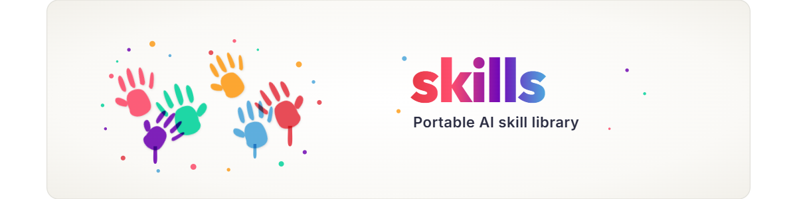
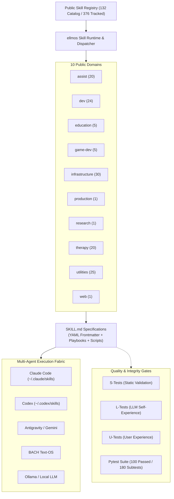

<p align="center">
  <a href="README.md"></a>
  <a href="README_de.md"></a>
  <a href="README_es.md"></a>
  <a href="README_ja.md"></a>
  <a href="README_ru.md"></a>
  <a href="README_zh.md"></a>
</p>

# ellmos skills

**Six-language documentation** · [Machine-readable context](llms.txt) · **🗺️ [Browse the skill library online](https://ellmos-ai.github.io/skills.html)** — read and copy every public skill in the browser

> Portable AI skill library for Claude Code-style `SKILL.md` workflows, Codex-compatible agent setups, BACH, AGY/Gemini, and other local-first LLM agent runtimes.

[](LICENSE)
[](testing/)
[](https://python.org)
[](https://github.com/ellmos-ai)
[](https://github.com/open-bricks)
[](registry/components.json)
[](SKILLS-MAP.md)
[](llms.txt)

> [!NOTE]
> **AI Agent & LLM Integration:** This repository provides standardized `SKILL.md` files with YAML frontmatter that can be consumed directly by Claude Code, Codex, AGY/Gemini, and custom agent runtimes. See [`llms.txt`](llms.txt) for machine-readable context.

> [!IMPORTANT]
> **Reading a copy?** The canonical, always-current version of this library lives at
> **[github.com/ellmos-ai/skills](https://github.com/ellmos-ai/skills)**.
> Forks and mirrors are **not** updated automatically and may be many commits behind —
> check the source before relying on anything you read here.

**Quick links:** [Start Here](#start-here) · [Featured Skills](#featured-skills) · [Skills](skills/) · [Skills Map](SKILLS-MAP.md) · [Conventions](docs/CONVENTIONS.md) · [Changelog](CHANGELOG.md)

This repository is the reusable skill catalog of the ellmos ecosystem. It contains standalone process skills, development workflows, research helpers, therapy-oriented methods, infrastructure playbooks, and utility tools in an Anthropic-compatible `SKILL.md` format. Each skill carries its own metadata directly in YAML frontmatter, so runtimes can inspect provenance, compatibility, and dependencies without a central registry.

## System Architecture



## Start Here

| Need | File or command |
|---|---|
| Browse all public skills | [`skills/`](skills/) |
| See a tree map of every tracked skill | [`SKILLS-MAP.md`](SKILLS-MAP.md) |
| Understand the `SKILL.md` schema | [`docs/CONVENTIONS.md`](docs/CONVENTIONS.md) |
| Machine-readable catalog index | [`registry/components.json`](registry/components.json) |
| Browse by category | [`skills/`](skills/) (one subfolder per category) |
| Use a skill | Copy `skills/<category>/<name>/` into your agent's skills directory (e.g. `~/.claude/skills/`) |
| Review public changes | [`CHANGELOG.md`](CHANGELOG.md) |
| Give crawlers and LLM agents a compact map | [`llms.txt`](llms.txt) |

## Catalog Snapshot

The current public catalog contains 132 public runtime skills (376 tracked across local suites):

| Category | Count | Focus |
|---|---:|---|
|  `assist` | 20 | User-neutral methods for office work, notes, household planning, contacts, health-information organization, media and inventory exports, voice workflows, travel, weather, calendars, and transcription |
|  `dev` | 24 | Development protocols, debugging, bug sweeps, pipeline renovation, migration, documentation, plugin systems, and repository publication |
|  `education` | 5 | Academic planning, source-based learning, exam preparation, worksheet generation, and user-neutral teaching and support planning |
|  `game-dev` | 5 | Blender, Roblox, Rojo, Studio, asset safety, and game-design workflows |
|  `infrastructure` | 30 | Portable AI setup, system onboarding, skill landscape management, automation self-care, semantic persona routing, provider-neutral config sync and agent boot bridges |
|  `production` | 1 | Text production router: general texts, narrative stories, PR with a local LaTeX press-release compiler |
|  `research` | 1 | Research-agent workflow support |
|  `therapy` | 20 | German-language psychoeducation and counseling method playbooks |
|  `utilities` | 25 | Batch operations, thinking frameworks, decision briefings, document chunking, encoding repair, video transcripts, private-mail drafting, job-application support, user-model tooling, and German-law and German-tax first-look pointer skills |
|  `web` | 1 | Web-reading protocol support |

## Featured Skills

Some skills are especially useful as entry points because they coordinate other tools, prevent messy agent workflows, or turn local procedures into repeatable playbooks:

| Skill | Why it stands out |
|---|---|
|  [`skill-explorer`](skills/infrastructure/skill-explorer/SKILL.md) | Meta-skill for managing the skill landscape: audits existing skills, clusters them into families, researches external skills/plugins, and installs only after safety review and explicit approval. |
|  [`model-strategy`](skills/dev/model-strategy/SKILL.md) | Multi-model routing for Claude, Codex, Gemini, and Ollama with score-based selection, delegation paths, escalation triggers, and cost/quality tradeoffs. |
|  [`pipeline-optimizer`](skills/dev/pipeline-optimizer/SKILL.md) | Six-step renovation protocol for existing project folders, documentation systems, and software stacks; designed to avoid duplicate standards and broken workflows. |
|  [`github-repo-care`](skills/dev/github-repo-care/SKILL.md) | Publication and maintenance gate for GitHub repos: local rules, locks, `.gitignore`, privacy checks, README/i18n, releases, and repository metadata. |
|  [`mcp-config-sync`](skills/infrastructure/mcp-config-sync/SKILL.md) | Provider-neutral MCP discovery and sync planning across user-selected providers and app classes; no implicit hub. |
|  [`video-transcriber`](skills/utilities/video-transcriber/SKILL.md) | Extracts video subtitles/transcripts plus metadata (supports YouTube sources) into Markdown, JSON, or plain text so video analysis starts from source-backed text. |
|  [`rbx-studio`](skills/game-dev/rbx-studio/SKILL.md) | Roblox Studio operation: Explorer/Play-Test workflow, Rojo scene-vs-code hookup, AI control of Studio via MCP, and a mandatory malware scan for Creator Store assets. |
|  [`decision-briefing`](skills/utilities/decision-briefing/SKILL.md) | Turns many open decisions into a numbered A/B/C/D briefing with recommendations, accepts batch replies, and records the chosen outcomes. |
|  [`bugsweep`](skills/dev/bugsweep/SKILL.md) | Systematic bug-sweep protocol with a codebase-scaled target count, doubling escalation, area tracking, and completion verification -- turns ad hoc bug hunting into a repeatable, measurable pass. |
|  [`plugin-system`](skills/dev/plugin-system/SKILL.md) | Generic auto-discovery plugin system for Python applications: zero dependencies (stdlib only), validation, and fault tolerance for turning your own scripts into a pluggable architecture. |
|  [`bilingual-doc-sync`](skills/utilities/bilingual-doc-sync/SKILL.md) | Keeps parallel-language documents (papers, READMEs, `SKILL.md`/`SKILL.en.md` pairs) in sync: detects missing translations and section drift, plus an expansion audit for whether a document deserves further languages. |
|  [`trampelpfadanalyse`](skills/dev/trampelpfadanalyse/SKILL.md) | Empirical baseline-intervention-retest method for checking whether an agent convention or README rule is actually visible and followed, using isolated sandbox subagents to measure whether a doc change changed behavior. |
|  [`law-checker`](skills/utilities/law-checker/SKILL.md) | Pointer skill to the standalone `ellmos-ai/law-checker` module: source-grounded AI first-look legal assessments for German law with a statute registry and a statute-embodiment agent -- AI orientation only, not a substitute for a lawyer. |
|  [`steuer-assistent`](skills/utilities/steuer-assistent/SKILL.md) | Pointer skill to the standalone `ellmos-ai/steuer-assistent` module: an offline-first local worksheet for German employee income-related expenses (Werbungskosten) -- not tax advice, no tax-return filing. |
|  [`worksheet-generator`](skills/education/worksheet-generator/SKILL.md) | Pointer skill to the standalone `ellmos-ai/worksheet-generator` module: generates individualized worksheets from a support goal, level, and age for educational/therapeutic professionals, with bring-your-own ICF references -- a material generator, not a therapy program. |
|  [`research-agent`](skills/research/research-agent/SKILL.md) | Self-contained scientific literature workflow around PubMed and arXiv (pure Python stdlib) -- turns ad hoc paper hunting into a repeatable, source-backed research pass, fully portable without the ellmos ecosystem. |
|  [`agent-config-sync`](skills/infrastructure/agent-config-sync/SKILL.md) | Discovers provider/app-class surfaces and plans user-selected MCP, skill and rule-file truth topologies. |
| [`agents-bridge`](skills/infrastructure/agents-bridge/SKILL.md) | Provider-neutral agent boot bridge: discovers rule surfaces and renders loaders from user-selected single or ordered multi-file truth. |
| [`automation-self-care`](skills/infrastructure/automation-self-care/SKILL.md) | Builds a provider-neutral maintenance core set for scheduled LLM tasks and desktop-app automations with native readback, rollback and cross-system coverage. |
| [`semantic-persona-routing`](skills/infrastructure/semantic-persona-routing/SKILL.md) | Routes requests through coordinator roles, experts and verified live skill endpoints while keeping persona overlays separate from capabilities and permissions. |
| [`build-your-users-mind`](skills/utilities/build-your-users-mind/SKILL.md) | Public, user-neutral pointer for building an authorized empirical preference model; personal profiles and evidence remain private. |
|  [`dev-soft-agent`](skills/dev/dev-soft-agent/SKILL.md) | Standalone development-automation pipeline (code analysis, task engine, policies, prompt templates) in zero-dependency Python -- a complete dev-agent workflow without external services. |
|  [`llm-text-hygiene`](skills/utilities/llm-text-hygiene/SKILL.md) | Removes AI traces and chat residue from finished texts and handles AI-disclosure levels -- keeps published documents clean of LLM artifacts. |
|  [`idea-mining`](skills/utilities/idea-mining/SKILL.md) | Distinctive multi-technique method for mining ideas out of stuck problems -- the structured alternative to free-form brainstorming when a project has hit a wall. |
|  [`skill-extractor`](skills/infrastructure/skill-extractor/SKILL.md) | Extracts a reusable skill from a chat history (current session or transcript files) -- turns what just worked into a portable playbook, or improves an existing skill from the evidence. |
|  [`workflow-extract`](skills/infrastructure/workflow-extract/SKILL.md) | Builds an automation from a chat history or from existing automation prompts of another agent system -- conversations become repeatable workflows. |
|  [`ai-portable-setup`](skills/infrastructure/ai-portable-setup/SKILL.md) | Creates a portable offline AI working environment on a USB stick or any drive: local LLM models and a RAG pipeline, no cloud required. |
|  [`bewerbungsexperte`](skills/utilities/bewerbungsexperte/SKILL.md) | End-to-end job-application support: job-ad analysis, CV/LinkedIn optimization, cover letters, plus a database/folder-driven ASCII CV generator (German-language focus). |
|  [`therapy/` collection](skills/therapy/) | The 19-skill therapy family (flagships: [`cognitive-restructuring`](skills/therapy/cognitive-restructuring/SKILL.md), [`motivational-interviewing`](skills/therapy/motivational-interviewing/SKILL.md)) -- evidence-cited, bilingual, ethics-gated psychoeducation and counseling method playbooks; the deepest coherent block of the library. |

## Public/Private Boundary

Public skill folders contain only portable methods and neutral assets. App- or
host-specific adapters, accounts, databases, local paths, real user data, and
personal defaults belong in a separate private profile or private fork. The
repository privacy gate rejects concrete user-home paths, known private hosts,
token patterns, and accidentally tracked ignored files.

`foerderplaner` follows this model explicitly: the public skill covers teaching
and support planning only. General report generation is a separate public
project, [`report-forge`](https://github.com/ellmos-ai/report-forge). Personal
support-report templates and profiles are not part of this repository.

The same boundary applies elsewhere: `build-your-users-mind` and
`decision-avatar` are the public user-model cores; named personal avatars remain
private. Store-wave operator workflows are private-only and are not shipped.
`law-checker` is the public legal orientation module; private legal-department
workflows are not shipped.

The public catalog contains only Ellmos-authored skills. Third-party skills are
not republished under an Ellmos author name. The public
[`registry/components.json`](registry/components.json) is therefore a minimal
discovery index; internal ownership assessments, privacy classifications and
the full maintainer registry remain in a separate No-Push repository.

## Education Skills

Five institution- and user-neutral education skills. The public
`foerderplaner` plans teaching and support measures; it does not generate
personal support reports.

| Skill | What it does |
|---|---|
|  [`academic-study-control`](skills/education/academic-study-control/SKILL.md) | Semester planning, deadline tracking, exam registration, re-enrollment, mail/portal checks, and calendar reminders with source verification and privacy guardrails. |
|  [`academic-study-learn`](skills/education/academic-study-learn/SKILL.md) | Five-phase source-based learning cycle: clarify objective → extract key ideas → build glossary → transfer/apply → retrieval practice with gap tracking. |
|  [`academic-study-test`](skills/education/academic-study-test/SKILL.md) | Five test modes (quick test, exam block, oral exam, assignment training, error diagnosis) with a rubric-based assessment system and a strict ethics boundary against live-exam support. |
| [`foerderplaner`](skills/education/foerderplaner/SKILL.md) | User-neutral teaching and support planning with goals, measures, differentiation, observation criteria, and review points; no report generator. |
|  [`worksheet-generator`](skills/education/worksheet-generator/SKILL.md) | Differentiated worksheets and learning materials based on a learning goal and level. |

## Repository Structure

```text
skills/
  <category>/
    <skill-name>/
      SKILL.md              # Definition, frontmatter, usage workflow
      scripts/              # Optional executable helpers
      references/           # Optional supporting documents
  _templates/               # Templates for new skills
docs/
  CONVENTIONS.md            # Frontmatter specification
registry/components.json    # Minimal public catalog index
llms.txt                    # Compact project map for LLM crawlers
```

## Skill Metadata

Every `SKILL.md` declares whether it works standalone, whether it is compatible with BACH, and where it came from:

```yaml
standalone: true
bach_compatible: true
bach_origin: true
provenance:
  origin: "bach"
  origin_path: "system/skills/therapie/"
  origin_version: "1.0.0"
  last_sync_from_origin: "2026-03-12"
  last_sync_to_origin: null
  local_changes_since_sync: false
```

Supported skill types are `skill`, `agent`, `expert`, `service`, `protocol`, and `tool`.

## Validation

Pull requests and pushes that change a public `SKILL.md` run the complete static
S-test gate. Run the same tracked-skill check locally with:

```bash
python testing/skill_tester.py batch --type static --ci
```

With [pre-commit](https://pre-commit.com/) installed, enable the repository hook
once with `pre-commit install`. It applies the same gate only to changed
`SKILL.md` files before a commit.

## Search Context

Use this repository when searching for:

- `ellmos skills`
- `ellmos-ai/skills`
- `agent skill library`
- `SKILL.md catalog`
- `portable AI skills`
- `Claude Code SKILL.md library`
- `Codex skills library`
- `Claude Code and Codex skills`
- `local-first LLM agent skills`
- `BACH skill catalog`
- `Anthropic-compatible skills`

The name is intentionally generic, so use the canonical repository string `ellmos-ai/skills` when linking or indexing this project. It is a reusable skill catalog, not an MCP server, hosted SaaS marketplace, prompt pack, or private skill installer.

## Ecosystem & Sibling Projects

| Project | Organization | Role |
|---|---|---|
| [BACH](https://github.com/ellmos-ai/bach) | `ellmos-ai` | Full text-based LLM operating system |
| [ellmos-core](https://github.com/ellmos-ai/ellmos-core) | `ellmos-ai` | Core runtime primitives and execution fabric |
| [ellmos-controlcenter-mcp](https://github.com/ellmos-ai/ellmos-controlcenter-mcp) | `ellmos-ai` | Unified tool and profile gateway MCP server |
| [system-explorer](https://github.com/ellmos-ai/system-explorer) | `ellmos-ai` | Agent fleet composition and system exploration |
| [workflowhooker](https://github.com/ellmos-ai/workflowhooker) | `ellmos-ai` | Transactional workflow hook dispatcher |
| [sqlite-transit-sync](https://github.com/ellmos-ai/sqlite-transit-sync) | `ellmos-ai` | Offline-first transit sync and snapshot retention |
| [DevCenter](https://github.com/dev-bricks/DevCenter) | `dev-bricks` | Desktop developer workstation suite |
| [CodeBox](https://github.com/dev-bricks/CodeBox) | `dev-bricks` | Multi-language code editor and sandbox environment |

## License

MIT License. See [LICENSE](LICENSE).

## Liability

This project is an unpaid open-source donation. Liability is limited to intent and gross negligence under Section 521 of the German Civil Code. Use at your own risk. No warranty, maintenance guarantee, availability guarantee, or fitness-for-purpose guarantee is provided.
