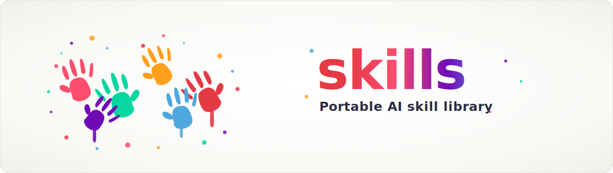

# ellmos skills

**[🇬🇧 Englische Version](README.md)** · **🇩🇪 Deutsch** · [Maschinenlesbarer Kontext](llms.txt)

> Portierbare KI-Skillbibliothek für Claude-Code-artige `SKILL.md`-Workflows, Codex-kompatible Agenten-Setups, BACH und andere lokal-first LLM-Agentenlaufzeiten.

[](LICENSE)

**Schnelleinstieg:** [Einstieg](#einstieg) · [Besondere Skills](#besondere-skills) · [Skills](skills/) · [Konventionen](docs/CONVENTIONS.md) · [Changelog](CHANGELOG.md)

Dieses Repository ist der wiederverwendbare Skill-Katalog des ellmos-Ökosystems. Es enthält eigenständige Prozess-Skills, Entwicklungs-Workflows, Forschungshelfer, therapieorientierte Methoden, Infrastruktur-Playbooks und Utility-Werkzeuge im Anthropic-kompatiblen `SKILL.md`-Format. Jeder Skill trägt seine Metadaten direkt im YAML-Frontmatter, sodass Laufzeiten Herkunft, Kompatibilität und Abhängigkeiten ohne zentrale Registry prüfen können.

## Einstieg

| Bedarf | Datei oder Befehl |
|---|---|
| Alle öffentlichen Skills ansehen | [`skills/`](skills/) |
| Das `SKILL.md`-Schema verstehen | [`docs/CONVENTIONS.md`](docs/CONVENTIONS.md) |
| Skills lokal auflisten | `python catalog.py list` |
| Nach Kategorie filtern | `python catalog.py list --category dev` |
| Herkunft und Sync-Status prüfen | `python catalog.py sync-status` |
| Neues Skill-Gerüst erzeugen | `python catalog.py create "mein-skill" --category utilities --type skill` |
| Drift zur lokalen Skill-Installation prüfen | `python skill_sync.py status` |
| Skills in `~/.claude/skills/` deployen | `python skill_sync.py deploy [skill ...] [--dry-run]` |
| Öffentliche Änderungen nachvollziehen | [`CHANGELOG.md`](CHANGELOG.md) |
| Kompakte Projektkarte für LLMs lesen | [`llms.txt`](llms.txt) |

## Katalogstand

Der aktuelle öffentliche Katalog enthält 65 getrackte Laufzeit-Skills:

| Kategorie | Anzahl | Fokus |
|---|---:|---|
| `dev` | 11 | Entwicklungsprotokolle, Debugging, Bug-Sweeps, Pipeline-Renovierung, Migration, Dokumentation, Plugin-Systeme, Repository-Veröffentlichung |
| `education` | 3 | Akademische Studienplanung, quellenbasiertes Lernen und Prüfungsvorbereitung |
| `game-dev` | 4 | Roblox, Rojo, Studio, Asset-Sicherheit und Game-Design-Workflows |
| `infrastructure` | 3 | Portables KI-Setup, Skill-Landschaftspflege, MCP-Config-Sync zwischen Agent-Apps |
| `research` | 1 | Unterstützung für Forschungsagenten-Workflows |
| `therapy` | 19 | Deutschsprachige Psychoedukation und Gesprächsführungs-Methoden |
| `utilities` | 11 | Batch-Operationen, Denkrahmen, Entscheidungs-Briefings, Dokumenten-Chunking, Encoding-Reparatur, YouTube-Transkripte |
| `web` | 1 | Protokoll zum Lesen und Auswerten von Webinhalten |

## Besondere Skills

Einige Skills sind besonders gute Einstiegspunkte, weil sie andere Werkzeuge koordinieren, chaotische Agentenabläufe verhindern oder lokale Verfahren als wiederholbare Playbooks nutzbar machen:

| Skill | Warum er heraussticht |
|---|---|
| [`skill-explorer`](skills/infrastructure/skill-explorer/SKILL.md) | Meta-Skill zur Pflege der Skill-Landschaft: auditiert vorhandene Skills, clustert sie in Familien, recherchiert externe Skills/Plugins und installiert erst nach Sicherheitsprüfung und ausdrücklicher Freigabe. |
| [`model-strategy`](skills/dev/model-strategy/SKILL.md) | Multi-Modell-Routing für Claude, Codex, Gemini und Ollama mit Score-basierter Auswahl, Delegationswegen, Eskalations-Triggern und Kosten-/Qualitätsabwägung. |
| [`pipeline-optimizer`](skills/dev/pipeline-optimizer/SKILL.md) | Sechs-Schritte-Renovierungsprotokoll für bestehende Projektordner, Dokumentationssysteme und Software-Stacks; verhindert Parallelstandards und gebrochene Workflows. |
| [`github-repo-care`](skills/dev/github-repo-care/SKILL.md) | Veröffentlichungs- und Pflege-Gate für GitHub-Repos: lokale Regeln, Sperren, `.gitignore`, Privacy-Checks, README/i18n, Releases und Repository-Metadaten. |
| [`mcp-config-sync`](skills/infrastructure/mcp-config-sync/SKILL.md) | Synchronisiert MCP-Server-Konfigurationen zwischen Claude Code und Claude Desktop über eine gemeinsame Master-Datei und Windows-/macOS-Hilfsskripte. |
| [`yt-transcriber`](skills/utilities/yt-transcriber/SKILL.md) | Holt YouTube-Untertitel/Transkripte plus Metadaten als Markdown, JSON oder Plaintext, damit Videoanalyse mit quellennahem Text beginnt. |
| [`roblox-studio`](skills/game-dev/roblox-studio/SKILL.md) | Deckt Studio/Rojo-Szene-vs.-Code-Arbeit, MCP-Steuerung von Roblox Studio, Asset-Pipeline-Übergaben und Pflicht-Malware-Checks für Creator-Store-Assets ab. |
| [`decision-briefing`](skills/utilities/decision-briefing/SKILL.md) | Macht aus vielen offenen Entscheidungen ein nummeriertes A/B/C/D-Briefing mit Empfehlung, nimmt Batch-Antworten an und protokolliert die Ergebnisse. |

## Education-Skills

Drei institutionsneutrale Skills für das Hochschulstudium. Platzhalter (`<HOCHSCHULE>`, `<LMS>`, `<MODUL_PREFIX>` usw.) werden beim ersten Einsatz an den konkreten Kontext angepasst. Alle drei Skills sind auf Deutsch (Basis) und Englisch verfügbar; ES, JA, RU, ZH sind für Stufe 2 geplant.

| Skill | Was er tut |
|---|---|
| [`academic-study-control`](skills/education/academic-study-control/SKILL.md) | Semesterplanung, Deadline-Tracking, Prüfungsanmeldung, Rückmeldung, Mail-/Portalchecks und Kalender-Erinnerungen mit Quellenprüfung und Datenschutz-Leitplanken. |
| [`academic-study-learn`](skills/education/academic-study-learn/SKILL.md) | Fünfphasiger quellenbasierter Lernzyklus: Lernziel klären → Kernideen extrahieren → Glossar aufbauen → Transfer/Anwendung → Retrieval Practice mit Lückendokumentation. |
| [`academic-study-test`](skills/education/academic-study-test/SKILL.md) | Fünf Testmodi (Schnelltest, Prüfungsblock, Mündliche Prüfung, Aufgabentraining, Fehlerdiagnose) mit Rubrik-Bewertungssystem und strikter Ethik-Grenze gegen Live-Prüfungsunterstützung. |

## Repository-Struktur

```text
skills/
  <kategorie>/
    <skill-name>/
      SKILL.md              # Definition, Frontmatter, Nutzungsablauf
      scripts/              # Optional ausführbare Hilfsprogramme
      references/           # Optional unterstützende Dokumente
  _templates/               # Vorlagen für neue Skills
docs/
  CONVENTIONS.md            # Frontmatter-Spezifikation
catalog.py                  # CLI für Liste, Filter, Sync-Status, Anlage
skill_sync.py               # Deploy-/Drift-Tool: Repo (Quelle) -> ~/.claude/skills
llms.txt                    # Kompakte Projektkarte für LLM-Crawler
```

## Skill-Metadaten

Jede `SKILL.md` deklariert, ob sie eigenständig läuft, ob sie BACH-kompatibel ist und woher sie stammt:

```yaml
standalone: true
bach_compatible: true
bach_origin: true
provenance:
  origin: "bach"
  origin_path: "system/skills/therapie/"
  origin_version: "1.0.0"
  last_sync_from_origin: "2026-03-12"
  last_sync_to_origin: null
  local_changes_since_sync: false
```

Unterstützte Skill-Typen sind `skill`, `agent`, `expert`, `service`, `protocol` und `tool`.

## Suchkontext

Dieses Repository ist relevant für Suchbegriffe wie:

- `ellmos skills`
- `ellmos-ai/skills`
- `agent skill library`
- `SKILL.md catalog`
- `portable AI skills`
- `Claude Code SKILL.md library`
- `Codex skills library`
- `Claude Code and Codex skills`
- `local-first LLM agent skills`
- `BACH skill catalog`
- `Anthropic-compatible skills`

Der Name ist bewusst generisch. Für Verlinkungen und Verzeichnisse sollte deshalb der kanonische Repository-String `ellmos-ai/skills` verwendet werden. Es handelt sich um einen wiederverwendbaren Skill-Katalog, nicht um einen MCP-Server, einen gehosteten SaaS-Marktplatz, ein Prompt-Pack oder einen privaten Skill-Installer.

## Verwandte ellmos-Projekte

| Projekt | Rolle |
|---|---|
| [BACH](https://github.com/ellmos-ai/bach) | Vollständiges textbasiertes LLM-Betriebssystem |
| [Rinnsal](https://github.com/ellmos-ai/rinnsal) | Leichte lokal-first LLM-Agenteninfrastruktur |
| [USMC](https://github.com/ellmos-ai/usmc) | Gemeinsamer Speicherbaustein für Agentensysteme |
| [Gardener](https://github.com/ellmos-ai/gardener) | Datenbankbasierter Betriebssystem-Gegenpart |
| [MarbleRun / llmauto](https://github.com/ellmos-ai/MarbleRun) | Framework zur Ausführung von LLM-Ketten |

## Lizenz

MIT License. Siehe [LICENSE](LICENSE).

## Haftung

Dieses Projekt ist eine unentgeltliche Open-Source-Schenkung im Sinne der §§ 516 ff. BGB. Die Haftung des Urhebers ist gemäß § 521 BGB auf Vorsatz und grobe Fahrlässigkeit beschränkt. Nutzung auf eigenes Risiko. Es gibt keine Wartungszusage, keine Verfügbarkeitsgarantie, keine Gewähr für Fehlerfreiheit und keine Zusicherung der Eignung für einen bestimmten Zweck.
