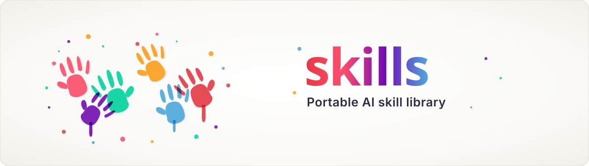
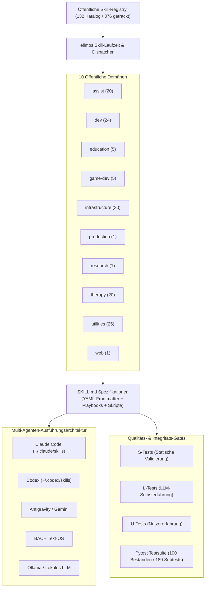

<p align="center">
  <a href="README.md"></a>
  <a href="README_de.md"></a>
  <a href="README_es.md"></a>
  <a href="README_ja.md"></a>
  <a href="README_ru.md"></a>
  <a href="README_zh.md"></a>
</p>

# ellmos skills

**Dokumentation in sechs Sprachen** · [Maschinenlesbarer Kontext](llms.txt) · **🗺️ [Skill-Bibliothek online durchstöbern](https://ellmos-ai.github.io/skills.html)** — jeden öffentlichen Skill im Browser lesen und kopieren

> Portierbare KI-Skillbibliothek für Claude-Code-artige `SKILL.md`-Workflows, Codex-kompatible Agenten-Setups, BACH, AGY/Gemini und andere lokal-first LLM-Agentenlaufzeiten.

[](LICENSE)
[](testing/)
[](https://python.org)
[](https://github.com/ellmos-ai)
[](https://github.com/open-bricks)
[](registry/components.json)
[](SKILLS-MAP.md)
[](llms.txt)

> [!NOTE]
> **KI-Agenten- & LLM-Integration:** Dieses Repository bietet standardisierte `SKILL.md`-Dateien mit YAML-Frontmatter, die direkt von Claude Code, Codex, AGY/Gemini und benutzerdefinierten Agenten-Laufzeiten verarbeitet werden können. Siehe [`llms.txt`](llms.txt) für maschinenlesbaren Kontext.

> [!IMPORTANT]
> **Du liest möglicherweise eine Kopie.** Die aktuelle Fassung dieser Bibliothek steht unter
> **[github.com/ellmos-ai/skills](https://github.com/ellmos-ai/skills)**.
> Forks und Spiegel werden **nicht** automatisch aktualisiert und können viele Commits
> zurückliegen — prüfe dort, bevor du dich auf Inhalte hier verlässt.

**Schnelleinstieg:** [Einstieg](#einstieg) · [Besondere Skills](#besondere-skills) · [Skills](skills/) · [Karte aller Skills](SKILLS-MAP.md) · [Konventionen](docs/CONVENTIONS.md) · [Changelog](CHANGELOG.md)

Dieses Repository ist der wiederverwendbare Skill-Katalog des ellmos-Ökosystems. Es enthält eigenständige Prozess-Skills, Entwicklungs-Workflows, Forschungshelfer, therapieorientierte Methoden, Infrastruktur-Playbooks und Utility-Werkzeuge im Anthropic-kompatiblen `SKILL.md`-Format. Jeder Skill trägt seine Metadaten direkt im YAML-Frontmatter, sodass Laufzeiten Herkunft, Kompatibilität und Abhängigkeiten ohne zentrale Registry prüfen können.

## Systemarchitektur


```mermaid
flowchart TD
    Registry["Öffentliche Skill-Registry (132 Katalog / 376 getrackt)"] --> Engine["ellmos Skill-Laufzeit & Dispatcher"]
    
    subgraph Catalog ["10 Öffentliche Domänen"]
        Assist["assist (20)"]
        Dev["dev (24)"]
        Edu["education (5)"]
        Game["game-dev (5)"]
        Infra["infrastructure (30)"]
        Prod["production (1)"]
        Res["research (1)"]
        Therapy["therapy (20)"]
        Utils["utilities (25)"]
        Web["web (1)"]
    end
    
    Engine --> Catalog
    Catalog --> Artifacts["SKILL.md Spezifikationen\n(YAML-Frontmatter + Playbooks + Skripte)"]
    
    subgraph MultiAgentRuntimes ["Multi-Agenten-Ausführungsarchitektur"]
        ClaudeCode["Claude Code (~/.claude/skills)"]
        Codex["Codex (~/.codex/skills)"]
        AGY["Antigravity / Gemini"]
        BACH["BACH Text-OS"]
        LocalOllama["Ollama / Lokales LLM"]
    end
    
    Artifacts --> MultiAgentRuntimes
    
    subgraph QualityGates ["Qualitäts- & Integritäts-Gates"]
        STests["S-Tests (Statische Validierung)"]
        LTests["L-Tests (LLM-Selbsterfahrung)"]
        UTests["U-Tests (Nutzererfahrung)"]
        PytestSuite["Pytest Testsuite (100 Bestanden / 180 Subtests)"]
    end
    
    Artifacts -.-> QualityGates
```

## Einstieg

| Bedarf | Datei oder Befehl |
|---|---|
| Alle öffentlichen Skills ansehen | [`skills/`](skills/) |
| Baumkarte aller getrackten Skills ansehen | [`SKILLS-MAP.md`](SKILLS-MAP.md) |
| Das `SKILL.md`-Schema verstehen | [`docs/CONVENTIONS.md`](docs/CONVENTIONS.md) |
| Maschinenlesbarer Katalog-Index | [`registry/components.json`](registry/components.json) |
| Nach Kategorie browsen | [`skills/`](skills/) (ein Unterordner je Kategorie) |
| Ein Skill nutzen | `skills/<kategorie>/<name>/` in das Skills-Verzeichnis deines Agenten kopieren (z.B. `~/.claude/skills/`) |
| Öffentliche Änderungen nachvollziehen | [`CHANGELOG.md`](CHANGELOG.md) |
| Kompakte Projektkarte für LLMs lesen | [`llms.txt`](llms.txt) |

## Katalogstand

Der aktuelle öffentliche Katalog enthält 132 öffentliche Laufzeit-Skills (376 getrackt über lokale Testsuiten):

| Kategorie | Anzahl | Fokus |
|---|---:|---|
|  `assist` | 20 | Nutzerneutrale Methoden für Büroarbeit, Notizen, Haushalt, Kontakte, Gesundheitsinformationen, Medien- und Bestandslisten, Sprachworkflows, Reisen, Wetter, Kalender und Transkription |
|  `dev` | 24 | Entwicklungsprotokolle, Debugging, Bug-Sweeps, Pipeline-Renovierung, Migration, Dokumentation, Plugin-Systeme und Repository-Veröffentlichung |
|  `education` | 5 | Akademische Studienplanung, quellenbasiertes Lernen, Prüfungsvorbereitung, Arbeitsblätter sowie nutzerneutrale Unterrichts- und Förderplanung |
|  `game-dev` | 5 | Blender, Roblox, Rojo, Studio, Asset-Sicherheit und Game-Design-Workflows |
|  `infrastructure` | 27 | Portables KI-Setup, System-Onboarding, Skill-Landschaftspflege, Automations-Selbstpflege, semantisches Persona-Routing, anbieterneutraler Config-Sync und Agent-Boot-Brücken |
|  `production` | 1 | Textproduktions-Router: allgemeine Texte, narrative Storys, PR mit lokalem LaTeX-Pressemitteilungs-Compiler |
|  `research` | 1 | Unterstützung für Forschungsagenten-Workflows |
|  `therapy` | 20 | Deutschsprachige Psychoedukation und Gesprächsführungs-Methoden |
|  `utilities` | 23 | Batch-Operationen, Denkrahmen, Entscheidungs-Briefings, Dokumenten-Chunking, Encoding-Reparatur, Video-Transkripte, Privat-Mail-Entwürfe, Bewerbungsunterstützung, Nutzerprofil-Werkzeuge sowie Verweis-Skills für deutsche Rechts- und Steuer-Erstorientierung |
|  `web` | 1 | Protokoll zum Lesen und Auswerten von Webinhalten |

## Besondere Skills

Einige Skills sind besonders gute Einstiegspunkte, weil sie andere Werkzeuge koordinieren, chaotische Agentenabläufe verhindern oder lokale Verfahren als wiederholbare Playbooks nutzbar machen:

| Skill | Warum er heraussticht |
|---|---|
|  [`skill-explorer`](skills/infrastructure/skill-explorer/SKILL.md) | Meta-Skill zur Pflege der Skill-Landschaft: auditiert vorhandene Skills, clustert sie in Familien, recherchiert externe Skills/Plugins und installiert erst nach Sicherheitsprüfung und ausdrücklicher Freigabe. |
|  [`model-strategy`](skills/dev/model-strategy/SKILL.md) | Multi-Modell-Routing für Claude, Codex, Gemini und Ollama mit Score-basierter Auswahl, Delegationswegen, Eskalations-Triggern und Kosten-/Qualitätsabwägung. |
|  [`pipeline-optimizer`](skills/dev/pipeline-optimizer/SKILL.md) | Sechs-Schritte-Renovierungsprotokoll für bestehende Projektordner, Dokumentationssysteme und Software-Stacks; verhindert Parallelstandards und gebrochene Workflows. |
|  [`github-repo-care`](skills/dev/github-repo-care/SKILL.md) | Veröffentlichungs- und Pflege-Gate für GitHub-Repos: lokale Regeln, Sperren, `.gitignore`, Privacy-Checks, README/i18n, Releases und Repository-Metadaten. |
|  [`mcp-config-sync`](skills/infrastructure/mcp-config-sync/SKILL.md) | Anbieterneutraler MCP-Einstieg: entdeckt vorhandene Flächen und plant die vom Nutzer gewählte Synchronisierung ohne impliziten Hub. |
|  [`video-transcriber`](skills/utilities/video-transcriber/SKILL.md) | Holt Video-Untertitel/Transkripte plus Metadaten (auch YouTube-Quellen) als Markdown, JSON oder Plaintext, damit Videoanalyse mit quellennahem Text beginnt. |
|  [`rbx-studio`](skills/game-dev/rbx-studio/SKILL.md) | Deckt Roblox-Studio-Grundbedienung (Explorer, Play-Test), Rojo-Szene-vs.-Code-Anbindung, KI-Steuerung von Studio per MCP und Pflicht-Malware-Checks für Creator-Store-Assets ab. |
|  [`decision-briefing`](skills/utilities/decision-briefing/SKILL.md) | Macht aus vielen offenen Entscheidungen ein nummeriertes A/B/C/D-Briefing mit Empfehlung, nimmt Batch-Antworten an und protokolliert die Ergebnisse. |
|  [`bugsweep`](skills/dev/bugsweep/SKILL.md) | Systematisches Bug-Sweep-Protokoll mit codebase-skaliertem Zielwert, Verdoppelungs-Eskalation, Bereichs-Tracking und Abschluss-Verifikation — macht aus wildem Bugfixing einen wiederholbaren, messbaren Durchlauf. |
|  [`plugin-system`](skills/dev/plugin-system/SKILL.md) | Generisches Plugin-System für Python-Anwendungen: Auto-Discovery, Validierung und Fehlertoleranz ohne externe Abhängigkeiten (nur Python-Stdlib). |
|  [`bilingual-doc-sync`](skills/utilities/bilingual-doc-sync/SKILL.md) | Hält parallel geführte Sprachfassungen (Paper, README, `SKILL.md`/`SKILL.en.md`) synchron: erkennt fehlende Übersetzungen und Abschnitts-Drift, inklusive Expansions-Audit, ob ein Dokument weitere Sprachen verdient. |
|  [`trampelpfadanalyse`](skills/dev/trampelpfadanalyse/SKILL.md) | Empirische Baseline-Intervention-Retest-Methode, um zu prüfen, ob eine Agenten-Konvention oder README-Regel überhaupt sichtbar ist und befolgt wird — misst mit isolierten Sandbox-Subagenten, ob eine Doku-Änderung das Verhalten ändert. |
|  [`law-checker`](skills/utilities/law-checker/SKILL.md) | Verweis-Skill auf das eigenständige Modul `ellmos-ai/law-checker`: quellenbasierte KI-Ersteinschätzungen für deutsches Recht mit Gesetzes-Registry und Gesetzbuch-Verkörperungs-Agent — KI-Ersteinschätzung, kein Anwaltsersatz. |
|  [`steuer-assistent`](skills/utilities/steuer-assistent/SKILL.md) | Verweis-Skill auf das eigenständige Modul `ellmos-ai/steuer-assistent`: offline-first lokale Beleg-Arbeitsunterlage für Arbeitnehmer-Werbungskosten — keine Steuerberatung, keine Steuererklärung. |
|  [`worksheet-generator`](skills/education/worksheet-generator/SKILL.md) | Verweis-Skill auf das eigenständige Modul `ellmos-ai/worksheet-generator`: erzeugt individualisierte Arbeitsblätter aus Förderziel, Niveau und Alter für pädagogische/therapeutische Fachkräfte, ICF-Referenz bring-your-own — Material-Generator, kein Therapieprogramm. |
|  [`research-agent`](skills/research/research-agent/SKILL.md) | In sich geschlossener Workflow für wissenschaftliche Literatur rund um PubMed und arXiv (reine Python-Stdlib) — macht aus wilder Paper-Suche einen wiederholbaren, quellengestützten Recherche-Durchlauf, voll portabel ohne das ellmos-Ökosystem. |
|  [`agent-config-sync`](skills/infrastructure/agent-config-sync/SKILL.md) | Entdeckt Anbieter- und App-Klassen-Flächen und plant nutzergewählte Wahrheits-Topologien für MCPs, Skills und Regeldateien. |
| [`agents-bridge`](skills/infrastructure/agents-bridge/SKILL.md) | Anbieterneutrale Boot-Brücke: entdeckt Regel-Flächen und erzeugt Loader aus einer vom Nutzer gewählten einzelnen oder geordneten mehrteiligen Wahrheit. |
| [`automation-self-care`](skills/infrastructure/automation-self-care/SKILL.md) | Baut ein anbieterneutrales Pflege-Core-Set für geplante LLM-Aufgaben und Desktop-App-Automationen mit nativem Readback, Rollback und systemübergreifender Abdeckung. |
| [`semantic-persona-routing`](skills/infrastructure/semantic-persona-routing/SKILL.md) | Routet Anfragen über koordinierende Rollen, Experten und verifizierte Live-Skill-Endpunkte und trennt Persona-Overlays von Fähigkeiten und Rechten. |
| [`build-your-users-mind`](skills/utilities/build-your-users-mind/SKILL.md) | Öffentlicher, nutzerneutraler Verweis zum Aufbau eines autorisierten empirischen Präferenzmodells; persönliche Profile und Belege bleiben privat. |
|  [`dev-soft-agent`](skills/dev/dev-soft-agent/SKILL.md) | Eigenständige Entwicklungs-Automatisierungs-Pipeline (Code-Analyse, Task-Engine, Policies, Prompt-Templates) in Zero-Dependency-Python — ein vollständiger Dev-Agent-Workflow ohne externe Dienste. |
|  [`llm-text-hygiene`](skills/utilities/llm-text-hygiene/SKILL.md) | Entfernt KI-Spuren und Chat-Reste aus fertigen Texten und behandelt KI-Disclosure-Stufen — hält publizierte Dokumente frei von LLM-Artefakten. |
|  [`idea-mining`](skills/utilities/idea-mining/SKILL.md) | Eigenständige Mehrtechniken-Methodik, um Ideen aus festgefahrenen Problemen zu schürfen — die strukturierte Alternative zum freien Brainstorming, wenn ein Projekt feststeckt. |
|  [`skill-extractor`](skills/infrastructure/skill-extractor/SKILL.md) | Extrahiert aus einem Chatverlauf (aktuelle Session oder Transkript-Dateien) einen wiederverwendbaren Skill — macht aus dem, was gerade funktioniert hat, ein portables Playbook, oder verbessert einen bestehenden Skill anhand der Belege. |
|  [`workflow-extract`](skills/infrastructure/workflow-extract/SKILL.md) | Baut aus einem Chatverlauf oder aus bestehenden Automatisierungs-Prompts eines anderen Agenten-Systems eine Automatisierung — Gespräche werden zu wiederholbaren Workflows. |
|  [`ai-portable-setup`](skills/infrastructure/ai-portable-setup/SKILL.md) | Erstellt eine portable Offline-KI-Arbeitsumgebung auf USB-Stick oder beliebigem Laufwerk: lokale LLM-Modelle und RAG-Pipeline, ganz ohne Cloud. |
|  [`bewerbungsexperte`](skills/utilities/bewerbungsexperte/SKILL.md) | Bewerbungsunterstützung von A bis Z: Stellenanzeigen-Analyse, CV-/LinkedIn-Optimierung, Anschreiben, plus DB-/Ordner-gespeister ASCII-Lebenslauf-Generator. |
|  [`therapy/`-Kollektion](skills/therapy/) | Die 19-teilige Therapie-Familie (Flaggschiffe: [`cognitive-restructuring`](skills/therapy/cognitive-restructuring/SKILL.md), [`motivational-interviewing`](skills/therapy/motivational-interviewing/SKILL.md)) — evidenzzitierte, zweisprachige, ethik-gegatete Psychoedukations- und Gesprächsführungs-Playbooks; der tiefste zusammenhängende Block der Bibliothek. |

## Grenze zwischen öffentlichem Kern und privaten Profilen

Öffentliche Skill-Ordner enthalten ausschließlich übertragbare Methoden und
neutrale Assets. App- oder host-spezifische Adapter, Konten, Datenbanken, lokale
Pfade, Echtdaten und persönliche Vorgaben gehören in ein getrenntes privates
Profil oder einen privaten Fork. Das Privacy-Gate weist konkrete Benutzerpfade,
bekannte private Hosts, Tokenmuster und versehentlich getrackte Ignore-Dateien ab.

Für `foerderplaner` gilt diese Trennung ausdrücklich: Der öffentliche Skill
plant Unterricht und Förderung. Die allgemeine Berichtserstellung ist ein
eigenes öffentliches Projekt, [`report-forge`](https://github.com/ellmos-ai/report-forge).
Persönliche Förderbericht-Vorlagen und Profile gehören nicht in dieses Repository.

Dieselbe Grenze gilt für weitere Bereiche: `build-your-users-mind` und
`decision-avatar` sind die öffentlichen Kerne für Nutzermodelle; namentliche
persönliche Avatare bleiben privat. Store-Wellen-Betreiberworkflows sind
ausschließlich privat und werden nicht ausgeliefert. `law-checker` ist das
öffentliche Rechtsorientierungsmodul; private Rechts-Workflows
werden nicht ausgeliefert.

Der öffentliche Katalog enthält ausschließlich Ellmos-eigene Skills.
Drittanbieter-Skills werden nicht unter einem Ellmos-Autorennamen
weiterveröffentlicht. Die öffentliche
[`registry/components.json`](registry/components.json) ist deshalb nur ein
reduzierter Discovery-Index. Interne Herkunftsbewertungen,
Privacy-Klassifizierungen und die vollständige Maintainer-Registry bleiben in
einem getrennten No-Push-Repository.

## Education-Skills

Fünf institutions- und nutzerneutrale Education-Skills. Der öffentliche
`foerderplaner` plant Unterrichts- und Fördermaßnahmen; persönliche
Förderberichte erzeugt er nicht.

| Skill | Was er tut |
|---|---|
|  [`academic-study-control`](skills/education/academic-study-control/SKILL.md) | Semesterplanung, Deadline-Tracking, Prüfungsanmeldung, Rückmeldung, Mail-/Portalchecks und Kalender-Erinnerungen mit Quellenprüfung und Datenschutz-Leitplanken. |
|  [`academic-study-learn`](skills/education/academic-study-learn/SKILL.md) | Fünfphasiger quellenbasierter Lernzyklus: Lernziel klären → Kernideen extrahieren → Glossar aufbauen → Transfer/Anwendung → Retrieval Practice mit Lückendokumentation. |
|  [`academic-study-test`](skills/education/academic-study-test/SKILL.md) | Fünf Testmodi (Schnelltest, Prüfungsblock, Mündliche Prüfung, Aufgabentraining, Fehlerdiagnose) mit Rubrik-Bewertungssystem und strikter Ethik-Grenze gegen Live-Prüfungsunterstützung. |
| [`foerderplaner`](skills/education/foerderplaner/SKILL.md) | Nutzerneutrale Unterrichts- und Förderplanung mit Zielen, Maßnahmen, Differenzierung, Beobachtungskriterien und Überprüfungsterminen; kein Berichtsgenerator. |
|  [`worksheet-generator`](skills/education/worksheet-generator/SKILL.md) | Differenzierte Arbeitsblätter und Lernmaterialien passend zu Lernziel und Niveau. |

## Repository-Struktur

```text
skills/
  <kategorie>/
    <skill-name>/
      SKILL.md              # Definition, Frontmatter, Nutzungsablauf
      scripts/              # Optional ausführbare Hilfsprogramme
      references/           # Optional unterstützende Dokumente
  _templates/               # Vorlagen für neue Skills
docs/
  CONVENTIONS.md            # Frontmatter-Spezifikation
registry/components.json    # Reduzierter öffentlicher Katalog-Index
llms.txt                    # Kompakte Projektkarte für LLM-Crawler
```

## Skill-Metadaten

Jede `SKILL.md` deklariert, ob sie eigenständig läuft, ob sie BACH-kompatibel ist und woher sie stammt:

```yaml
standalone: true
bach_compatible: true
bach_origin: true
provenance:
  origin: "bach"
  origin_path: "system/skills/therapie/"
  origin_version: "1.0.0"
  last_sync_from_origin: "2026-03-12"
  last_sync_to_origin: null
  local_changes_since_sync: false
```

Unterstützte Skill-Typen sind `skill`, `agent`, `expert`, `service`, `protocol` und `tool`.

## Validierung

Pull Requests und Pushes, die eine öffentliche `SKILL.md` ändern, führen das
vollständige statische S-Test-Gate aus. Derselbe Check für alle git-getrackten
Skills läuft lokal mit:

```bash
python testing/skill_tester.py batch --type static --ci
```

Wenn [pre-commit](https://pre-commit.com/) installiert ist, wird der Repository-
Hook einmalig mit `pre-commit install` aktiviert. Vor einem Commit prüft er mit
demselben Gate nur die geänderten `SKILL.md`-Dateien.

## Suchkontext

Dieses Repository ist relevant für Suchbegriffe wie:

- `ellmos skills`
- `ellmos-ai/skills`
- `agent skill library`
- `SKILL.md catalog`
- `portable AI skills`
- `Claude Code SKILL.md library`
- `Codex skills library`
- `Claude Code and Codex skills`
- `local-first LLM agent skills`
- `BACH skill catalog`
- `Anthropic-compatible skills`

Der Name ist bewusst generisch. Für Verlinkungen und Verzeichnisse sollte deshalb der kanonische Repository-String `ellmos-ai/skills` verwendet werden. Es handelt sich um einen wiederverwendbaren Skill-Katalog, nicht um einen MCP-Server, einen gehosteten SaaS-Marktplatz, ein Prompt-Pack oder einen privaten Skill-Installer.

## Ökosystem & Geschwister-Projekte

| Projekt | Organisation | Rolle |
|---|---|---|
| [BACH](https://github.com/ellmos-ai/bach) | `ellmos-ai` | Vollständiges textbasiertes LLM-Betriebssystem |
| [ellmos-core](https://github.com/ellmos-ai/ellmos-core) | `ellmos-ai` | Kern-Laufzeitprimitive und Ausführungsplattform |
| [ellmos-controlcenter-mcp](https://github.com/ellmos-ai/ellmos-controlcenter-mcp) | `ellmos-ai` | Zentrales Werkzeug- und Profil-Gateway MCP-Server |
| [system-explorer](https://github.com/ellmos-ai/system-explorer) | `ellmos-ai` | Agentenflotten-Komposition und Systemexploration |
| [workflowhooker](https://github.com/ellmos-ai/workflowhooker) | `ellmos-ai` | Transaktionaler Workflow-Hook-Dispatcher |
| [sqlite-transit-sync](https://github.com/ellmos-ai/sqlite-transit-sync) | `ellmos-ai` | Offline-First Transitsynchronisation & Snapshot-Retention |
| [DevCenter](https://github.com/dev-bricks/DevCenter) | `dev-bricks` | Desktop-Entwickler-Workstation-Suite |
| [CodeBox](https://github.com/dev-bricks/CodeBox) | `dev-bricks` | Mehrsprachiger Code-Editor & Sandbox-Umgebung |

## Lizenz

MIT License. Siehe [LICENSE](LICENSE).

## Haftung

Dieses Projekt ist eine unentgeltliche Open-Source-Schenkung im Sinne der §§ 516 ff. BGB. Die Haftung des Urhebers ist gemäß § 521 BGB auf Vorsatz und grobe Fahrlässigkeit beschränkt. Nutzung auf eigenes Risiko. Es gibt keine Wartungszusage, keine Verfügbarkeitsgarantie, keine Gewähr für Fehlerfreiheit und keine Zusicherung der Eignung für einen bestimmten Zweck.
