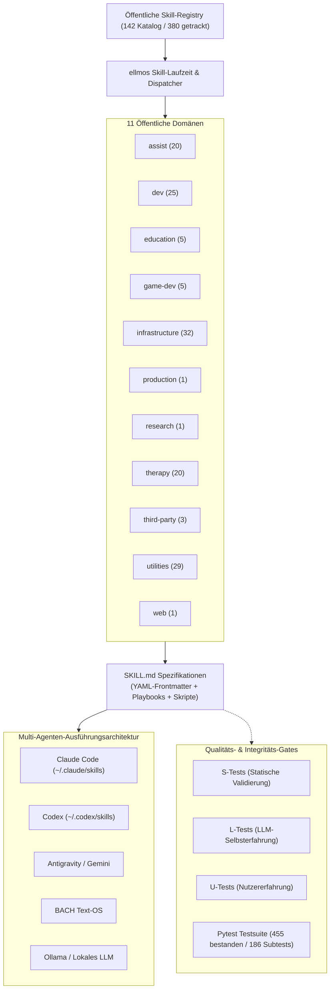
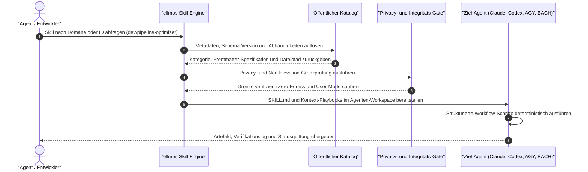

<p align="center">
  <a href="README.md"></a>
  <a href="README_de.md"></a>
  <a href="README_es.md"></a>
  <a href="README_ja.md"></a>
  <a href="README_ru.md"></a>
  <a href="README_zh.md"></a>
</p>

# ellmos skills

**Dokumentation in sechs Sprachen** · [Maschinenlesbarer Kontext](llms.txt) · **🗺️ [Skill-Bibliothek online durchstöbern](https://ellmos-ai.github.io/skills.html)** — jeden öffentlichen Skill im Browser lesen und kopieren

> Portierbare KI-Skillbibliothek für Claude-Code-artige `SKILL.md`-Workflows, Codex-kompatible Agenten-Setups, BACH, AGY/Gemini und andere lokal-first LLM-Agentenlaufzeiten.

[](https://github.com/ellmos-ai/skills/actions/workflows/tests.yml)
[](pyproject.toml)
[](LICENSE)
[-success.svg)](testing/)
[](https://python.org)
[](SECURITY.md)
[](SECURITY.md)
[](SECURITY.md)
[](THIRD_PARTY_LICENSES.md)
[](MARKETING-LOG.txt)
[](https://github.com/ellmos-ai)
[](https://github.com/open-bricks)
[](registry/components.json)
[](SKILLS-MAP.md)
[](llms.txt)
[](NOTICE)
[](CONTRIBUTING.md)
[](MARKETING-LOG.txt)

> [!NOTE]
> **KI-Agenten- & LLM-Integration:** Dieses Repository bietet standardisierte `SKILL.md`-Dateien mit YAML-Frontmatter, die direkt von Claude Code, Codex, AGY/Gemini und benutzerdefinierten Agenten-Laufzeiten verarbeitet werden können. Siehe [`llms.txt`](llms.txt) für maschinenlesbaren Kontext.

> [!IMPORTANT]
> **Du liest möglicherweise eine Kopie.** Die aktuelle Fassung dieser Bibliothek steht unter
> **[github.com/ellmos-ai/skills](https://github.com/ellmos-ai/skills)**.
> Forks und Spiegel werden **nicht** automatisch aktualisiert und können viele Commits
> zurückliegen — prüfe dort, bevor du dich auf Inhalte hier verlässt.

---

## Schnellnavigation

- [01. Systemarchitektur & Schnellübersicht](#sec-01)
- [02. Multi-Agenten Skill-Discovery & Ausführungslebenszyklus](#sec-02)
- [03. Zielgruppen & Auffindbarkeit](#sec-03)
- [04. Vergleichsmatrix gegenüber Alternativen](#sec-04)
- [05. ASCII Vier-Ebenen-Architektur-Topologie](#sec-05)
- [06. Einstieg & Schnellstart-Leitfaden](#sec-06)
- [07. Katalogstand & Domänenverteilung](#sec-07)
- [08. Besondere Skills & Praxiserprobte Workflows](#sec-08)
- [09. Grenze zwischen öffentlichem Kern und privaten Profilen](#sec-09)
- [10. Education-Skills](#sec-10)
- [11. Repository-Struktur & Verzeichnislayout](#sec-11)
- [12. Skill-Metadaten & Frontmatter-Anatomie](#sec-12)
- [13. Validierung & Automatisierte Qualitätstore](#sec-13)
- [14. Suchkontext & High-Intent-Indexierung](#sec-14)
- [15. Governance & Laufzeit-Invarianten-Matrix](#sec-15)
- [16. Ökosystem & Geschwister-Projekte](#sec-16)
- [17. Drittanbieter-Lizenzen, Level 1 SBOM & RunAsInvoker](#sec-17)
- [18. Sicherheitsrichtlinie, § 521 BGB Haftungsausschluss & 48h SLA](#sec-18)

---

Dieses Repository ist der wiederverwendbare Skill-Katalog des ellmos-Ökosystems. Es enthält eigenständige Prozess-Skills, Entwicklungs-Workflows, Forschungshelfer, therapieorientierte Methoden, Infrastruktur-Playbooks und Utility-Werkzeuge im Anthropic-kompatiblen `SKILL.md`-Format. Jeder Skill trägt seine Metadaten direkt im YAML-Frontmatter, sodass Laufzeiten Herkunft, Kompatibilität und Abhängigkeiten ohne zentrale Registry prüfen können.

<a id="sec-01"></a><a id="systemarchitektur"></a>
## 1. Systemarchitektur & Schnellübersicht


```mermaid
flowchart TD
    Registry["Öffentliche Skill-Registry (142 Katalog / 380 getrackt)"] --> Engine["ellmos Skill-Laufzeit & Dispatcher"]
    
    subgraph Catalog ["11 Öffentliche Domänen"]
        Assist["assist (20)"]
        Dev["dev (25)"]
        Edu["education (5)"]
        Game["game-dev (5)"]
        Infra["infrastructure (32)"]
        Prod["production (1)"]
        Res["research (1)"]
        Therapy["therapy (20)"]
        ThirdParty["third-party (3)"]
        Utils["utilities (29)"]
        Web["web (1)"]
    end
    
    Engine --> Catalog
    Catalog --> Artifacts["SKILL.md Spezifikationen<br/>(YAML-Frontmatter + Playbooks + Skripte)"]
    
    subgraph MultiAgentRuntimes ["Multi-Agenten-Ausführungsarchitektur"]
        ClaudeCode["Claude Code (~/.claude/skills)"]
        Codex["Codex (~/.codex/skills)"]
        AGY["Antigravity / Gemini"]
        BACH["BACH Text-OS"]
        LocalOllama["Ollama / Lokales LLM"]
    end
    
    Artifacts --> MultiAgentRuntimes
    
    subgraph QualityGates ["Qualitäts- & Integritäts-Gates"]
        STests["S-Tests (Statische Validierung)"]
        LTests["L-Tests (LLM-Selbsterfahrung)"]
        UTests["U-Tests (Nutzererfahrung)"]
        PytestSuite["Pytest Testsuite (455 bestanden / 186 Subtests)"]
    end
    
    Artifacts -.-> QualityGates
```

<a id="sec-02"></a><a id="multi-agenten-skill-discovery--ausfuehrungslebenszyklus"></a>
## 2. Multi-Agenten Skill-Discovery & Ausführungslebenszyklus


```mermaid
sequenceDiagram
    autonumber
    actor Operator as "Agent / Entwickler"
    participant Dispatcher as "ellmos Skill Engine"
    participant Registry as "Öffentlicher Katalog"
    participant Gate as "Privacy- und Integritäts-Gate"
    participant Runtime as "Ziel-Agent (Claude, Codex, AGY, BACH)"

    Operator->>Dispatcher: Skill nach Domäne oder ID abfragen (dev/pipeline-optimizer)
    Dispatcher->>Registry: Metadaten, Schema-Version und Abhängigkeiten auflösen
    Registry-->>Dispatcher: Kategorie, Frontmatter-Spezifikation und Dateipfad zurückgeben
    Dispatcher->>Gate: Privacy- und Non-Elevation-Grenzprüfung ausführen
    Gate-->>Dispatcher: Grenze verifiziert (Zero-Egress und User-Mode sauber)
    Dispatcher->>Runtime: SKILL.md und Kontext-Playbooks im Agenten-Workspace bereitstellen
    Runtime->>Runtime: Strukturierte Workflow-Schritte deterministisch ausführen
    Runtime-->>Operator: Artefakt, Verifikationslog und Statusquittung übergeben
```

<a id="sec-03"></a><a id="zielgruppen--auffindbarkeit"></a>
## 3. Zielgruppen & Auffindbarkeit

`ellmos-skills` bedient vier zentrale technische Zielgruppen im Spektrum autonomer Agenten- und Plattform-Entwicklung:

### `[PERSONA-01]` Autonome KI-Agenten & Multi-Agenten-Schwärme
- **Profil:** Multi-Agenten-Systeme, Orchestratoren und autonome Coding-Schleifen (*Claude Code, AGY, Codex, BACH*).
- **Zentraler Pain Point:** Halluzinierte Zwischenschritte, unstrukturierte Tool-Aufrufe, nicht-deterministische Ausführung über Agentengrenzen hinweg und Kontext-Drift.
- **Lösung durch `ellmos-skills`:** Standardisiertes `SKILL.md`-Format mit striktem YAML-Frontmatter, autarken Playbooks, deterministischen Ein-/Ausgabe-Verträgen und sofortiger Portabilität.
- **Typische Workflows & Skills:** `infrastructure/agents-bridge`, `dev/pipeline-optimizer`, `utilities/generalizer`, `infrastructure/work-autonomous`.

### `[PERSONA-02]` Enterprise DevOps & Platform Engineers
- **Profil:** Plattform-Ingenieure und Infrastruktur-Teams, die Entwicklerflotten, geplante Aufgaben und CI-Pipelines betreuen.
- **Zentraler Pain Point:** Wiederkehrende Neuerfindung von Wartungsabläufen, fragile CI-Skripte, fehlende Host-Parität und chaotische Repository-Verwaltung.
- **Lösung durch `ellmos-skills`:** Sofort einhängbare, praxiserprobte Playbooks für Refactoring, Git-Hygiene und Pipeline-Renovierung ohne Tool-Sprawl.
- **Typische Workflows & Skills:** `dev/project-bootstrapper`, `dev/pipeline-bootstrapper`, `utilities/folder-organization`, `dev/github-repo-care`.

### `[PERSONA-03]` Local-First, Privacy & SecOps Spezialisten
- **Profil:** Sicherheitsbeauftragte, Compliance-Auditoren und Datenschutz-Ingenieure in regulierten oder isolierten Umgebungen.
- **Zentraler Pain Point:** Unbeabsichtigte Datenabflüsse in die Cloud, unüberprüfte transitive Pakete, Supply-Chain-Risiken und erhöhte Ausführungsrechte in Agenten-Tools.
- **Lösung durch `ellmos-skills`:** Striktes Zero-Egress (`INV-LOCAL-01`), automatisierte statische Privacy-Boundary-Gates (`testing/privacy_gate.py`), User-Mode-Betrieb (`RunAsInvoker`), 0% Copyleft und Level 1 SBOM Transparenz.
- **Typische Workflows & Skills:** `infrastructure/privacy-gate`, `utilities/secret-redactor`, `SECURITY.md`, `THIRD_PARTY_LICENSES.md`.

### `[PERSONA-04]` Domain Skill Autoren & Research Engineers
- **Profil:** KI-Forscher, Methodiker und Fachspezialisten, die reproduzierbare Agenten-Fähigkeiten entwickeln.
- **Zentraler Pain Point:** Mangelnde Konventionen, inkonsistente Mehrsprachigkeit und fehlende Test-Harnische für benutzerdefinierte Skills.
- **Lösung durch `ellmos-skills`:** Formale Schema-Spezifikation (`docs/CONVENTIONS.md`), öffentliche Registry-Generierung (`registry/components.json`) und dreistufiges S/L/U-Test-Framework.
- **Typische Workflows & Skills:** `schemas/assist-v1.schema.json`, `docs/CONVENTIONS.md`, `testing/skill_tester.py`, `research/research-agent`.

### Zielgruppen-Übersichtsmatrix

| Zielgruppe | Zentraler Pain Point | Lösung durch `ellmos-skills` | Typische Workflows & Skills |
|---|---|---|---|
| **Autonome KI-Agenten & Multi-Agenten-Schwärme** *(Claude Code, AGY, Codex, BACH)* | Halluzinierte Zwischenschritte, unstrukturierte Tool-Aufrufe und nicht-deterministische Ausführung über Agentengrenzen hinweg. | Standardisiertes `SKILL.md`-Format mit striktem YAML-Frontmatter, autarken Playbooks und deterministischen Ein-/Ausgabe-Verträgen. | `infrastructure/agents-bridge`, `dev/pipeline-optimizer`, `utilities/generalizer` |
| **Enterprise DevOps & Platform Engineers** | Wiederkehrende Neuerfindung von Wartungsabläufen, fragile CI-Skripte und chaotische Repository-Verwaltung. | Sofort einhängbare, praxiserprobte Playbooks für Refactoring, Git-Hygiene und Pipeline-Renovierung ohne Tool-Sprawl. | `dev/project-bootstrapper`, `dev/pipeline-bootstrapper`, `utilities/folder-organization` |
| **Local-First, Privacy & SecOps Spezialisten** | Unbeabsichtigte Datenabflüsse in die Cloud, unüberprüfte transitive Pakete und erhöhte Ausführungsrechte in Agenten-Tools. | Striktes Zero-Egress (`INV-LOCAL-01`), automatisierte Privacy-Boundary-Gates, User-Mode-Betrieb (`RunAsInvoker`) und 0% Copyleft. | `infrastructure/privacy-gate`, `utilities/secret-redactor`, `SECURITY.md` |
| **Domain Skill Autoren & Research Engineers** | Mangelnde Konventionen, inkonsistente Mehrsprachigkeit und fehlende Test-Harnische für benutzerdefinierte Skills. | Formale Schema-Spezifikation (`docs/CONVENTIONS.md`), öffentliche Registry-Generierung (`registry/components.json`) und S/L/U-Test-Framework. | `schemas/assist-v1.schema.json`, `docs/CONVENTIONS.md`, `testing/skill_tester.py` |

### Hochrelevante Suchbegriffs-Matrix (SEO & Discovery)

| Kategorie | Primäre Suchbegriffe (Deutsch) | Primary Search Terms (English) |
|---|---|---|
| **Agenten-Frameworks** | `Claude Code Skills`, `Codex Agenten Skills`, `Anthropic SKILL.md Standard`, `Gemini Agenten Skills` | `claude code skills`, `codex agent skills`, `anthropic skill md standard`, `agy gemini agent skills` |
| **Skill-Architektur** | `Portable KI Fähigkeiten`, `Wiederverwendbare Agenten Playbooks`, `KI Skill Bibliothek`, `Deterministische Workflows` | `portable ai skills`, `reusable agent playbooks`, `agent skill library`, `deterministic llm workflows` |
| **Datenschutz & Sicherheit** | `Zero-Egress KI Skills`, `Lokale Agenten Bibliothek`, `Fail-Closed Datenschutz Gate`, `Unprivilegierte Ausführung` | `zero-egress ai skills`, `local-first agent library`, `fail-closed privacy gate`, `user-mode agent execution` |
| **Ökosystem & Katalog** | `BACH Skill Katalog`, `Multi-Agenten Skill Bibliothek`, `Offline KI Werkzeuge`, `Open Source Agenten Skills` | `bach skill catalog`, `multi-agent skill library`, `offline ai tools`, `open source agent skills` |

<a id="sec-04"></a><a id="vergleichsmatrix-gegenueber-alternativen"></a>
## 4. Vergleichsmatrix gegenüber Alternativen

`ellmos-skills` definiert einen anbieterneutralen, portablen Skill-Standard, der speziell für lokale, multi-agentielle Arbeitsabläufe optimiert ist. Die folgende Matrix vergleicht den Ansatz mit gängigen Alternativen über zehn fundamentale Dimensionen:

| Bewertungsdimension | `ellmos-skills` | Ad-hoc System-Prompts | Tool/Function-Calling ohne Playbooks | Zentrale Cloud-Hubs | Schwergewichtige Frameworks (LangChain/CrewAI) |
|---|:---:|:---:|:---:|:---:|:---:|
| **1. 100% Local-First & Zero-Egress** | **PASS** (Null Telemetrie) | **PASS** (Lokaler Text) | ⚠️ Abhängig vom API-Anbieter | ❌ Cloud-Account & Telemetrie erforderlich | ⚠️ Komplexe Abhängigkeiten & Telemetrie-Risiken |
| **2. Standardisiertes Format (`SKILL.md`)** | **PASS** (Anthropic-Standard + YAML) | ❌ Unstrukturierter Freitext | ❌ Reines JSON-Schema, keine Playbooks | ⚠️ Proprietäre Manifeste | ❌ Code-Abstraktionen in Python/JS |
| **3. Multi-Agenten-Portabilität** | **PASS** (Claude, Codex, AGY, BACH) | ⚠️ Prompts driften je nach Modell | ⚠️ Spezifische Wrapper je Provider | ❌ An proprietäre Plattform gebunden | ⚠️ Framework-spezifischer Lock-in |
| **4. Schritt-für-Schritt-Playbooks** | **PASS** (Strukturierte Phasen & Gates) | ❌ Unzuverlässige Instruktionsbefolgung | ❌ Nur Einzelschritt-Toolaufrufe | ⚠️ Sehr heterogene Autorenqualität | ⚠️ Python-DAG-Logik erforderlich |
| **5. Datenschutz- & Leakage-Gates** | **PASS** (Automatisches statisches Gate) | ❌ Keine vorhanden | ❌ Keine vorhanden | ⚠️ Nur Cloud-Moderationsfilter | ❌ Standardmäßig nicht integriert |
| **6. Automatisierte Test-Suite** | **PASS** (455 Pytest-Tests, 186 Subtests, 100% grün) | ❌ Ungetestet | ⚠️ Nur Unit-Tests für API-Calls | ❌ Kein öffentlicher Test-Harnisch | ⚠️ Nur Framework-eigene Unit-Tests |
| **7. Multi-OS CI-Parität** | **PASS** (Linux, Windows, macOS) | Nicht anwendbar | ⚠️ Provider-abhängig | ❌ Gehosteter Cloud-Dienst | ⚠️ Plattform-Inkonsistenzen |
| **8. Maschinenlesbarer Katalog** | **PASS** (`registry/components.json`) | ❌ Nicht indexiert | ❌ Nur dynamische API-Introspektion | ⚠️ Proprietäre API-Abfragen | ❌ Code-Modulimporte |
| **9. Open-Source & 0% Copyleft** | **PASS** (100% MIT-Lizenz) | Nicht anwendbar | Nicht anwendbar | ❌ Proprietäre Nutzungsbedingungen | ⚠️ Gemischte Lizenzmodelle |
| **10. Null externe Laufzeit-Abhängigkeiten** | **PASS** (Nur Python-Standardbib) | **PASS** | ⚠️ Externe HTTP/JSON-Libs nötig | ❌ Cloud-Client-SDKs zwingend | ❌ Sehr große Dependency-Trees |

<a id="sec-05"></a><a id="ascii-topologie"></a><a id="architektur-topologie"></a>
## 5. ASCII Vier-Ebenen-Architektur-Topologie

```text
+----------------------------------------------------------------------------------------------------+
| EBENE 1: RUNTIME-DISPATCH & DISCOVERY-SCHICHT                                                      |
|                                                                                                    |
|  [ Operator / LLM-Agent ]                                                                          |
|            |                                                                                       |
|            v (Aufgaben-Intent / Suchanfrage)                                                       |
|  +----------------------------------------------------------------------------------------------+  |
|  | ellmos Skill-Laufzeit & Dispatcher (Reine Python-Standardbibliothek)                         |  |
|  |  * Kategorie-Resolver    * Frontmatter-Validator    * Abhängigkeits- & Herkunftsprüfer       |  |
|  +----------------------------------------------------------------------------------------------+  |
|            |                                            |                                          |
|            v (Discovery-Abfrage)                        v (Katalog-Index-Rücklesung)               |
|  +-----------------------------------+        +-------------------------------------------------+  |
|  | Öffentliche Katalog-Registry      |        | llms.txt & Kontext-Index                        |  |
|  | (registry/components.json: 142)   |        | (Maschinenlesbares Markdown & Domänen-Hierarchie)|  |
|  +-----------------------------------+        +-------------------------------------------------+  |
+----------------------------------------------------------------------------------------------------+
| EBENE 2: MULTI-AGENTEN-CLIENT-INTEGRATIONSSCHICHT                                                  |
|                                                                                                    |
|  [ Claude Code ]      [ OpenAI Codex ]      [ Antigravity / Gemini ]     [ BACH Text-OS / Lokal ]  |
|  (~/.claude/skills)   (~/.codex/skills)     (~/.gemini/.../skills)       (system/skills/...)       |
|         \                   |                        |                          /                  |
|          +------------------+------------------------+-------------------------+                   |
|                             | Einheitliche Bereitstellung (Materialization)                        |
|                             v                                                                      |
|  +----------------------------------------------------------------------------------------------+  |
|  | Standardisierte SKILL.md Ausführungsoberfläche                                               |  |
|  |  * Anthropic YAML-Frontmatter-Vertrag    * Schritt-für-Schritt-Playbooks  * S/L/U-Prüfgates     |  |
|  +----------------------------------------------------------------------------------------------+  |
+----------------------------------------------------------------------------------------------------+
| EBENE 3: GOVERNANCE- & SICHERHEITSGRENZE (FAIL-CLOSED)                                             |
|                                                                                                    |
|  +----------------------------------------------------------------------------------------------+  |
|  | Statisches Privacy-Gate (testing/privacy_gate.py)                                             |  |
|  |  * Zero-Egress-Garantie (INV-LOCAL-01)       * Non-Elevation / RunAsInvoker (INV-UNPRIV-03)   |  |
|  |  * Abweisung konkreter User-Pfade & Hostnamen * Abweisung privater Tokens, Keys & Geheimnisse |  |
|  +----------------------------------------------------------------------------------------------+  |
|            |                                            |                                          |
|            v (Compliance-Audit)                         v (Öffentlich/Privat-Trennung)             |
|  +-----------------------------------+        +-------------------------------------------------+  |
|  | Level 1 SBOM Invarianten-Matrix   |        | No-Push Grenztrennung                           |  |
|  | (THIRD_PARTY_LICENSES.md/.txt)    |        | (Generische Methoden öffentlich, Profile privat)|  |
|  +-----------------------------------+        +-------------------------------------------------+  |
+----------------------------------------------------------------------------------------------------+
| EBENE 4: DOMÄNEN-TOPOLOGIE & SKILL-AUFBAU                                                          |
|                                                                                                    |
|  skills/                                                                                           |
|  +-- assist/ (20)        +-- dev/ (25)            +-- education/ (5)       +-- game-dev/ (5)       |
|  +-- infrastructure/ (32)+-- production/ (1)      +-- research/ (1)        +-- therapy/ (20)       |
|  +-- third-party/ (3)    +-- utilities/ (29)      +-- web/ (1)                                     |
|                                                                                                    |
|  [ Anatomie eines einzelnen Skills ]:                                                              |
|  +-- SKILL.md (Frontmatter + Playbook)   +-- scripts/ (Helfer)    +-- references/ (Belege/Doku)    |
+----------------------------------------------------------------------------------------------------+
```

<a id="sec-06"></a><a id="einstieg"></a><a id="schnellstart"></a>
## 6. Einstieg & Schnellstart-Leitfaden

| Bedarf | Datei oder Befehl |
|---|---|
| Alle öffentlichen Skills ansehen | [`skills/`](skills/) |
| Baumkarte aller getrackten Skills ansehen | [`SKILLS-MAP.md`](SKILLS-MAP.md) |
| Das `SKILL.md`-Schema verstehen | [`docs/CONVENTIONS.md`](docs/CONVENTIONS.md) |
| Maschinenlesbarer Katalog-Index | [`registry/components.json`](registry/components.json) |
| Sicherheitsrichtlinie & Boundary-Garantien | [`SECURITY.md`](SECURITY.md) |
| Level 1 SBOM Plain-Text Begleitdokument | [`THIRD_PARTY_LICENSES.txt`](THIRD_PARTY_LICENSES.txt) |
| Formeller Urheberrechts- & Attributions-Hinweis | [`NOTICE`](NOTICE) |
| Nach Kategorie browsen | [`skills/`](skills/) (ein Unterordner je Kategorie) |
| Ein Skill nutzen | `skills/<kategorie>/<name>/` in das Skills-Verzeichnis deines Agenten kopieren (z.B. `~/.claude/skills/`) |
| Öffentliche Änderungen nachvollziehen | [`CHANGELOG.md`](CHANGELOG.md) |
| Kompakte Projektkarte für LLMs lesen | [`llms.txt`](llms.txt) |

<a id="sec-07"></a><a id="katalogstand"></a><a id="domaenenverteilung"></a>
## 7. Katalogstand & Domänenverteilung

Der aktuelle öffentliche Katalog enthält 142 öffentliche Laufzeit-Skills (380 getrackt über lokale Testsuiten):

| Kategorie | Anzahl | Fokus |
|---|---:|---|
|  `assist` | 20 | Nutzerneutrale Methoden für Büroarbeit, Notizen, Haushalt, Kontakte, Gesundheitsinformationen, Medien- und Bestandslisten, Sprachworkflows, Reisen, Wetter, Kalender und Transkription |
|  `dev` | 25 | Entwicklungsprotokolle, Debugging, Bug-Sweeps, Pipeline-Renovierung, Migration, Dokumentation, Plugin-Systeme und Repository-Veröffentlichung |
|  `education` | 5 | Akademische Studienplanung, quellenbasiertes Lernen, Prüfungsvorbereitung, Arbeitsblätter sowie nutzerneutrale Unterrichts- und Förderplanung |
|  `game-dev` | 5 | Blender, Roblox, Rojo, Studio, Asset-Sicherheit und Game-Design-Workflows |
|  `infrastructure` | 32 | Portables KI-Setup, System-Onboarding, Skill-Landschaftspflege, Automations-Selbstpflege, semantisches Persona-Routing, anbieterneutraler Config-Sync und Agent-Boot-Brücken |
|  `production` | 1 | Textproduktions-Router: allgemeine Texte, narrative Storys, PR mit lokalem LaTeX-Pressemitteilungs-Compiler |
|  `research` | 1 | Unterstützung für Forschungsagenten-Workflows |
|  `therapy` | 20 | Deutschsprachige Psychoedukation und Gesprächsführungs-Methoden |
| `third-party` | 3 | Kuratierte externe Skills, die unter geprüften Lizenzen weitergegeben werden |
|  `utilities` | 29 | Batch-Operationen, Denkrahmen, Entscheidungs-Briefings, Dokumenten-Chunking, Encoding-Reparatur, Video-Transkripte, Privat-Mail-Entwürfe, Bewerbungsunterstützung, Nutzerprofil-Werkzeuge sowie Verweis-Skills für deutsche Rechts- und Steuer-Erstorientierung |
|  `web` | 1 | Protokoll zum Lesen und Auswerten von Webinhalten |

<a id="sec-08"></a><a id="besondere-skills"></a><a id="praxiserprobte-workflows"></a>
## 8. Besondere Skills & Praxiserprobte Workflows

Einige Skills sind besonders gute Einstiegspunkte, weil sie andere Werkzeuge koordinieren, chaotische Agentenabläufe verhindern oder lokale Verfahren als wiederholbare Playbooks nutzbar machen:

| Skill | Warum er heraussticht |
|---|---|
|  [`skill-explorer`](skills/infrastructure/skill-explorer/SKILL.md) | Meta-Skill zur Pflege der Skill-Landschaft: auditiert vorhandene Skills, clustert sie in Familien, recherchiert externe Skills/Plugins und installiert erst nach Sicherheitsprüfung und ausdrücklicher Freigabe. |
|  [`model-strategy`](skills/dev/model-strategy/SKILL.md) | Multi-Modell-Routing für Claude, Codex, Gemini und Ollama mit Score-basierter Auswahl, Delegationswegen, Eskalations-Triggern und Kosten-/Qualitätsabwägung. |
|  [`pipeline-optimizer`](skills/dev/pipeline-optimizer/SKILL.md) | Sechs-Schritte-Renovierungsprotokoll für bestehende Projektordner, Dokumentationssysteme und Software-Stacks; verhindert Parallelstandards und gebrochene Workflows. |
|  [`github-repo-care`](skills/dev/github-repo-care/SKILL.md) | Veröffentlichungs- und Pflege-Gate für GitHub-Repos: lokale Regeln, Sperren, `.gitignore`, Privacy-Checks, README/i18n, Releases und Repository-Metadaten. |
|  [`mcp-config-sync`](skills/infrastructure/mcp-config-sync/SKILL.md) | Anbieterneutraler MCP-Einstieg: entdeckt vorhandene Flächen und plant die vom Nutzer gewählte Synchronisierung ohne impliziten Hub. |
|  [`video-transcriber`](skills/utilities/video-transcriber/SKILL.md) | Holt Video-Untertitel/Transkripte plus Metadaten (auch YouTube-Quellen) als Markdown, JSON oder Plaintext, damit Videoanalyse mit quellennahem Text beginnt. |
|  [`rbx-studio`](skills/game-dev/rbx-studio/SKILL.md) | Deckt Roblox-Studio-Grundbedienung (Explorer, Play-Test), Rojo-Szene-vs.-Code-Anbindung, KI-Steuerung von Studio per MCP und Pflicht-Malware-Checks für Creator-Store-Assets ab. |
|  [`decision-briefing`](skills/utilities/decision-briefing/SKILL.md) | Macht aus vielen offenen Entscheidungen ein nummeriertes A/B/C/D-Briefing mit Empfehlung, nimmt Batch-Antworten an und protokolliert die Ergebnisse. |
|  [`bugsweep`](skills/dev/bugsweep/SKILL.md) | Systematisches Bug-Sweep-Protokoll mit codebase-skaliertem Zielwert, Verdoppelungs-Eskalation, Bereichs-Tracking und Abschluss-Verifikation — macht aus wildem Bugfixing einen wiederholbaren, messbaren Durchlauf. |
|  [`plugin-system`](skills/dev/plugin-system/SKILL.md) | Generisches Plugin-System für Python-Anwendungen: Auto-Discovery, Validierung und Fehlertoleranz ohne externe Abhängigkeiten (nur Python-Stdlib). |
|  [`bilingual-doc-sync`](skills/utilities/bilingual-doc-sync/SKILL.md) | Hält parallel geführte Sprachfassungen (Paper, README, `SKILL.md`/`SKILL.en.md`) synchron: erkennt fehlende Übersetzungen und Abschnitts-Drift, inklusive Expansions-Audit, ob ein Dokument weitere Sprachen verdient. |
|  [`law-checker`](skills/utilities/law-checker/SKILL.md) | Verweis-Skill auf das eigenständige Modul `ellmos-ai/law-checker`: quellenbasierte KI-Ersteinschätzungen für deutsches Recht mit Gesetzes-Registry und Gesetzbuch-Verkörperungs-Agent — KI-Ersteinschätzung, kein Anwaltsersatz. |
|  [`steuer-assistent`](skills/utilities/steuer-assistent/SKILL.md) | Verweis-Skill auf das eigenständige Modul `ellmos-ai/steuer-assistent`: offline-first lokale Beleg-Arbeitsunterlage für Arbeitnehmer-Werbungskosten — keine Steuerberatung, keine Steuererklärung. |
|  [`worksheet-generator`](skills/education/worksheet-generator/SKILL.md) | Verweis-Skill auf das eigenständige Modul `ellmos-ai/worksheet-generator`: erzeugt individualisierte Arbeitsblätter aus Förderziel, Niveau und Alter für pädagogische/therapeutische Fachkräfte, ICF-Referenz bring-your-own — Material-Generator, kein Therapieprogramm. |
|  [`research-agent`](skills/research/research-agent/SKILL.md) | In sich geschlossener Workflow für wissenschaftliche Literatur rund um PubMed und arXiv (reine Python-Stdlib) — macht aus wilder Paper-Suche einen wiederholbaren, quellengestützten Recherche-Durchlauf, voll portabel ohne das ellmos-Ökosystem. |
|  [`agent-config-sync`](skills/infrastructure/agent-config-sync/SKILL.md) | Entdeckt Anbieter- und App-Klassen-Flächen und plant nutzergewählte Wahrheits-Topologien für MCPs, Skills und Regeldateien. |
|  [`agents-bridge`](skills/infrastructure/agents-bridge/SKILL.md) | Portable anbieterneutrale Dateibrücke: erfasst explizite Boot-/Wahrheitsgraphen, getrennte Memory-Silos, Messenger, Presence und Locks und kann ein datenschutzgeprüftes Instanzpaket planen, wiederherstellen, prüfen oder zurückrollen. |
|  [`automation-self-care`](skills/infrastructure/automation-self-care/SKILL.md) | Baut ein anbieterneutrales Pflege-Core-Set für geplante LLM-Aufgaben und Desktop-App-Automationen mit nativem Readback, Rollback und systemübergreifender Abdeckung. |
|  [`semantic-persona-routing`](skills/infrastructure/semantic-persona-routing/SKILL.md) | Routet Anfragen über koordinierende Rollen, Experten und verifizierte Live-Skill-Endpunkte und trennt Persona-Overlays von Fähigkeiten und Rechten. |
|  [`build-your-users-mind`](skills/utilities/build-your-users-mind/SKILL.md) | Öffentlicher, nutzerneutraler Verweis zum Aufbau eines autorisierten empirischen Präferenzmodells; persönliche Profile und Belege bleiben privat. |
|  [`dev-soft-agent`](skills/dev/dev-soft-agent/SKILL.md) | Eigenständige Entwicklungs-Automatisierungs-Pipeline (Code-Analyse, Task-Engine, Policies, Prompt-Templates) in Zero-Dependency-Python — ein vollständiger Dev-Agent-Workflow ohne externe Dienste. |
|  [`llm-text-hygiene`](skills/utilities/llm-text-hygiene/SKILL.md) | Entfernt KI-Spuren und Chat-Reste aus fertigen Texten und behandelt KI-Disclosure-Stufen — hält publizierte Dokumente frei von LLM-Artefakten. |
|  [`idea-mining`](skills/utilities/idea-mining/SKILL.md) | Eigenständige Mehrtechniken-Methodik, um Ideen aus festgefahrenen Problemen zu schürfen — die strukturierte Alternative zum freien Brainstorming, wenn ein Projekt feststeckt. |
|  [`skill-extractor`](skills/infrastructure/skill-extractor/SKILL.md) | Extrahiert aus einem Chatverlauf (aktuelle Session oder Transkript-Dateien) einen wiederverwendbaren Skill — macht aus dem, was gerade funktioniert hat, ein portables Playbook, oder verbessert einen bestehenden Skill anhand der Belege. |
|  [`workflow-extract`](skills/infrastructure/workflow-extract/SKILL.md) | Baut aus einem Chatverlauf oder aus bestehenden Automatisierungs-Prompts eines anderen Agenten-Systems eine Automatisierung — Gespräche werden zu wiederholbaren Workflows. |
|  [`ai-portable-setup`](skills/infrastructure/ai-portable-setup/SKILL.md) | Erstellt eine portable Offline-KI-Arbeitsumgebung auf USB-Stick oder beliebigem Laufwerk: lokale LLM-Modelle und RAG-Pipeline, ganz ohne Cloud. |
|  [`bewerbungsexperte`](skills/utilities/bewerbungsexperte/SKILL.md) | Bewerbungsunterstützung von A bis Z: Stellenanzeigen-Analyse, CV-/LinkedIn-Optimierung, Anschreiben, plus DB-/Ordner-gespeister ASCII-Lebenslauf-Generator. |
|  [`therapy/`-Kollektion](skills/therapy/) | Die 19-teilige Therapie-Familie (Flaggschiffe: [`cognitive-restructuring`](skills/therapy/cognitive-restructuring/SKILL.md), [`motivational-interviewing`](skills/therapy/motivational-interviewing/SKILL.md)) — evidenzzitierte, zweisprachige, ethik-gegatete Psychoedukations- und Gesprächsführungs-Playbooks; der tiefste zusammenhängende Block der Bibliothek. |
|  [`lebende-verfassung`](skills/utilities/lebende-verfassung/SKILL.md) | Operationalisierte Verfassungs-Superposition ('Position der Ungeborenen'): räumt künftigen und ungeborenen Generationen über einen algorithmischen Rawls-Schleier und eine 5-CORE-Prüfarchitektur mit Gegenfaktual-Pflicht ein formales Veto-Recht gegen kurzfristige Gegenwartsoptimierungen ein. |
|  [`work-autonomous`](skills/infrastructure/work-autonomous/SKILL.md) | Beweisbasierte Nicht-Abbruch-Prüfkette (WAAFAP) gegen Agentic Laziness: invertiert die Abbruchbedingung autonomer Schleifen – Beenden erfordert den formalen, falsifizierbaren Nachweis der Aufgabenabwesenheit ('Quit requires Proof of Inactivity'). |
|  [`piggyback-hosting`](skills/dev/piggyback-hosting/SKILL.md) | Zero-State Privacy-Hosting-Muster (Huckepack-Hosting): betreibt relationale SQLite-Datenbanken via SQLite-WASM/OPFS direkt im Browser des Besuchers mit clientseitigem BYOK – eliminiert Server-Datenbanken, Benutzerkonten und DSGVO-Haftung konstruktiv. |
|  [`software-in-worten`](skills/dev/software-in-worten/SKILL.md) | Bidirektionale UI-Text/Prompt-Synthese ('Der Klick ist der Prompt'): typisiertes ASCII-Blueprint mit 4D-Feldlegende, das Benutzeroberflächen und Agenten-Instruktionen buildfrei und dauerhaft synchron hält. |
|  [`metacognitive-injectors`](skills/infrastructure/metacognitive-injectors/SKILL.md) | Neuropsychologische exekutive Kontrollfunktionen (Miyake-Inhibition, Arbeitsgedächtnis-Puffer, Mental Rehearsal) als Preflight-Checks vor Mutationen zur Unterdrückung von Sycophancy und vorzeitigem Beenden. |
|  [`paveman`](skills/utilities/paveman/SKILL.md) | Deterministische, modellfreie Regelkompression: kürzt große Markdown-Regel- und Gedächtnisdateien um bis zu 40 % Token-Volumen ohne LLM-Inferenz, Halluzinationen oder semantischen Drift. |
|  [`wayfinding-routing`](skills/infrastructure/wayfinding-routing/SKILL.md) | Universelle nautische Navigationsmetriken (Nordstern-Peilung, Koppelnavigation) für desorientierte Agenten: Heuristiken zur Selbstorientierung und Zustandswiederherstellung bei Kontextdrift oder Schleifen. |
|  [`condition`](skills/infrastructure/condition/SKILL.md) | Deklarative Condition-Gate-Sprache für Prompts: übersetzt Vorbedingungen, Meilensteine und Reihenfolgen in prüfbare Fail-Closed-Gates direkt in Standard-Markdown. |
|  [`letter-hooker`](skills/infrastructure/letter-hooker/SKILL.md) | Preflight-Bootloader für hooklose CLI-Agenten: injiziert Governance-Regeln, Gedächtnis-Traversierung und selbstheilende Kontextanreicherung vor dem ersten Turn ohne native JSON-Lifecycle-Hooks. |
|  [`pingpong`](skills/infrastructure/pingpong/SKILL.md) | Sitzungsgebundene Funkstelle über gemeinsam synchronisierte Ordner: trennt asymmetrische Rollen (`ListenSync`-Hörer vs. `WriteSync`-Sender) für brokerlose Multi-Agenten-Koordination ohne Server. |
|  [`choose-your-orchestrator`](skills/infrastructure/choose-your-orchestrator/SKILL.md) | Session-Vertragsverhandlung vor Multi-Agenten-Programmen: legt Orchestrierungs-Topologie, Parallelität, Modellslots und Eskalationsschwellen vor Arbeitsbeginn verbindlich fest. |
|  [`reissverschluss-merge`](skills/dev/reissverschluss-merge/SKILL.md) | Reißverschluss-Merge-Verfahren für hochgradig divergente Branches: abschnittsweiser Abgleich per Entscheidungstabelle mit Absichtsrekonstruktion ('Rebuild statt Merge') als letzter Eskalationsstufe. |
|  [`migrate-rename`](skills/dev/migrate-rename/SKILL.md) | Evolutionäre Datei- und Modulumbenennung mit temporären Wrappern und MOVED-Stubs: verhindert Migrationsbrüche in Agentenflotten, während sich Verweise organisch durch reale Nutzung aktualisieren. |
|  [`projekt-pipeline-umbrella`](skills/dev/projekt-pipeline-umbrella/SKILL.md) | Taxonomischer 2x2-Pipeline-Kompass (Greenfield vs. Brownfield x Projekt vs. Pipeline): verhindert den Scaffolding-Bias von Sprachmodellen und leitet zielsicher zum passenden Bootstrapper oder Renovierer. |
|  [`tidy-up`](skills/dev/tidy-up/SKILL.md) | Deterministischer 3-Rollen-Sessionabschluss (Tasksolver, Writer, Maintainer): löst offene Registerpunkte ohne neue Agenden, zieht Doku auf den gemessenen Ist-Stand nach und archiviert Strays reversibel nach dem Papierkorb-Prinzip. |
|  [`human-loop-audit`](skills/dev/human-loop-audit/SKILL.md) | Asynchrones Reißverschluss-Pipelining im Human-in-the-Loop: während der Nutzer Objekt N testet, startet der Agent bereits Objekt N+1 und delegiert Reparaturen für N-1, statt blockierend zu warten. |
|  [`folder-organization`](skills/utilities/folder-organization/SKILL.md) | Semantische Dateisystembereinigung nach dem Cut-and-Clue-Prinzip: trennt aktive von historischen Inhalten mit maschinenlesbaren Zeigern am Ursprungsort unter Erhalt aller Taxonomien und Prüf-Logs. |
|  [`iterative-bundle-selection`](skills/utilities/iterative-bundle-selection/SKILL.md) | Reduziert große Kandidatenlisten schrittweise durch optionale Themen-Pfützen, Filterstufen und wiederholt neu gemischte Bündel -- zum gruppenweisen Auswählen, Filtern oder Mischen von Skills, Aufgaben, Ideen oder Dateien, ohne übrige Einträge endgültig zu verwerfen. |

<a id="sec-09"></a><a id="grenze-zwischen-oeffentlichem-kern-und-privaten-profilen"></a><a id="oeffentlich-privat-grenze"></a>
## 9. Grenze zwischen öffentlichem Kern und privaten Profilen

Öffentliche Skill-Ordner enthalten ausschließlich übertragbare Methoden und
neutrale Assets. App- oder host-spezifische Adapter, Konten, Datenbanken, lokale
Pfade, Echtdaten und persönliche Vorgaben gehören in ein getrenntes privates
Profil oder einen privaten Fork. Das Privacy-Gate weist konkrete Benutzerpfade,
bekannte private Hosts, Tokenmuster und versehentlich getrackte Ignore-Dateien ab.

Für `foerderplaner` gilt diese Trennung ausdrücklich: Der öffentliche Skill
plant Unterricht und Förderung. Die allgemeine Berichtserstellung ist ein
eigenes öffentliches Projekt, [`report-forge`](https://github.com/ellmos-ai/report-forge).
Persönliche Förderbericht-Vorlagen und Profile gehören nicht in dieses Repository.

Dieselbe Grenze gilt für weitere Bereiche: `build-your-users-mind` und
`decision-avatar` sind die öffentlichen Kerne für Nutzermodelle; namentliche
persönliche Avatare bleiben privat. Store-Wellen-Betreiberworkflows sind
ausschließlich privat und werden nicht ausgeliefert. `law-checker` ist das
öffentliche Rechtsorientierungsmodul; private Rechts-Workflows
werden nicht ausgeliefert.

Der öffentliche Katalog enthält ausschließlich Ellmos-eigene Skills.
Drittanbieter-Skills werden nicht unter einem Ellmos-Autorennamen
weiterveröffentlicht. Die öffentliche
[`registry/components.json`](registry/components.json) ist deshalb nur ein
reduzierter Discovery-Index. Interne Herkunftsbewertungen,
Privacy-Klassifizierungen und die vollständige Maintainer-Registry bleiben in
einem getrennten No-Push-Repository. Die nicht-zirkuläre Autoritätsquelle ist
[`registry/public-skill-files.json`](registry/public-skill-files.json): Git
generiert und prüft sie in Checkouts, während gitlose Archive und angereicherte
Plan-D-Projektionen nur die dort geführten Dateien nutzen und lokale private Extras ignorieren.

Sowohl [`registry/components.json`](registry/components.json) als auch
[`SKILLS-MAP.md`](SKILLS-MAP.md) sind **generiert**. Nach jeder Änderung unter
`skills/` beide Generatoren ausführen (`python build_public_registry.py`,
`python build_skills_map.py`), den Diff prüfen und committen. Nichts wird still
neu erzeugt: Der CI-Schritt `Check public catalog outputs` und die pre-commit-Hooks
`public-registry-current` / `skills-map-current` schlagen bei veraltetem Katalog laut fehl.

<a id="sec-10"></a><a id="education-skills"></a>
## 10. Education-Skills

Fünf institutions- und nutzerneutrale Education-Skills. Der öffentliche
`foerderplaner` plant Unterrichts- und Fördermaßnahmen; persönliche
Förderberichte erzeugt er nicht.

| Skill | Was er tut |
|---|---|
|  [`academic-study-control`](skills/education/academic-study-control/SKILL.md) | Semesterplanung, Deadline-Tracking, Prüfungsanmeldung, Rückmeldung, Mail-/Portalchecks und Kalender-Erinnerungen mit Quellenprüfung und Datenschutz-Leitplanken. |
|  [`academic-study-learn`](skills/education/academic-study-learn/SKILL.md) | Fünfphasiger quellenbasierter Lernzyklus: Lernziel klären → Kernideen extrahieren → Glossar aufbauen → Transfer/Anwendung → Retrieval Practice mit Lückendokumentation. |
|  [`academic-study-test`](skills/education/academic-study-test/SKILL.md) | Fünf Testmodi (Schnelltest, Prüfungsblock, Mündliche Prüfung, Aufgabentraining, Fehlerdiagnose) mit Rubrik-Bewertungssystem und strikter Ethik-Grenze gegen Live-Prüfungsunterstützung. |
| [`foerderplaner`](skills/education/foerderplaner/SKILL.md) | Nutzerneutrale Unterrichts- und Förderplanung mit Zielen, Maßnahmen, Differenzierung, Beobachtungskriterien und Überprüfungsterminen; kein Berichtsgenerator. |
|  [`worksheet-generator`](skills/education/worksheet-generator/SKILL.md) | Differenzierte Arbeitsblätter und Lernmaterialien passend zu Lernziel und Niveau. |

<a id="sec-11"></a><a id="repository-struktur"></a><a id="verzeichnislayout"></a>
## 11. Repository-Struktur & Verzeichnislayout

```text
skills/
  <kategorie>/
    <skill-name>/
      SKILL.md              # Definition, Frontmatter, Nutzungsablauf
      scripts/              # Optional ausführbare Hilfsprogramme
      references/           # Optional unterstützende Dokumente
  _templates/               # Vorlagen für neue Skills
docs/
  CONVENTIONS.md            # Frontmatter-Spezifikation
registry/components.json    # Reduzierter öffentlicher Katalog-Index
registry/public-skill-files.json # Öffentliche Quell-Autorität für gitlose Kopien
NOTICE                      # Formeller Urheberrechts- und Attributions-Hinweis
THIRD_PARTY_LICENSES.txt    # Level 1 SBOM Begleitdokument im Klartext
llms.txt                    # Kompakte Projektkarte für LLM-Crawler
```

<a id="sec-12"></a><a id="skill-metadaten"></a><a id="frontmatter-anatomie"></a>
## 12. Skill-Metadaten & Frontmatter-Anatomie

Jede `SKILL.md` deklariert, ob sie eigenständig läuft, ob sie BACH-kompatibel ist und woher sie stammt:

```yaml
standalone: true
bach_compatible: true
bach_origin: true
provenance:
  origin: "bach"
  origin_path: "system/skills/therapie/"
  origin_version: "1.0.0"
  last_sync_from_origin: "2026-03-12"
  last_sync_to_origin: null
  local_changes_since_sync: false
```

Unterstützte Skill-Typen sind `skill`, `agent`, `expert`, `service`, `protocol` und `tool`.

<a id="sec-13"></a><a id="validierung"></a><a id="qualitaetstore"></a>
## 13. Validierung & Automatisierte Qualitätstore

Pull Requests und Pushes, die eine öffentliche `SKILL.md` ändern, führen das
vollständige statische S-Test-Gate aus. Derselbe Check für alle git-getrackten
Skills läuft lokal mit:

```bash
python testing/skill_tester.py batch --type static --ci
```

Wenn [pre-commit](https://pre-commit.com/) installiert ist, wird der Repository-
Hook einmalig mit `pre-commit install` aktiviert. Vor einem Commit prüft er mit
demselben Gate nur die geänderten `SKILL.md`-Dateien.

### Externe Bewertungen

Unabhängige Drittanbieter-A/B-Bewertungen einzelner Skills, hier referenziert
sobald verfügbar (nicht von diesem Projekt durchgeführt oder beauftragt):

- [`cloud-communication-protocols`](skills/infrastructure/cloud-communication-protocols/SKILL.md) -- [decimal.ai](https://app.decimal.ai/skills/ellmos-ai-cloud-communication-protocols), getestet 2026-08-08 auf Gemini-3.6-flash, 22 Fälle: Erfolgsquote 22,7 % -> 95,5 % (+73pp), -14 % Tokens, Sicherheit 15/15 Checks (3/3).

<a id="sec-14"></a><a id="suchkontext"></a><a id="high-intent-indexierung"></a>
## 14. Suchkontext & High-Intent-Indexierung

Dieses Repository ist relevant für Suchbegriffe wie:

- `ellmos skills`
- `ellmos-ai/skills`
- `agent skill library`
- `SKILL.md catalog`
- `portable AI skills`
- `Claude Code SKILL.md library`
- `Codex skills library`
- `Claude Code and Codex skills`
- `local-first LLM agent skills`
- `BACH skill catalog`
- `Anthropic-compatible skills`

Der Name ist bewusst generisch. Für Verlinkungen und Verzeichnisse sollte deshalb der kanonische Repository-String `ellmos-ai/skills` verwendet werden. Es handelt sich um einen wiederverwendbaren Skill-Katalog, nicht um einen MCP-Server, einen gehosteten SaaS-Marktplatz, ein Prompt-Pack oder einen privaten Skill-Installer.

<a id="sec-15"></a><a id="governance--laufzeit-invarianten"></a><a id="invarianten-matrix"></a>
## 15. Governance & Laufzeit-Invarianten-Matrix

Jeder Skill, jedes Hilfsskript und jedes Metadaten-Manifest in `ellmos-skills` unterliegt zehn verbindlichen Invarianten:

| Invarianten-ID | Bezeichnung | Architektonischer & Operativer Geltungsbereich | Verifikations- & Erfüllungsstatus |
|---|---|---|---|
| **INV-LOCAL-01** | 100% Local-First & Zero-Egress | Netzwerk & Datenschutz | **PASS** — Reines Markdown und lokale Python-Skripte; null Telemetrie, null ausgehende Netzwerkverbindungen. |
| **INV-PRIVACY-02** | Fail-Closed Privacy-Boundary-Gate | Datenschutz | **PASS** — Automatisiertes Privacy-Gate weist konkrete User-Pfade, Hostnamen und Tokenmuster ab. |
| **INV-UNPRIV-03** | Non-Elevation & RunAsInvoker | Prozessausführung | **PASS** — Alle Workflows laufen ausnahmslos im unprivilegierten Benutzerraum; Root/Admin-Elevation verboten. |
| **INV-SCHEMA-04** | Deterministisches Frontmatter & Schema-Integrität | Vertragstreue | **PASS** — YAML-Frontmatter entspricht strikt `docs/CONVENTIONS.md` und den Schema-Validierungstoren. |
| **INV-ISOLATION-05** | Portable & Autarke Skill-Anatomie | Modularität | **PASS** — Skills kapseln eigene Playbooks, Referenzen und Skripte ohne implizite Host-Kopplungen. |
| **INV-PORTABLE-06** | Multi-Agenten-Laufzeit-Portabilität | Interoperabilität | **PASS** — Vollständig kompatibel mit Claude Code, Codex, AGY/Gemini, BACH und lokalen Ollama-Runtimes. |
| **INV-DISCOVERY-07** | Trennung öffentlicher Kern & private Profile | Grenztrennung | **PASS** — Öffentlicher Katalog (`registry/components.json`) exponiert nur verifizierte, unkritische Discovery-Felder. |
| **INV-PLATFORM-08** | Multi-OS-Parität & Plattformunabhängigkeit | Portabilität | **PASS** — Linux, Windows und macOS über Multi-OS-CI-Matrix auf Python 3.10 bis 3.13 identisch validiert. |
| **INV-SYNC-09** | Multi-Host Cloud-Sync & Lock-Resilienz | Nebenläufigkeit | **PASS** — Gehärtete `.gitignore` und kooperative Lock-Protokolle verhindern Cloud-Sync-Races und Datenkorruption. |
| **INV-SLA-10** | 48h Security-Response- & Triage-Zusage | Governance | **PASS** — Verbindliches SLA: 48h Eingangsbestätigung, 5 Werktage Triage-Zusage via `SECURITY.md`. |

<a id="sec-16"></a><a id="oekosystem--geschwister-projekte"></a>
## 16. Ökosystem & Geschwister-Projekte

| Projekt | Organisation | Rolle |
|---|---|---|
| [BACH](https://github.com/ellmos-ai/bach) | `ellmos-ai` | Vollständiges textbasiertes LLM-Betriebssystem |
| [ellmos-controlcenter-mcp](https://github.com/ellmos-ai/ellmos-controlcenter-mcp) | `ellmos-ai` | Zentrales Werkzeug- und Profil-Gateway MCP-Server |
| [system-explorer](https://github.com/ellmos-ai/system-explorer) | `ellmos-ai` | Agentenflotten-Komposition und Systemexploration |
| [workflowhooker](https://github.com/ellmos-ai/workflowhooker) | `ellmos-ai` | Transaktionaler Workflow-Hook-Dispatcher |
| [sqlite-transit-sync](https://github.com/ellmos-ai/sqlite-transit-sync) | `ellmos-ai` | Offline-First Transitsynchronisation & Snapshot-Retention |
| [MarbleRun](https://github.com/ellmos-ai/MarbleRun) | `ellmos-ai` | Lokales Automatisierungs-Framework für autonome LLM-Agentenketten |
| [gardener](https://github.com/ellmos-ai/gardener) | `ellmos-ai` | Kuratierter Cross-Source-Gedächtnisindex für agentische Systeme |
| [usmc](https://github.com/ellmos-ai/usmc) | `ellmos-ai` | Lokales SQLite-Gedächtnis und Cross-Agent-Kontextaustausch |
| [DevCenter](https://github.com/dev-bricks/DevCenter) | `dev-bricks` | Desktop-Entwickler-Workstation-Suite |
| [CodeBox](https://github.com/dev-bricks/CodeBox) | `dev-bricks` | Mehrsprachiger Code-Editor & Sandbox-Umgebung |

<a id="sec-17"></a><a id="drittanbieter-lizenzen--transparenz"></a><a id="level-1-sbom"></a>
## 17. Drittanbieter-Lizenzen, Level 1 SBOM & RunAsInvoker

`ellmos-skills` verpflichtet sich zu vollständiger Transparenz, sauberen Softwaregrenzen und maximaler Supply-Chain-Sicherheit:

- **Null externe Laufzeit-Abhängigkeiten**: Alle Kern-Katalogwerkzeuge, Schema-Generatoren und Privacy-Boundary-Prüfer laufen ausschließlich mit der Python-Standardbibliothek (`>=3.10`).
- **Permissive Drittanbieter-Skills**: Kuratierte externe Skills unter `skills/third-party/` (`grill-me`, `grilling`) stehen unter der MIT-Lizenz aus [mattpocock/skills](https://github.com/mattpocock/skills).
- **Formelle Urheberrechts- & Attributions-Hinweise**: Rechtliche Hinweise und Attributionsangaben werden in [`NOTICE`](NOTICE) gepflegt.
- **Level 1 SBOM Begleitdokumente**: Vollständiges Drittanbieter-Lizenzinventar und Invarianten-Abbildung sind in [`THIRD_PARTY_LICENSES.md`](THIRD_PARTY_LICENSES.md) und der Plaintext-Begleitdatei [`THIRD_PARTY_LICENSES.txt`](THIRD_PARTY_LICENSES.txt) dokumentiert.
- **0% Copyleft**: Keine GPL-, AGPL- oder LGPL-Komponenten werden ausgeliefert oder zur Laufzeit benötigt.
- **Unprivilegierter Benutzermodus (RunAsInvoker)**: Alle Skripte laufen ausschließlich mit regulären Benutzerrechten ohne Rechteausweitung.
- **10 Governance- & Laufzeit-Invarianten**: Jeder Release wird gegen 10 strikte Invarianten validiert (`INV-LOCAL-01` bis `INV-SLA-10`).
- Vollständige Details zu Abhängigkeiten, Lizenztexten und Invarianten sind in [`THIRD_PARTY_LICENSES.md`](THIRD_PARTY_LICENSES.md) dokumentiert.

<a id="sec-18"></a><a id="sicherheitsrichtlinie--haftung"></a><a id="lizenz--haftung"></a>
## 18. Sicherheitsrichtlinie, § 521 BGB Haftungsausschluss & 48h SLA

### Sicherheitsrichtlinie & 48h SLA-Zusage

Wir nehmen Sicherheit und die Einhaltung von Datenschutzgrenzen über alle Agenten-Laufzeiten hinweg ernst:
- **Verbindliches 48-Stunden Reaktions-SLA**: Der Eingang von Schwachstellenmeldungen wird innerhalb von 48 Stunden bestätigt.
- **5-Tage Triage-Zusage**: Umfassende Sicherheitsbewertung und Behebungs-Fahrplan innerhalb von 5 Werktagen.
- **Meldewege**: Kontakt über **[security@ellmos.ai](mailto:security@ellmos.ai)** mit CC an **[support@lukasgeiger.com](mailto:support@lukasgeiger.com)** oder über private [GitHub Security Advisories](https://github.com/ellmos-ai/skills/security/advisories). Bitte KEINE öffentlichen Issues für Sicherheitslücken anlegen.
- Vollständige Richtlinie: [`SECURITY.md`](SECURITY.md).

### Gesetzlicher Hinweis & Haftungsbeschränkung (§ 521 BGB)

Dieses Projekt ist eine unentgeltliche Open-Source-Schenkung im Sinne der §§ 516 ff. BGB. Die Haftung des Urhebers ist gemäß § 521 BGB (Gefälligkeitsrecht) auf Vorsatz und grobe Fahrlässigkeit beschränkt. Nutzung auf eigenes Risiko. Es gibt keine Wartungszusage, keine Verfügbarkeitsgarantie, keine Gewähr für Fehlerfreiheit und keine Zusicherung der Eignung für einen bestimmten Zweck.

### Lizenz & Mitwirken

`ellmos-skills` steht unter der [MIT License](LICENSE). Formelle Attributions- und Urheberrechtshinweise werden in [`NOTICE`](NOTICE) geführt. Detaillierte Entwicklungsrichtlinien, Invarianten und Beitragsregeln sind in [`CONTRIBUTING.md`](CONTRIBUTING.md) dokumentiert.
