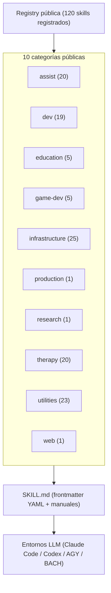

<p align="center">
  <a href="README.md"></a>
  <a href="README_de.md"></a>
  <a href="README_es.md"></a>
  <a href="README_ja.md"></a>
  <a href="README_ru.md"></a>
  <a href="README_zh.md"></a>
</p>

# ellmos skills

**Documentación en seis idiomas** · [Contexto legible por máquinas](llms.txt)

> Biblioteca portátil de skills de IA para flujos `SKILL.md` al estilo Claude Code, configuraciones de agentes compatibles con Codex, BACH y otros entornos de agentes LLM local-first.

[](LICENSE)
[](SKILLS-MAP.md)
[](llms.txt)

> [!NOTE]
> **Integración con agentes de IA y LLM:** este repositorio ofrece archivos `SKILL.md` estandarizados con frontmatter YAML que pueden consumir directamente Claude Code, Codex, AGY/Gemini y entornos de agentes personalizados. Consulta [`llms.txt`](llms.txt) para obtener contexto legible por máquinas.

> [!IMPORTANT]
> **¿Estás leyendo una copia?** La versión canónica y siempre actualizada vive en
> **[github.com/ellmos-ai/skills](https://github.com/ellmos-ai/skills)**.
> Los forks y espejos **no** se actualizan automáticamente y pueden estar muchos commits
> atrasados. Comprueba la fuente antes de basarte en su contenido.

**Enlaces rápidos:** [Primeros pasos](#primeros-pasos) · [Skills destacados](#skills-destacados) · [Skills](skills/) · [Mapa de skills](SKILLS-MAP.md) · [Convenciones](docs/CONVENTIONS.md) · [Cambios](CHANGELOG.md)

Este repositorio es el catálogo reutilizable de skills del ecosistema ellmos. Contiene procesos independientes, flujos de desarrollo, asistentes de investigación, métodos orientados a terapia, manuales de infraestructura y utilidades en un formato `SKILL.md` compatible con Anthropic. Cada skill incluye sus metadatos en el frontmatter YAML para que los entornos puedan inspeccionar procedencia, compatibilidad y dependencias sin una registry central.

## Arquitectura del sistema



## Primeros pasos

| Necesidad | Archivo o comando |
|---|---|
| Explorar todos los skills públicos | [`skills/`](skills/) |
| Ver el árbol de todos los skills registrados | [`SKILLS-MAP.md`](SKILLS-MAP.md) |
| Entender el esquema `SKILL.md` | [`docs/CONVENTIONS.md`](docs/CONVENTIONS.md) |
| Índice de catálogo legible por máquinas | [`registry/components.json`](registry/components.json) |
| Explorar por categoría | [`skills/`](skills/) (una subcarpeta por categoría) |
| Usar un skill | Copia `skills/<categoría>/<nombre>/` al directorio de skills de tu agente, por ejemplo `~/.claude/skills/` |
| Revisar cambios públicos | [`CHANGELOG.md`](CHANGELOG.md) |
| Dar a crawlers y agentes LLM un mapa compacto | [`llms.txt`](llms.txt) |

## Estado del catálogo

El catálogo público actual contiene 120 skills de ejecución registrados:

| Categoría | Cantidad | Enfoque |
|---|---:|---|
|  `assist` | 20 | Métodos neutrales para oficina, notas, hogar, contactos, organización de información sanitaria, exportaciones de medios e inventario, voz, viajes, tiempo, calendarios y transcripción |
|  `dev` | 19 | | Protocolos de desarrollo, depuración, barridos de errores, renovación de pipelines, migración, documentación, plugins y publicación de repositorios |
|  `education` | 5 | Planificación académica, aprendizaje basado en fuentes, preparación de exámenes, hojas de trabajo y planificación neutral de enseñanza y apoyo |
|  `game-dev` | 5 | Flujos para Blender, Roblox, Rojo, Studio, seguridad de assets y diseño de juegos |
|  `infrastructure` | 25 | Configuración portátil de IA, onboarding, gestión del catálogo, autocuidado de automatizaciones, routing semántico de personas, sincronización neutral y puentes de arranque |
|  `production` | 1 | Router de producción textual para textos generales, narrativa y relaciones públicas con compilador LaTeX local |
|  `research` | 1 | Apoyo a flujos de agentes de investigación |
|  `therapy` | 20 | Manuales de psicoeducación y métodos de conversación |
|  `utilities` | 23 | | Operaciones por lotes, marcos de pensamiento, decisiones, fragmentación de documentos, reparación de codificación, transcripción, correo privado, empleo, modelos de usuario y orientación inicial jurídica y fiscal alemana |
|  `web` | 1 | Protocolo para lectura web |

## Skills destacados

Estos skills son buenos puntos de entrada porque coordinan herramientas, reducen flujos caóticos o convierten procedimientos locales en manuales repetibles:

| Skill | Por qué destaca |
|---|---|
|  [`skill-explorer`](skills/infrastructure/skill-explorer/SKILL.md) | Audita, agrupa e investiga skills y plugins; instala solo tras revisión de seguridad y autorización. |
|  [`model-strategy`](skills/dev/model-strategy/SKILL.md) | Routing multimodelo para Claude, Codex, Gemini y Ollama con selección, delegación y escalado. |
|  [`pipeline-optimizer`](skills/dev/pipeline-optimizer/SKILL.md) | Protocolo de seis pasos para renovar proyectos y evitar estándares paralelos. |
|  [`github-repo-care`](skills/dev/github-repo-care/SKILL.md) | Gate de publicación y mantenimiento con reglas, locks, privacidad, i18n y releases. |
|  [`mcp-config-sync`](skills/infrastructure/mcp-config-sync/SKILL.md) | Descubrimiento MCP y planificación de sincronización sin hub implícito. |
|  [`video-transcriber`](skills/utilities/video-transcriber/SKILL.md) | Extrae subtítulos, transcripciones y metadatos a Markdown, JSON o texto. |
|  [`rbx-studio`](skills/game-dev/rbx-studio/SKILL.md) | Operación de Roblox Studio, conexión con Rojo y revisión obligatoria de assets. |
|  [`decision-briefing`](skills/utilities/decision-briefing/SKILL.md) | Convierte decisiones abiertas en un briefing numerado con opciones y recomendaciones. |
|  [`bugsweep`](skills/dev/bugsweep/SKILL.md) | Barrido sistemático de errores con objetivos medibles y verificación final. |
|  [`plugin-system`](skills/dev/plugin-system/SKILL.md) | Sistema de plugins Python sin dependencias, con descubrimiento y tolerancia a fallos. |
|  [`bilingual-doc-sync`](skills/utilities/bilingual-doc-sync/SKILL.md) | Mantiene sincronizadas versiones lingüísticas y detecta secciones divergentes. |
|  [`trampelpfadanalyse`](skills/dev/trampelpfadanalyse/SKILL.md) | Comprueba empíricamente si una convención documental cambia realmente el comportamiento del agente. |
|  [`law-checker`](skills/utilities/law-checker/SKILL.md) | Referencia al módulo público de orientación jurídica alemana basada en fuentes; no sustituye a un abogado. |
|  [`steuer-assistent`](skills/utilities/steuer-assistent/SKILL.md) | Referencia a una hoja local para gastos laborales de empleados en Alemania; no es asesoría fiscal. |
|  [`worksheet-generator`](skills/education/worksheet-generator/SKILL.md) | Genera hojas individualizadas a partir de objetivo, nivel y edad. |
|  [`research-agent`](skills/research/research-agent/SKILL.md) | Flujo reproducible de literatura científica para PubMed y arXiv. |
|  [`agent-config-sync`](skills/infrastructure/agent-config-sync/SKILL.md) | Descubre superficies y planifica topologías seleccionadas por el usuario. |
| [`agents-bridge`](skills/infrastructure/agents-bridge/SKILL.md) | Puente neutral de arranque para cargar reglas desde una o varias fuentes elegidas. |
| [`automation-self-care`](skills/infrastructure/automation-self-care/SKILL.md) | Mantiene tareas programadas y automatizaciones con readback, rollback y cobertura cruzada. |
| [`semantic-persona-routing`](skills/infrastructure/semantic-persona-routing/SKILL.md) | Separa roles, expertos, endpoints, personas y permisos. |
| [`build-your-users-mind`](skills/utilities/build-your-users-mind/SKILL.es.md) | Referencia pública para crear un modelo de preferencias autorizado sin publicar el perfil personal. |
|  [`dev-soft-agent`](skills/dev/dev-soft-agent/SKILL.md) | Pipeline de automatización de desarrollo en Python sin servicios externos. |
|  [`llm-text-hygiene`](skills/utilities/llm-text-hygiene/SKILL.md) | Elimina residuos de chat y gestiona niveles de declaración de IA. |
|  [`idea-mining`](skills/utilities/idea-mining/SKILL.md) | Método multitécnica para extraer ideas de problemas bloqueados. |
|  [`skill-extractor`](skills/infrastructure/skill-extractor/SKILL.md) | Extrae un skill reutilizable de una conversación o transcripción. |
|  [`workflow-extract`](skills/infrastructure/workflow-extract/SKILL.md) | Convierte conversaciones y prompts existentes en flujos repetibles. |
|  [`ai-portable-setup`](skills/infrastructure/ai-portable-setup/SKILL.md) | Crea un entorno portátil y sin nube con modelos locales y RAG. |
|  [`bewerbungsexperte`](skills/utilities/bewerbungsexperte/SKILL.md) | Apoyo integral para candidaturas, CV, LinkedIn y cartas. |
|  [`therapy/`](skills/therapy/) | Familia coherente de psicoeducación y métodos de conversación con límites éticos. |

## Límite público/privado

Las carpetas públicas contienen únicamente métodos portátiles y assets neutrales. Adaptadores ligados a apps o hosts, cuentas, bases de datos, rutas locales, datos reales y preferencias personales pertenecen a un perfil o fork privado. El gate de privacidad rechaza rutas de usuario concretas, hosts privados conocidos, patrones de token y archivos ignorados añadidos por error.

`foerderplaner` solo cubre planificación educativa y de apoyo. La generación general de informes vive en [`report-forge`](https://github.com/ellmos-ai/report-forge); las plantillas personales de informes permanecen privadas.

`build-your-users-mind` y `decision-avatar` son los núcleos públicos para modelos autorizados de usuario; los avatares personales identificados son privados. Los flujos operativos de Store son exclusivamente privados y no se distribuyen. `law-checker` es el módulo público de orientación jurídica; los flujos privados de departamento jurídico tampoco se publican.

El catálogo público contiene únicamente skills propios de Ellmos. Los skills de terceros no se republican con un autor de Ellmos. Por ello, `registry/components.json` es solo un índice público reducido; las evaluaciones internas, clasificaciones de privacidad y la registry completa permanecen en un repositorio No-Push separado.

## Skills educativos

Cinco skills educativos neutrales respecto a institución y usuario:

| Skill | Función |
|---|---|
| [`academic-study-control`](skills/education/academic-study-control/SKILL.md) | Planificación semestral, plazos, inscripciones y recordatorios con verificación. |
| [`academic-study-learn`](skills/education/academic-study-learn/SKILL.md) | Ciclo de aprendizaje basado en fuentes, glosario, transferencia y recuperación. |
| [`academic-study-test`](skills/education/academic-study-test/SKILL.md) | Modos de prueba con rúbricas y límite estricto contra asistencia en exámenes reales. |
| [`foerderplaner`](skills/education/foerderplaner/SKILL.es.md) | Planificación neutral de enseñanza y apoyo; no genera informes personales. |
| [`worksheet-generator`](skills/education/worksheet-generator/SKILL.md) | Hojas de trabajo diferenciadas según objetivo y nivel. |

## Estructura del repositorio

```text
skills/
  <categoría>/
    <nombre-del-skill>/
      SKILL.md              # Definición, frontmatter y flujo
      scripts/              # Ayudantes ejecutables opcionales
      references/           # Documentos de apoyo opcionales
docs/
  CONVENTIONS.md
registry/components.json
llms.txt
```

## Metadatos y validación

Cada `SKILL.md` declara independencia, compatibilidad, procedencia y dependencias. Los pushes y pull requests que modifican skills públicos ejecutan el gate estático completo:

```bash
python testing/skill_tester.py batch --type static --ci
```

Con [pre-commit](https://pre-commit.com/) instalado, activa el hook con `pre-commit install`.

## Contexto de búsqueda

Usa la cadena canónica `ellmos-ai/skills` al enlazar o indexar el proyecto. Es un catálogo reutilizable, no un servidor MCP, un SaaS, un marketplace ni un instalador de skills privados.

## Proyectos relacionados

| Proyecto | Función |
|---|---|
| [BACH](https://github.com/ellmos-ai/bach) | Sistema operativo textual completo para LLM |
| [Rinnsal](https://github.com/ellmos-ai/rinnsal) | Infraestructura ligera de agentes local-first |
| [USMC](https://github.com/ellmos-ai/usmc) | Primitiva de memoria compartida |
| [Gardener](https://github.com/ellmos-ai/gardener) | Contraparte basada en base de datos |
| [MarbleRun / llmauto](https://github.com/ellmos-ai/MarbleRun) | Framework para cadenas de LLM |

## Licencia y responsabilidad

Licencia MIT. Consulta [LICENSE](LICENSE).

Este proyecto es una contribución open source no remunerada. La responsabilidad se limita a dolo y negligencia grave según el artículo 521 del Código Civil alemán. Uso bajo tu propio riesgo; no se ofrece garantía de mantenimiento, disponibilidad, ausencia de errores ni adecuación para un fin concreto.
