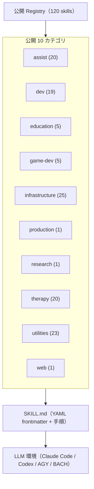

<p align="center">
  <a href="README.md"></a>
  <a href="README_de.md"></a>
  <a href="README_es.md"></a>
  <a href="README_ja.md"></a>
  <a href="README_ru.md"></a>
  <a href="README_zh.md"></a>
</p>

# ellmos skills

**6 言語のドキュメント** · [機械可読コンテキスト](llms.txt)

> Claude Code 形式の `SKILL.md` ワークフロー、Codex 対応のエージェント構成、BACH、その他の local-first LLM エージェント環境向けのポータブル AI スキルライブラリです。

[](LICENSE)
[](SKILLS-MAP.md)
[](llms.txt)

> [!NOTE]
> **AI エージェントと LLM の統合:** このリポジトリは、Claude Code、Codex、AGY/Gemini、独自エージェント環境から直接利用できる YAML frontmatter 付きの標準 `SKILL.md` を提供します。機械可読情報は [`llms.txt`](llms.txt) を参照してください。

> [!IMPORTANT]
> **コピーを読んでいますか？** 正式かつ常に最新の版は
> **[github.com/ellmos-ai/skills](https://github.com/ellmos-ai/skills)** にあります。
> fork や mirror は自動更新されません。利用前に正本を確認してください。

**クイックリンク:** [はじめに](#はじめに) · [注目スキル](#注目スキル) · [Skills](skills/) · [スキルマップ](SKILLS-MAP.md) · [規約](docs/CONVENTIONS.md) · [変更履歴](CHANGELOG.md)

このリポジトリは ellmos エコシステムの再利用可能なスキルカタログです。独立したプロセススキル、開発ワークフロー、研究支援、セラピー関連手法、インフラ手順、ユーティリティを Anthropic 互換の `SKILL.md` 形式で収録します。各スキルは出典、互換性、依存関係を YAML frontmatter に保持します。

## システム構成



## はじめに

| 目的 | ファイルまたはコマンド |
|---|---|
| すべての公開スキルを見る | [`skills/`](skills/) |
| 登録スキルのツリーを見る | [`SKILLS-MAP.md`](SKILLS-MAP.md) |
| `SKILL.md` スキーマを理解する | [`docs/CONVENTIONS.md`](docs/CONVENTIONS.md) |
| 機械可読カタログ | [`registry/components.json`](registry/components.json) |
| カテゴリ別に探す | [`skills/`](skills/) |
| スキルを使う | `skills/<category>/<name>/` をエージェントのスキルディレクトリへコピー |
| 公開変更を確認する | [`CHANGELOG.md`](CHANGELOG.md) |
| LLM 向けの短い地図を読む | [`llms.txt`](llms.txt) |

## カタログ概要

公開カタログには 120 の実行用スキルがあります。

| カテゴリ | 数 | 主な内容 |
|---|---:|---|
|  `assist` | 20 | オフィス、メモ、家庭、連絡先、健康情報、メディア、在庫、音声、旅行、天気、カレンダー、文字起こしのユーザー中立な手法 |
|  `dev` | 19 | | 開発、デバッグ、バグ調査、パイプライン、移行、文書、プラグイン、リポジトリ公開 |
|  `education` | 5 | 学習計画、資料ベース学習、試験準備、ワークシート、授業・支援計画 |
|  `game-dev` | 5 | Blender、Roblox、Rojo、Studio、アセット安全、ゲーム設計 |
|  `infrastructure` | 25 | ポータブル AI、オンボーディング、スキル管理、自動化保守、セマンティックルーティング、設定同期、起動ブリッジ |
|  `production` | 1 | 一般文書、物語、PR 文書の制作ルーター |
|  `research` | 1 | 研究エージェントのワークフロー |
|  `therapy` | 20 | 心理教育と対話手法のプレイブック |
|  `utilities` | 23 | | バッチ処理、思考、意思決定、文書分割、文字コード修復、動画、応募支援、ユーザーモデル、ドイツ法・税務の初期案内 |
|  `web` | 1 | Web 読み取りプロトコル |

## 注目スキル

| Skill | 特徴 |
|---|---|
| [`skill-explorer`](skills/infrastructure/skill-explorer/SKILL.md) | スキルの監査、分類、調査、安全確認後の導入。 |
| [`model-strategy`](skills/dev/model-strategy/SKILL.md) | Claude、Codex、Gemini、Ollama のモデルルーティング。 |
| [`pipeline-optimizer`](skills/dev/pipeline-optimizer/SKILL.md) | 既存プロジェクトを安全に整理する 6 段階手順。 |
| [`github-repo-care`](skills/dev/github-repo-care/SKILL.md) | ルール、lock、privacy、i18n、release を含む公開ゲート。 |
| [`mcp-config-sync`](skills/infrastructure/mcp-config-sync/SKILL.md) | 暗黙の hub を置かない MCP 検出・同期計画。 |
| [`video-transcriber`](skills/utilities/video-transcriber/SKILL.md) | 動画字幕、文字起こし、メタデータの抽出。 |
| [`rbx-studio`](skills/game-dev/rbx-studio/SKILL.md) | Roblox Studio、Rojo、アセット安全確認。 |
| [`decision-briefing`](skills/utilities/decision-briefing/SKILL.md) | 未決事項を番号付き選択肢と推奨に変換。 |
| [`bugsweep`](skills/dev/bugsweep/SKILL.md) | 測定可能な目標と完了確認を持つバグ調査。 |
| [`plugin-system`](skills/dev/plugin-system/SKILL.md) | 依存関係なしの Python プラグインシステム。 |
| [`bilingual-doc-sync`](skills/utilities/bilingual-doc-sync/SKILL.md) | 言語版の欠落と構造ドリフトを検出。 |
| [`trampelpfadanalyse`](skills/dev/trampelpfadanalyse/SKILL.md) | 文書規約が実際に行動を変えるか実証。 |
| [`law-checker`](skills/utilities/law-checker/SKILL.md) | 出典に基づくドイツ法の初期案内。弁護士の代替ではありません。 |
| [`steuer-assistent`](skills/utilities/steuer-assistent/SKILL.md) | ドイツの従業員経費用ローカルシート。税務助言ではありません。 |
| [`worksheet-generator`](skills/education/worksheet-generator/SKILL.md) | 目標、レベル、年齢に応じた教材生成。 |
| [`research-agent`](skills/research/research-agent/SKILL.md) | PubMed と arXiv の再現可能な調査。 |
| [`agent-config-sync`](skills/infrastructure/agent-config-sync/SKILL.md) | 選択された設定・ルール面の同期計画。 |
| [`agents-bridge`](skills/infrastructure/agents-bridge/SKILL.md) | 選択したルール面を読み込む中立ブリッジ。 |
| [`automation-self-care`](skills/infrastructure/automation-self-care/SKILL.ja.md) | readback と rollback を備えた自動化保守。 |
| [`semantic-persona-routing`](skills/infrastructure/semantic-persona-routing/SKILL.ja.md) | 役割、専門家、endpoint、persona、権限を分離。 |
| [`build-your-users-mind`](skills/utilities/build-your-users-mind/SKILL.ja.md) | 個人プロファイルを公開せず、許可済み選好モデルを構築する公開モジュール。 |
| [`dev-soft-agent`](skills/dev/dev-soft-agent/SKILL.md) | 外部サービス不要の開発自動化パイプライン。 |
| [`llm-text-hygiene`](skills/utilities/llm-text-hygiene/SKILL.md) | チャット残留物と AI 開示レベルを処理。 |
| [`idea-mining`](skills/utilities/idea-mining/SKILL.md) | 停滞した問題から案を抽出する複合手法。 |
| [`skill-extractor`](skills/infrastructure/skill-extractor/SKILL.md) | 会話から再利用可能なスキルを抽出。 |
| [`workflow-extract`](skills/infrastructure/workflow-extract/SKILL.md) | 会話や既存 prompt を反復可能な workflow に変換。 |
| [`ai-portable-setup`](skills/infrastructure/ai-portable-setup/SKILL.md) | ローカルモデルと RAG を持つポータブル環境を作成。 |
| [`bewerbungsexperte`](skills/utilities/bewerbungsexperte/SKILL.md) | 求人分析、履歴書、LinkedIn、応募文を支援。 |
| [`therapy/`](skills/therapy/) | 倫理境界を持つ心理教育と対話手法のコレクション。 |

## 公開領域と非公開領域

公開スキルにはポータブルな手法と中立なアセットだけを含めます。アプリやホスト固有のアダプター、アカウント、データベース、ローカルパス、実データ、個人設定は別の非公開プロファイルまたは fork に置きます。Privacy Gate は具体的なユーザーパス、既知の非公開ホスト、token パターン、誤って追跡された ignore 対象を拒否します。

`foerderplaner` は授業と支援の計画だけを扱います。一般的な報告書生成は [`report-forge`](https://github.com/ellmos-ai/report-forge) にあり、個人用支援報告テンプレートは非公開です。

`build-your-users-mind` と `decision-avatar` は公開されたユーザーモデルのコアです。特定人物のアバターは非公開です。Store 運用 workflow は非公開専用で配布しません。`law-checker` は公開の法的初期案内で、個人用の法務部門 workflow も配布しません。

公開カタログには Ellmos 独自の skills だけを収録します。第三者の skills を Ellmos の著者名で再公開しません。そのため `registry/components.json` は最小限の公開索引であり、内部評価、プライバシー分類、完全な maintainer registry は別の No-Push リポジトリに保持します。

## 教育スキル

| Skill | 内容 |
|---|---|
| [`academic-study-control`](skills/education/academic-study-control/SKILL.md) | 学期、期限、登録、通知を出典確認付きで管理。 |
| [`academic-study-learn`](skills/education/academic-study-learn/SKILL.md) | 目標、要点、用語集、応用、想起練習の学習サイクル。 |
| [`academic-study-test`](skills/education/academic-study-test/SKILL.md) | rubric 付き試験練習。実試験支援は禁止。 |
| [`foerderplaner`](skills/education/foerderplaner/SKILL.ja.md) | ユーザー中立の授業・支援計画。個人報告書は生成しません。 |
| [`worksheet-generator`](skills/education/worksheet-generator/SKILL.md) | 学習目標とレベルに応じたワークシート。 |

## リポジトリ構造

```text
skills/
  <category>/
    <skill-name>/
      SKILL.md
      scripts/
      references/
docs/CONVENTIONS.md
registry/components.json
llms.txt
```

## メタデータと検証

各 `SKILL.md` は standalone、互換性、出典、依存関係を宣言します。公開スキルを変更する push と pull request は静的ゲートを実行します。

```bash
python testing/skill_tester.py batch --type static --ci
```

[pre-commit](https://pre-commit.com/) を利用する場合は `pre-commit install` で hook を有効にします。

## 検索と関連プロジェクト

リンクや索引には正規名 `ellmos-ai/skills` を使用してください。このプロジェクトは再利用可能なカタログであり、MCP サーバー、SaaS、marketplace、非公開スキルの installer ではありません。

| プロジェクト | 役割 |
|---|---|
| [BACH](https://github.com/ellmos-ai/bach) | テキストベースの完全な LLM OS |
| [Rinnsal](https://github.com/ellmos-ai/rinnsal) | 軽量 local-first エージェント基盤 |
| [USMC](https://github.com/ellmos-ai/usmc) | 共有メモリ基盤 |
| [Gardener](https://github.com/ellmos-ai/gardener) | データベース型 OS 対応物 |
| [MarbleRun / llmauto](https://github.com/ellmos-ai/MarbleRun) | LLM チェーン実行フレームワーク |

## ライセンスと責任

MIT License。詳細は [LICENSE](LICENSE) を参照してください。

このプロジェクトは無償のオープンソース提供です。ドイツ民法第 521 条に従い、責任は故意および重大な過失に限定されます。利用は自己責任であり、保守、可用性、無欠陥性、特定目的への適合性は保証されません。
