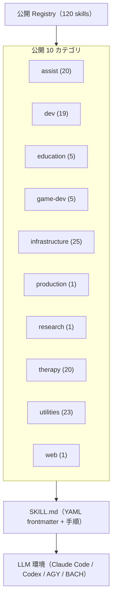

<p align="center">
  <a href="README.md"></a>
  <a href="README_de.md"></a>
  <a href="README_es.md"></a>
  <a href="README_ja.md"></a>
  <a href="README_ru.md"></a>
  <a href="README_zh.md"></a>
</p>

# ellmos skills

**6 言語のドキュメント** · [機械可読コンテキスト](llms.txt) · **🗺️ [スキルライブラリをオンラインで閲覧](https://ellmos-ai.github.io/skills.html)** — ブラウザですべての公開スキルを閲覧・コピー

> Claude Code 形式の `SKILL.md` ワークフロー、Codex 対応のエージェント構成、BACH、その他の local-first LLM エージェント環境向けのポータブル AI スキルライブラリです。

[](https://github.com/ellmos-ai/skills/actions/workflows/tests.yml)
[](LICENSE)
[](SKILLS-MAP.md)
[](https://python.org)
[](https://github.com/ellmos-ai)
[](https://github.com/open-bricks)
[](llms.txt)

> [!NOTE]
> **AI エージェントと LLM の統合:** このリポジトリは、Claude Code、Codex、AGY/Gemini、独自エージェント環境から直接利用できる YAML frontmatter 付きの標準 `SKILL.md` を提供します。機械可読情報は [`llms.txt`](llms.txt) を参照してください。

> [!IMPORTANT]
> **コピーを読んでいますか？** 正式かつ常に最新の版は
> **[github.com/ellmos-ai/skills](https://github.com/ellmos-ai/skills)** にあります。
> fork や mirror は自動更新されません。利用前に正本を確認してください。

**クイックリンク:** [はじめに](#はじめに) · [注目スキル](#注目スキル) · [Skills](skills/) · [スキルマップ](SKILLS-MAP.md) · [規約](docs/CONVENTIONS.md) · [変更履歴](CHANGELOG.md)

このリポジトリは ellmos エコシステムの再利用可能なスキルカタログです。独立したプロセススキル、開発ワークフロー、研究支援、セラピー関連手法、インフラ手順、ユーティリティを Anthropic 互換の `SKILL.md` 形式で収録します。各スキルは出典、互換性、依存関係を YAML frontmatter に保持します。

## システム構成


```mermaid
flowchart TD
    Catalog["公開 Registry（120 skills）"] --> Categories
    subgraph Categories ["公開 10 カテゴリ"]
        Assist["assist (20)"]
        Dev["dev (19)"]
        Edu["education (5)"]
        Game["game-dev (5)"]
        Infra["infrastructure (25)"]
        Prod["production (1)"]
        Res["research (1)"]
        Therapy["therapy (20)"]
        Utils["utilities (23)"]
        Web["web (1)"]
    end
    Categories --> Specs["SKILL.md（YAML frontmatter + 手順）"]
    Specs --> Runtimes["LLM 環境（Claude Code / Codex / AGY / BACH）"]
```

## はじめに

| 目的 | ファイルまたはコマンド |
|---|---|
| すべての公開スキルを見る | [`skills/`](skills/) |
| 登録スキルのツリーを見る | [`SKILLS-MAP.md`](SKILLS-MAP.md) |
| `SKILL.md` スキーマを理解する | [`docs/CONVENTIONS.md`](docs/CONVENTIONS.md) |
| 機械可読カタログ | [`registry/components.json`](registry/components.json) |
| カテゴリ別に探す | [`skills/`](skills/) |
| スキルを使う | `skills/<category>/<name>/` をエージェントのスキルディレクトリへコピー |
| 公開変更を確認する | [`CHANGELOG.md`](CHANGELOG.md) |
| LLM 向けの短い地図を読む | [`llms.txt`](llms.txt) |

## カタログ概要

公開カタログには 120 の実行用スキルがあります。

| カテゴリ | 数 | 主な内容 |
|---|---:|---|
|  `assist` | 20 | オフィス、メモ、家庭、連絡先、健康情報、メディア、在庫、音声、旅行、天気、カレンダー、文字起こしのユーザー中立な手法 |
|  `dev` | 19 | | 開発、デバッグ、バグ調査、パイプライン、移行、文書、プラグイン、リポジトリ公開 |
|  `education` | 5 | 学習計画、資料ベース学習、試験準備、ワークシート、授業・支援計画 |
|  `game-dev` | 5 | Blender、Roblox、Rojo、Studio、アセット安全、ゲーム設計 |
|  `infrastructure` | 25 | ポータブル AI、オンボーディング、スキル管理、自動化保守、セマンティックルーティング、設定同期、起動ブリッジ |
|  `production` | 1 | 一般文書、物語、PR 文書の制作ルーター |
|  `research` | 1 | 研究エージェントのワークフロー |
|  `therapy` | 20 | 心理教育と対話手法のプレイブック |
|  `utilities` | 23 | | バッチ処理、思考、意思決定、文書分割、文字コード修復、動画、応募支援、ユーザーモデル、ドイツ法・税務の初期案内 |
|  `web` | 1 | Web 読み取りプロトコル |

## 注目スキル

| Skill | 特徴 |
|---|---|
|  [`skill-explorer`](skills/infrastructure/skill-explorer/SKILL.ja.md) | スキルの監査、分類、調査、安全確認後の導入。 |
|  [`model-strategy`](skills/dev/model-strategy/SKILL.ja.md) | Claude、Codex、Gemini、Ollama のモデルルーティング。 |
|  [`pipeline-optimizer`](skills/dev/pipeline-optimizer/SKILL.ja.md) | 既存プロジェクトを安全に整理する 6 段階手順。 |
|  [`github-repo-care`](skills/dev/github-repo-care/SKILL.ja.md) | ルール、lock、privacy、i18n、release を含む公開ゲート。 |
|  [`mcp-config-sync`](skills/infrastructure/mcp-config-sync/SKILL.ja.md) | 暗黙の hub を置かない MCP 検出・同期計画。 |
|  [`video-transcriber`](skills/utilities/video-transcriber/SKILL.ja.md) | 動画字幕、文字起こし、メタデータの抽出。 |
|  [`rbx-studio`](skills/game-dev/rbx-studio/SKILL.ja.md) | Roblox Studio、Rojo、アセット安全確認。 |
|  [`decision-briefing`](skills/utilities/decision-briefing/SKILL.ja.md) | 未決事項を番号付き選択肢と推奨に変換。 |
|  [`bugsweep`](skills/dev/bugsweep/SKILL.ja.md) | 測定可能な目標と完了確認を持つバグ調査。 |
|  [`plugin-system`](skills/dev/plugin-system/SKILL.ja.md) | 依存関係なしの Python プラグインシステム。 |
|  [`bilingual-doc-sync`](skills/utilities/bilingual-doc-sync/SKILL.ja.md) | 言語版の欠落と構造ドリフトを検出。 |
|  [`law-checker`](skills/utilities/law-checker/SKILL.ja.md) | 出典に基づくドイツ法の初期案内。弁護士の代替ではありません。 |
|  [`steuer-assistent`](skills/utilities/steuer-assistent/SKILL.ja.md) | ドイツの従業員経費用ローカルシート。税務助言ではありません。 |
|  [`worksheet-generator`](skills/education/worksheet-generator/SKILL.ja.md) | 目標、レベル、年齢に応じた教材生成。 |
|  [`research-agent`](skills/research/research-agent/SKILL.ja.md) | PubMed と arXiv の再現可能な調査。 |
|  [`agent-config-sync`](skills/infrastructure/agent-config-sync/SKILL.ja.md) | 選択された設定・ルール面の同期計画。 |
|  [`agents-bridge`](skills/infrastructure/agents-bridge/SKILL.ja.md) | 選択したルール面を読み込む中立ブリッジ。 |
|  [`automation-self-care`](skills/infrastructure/automation-self-care/SKILL.ja.md) | readback と rollback を備えた自動化保守。 |
|  [`semantic-persona-routing`](skills/infrastructure/semantic-persona-routing/SKILL.ja.md) | 役割、専門家、endpoint、persona、権限を分離。 |
|  [`build-your-users-mind`](skills/utilities/build-your-users-mind/SKILL.ja.md) | 個人プロファイルを公開せず、許可済み選好モデルを構築する公開モジュール。 |
|  [`dev-soft-agent`](skills/dev/dev-soft-agent/SKILL.ja.md) | 外部サービス不要の開発自動化パイプライン。 |
|  [`llm-text-hygiene`](skills/utilities/llm-text-hygiene/SKILL.ja.md) | チャット残留物と AI 開示レベルを処理。 |
|  [`idea-mining`](skills/utilities/idea-mining/SKILL.ja.md) | 停滞した問題から案を抽出する複合手法。 |
|  [`skill-extractor`](skills/infrastructure/skill-extractor/SKILL.ja.md) | 会話から再利用可能なスキルを抽出。 |
|  [`workflow-extract`](skills/infrastructure/workflow-extract/SKILL.ja.md) | 会話や既存 prompt を反復可能な workflow に変換。 |
|  [`ai-portable-setup`](skills/infrastructure/ai-portable-setup/SKILL.ja.md) | ローカルモデルと RAG を持つポータブル環境を作成。 |
|  [`bewerbungsexperte`](skills/utilities/bewerbungsexperte/SKILL.ja.md) | 求人分析、履歴書、LinkedIn、応募文を支援。 |
|  [`therapy/`](skills/therapy/) | 倫理境界を持つ 19 個の心理教育と対話手法のコレクション（主力: [`cognitive-restructuring`](skills/therapy/cognitive-restructuring/SKILL.ja.md), [`motivational-interviewing`](skills/therapy/motivational-interviewing/SKILL.ja.md)）。ライブラリで最も深くまとまった体系。 |
|  [`lebende-verfassung`](skills/utilities/lebende-verfassung/SKILL.ja.md) | 憲法上の重ね合わせ（「未生者の位置」）：5-CORE 監査と反実仮想分析を通じて、短期的最適化に対する未来世代のアルゴリズム的拒否権を付与。 |
|  [`work-autonomous`](skills/infrastructure/work-autonomous/SKILL.md) | エージェントの手抜きを防ぐ証明ベースの非終了プロトコル（WAAFAP）：終了条件を反転させ、ループの終了にタスク不存在の反証可能な証明を要求。 |
|  [`piggyback-hosting`](skills/dev/piggyback-hosting/SKILL.md) | ゼロステート・プライバシー配信パターン：SQLite-WASM/OPFS とクライアント側 BYOK によりブラウザ内で SQLite を実行し、サーバー DB や GDPR 責任を排除。 |
|  [`software-in-worten`](skills/dev/software-in-worten/SKILL.md) | 双方向 UI プロンプト統合（「クリックがプロンプト」）：ビルド段階なしで GUI 設計と指示を同期させる 4D 凡例付き型定義 ASCII ブループリント。 |
|  [`metacognitive-injectors`](skills/infrastructure/metacognitive-injectors/SKILL.ja.md) | おもねりや時期尚早な終了を防ぐため、実行時プリフライトチェックに統合された神経心理学的実行制御機能（抑制、作業記憶、メンタルリハーサル）。 |
|  [`paveman`](skills/utilities/paveman/SKILL.md) | 決定論的でモデル不要のルール圧縮：LLM 推論や幻覚、意味ドリフトなしに、Markdown ルールとメモリのトークン量を最大 40% 削減。 |
|  [`wayfinding-routing`](skills/infrastructure/wayfinding-routing/SKILL.ja.md) | 見失った AI エージェントのための普遍的航海ナビゲーション：コンテキストのドリフトやループに陥った際の回復ヒューリスティクスと状態再構築。 |
|  [`condition`](skills/infrastructure/condition/SKILL.ja.md) | プロンプト用の宣言的条件ゲート DSL：前提条件、マイルストーン、順序依存関係を標準 Markdown 内の fail-closed ゲートにカプセル化。 |
|  [`letter-hooker`](skills/infrastructure/letter-hooker/SKILL.ja.md) | フックのない CLI エージェント向けプリフライト・ブートローダー：ネイティブ JSON イベントフックなしで、ターン前に統治ルールとメモリを注入。 |
|  [`pingpong`](skills/infrastructure/pingpong/SKILL.md) | 共有同期フォルダを介したセッション無線局：非対称な役割（`ListenSync` 受信者 vs `WriteSync` 送信者）を分離し、サーバーなしで自律協調。 |
|  [`choose-your-orchestrator`](skills/infrastructure/choose-your-orchestrator/SKILL.md) | マルチエージェント作業のためのセッション契約交渉：実行開始前にオーケストレーション構造、並行性、モデル枠、エスカレーション条件を確定。 |
|  [`reissverschluss-merge`](skills/dev/reissverschluss-merge/SKILL.md) | 大きく乖離したブランチのためのジッパーマージ：決定表によるセクション比較と、最終エスカレーションとしての意図再構築（マージの代わりに再構築）。 |
|  [`migrate-rename`](skills/dev/migrate-rename/SKILL.ja.md) | ラッパーと MOVED スタブを用いた進化的なファイル・モジュール改名：利用を通じて参照が自然に更新される間、破壊的変更を防止。 |
|  [`projekt-pipeline-umbrella`](skills/dev/projekt-pipeline-umbrella/SKILL.ja.md) | パイプラインのための 2x2 分類コンパス：LLM のスキャフォールディング偏向を防ぎ、適切なオンボーディングや改修スキルに案内。 |
|  [`tidy-up`](skills/dev/tidy-up/SKILL.md) | 決定論的な 3 役セッション終了衛生ループ：新たな課題を作らずに保留タスクを解決し、実態に合わせてドキュメントを同期。 |
|  [`human-loop-audit`](skills/dev/human-loop-audit/SKILL.md) | 非同期の人間参加型パイプライン：ユーザーが項目 N をテストする間にエージェントが項目 N+1 を開始し、待機時間を排除。 |
|  [`folder-organization`](skills/utilities/folder-organization/SKILL.md) | Cut-and-Clue による意味論的ファイル整理：発生元に機械可読ポインタを残して現行と過去のファイルを分離し、分類とログを保持。 |
|  [`iterative-bundle-selection`](skills/utilities/iterative-bundle-selection/SKILL.md) | トピックプールやフィルタ、再シャッフルバンドルにより候補リストを段階的に削減し、残りを破棄せずグループ単位で選択・混合。 |

## 公開領域と非公開領域

公開スキルにはポータブルな手法と中立なアセットだけを含めます。アプリやホスト固有のアダプター、アカウント、データベース、ローカルパス、実データ、個人設定は別の非公開プロファイルまたは fork に置きます。Privacy Gate は具体的なユーザーパス、既知の非公開ホスト、token パターン、誤って追跡された ignore 対象を拒否します。

`foerderplaner` は授業と支援の計画だけを扱います。一般的な報告書生成は [`report-forge`](https://github.com/ellmos-ai/report-forge) にあり、個人用支援報告テンプレートは非公開です。

`build-your-users-mind` と `decision-avatar` は公開されたユーザーモデルのコアです。特定人物のアバターは非公開です。Store 運用 workflow は非公開専用で配布しません。`law-checker` は公開の法的初期案内で、個人用の法務部門 workflow も配布しません。

公開カタログには Ellmos 独自の skills だけを収録します。第三者の skills を Ellmos の著者名で再公開しません。そのため `registry/components.json` は最小限の公開索引であり、内部評価、プライバシー分類、完全な maintainer registry は別の No-Push リポジトリに保持します。

## 教育スキル

| Skill | 内容 |
|---|---|
| [`academic-study-control`](skills/education/academic-study-control/SKILL.ja.md) | 学期、期限、登録、通知を出典確認付きで管理。 |
| [`academic-study-learn`](skills/education/academic-study-learn/SKILL.ja.md) | 目標、要点、用語集、応用、想起練習の学習サイクル。 |
| [`academic-study-test`](skills/education/academic-study-test/SKILL.ja.md) | rubric 付き試験練習。実試験支援は禁止。 |
| [`foerderplaner`](skills/education/foerderplaner/SKILL.ja.md) | ユーザー中立の授業・支援計画。個人報告書は生成しません。 |
| [`worksheet-generator`](skills/education/worksheet-generator/SKILL.ja.md) | 学習目標とレベルに応じたワークシート。 |

## リポジトリ構造

```text
skills/
  <category>/
    <skill-name>/
      SKILL.md
      scripts/
      references/
docs/CONVENTIONS.md
registry/components.json
llms.txt
```

## メタデータと検証

各 `SKILL.md` は standalone、互換性、出典、依存関係を宣言します。公開スキルを変更する push と pull request は静的ゲートを実行します。

```bash
python testing/skill_tester.py batch --type static --ci
```

[pre-commit](https://pre-commit.com/) を利用する場合は `pre-commit install` で hook を有効にします。

### 外部評価

個別スキルに関する独立した第三者による A/B 評価。利用可能になり次第ここに掲載する
（本プロジェクトが実施・依頼したものではない）：

- [`cloud-communication-protocols`](skills/infrastructure/cloud-communication-protocols/SKILL.md) -- [decimal.ai](https://app.decimal.ai/skills/ellmos-ai-cloud-communication-protocols)、2026-08-08 に Gemini-3.6-flash で 22 ケースをテスト：合格率 22.7% -> 95.5%（+73pp）、トークン -14%、セキュリティ 15/15 チェック（3/3）。

## 検索と関連プロジェクト

リンクや索引には正規名 `ellmos-ai/skills` を使用してください。このプロジェクトは再利用可能なカタログであり、MCP サーバー、SaaS、marketplace、非公開スキルの installer ではありません。

| プロジェクト | 組織 | 役割 |
|---|---|---|
| [BACH](https://github.com/ellmos-ai/bach) | `ellmos-ai` | テキストベースの完全な LLM OS |
| [ellmos-controlcenter-mcp](https://github.com/ellmos-ai/ellmos-controlcenter-mcp) | `ellmos-ai` | 統合ツール・プロファイルゲートウェイ MCP サーバー |
| [system-explorer](https://github.com/ellmos-ai/system-explorer) | `ellmos-ai` | エージェントフリート構成とシステム探索 |
| [workflowhooker](https://github.com/ellmos-ai/workflowhooker) | `ellmos-ai` | トランザクション型ワークフローフックディスパッチャー |
| [sqlite-transit-sync](https://github.com/ellmos-ai/sqlite-transit-sync) | `ellmos-ai` | オフラインファーストの転送同期とスナップショット保持 |
| [MarbleRun](https://github.com/ellmos-ai/MarbleRun) | `ellmos-ai` | 自律 LLM エージェントチェーン向けのローカルファースト自動化フレームワーク |
| [gardener](https://github.com/ellmos-ai/gardener) | `ellmos-ai` | エージェント系システム向けのキュレート済みクロスソースメモリインデックス |
| [usmc](https://github.com/ellmos-ai/usmc) | `ellmos-ai` | ローカル SQLite メモリとエージェント間コンテキスト共有 |
| [DevCenter](https://github.com/dev-bricks/DevCenter) | `dev-bricks` | デスクトップ開発者ワークステーションスイート |
| [CodeBox](https://github.com/dev-bricks/CodeBox) | `dev-bricks` | 多言語コードエディタとサンドボックス環境 |

`skills/third-party/` にキュレートされたサードパーティスキル（`grill-me`、`grilling`）は、
アップストリームの [mattpocock/skills](https://github.com/mattpocock/skills) から MIT ライセンスで提供されています。

## ライセンスと責任

MIT License。詳細は [LICENSE](LICENSE) を参照してください。

このプロジェクトは無償のオープンソース提供です。ドイツ民法第 521 条に従い、責任は故意および重大な過失に限定されます。利用は自己責任であり、保守、可用性、無欠陥性、特定目的への適合性は保証されません。
