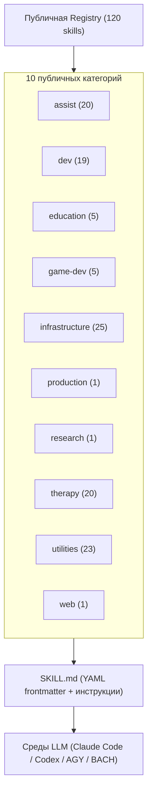

<p align="center">
  <a href="README.md"></a>
  <a href="README_de.md"></a>
  <a href="README_es.md"></a>
  <a href="README_ja.md"></a>
  <a href="README_ru.md"></a>
  <a href="README_zh.md"></a>
</p>

# ellmos skills

**Документация на шести языках** · [Машиночитаемый контекст](llms.txt)

> Переносимая библиотека AI skills для рабочих процессов `SKILL.md` в стиле Claude Code, конфигураций агентов Codex, BACH и других local-first сред LLM.

[](LICENSE)
[](SKILLS-MAP.md)
[](llms.txt)

> [!NOTE]
> **Интеграция с AI-агентами и LLM:** репозиторий предоставляет стандартные `SKILL.md` с YAML frontmatter для Claude Code, Codex, AGY/Gemini и собственных сред. Машиночитаемая карта находится в [`llms.txt`](llms.txt).

> [!IMPORTANT]
> **Вы читаете копию?** Каноническая и всегда актуальная версия находится на
> **[github.com/ellmos-ai/skills](https://github.com/ellmos-ai/skills)**.
> Fork и mirror не обновляются автоматически; перед использованием сверяйтесь с источником.

**Быстрые ссылки:** [Начало](#начало) · [Избранные skills](#избранные-skills) · [Skills](skills/) · [Карта](SKILLS-MAP.md) · [Соглашения](docs/CONVENTIONS.md) · [Изменения](CHANGELOG.md)

Это повторно используемый каталог skills экосистемы ellmos. Он включает автономные процессы, рабочие циклы разработки, научные помощники, терапевтические методы, инфраструктурные инструкции и утилиты в формате `SKILL.md`, совместимом с Anthropic. Метаданные о происхождении, совместимости и зависимостях находятся непосредственно в YAML frontmatter.

## Архитектура



## Начало

| Задача | Файл или команда |
|---|---|
| Просмотреть все публичные skills | [`skills/`](skills/) |
| Открыть дерево каталога | [`SKILLS-MAP.md`](SKILLS-MAP.md) |
| Понять схему `SKILL.md` | [`docs/CONVENTIONS.md`](docs/CONVENTIONS.md) |
| Машиночитаемый индекс | [`registry/components.json`](registry/components.json) |
| Искать по категории | [`skills/`](skills/) |
| Использовать skill | Скопируйте `skills/<category>/<name>/` в каталог skills своей среды |
| Просмотреть публичные изменения | [`CHANGELOG.md`](CHANGELOG.md) |
| Получить компактную карту для LLM | [`llms.txt`](llms.txt) |

## Состав каталога

Публичный каталог содержит 120 исполняемых skills:

| Категория | Количество | Назначение |
|---|---:|---|
|  `assist` | 20 | Нейтральные методы для офиса, заметок, быта, контактов, медицинской информации, медиа, инвентаря, голоса, поездок, погоды, календаря и транскрипции |
|  `dev` | 19 | | Разработка, отладка, поиск ошибок, pipelines, миграция, документация, plugins и публикация репозиториев |
|  `education` | 5 | Учебное планирование, обучение по источникам, подготовка к экзаменам, рабочие листы и поддержка |
|  `game-dev` | 5 | Blender, Roblox, Rojo, Studio, безопасность ресурсов и игровой дизайн |
|  `infrastructure` | 25 | Переносимый AI, onboarding, управление skills, обслуживание автоматизаций, routing персон, синхронизация и загрузочные мосты |
|  `production` | 1 | Маршрутизатор текстового производства |
|  `research` | 1 | Рабочий процесс научного поиска |
|  `therapy` | 20 | Психообразование и методы консультирования |
|  `utilities` | 23 | | Пакетные операции, мышление, решения, документы, кодировки, видео, письма, трудоустройство, модели пользователя, первичная ориентация по немецкому праву и налогам |
|  `web` | 1 | Протокол чтения web |

## Избранные skills

| Skill | Назначение |
|---|---|
| [`skill-explorer`](skills/infrastructure/skill-explorer/SKILL.md) | Аудит, группировка, исследование и безопасная установка skills. |
| [`model-strategy`](skills/dev/model-strategy/SKILL.md) | Маршрутизация между Claude, Codex, Gemini и Ollama. |
| [`pipeline-optimizer`](skills/dev/pipeline-optimizer/SKILL.md) | Шесть этапов безопасного обновления проекта. |
| [`github-repo-care`](skills/dev/github-repo-care/SKILL.md) | Gate публикации: правила, locks, privacy, i18n и releases. |
| [`mcp-config-sync`](skills/infrastructure/mcp-config-sync/SKILL.md) | Обнаружение MCP и синхронизация без неявного hub. |
| [`video-transcriber`](skills/utilities/video-transcriber/SKILL.md) | Субтитры, транскрипции и метаданные видео. |
| [`rbx-studio`](skills/game-dev/rbx-studio/SKILL.md) | Roblox Studio, Rojo и обязательная проверка ресурсов. |
| [`decision-briefing`](skills/utilities/decision-briefing/SKILL.md) | Нумерованный обзор вариантов и рекомендаций. |
| [`bugsweep`](skills/dev/bugsweep/SKILL.md) | Системный поиск ошибок с измеримой целью. |
| [`plugin-system`](skills/dev/plugin-system/SKILL.md) | Python plugin system без внешних зависимостей. |
| [`bilingual-doc-sync`](skills/utilities/bilingual-doc-sync/SKILL.md) | Синхронизация языковых версий и обнаружение расхождений. |
| [`trampelpfadanalyse`](skills/dev/trampelpfadanalyse/SKILL.md) | Эмпирическая проверка влияния правил документации. |
| [`law-checker`](skills/utilities/law-checker/SKILL.md) | Первичная ориентация по немецкому праву на основе источников; не заменяет юриста. |
| [`steuer-assistent`](skills/utilities/steuer-assistent/SKILL.md) | Локальная таблица расходов работника; не налоговая консультация. |
| [`worksheet-generator`](skills/education/worksheet-generator/SKILL.md) | Рабочие листы по цели, уровню и возрасту. |
| [`research-agent`](skills/research/research-agent/SKILL.md) | Повторяемый поиск литературы в PubMed и arXiv. |
| [`agent-config-sync`](skills/infrastructure/agent-config-sync/SKILL.md) | Планирование выбранной топологии конфигурации. |
| [`agents-bridge`](skills/infrastructure/agents-bridge/SKILL.md) | Нейтральный загрузочный мост для правил. |
| [`automation-self-care`](skills/infrastructure/automation-self-care/SKILL.ru.md) | Обслуживание автоматизаций с readback и rollback. |
| [`semantic-persona-routing`](skills/infrastructure/semantic-persona-routing/SKILL.ru.md) | Разделение ролей, экспертов, endpoints, персон и прав. |
| [`build-your-users-mind`](skills/utilities/build-your-users-mind/SKILL.ru.md) | Публичный модуль для авторизованной модели предпочтений без публикации личного профиля. |
| [`dev-soft-agent`](skills/dev/dev-soft-agent/SKILL.md) | Автоматизация разработки без внешних сервисов. |
| [`llm-text-hygiene`](skills/utilities/llm-text-hygiene/SKILL.md) | Удаление следов чата и управление раскрытием AI. |
| [`idea-mining`](skills/utilities/idea-mining/SKILL.md) | Извлечение идей из застрявших задач. |
| [`skill-extractor`](skills/infrastructure/skill-extractor/SKILL.md) | Создание повторно используемого skill из диалога. |
| [`workflow-extract`](skills/infrastructure/workflow-extract/SKILL.md) | Преобразование разговоров в повторяемые workflows. |
| [`ai-portable-setup`](skills/infrastructure/ai-portable-setup/SKILL.md) | Переносимая среда с локальными моделями и RAG. |
| [`bewerbungsexperte`](skills/utilities/bewerbungsexperte/SKILL.md) | Поддержка вакансий, CV, LinkedIn и писем. |
| [`therapy/`](skills/therapy/) | Семейство психообразовательных методов с этическими границами. |

## Публичная и приватная граница

Публичные каталоги содержат только переносимые методы и нейтральные ресурсы. Адаптеры конкретных приложений и hosts, учётные записи, базы данных, локальные пути, реальные данные и личные настройки хранятся в отдельном приватном профиле или fork. Privacy Gate отклоняет конкретные пользовательские пути, известные приватные hosts, шаблоны токенов и ошибочно отслеживаемые ignored-файлы.

`foerderplaner` планирует только обучение и поддержку. Общая генерация отчётов находится в [`report-forge`](https://github.com/ellmos-ai/report-forge); личные шаблоны остаются приватными.

`build-your-users-mind` и `decision-avatar` — публичные ядра для моделей пользователя. Именные личные аватары приватны. Операционные Store-workflows являются только приватными и не распространяются. `law-checker` — публичный модуль правовой ориентации; частные workflows юридического отдела также не поставляются.

Публичный каталог содержит только собственные skills Ellmos. Сторонние skills не публикуются под авторством Ellmos. Поэтому `registry/components.json` — лишь сокращённый публичный индекс; внутренние оценки, классификации приватности и полная maintainer-registry находятся в отдельном No-Push-репозитории.

## Образовательные skills

| Skill | Назначение |
|---|---|
| [`academic-study-control`](skills/education/academic-study-control/SKILL.md) | Семестры, сроки, регистрация и напоминания с проверкой источников. |
| [`academic-study-learn`](skills/education/academic-study-learn/SKILL.md) | Цель, ключевые идеи, словарь, перенос и практика воспроизведения. |
| [`academic-study-test`](skills/education/academic-study-test/SKILL.md) | Режимы тренировки с rubric и запретом помощи на реальном экзамене. |
| [`foerderplaner`](skills/education/foerderplaner/SKILL.ru.md) | Нейтральное планирование обучения и поддержки без личных отчётов. |
| [`worksheet-generator`](skills/education/worksheet-generator/SKILL.md) | Дифференцированные учебные материалы. |

## Структура и проверка

```text
skills/<category>/<skill-name>/
  SKILL.md
  scripts/
  references/
docs/CONVENTIONS.md
registry/components.json
llms.txt
```

Каждый `SKILL.md` объявляет автономность, совместимость, происхождение и зависимости. Для публичных изменений выполняется статический gate:

```bash
python testing/skill_tester.py batch --type static --ci
```

При использовании [pre-commit](https://pre-commit.com/) активируйте hook командой `pre-commit install`.

## Поиск и связанные проекты

При ссылках и индексировании используйте каноническую строку `ellmos-ai/skills`. Это каталог, а не MCP-сервер, SaaS, marketplace или установщик приватных skills.

| Проект | Роль |
|---|---|
| [BACH](https://github.com/ellmos-ai/bach) | Полная текстовая LLM OS |
| [Rinnsal](https://github.com/ellmos-ai/rinnsal) | Лёгкая local-first инфраструктура агентов |
| [USMC](https://github.com/ellmos-ai/usmc) | Общий примитив памяти |
| [Gardener](https://github.com/ellmos-ai/gardener) | Аналог на основе базы данных |
| [MarbleRun / llmauto](https://github.com/ellmos-ai/MarbleRun) | Framework выполнения LLM-цепочек |

## Лицензия и ответственность

Лицензия MIT. См. [LICENSE](LICENSE).

Проект является безвозмездным вкладом в open source. Ответственность ограничена умыслом и грубой неосторожностью согласно § 521 Германского гражданского кодекса. Использование на свой риск; гарантии обслуживания, доступности, отсутствия ошибок или пригодности для конкретной цели не предоставляются.
