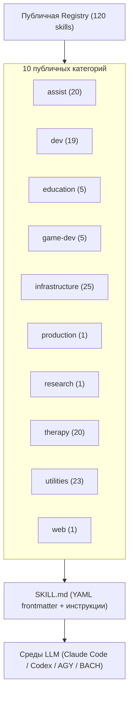

<p align="center">
  <a href="README.md"></a>
  <a href="README_de.md"></a>
  <a href="README_es.md"></a>
  <a href="README_ja.md"></a>
  <a href="README_ru.md"></a>
  <a href="README_zh.md"></a>
</p>

# ellmos skills

**Документация на шести языках** · [Машиночитаемый контекст](llms.txt) · **🗺️ [Просмотреть библиотеку skills онлайн](https://ellmos-ai.github.io/skills.html)** — читайте и копируйте любой публичный skill прямо в браузере

> Переносимая библиотека AI skills для рабочих процессов `SKILL.md` в стиле Claude Code, конфигураций агентов Codex, BACH и других local-first сред LLM.

[](https://github.com/ellmos-ai/skills/actions/workflows/tests.yml)
[](LICENSE)
[](SKILLS-MAP.md)
[](https://python.org)
[](https://github.com/ellmos-ai)
[](https://github.com/open-bricks)
[](llms.txt)

> [!NOTE]
> **Интеграция с AI-агентами и LLM:** репозиторий предоставляет стандартные `SKILL.md` с YAML frontmatter для Claude Code, Codex, AGY/Gemini и собственных сред. Машиночитаемая карта находится в [`llms.txt`](llms.txt).

> [!IMPORTANT]
> **Вы читаете копию?** Каноническая и всегда актуальная версия находится на
> **[github.com/ellmos-ai/skills](https://github.com/ellmos-ai/skills)**.
> Fork и mirror не обновляются автоматически; перед использованием сверяйтесь с источником.

**Быстрые ссылки:** [Начало](#начало) · [Избранные skills](#избранные-skills) · [Skills](skills/) · [Карта](SKILLS-MAP.md) · [Соглашения](docs/CONVENTIONS.md) · [Изменения](CHANGELOG.md)

Это повторно используемый каталог skills экосистемы ellmos. Он включает автономные процессы, рабочие циклы разработки, научные помощники, терапевтические методы, инфраструктурные инструкции и утилиты в формате `SKILL.md`, совместимом с Anthropic. Метаданные о происхождении, совместимости и зависимостях находятся непосредственно в YAML frontmatter.

## Архитектура


```mermaid
flowchart TD
    Catalog["Публичная Registry (120 skills)"] --> Categories
    subgraph Categories ["10 публичных категорий"]
        Assist["assist (20)"]
        Dev["dev (19)"]
        Edu["education (5)"]
        Game["game-dev (5)"]
        Infra["infrastructure (25)"]
        Prod["production (1)"]
        Res["research (1)"]
        Therapy["therapy (20)"]
        Utils["utilities (23)"]
        Web["web (1)"]
    end
    Categories --> Specs["SKILL.md (YAML frontmatter + инструкции)"]
    Specs --> Runtimes["Среды LLM (Claude Code / Codex / AGY / BACH)"]
```

## Начало

| Задача | Файл или команда |
|---|---|
| Просмотреть все публичные skills | [`skills/`](skills/) |
| Открыть дерево каталога | [`SKILLS-MAP.md`](SKILLS-MAP.md) |
| Понять схему `SKILL.md` | [`docs/CONVENTIONS.md`](docs/CONVENTIONS.md) |
| Машиночитаемый индекс | [`registry/components.json`](registry/components.json) |
| Искать по категории | [`skills/`](skills/) |
| Использовать skill | Скопируйте `skills/<category>/<name>/` в каталог skills своей среды |
| Просмотреть публичные изменения | [`CHANGELOG.md`](CHANGELOG.md) |
| Получить компактную карту для LLM | [`llms.txt`](llms.txt) |

## Состав каталога

Публичный каталог содержит 120 исполняемых skills:

| Категория | Количество | Назначение |
|---|---:|---|
|  `assist` | 20 | Нейтральные методы для офиса, заметок, быта, контактов, медицинской информации, медиа, инвентаря, голоса, поездок, погоды, календаря и транскрипции |
|  `dev` | 19 | | Разработка, отладка, поиск ошибок, pipelines, миграция, документация, plugins и публикация репозиториев |
|  `education` | 5 | Учебное планирование, обучение по источникам, подготовка к экзаменам, рабочие листы и поддержка |
|  `game-dev` | 5 | Blender, Roblox, Rojo, Studio, безопасность ресурсов и игровой дизайн |
|  `infrastructure` | 25 | Переносимый AI, onboarding, управление skills, обслуживание автоматизаций, routing персон, синхронизация и загрузочные мосты |
|  `production` | 1 | Маршрутизатор текстового производства |
|  `research` | 1 | Рабочий процесс научного поиска |
|  `therapy` | 20 | Психообразование и методы консультирования |
|  `utilities` | 23 | | Пакетные операции, мышление, решения, документы, кодировки, видео, письма, трудоустройство, модели пользователя, первичная ориентация по немецкому праву и налогам |
|  `web` | 1 | Протокол чтения web |

## Избранные skills

| Skill | Назначение |
|---|---|
|  [`skill-explorer`](skills/infrastructure/skill-explorer/SKILL.ru.md) | Аудит, группировка, исследование и безопасная установка skills. |
|  [`model-strategy`](skills/dev/model-strategy/SKILL.ru.md) | Маршрутизация между Claude, Codex, Gemini и Ollama. |
|  [`pipeline-optimizer`](skills/dev/pipeline-optimizer/SKILL.ru.md) | Шесть этапов безопасного обновления проекта. |
|  [`github-repo-care`](skills/dev/github-repo-care/SKILL.ru.md) | Gate публикации: правила, locks, privacy, i18n и releases. |
|  [`mcp-config-sync`](skills/infrastructure/mcp-config-sync/SKILL.ru.md) | Обнаружение MCP и синхронизация без неявного hub. |
|  [`video-transcriber`](skills/utilities/video-transcriber/SKILL.ru.md) | Субтитры, транскрипции и метаданные видео. |
|  [`rbx-studio`](skills/game-dev/rbx-studio/SKILL.ru.md) | Roblox Studio, Rojo и обязательная проверка ресурсов. |
|  [`decision-briefing`](skills/utilities/decision-briefing/SKILL.ru.md) | Нумерованный обзор вариантов и рекомендаций. |
|  [`bugsweep`](skills/dev/bugsweep/SKILL.ru.md) | Системный поиск ошибок с измеримой целью. |
|  [`plugin-system`](skills/dev/plugin-system/SKILL.ru.md) | Python plugin system без внешних зависимостей. |
|  [`bilingual-doc-sync`](skills/utilities/bilingual-doc-sync/SKILL.ru.md) | Синхронизация языковых версий и обнаружение расхождений. |
|  [`law-checker`](skills/utilities/law-checker/SKILL.ru.md) | Первичная ориентация по немецкому праву на основе источников; не заменяет юриста. |
|  [`steuer-assistent`](skills/utilities/steuer-assistent/SKILL.ru.md) | Локальная таблица расходов работника; не налоговая консультация. |
|  [`worksheet-generator`](skills/education/worksheet-generator/SKILL.ru.md) | Рабочие листы по цели, уровню и возрасту. |
|  [`research-agent`](skills/research/research-agent/SKILL.ru.md) | Повторяемый поиск литературы в PubMed и arXiv. |
|  [`agent-config-sync`](skills/infrastructure/agent-config-sync/SKILL.ru.md) | Планирование выбранной топологии конфигурации. |
|  [`agents-bridge`](skills/infrastructure/agents-bridge/SKILL.ru.md) | Нейтральный загрузочный мост для правил. |
|  [`automation-self-care`](skills/infrastructure/automation-self-care/SKILL.ru.md) | Обслуживание автоматизаций с readback и rollback. |
|  [`semantic-persona-routing`](skills/infrastructure/semantic-persona-routing/SKILL.ru.md) | Разделение ролей, экспертов, endpoints, персон и прав. |
|  [`build-your-users-mind`](skills/utilities/build-your-users-mind/SKILL.ru.md) | Публичный модуль для авторизованной модели предпочтений без публикации личного профиля. |
|  [`dev-soft-agent`](skills/dev/dev-soft-agent/SKILL.ru.md) | Автоматизация разработки без внешних сервисов. |
|  [`llm-text-hygiene`](skills/utilities/llm-text-hygiene/SKILL.ru.md) | Удаление следов чата и управление раскрытием AI. |
|  [`idea-mining`](skills/utilities/idea-mining/SKILL.ru.md) | Извлечение идей из застрявших задач. |
|  [`skill-extractor`](skills/infrastructure/skill-extractor/SKILL.ru.md) | Создание повторно используемого skill из диалога. |
|  [`workflow-extract`](skills/infrastructure/workflow-extract/SKILL.ru.md) | Преобразование разговоров в повторяемые workflows. |
|  [`ai-portable-setup`](skills/infrastructure/ai-portable-setup/SKILL.ru.md) | Переносимая среда с локальными моделями и RAG. |
|  [`bewerbungsexperte`](skills/utilities/bewerbungsexperte/SKILL.ru.md) | Поддержка вакансий, CV, LinkedIn и писем. |
|  [`therapy/`](skills/therapy/) | Семейство из 19 психообразовательных методов с этическими границами (флагманы: [`cognitive-restructuring`](skills/therapy/cognitive-restructuring/SKILL.ru.md), [`motivational-interviewing`](skills/therapy/motivational-interviewing/SKILL.ru.md)); глубочайший целостный блок библиотеки. |
|  [`lebende-verfassung`](skills/utilities/lebende-verfassung/SKILL.ru.md) | Конституционная суперпозиция («Позиция нерождённых»): даёт будущим поколениям алгоритмическое право вето против краткосрочной выгоды через 5-CORE и контрфактический анализ. |
|  [`work-autonomous`](skills/infrastructure/work-autonomous/SKILL.md) | Протокол непрерывности на основе доказательств (WAAFAP): инвертирует условие остановки — завершение цикла требует опровержимого доказательства отсутствия задач. |
|  [`piggyback-hosting`](skills/dev/piggyback-hosting/SKILL.md) | Шаблон zero-state приватного развёртывания: выполняет SQLite в браузере через SQLite-WASM/OPFS с клиентским BYOK, устраняя серверные БД и риски GDPR. |
|  [`software-in-worten`](skills/dev/software-in-worten/SKILL.md) | Двунаправленный синтез UI и промптов («Клик как промпт»): типизированный ASCII-чертёж с 4D-легендой, синхронизирующий интерфейс и инструкции без шага сборки. |
|  [`metacognitive-injectors`](skills/infrastructure/metacognitive-injectors/SKILL.ru.md) | Нейропсихологические функции исполнительного контроля (торможение, буфер рабочей памяти, мысленная репетиция) для предотвращения поддакивания и ранней остановки. |
|  [`paveman`](skills/utilities/paveman/SKILL.md) | Детерминированное сжатие правил без модели: сокращает объём токенов Markdown-файлов правил и памяти до 40% без инференса LLM, галлюцинаций или потери смысла. |
|  [`wayfinding-routing`](skills/infrastructure/wayfinding-routing/SKILL.ru.md) | Универсальные морские протоколы навигации для дезориентированных AI-агентов: эвристики восстановления и реконструкции состояния при дрейфе контекста или петлях. |
|  [`condition`](skills/infrastructure/condition/SKILL.ru.md) | Декларативный DSL условных шлюзов для промптов: инкапсулирует предварительные условия, вехи и порядок зависимостей в fail-closed шлюзы в стандартном Markdown. |
|  [`letter-hooker`](skills/infrastructure/letter-hooker/SKILL.ru.md) | Загрузчик перед выполнением для CLI-агентов без хуков: внедряет правила управления, обход памяти и контекст до начала хода без нативных событий JSON. |
|  [`pingpong`](skills/infrastructure/pingpong/SKILL.md) | Сеансовая радиостанция через общие синхронизированные папки: разделяет асимметричные роли (`ListenSync` и `WriteSync`) для асинхронной координации без серверов. |
|  [`choose-your-orchestrator`](skills/infrastructure/choose-your-orchestrator/SKILL.md) | Согласование контракта сессии перед многоагентной работой: фиксирует топологию оркестрации, параллелизм, слоты моделей и триггеры эскалации. |
|  [`reissverschluss-merge`](skills/dev/reissverschluss-merge/SKILL.md) | Протокол слияния-молнии для сильно расходящихся веток: пораздельное сопоставление через таблицу решений с реконструкцией замысла вместо слияния. |
|  [`migrate-rename`](skills/dev/migrate-rename/SKILL.ru.md) | Эволюционное переименование файлов и модулей с обёртками и заглушками MOVED: предотвращает сбои у агентов, пока ссылки обновляются органически. |
|  [`projekt-pipeline-umbrella`](skills/dev/projekt-pipeline-umbrella/SKILL.ru.md) | Таксономический компас 2x2 для пайплайнов: устраняет смещение шаблонов LLM, направляя к нужному skill для адаптации, начальной настройки или реновации. |
|  [`tidy-up`](skills/dev/tidy-up/SKILL.md) | Детерминированный цикл гигиены завершения сессии с 3 ролями: решает ожидающие тривиальные задачи без расползания планов, синхронизирует документацию и архивирует файлы. |
|  [`human-loop-audit`](skills/dev/human-loop-audit/SKILL.md) | Асинхронный конвейер с участием человека: пока пользователь тестирует элемент N, агент запускает N+1 и делегирует исправления для N-1, исключая ожидание. |
|  [`folder-organization`](skills/utilities/folder-organization/SKILL.md) | Семантическая очистка файловой системы по принципу Cut-and-Clue: отделяет активные файлы от устаревших с машиночитаемыми указателями, сохраняя журналы. |
|  [`iterative-bundle-selection`](skills/utilities/iterative-bundle-selection/SKILL.md) | Пошаговое сокращение списков кандидатов через тематические пулы, этапы фильтрации и перемешиваемые пакеты без окончательного удаления остального. |

## Публичная и приватная граница

Публичные каталоги содержат только переносимые методы и нейтральные ресурсы. Адаптеры конкретных приложений и hosts, учётные записи, базы данных, локальные пути, реальные данные и личные настройки хранятся в отдельном приватном профиле или fork. Privacy Gate отклоняет конкретные пользовательские пути, известные приватные hosts, шаблоны токенов и ошибочно отслеживаемые ignored-файлы.

`foerderplaner` планирует только обучение и поддержку. Общая генерация отчётов находится в [`report-forge`](https://github.com/ellmos-ai/report-forge); личные шаблоны остаются приватными.

`build-your-users-mind` и `decision-avatar` — публичные ядра для моделей пользователя. Именные личные аватары приватны. Операционные Store-workflows являются только приватными и не распространяются. `law-checker` — публичный модуль правовой ориентации; частные workflows юридического отдела также не поставляются.

Публичный каталог содержит только собственные skills Ellmos. Сторонние skills не публикуются под авторством Ellmos. Поэтому `registry/components.json` — лишь сокращённый публичный индекс; внутренние оценки, классификации приватности и полная maintainer-registry находятся в отдельном No-Push-репозитории.

## Образовательные skills

| Skill | Назначение |
|---|---|
| [`academic-study-control`](skills/education/academic-study-control/SKILL.ru.md) | Семестры, сроки, регистрация и напоминания с проверкой источников. |
| [`academic-study-learn`](skills/education/academic-study-learn/SKILL.ru.md) | Цель, ключевые идеи, словарь, перенос и практика воспроизведения. |
| [`academic-study-test`](skills/education/academic-study-test/SKILL.ru.md) | Режимы тренировки с rubric и запретом помощи на реальном экзамене. |
| [`foerderplaner`](skills/education/foerderplaner/SKILL.ru.md) | Нейтральное планирование обучения и поддержки без личных отчётов. |
| [`worksheet-generator`](skills/education/worksheet-generator/SKILL.ru.md) | Дифференцированные учебные материалы. |

## Структура и проверка

```text
skills/<category>/<skill-name>/
  SKILL.md
  scripts/
  references/
docs/CONVENTIONS.md
registry/components.json
llms.txt
```

Каждый `SKILL.md` объявляет автономность, совместимость, происхождение и зависимости. Для публичных изменений выполняется статический gate:

```bash
python testing/skill_tester.py batch --type static --ci
```

При использовании [pre-commit](https://pre-commit.com/) активируйте hook командой `pre-commit install`.

### Внешние оценки

Независимые сторонние A/B-оценки отдельных skills, приводятся здесь по мере
появления (не проводятся и не заказываются этим проектом):

- [`cloud-communication-protocols`](skills/infrastructure/cloud-communication-protocols/SKILL.md) -- [decimal.ai](https://app.decimal.ai/skills/ellmos-ai-cloud-communication-protocols), протестировано 2026-08-08 на Gemini-3.6-flash, 22 случая: доля успеха 22,7 % -> 95,5 % (+73pp), -14 % токенов, безопасность 15/15 проверок (3/3).

## Поиск и связанные проекты

При ссылках и индексировании используйте каноническую строку `ellmos-ai/skills`. Это каталог, а не MCP-сервер, SaaS, marketplace или установщик приватных skills.

| Проект | Организация | Роль |
|---|---|---|
| [BACH](https://github.com/ellmos-ai/bach) | `ellmos-ai` | Полная текстовая LLM OS |
| [ellmos-controlcenter-mcp](https://github.com/ellmos-ai/ellmos-controlcenter-mcp) | `ellmos-ai` | Единый MCP-шлюз инструментов и профилей |
| [system-explorer](https://github.com/ellmos-ai/system-explorer) | `ellmos-ai` | Композиция флота агентов и исследование системы |
| [workflowhooker](https://github.com/ellmos-ai/workflowhooker) | `ellmos-ai` | Транзакционный диспетчер хуков рабочих процессов |
| [sqlite-transit-sync](https://github.com/ellmos-ai/sqlite-transit-sync) | `ellmos-ai` | Офлайн-синхронизация транзита и хранение снапшотов |
| [MarbleRun](https://github.com/ellmos-ai/MarbleRun) | `ellmos-ai` | Локальный фреймворк автоматизации для цепочек автономных LLM-агентов |
| [gardener](https://github.com/ellmos-ai/gardener) | `ellmos-ai` | Курируемый кросс-источниковый индекс памяти для агентных систем |
| [usmc](https://github.com/ellmos-ai/usmc) | `ellmos-ai` | Локальная память SQLite и обмен контекстом между агентами |
| [DevCenter](https://github.com/dev-bricks/DevCenter) | `dev-bricks` | Набор для рабочей станции разработчика |
| [CodeBox](https://github.com/dev-bricks/CodeBox) | `dev-bricks` | Многоязычный редактор кода и песочница |

Отобранные сторонние skills в `skills/third-party/` (`grill-me`, `grilling`)
распространяются по лицензии MIT из исходного репозитория
[mattpocock/skills](https://github.com/mattpocock/skills).

## Лицензия и ответственность

Лицензия MIT. См. [LICENSE](LICENSE).

Проект является безвозмездным вкладом в open source. Ответственность ограничена умыслом и грубой неосторожностью согласно § 521 Германского гражданского кодекса. Использование на свой риск; гарантии обслуживания, доступности, отсутствия ошибок или пригодности для конкретной цели не предоставляются.
