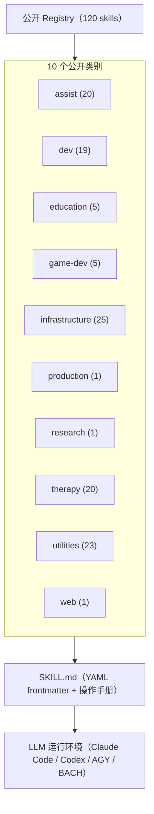

<p align="center">
  <a href="README.md"></a>
  <a href="README_de.md"></a>
  <a href="README_es.md"></a>
  <a href="README_ja.md"></a>
  <a href="README_ru.md"></a>
  <a href="README_zh.md"></a>
</p>

# ellmos skills

**六种语言的文档** · [机器可读上下文](llms.txt)

> 面向 Claude Code 风格 `SKILL.md` 工作流、兼容 Codex 的智能体配置、BACH 以及其他 local-first LLM 智能体运行环境的可移植 AI skill 库。

[](LICENSE)
[](SKILLS-MAP.md)
[](llms.txt)

> [!NOTE]
> **AI 智能体与 LLM 集成：** 本仓库提供带 YAML frontmatter 的标准 `SKILL.md`，可由 Claude Code、Codex、AGY/Gemini 和自定义智能体运行环境直接使用。机器可读信息见 [`llms.txt`](llms.txt)。

> [!IMPORTANT]
> **正在阅读副本？** 权威且始终最新的版本位于
> **[github.com/ellmos-ai/skills](https://github.com/ellmos-ai/skills)**。
> fork 和 mirror 不会自动更新，使用前请核对权威来源。

**快速链接：** [开始使用](#开始使用) · [精选-skills](#精选-skills) · [Skills](skills/) · [技能地图](SKILLS-MAP.md) · [规范](docs/CONVENTIONS.md) · [更新日志](CHANGELOG.md)

本仓库是 ellmos 生态系统的可复用 skill 目录，包含独立流程、开发工作流、研究助手、治疗相关方法、基础设施手册和实用工具，采用兼容 Anthropic 的 `SKILL.md` 格式。每个 skill 在 YAML frontmatter 中声明来源、兼容性和依赖项。

## 系统架构



## 开始使用

| 需求 | 文件或命令 |
|---|---|
| 浏览所有公开 skills | [`skills/`](skills/) |
| 查看完整目录树 | [`SKILLS-MAP.md`](SKILLS-MAP.md) |
| 了解 `SKILL.md` 结构 | [`docs/CONVENTIONS.md`](docs/CONVENTIONS.md) |
| 机器可读目录索引 | [`registry/components.json`](registry/components.json) |
| 按类别浏览 | [`skills/`](skills/) |
| 使用一个 skill | 将 `skills/<category>/<name>/` 复制到智能体的 skills 目录 |
| 查看公开变更 | [`CHANGELOG.md`](CHANGELOG.md) |
| 获取供 LLM 使用的简洁地图 | [`llms.txt`](llms.txt) |

## 目录概览

当前公开目录包含 120 个可运行 skills：

| 类别 | 数量 | 重点 |
|---|---:|---|
|  `assist` | 20 | 办公、笔记、家庭、联系人、健康信息、媒体、库存、语音、旅行、天气、日历和转录的用户中立方法 |
|  `dev` | 19 | | 开发、调试、错误扫描、pipeline、迁移、文档、plugin 和仓库发布 |
|  `education` | 5 | 学业规划、基于来源的学习、考试准备、工作表以及教学和支持规划 |
|  `game-dev` | 5 | Blender、Roblox、Rojo、Studio、资源安全和游戏设计 |
|  `infrastructure` | 25 | 可移植 AI、系统引导、skill 管理、自动化维护、语义 persona routing、配置同步和启动桥接 |
|  `production` | 1 | 通用文本、叙事和 PR 文本生产路由 |
|  `research` | 1 | 研究智能体工作流 |
|  `therapy` | 20 | 心理教育和咨询方法手册 |
|  `utilities` | 23 | | 批处理、思维、决策、文档分块、编码修复、视频、邮件、求职、用户模型以及德国法律和税务初步指引 |
|  `web` | 1 | Web 阅读协议 |

## 精选 Skills

| Skill | 作用 |
|---|---|
| [`skill-explorer`](skills/infrastructure/skill-explorer/SKILL.md) | 审计、分类、研究 skills，并在安全审查后安装。 |
| [`model-strategy`](skills/dev/model-strategy/SKILL.md) | 在 Claude、Codex、Gemini 和 Ollama 之间路由。 |
| [`pipeline-optimizer`](skills/dev/pipeline-optimizer/SKILL.md) | 以六个阶段安全整理现有项目。 |
| [`github-repo-care`](skills/dev/github-repo-care/SKILL.md) | 包含规则、锁、隐私、i18n 和 release 的发布 gate。 |
| [`mcp-config-sync`](skills/infrastructure/mcp-config-sync/SKILL.md) | 不设置隐式 hub 的 MCP 发现和同步规划。 |
| [`video-transcriber`](skills/utilities/video-transcriber/SKILL.md) | 提取视频字幕、转录文本和元数据。 |
| [`rbx-studio`](skills/game-dev/rbx-studio/SKILL.md) | Roblox Studio、Rojo 和资源安全检查。 |
| [`decision-briefing`](skills/utilities/decision-briefing/SKILL.md) | 将未决事项变为带建议的编号选项。 |
| [`bugsweep`](skills/dev/bugsweep/SKILL.md) | 具有可量化目标和完成验证的错误扫描。 |
| [`plugin-system`](skills/dev/plugin-system/SKILL.md) | 无外部依赖的 Python plugin system。 |
| [`bilingual-doc-sync`](skills/utilities/bilingual-doc-sync/SKILL.md) | 同步语言版本并发现结构漂移。 |
| [`trampelpfadanalyse`](skills/dev/trampelpfadanalyse/SKILL.md) | 实证检查文档规则是否改变智能体行为。 |
| [`law-checker`](skills/utilities/law-checker/SKILL.md) | 基于来源的德国法律初步指引；不能替代律师。 |
| [`steuer-assistent`](skills/utilities/steuer-assistent/SKILL.md) | 德国雇员费用的本地工作表；不构成税务建议。 |
| [`worksheet-generator`](skills/education/worksheet-generator/SKILL.md) | 根据目标、水平和年龄生成工作表。 |
| [`research-agent`](skills/research/research-agent/SKILL.md) | 面向 PubMed 和 arXiv 的可重复研究流程。 |
| [`agent-config-sync`](skills/infrastructure/agent-config-sync/SKILL.md) | 规划用户选择的配置拓扑。 |
| [`agents-bridge`](skills/infrastructure/agents-bridge/SKILL.md) | 从选定规则面加载上下文的中立桥接。 |
| [`automation-self-care`](skills/infrastructure/automation-self-care/SKILL.zh.md) | 带 readback 和 rollback 的自动化维护。 |
| [`semantic-persona-routing`](skills/infrastructure/semantic-persona-routing/SKILL.zh.md) | 分离角色、专家、endpoint、persona 和权限。 |
| [`build-your-users-mind`](skills/utilities/build-your-users-mind/SKILL.zh.md) | 在不公开个人档案的前提下构建经授权的偏好模型。 |
| [`dev-soft-agent`](skills/dev/dev-soft-agent/SKILL.md) | 不依赖外部服务的开发自动化 pipeline。 |
| [`llm-text-hygiene`](skills/utilities/llm-text-hygiene/SKILL.md) | 清除聊天残留并管理 AI 披露等级。 |
| [`idea-mining`](skills/utilities/idea-mining/SKILL.md) | 从停滞问题中挖掘方案。 |
| [`skill-extractor`](skills/infrastructure/skill-extractor/SKILL.md) | 从对话中提取可复用 skill。 |
| [`workflow-extract`](skills/infrastructure/workflow-extract/SKILL.md) | 将对话或现有 prompt 转换为可重复 workflow。 |
| [`ai-portable-setup`](skills/infrastructure/ai-portable-setup/SKILL.md) | 创建包含本地模型和 RAG 的可移植环境。 |
| [`bewerbungsexperte`](skills/utilities/bewerbungsexperte/SKILL.md) | 支持招聘广告、简历、LinkedIn 和求职信。 |
| [`therapy/`](skills/therapy/) | 具有伦理边界的心理教育和咨询方法集合。 |

## 公开与私有边界

公开 skill 文件夹只包含可移植方法和中立资源。特定应用或 host 的适配器、账户、数据库、本地路径、真实数据和个人默认设置必须放在独立私有档案或 fork 中。Privacy Gate 会拒绝具体用户路径、已知私有 host、token 模式以及误纳入跟踪的 ignored 文件。

`foerderplaner` 只负责教学和支持规划。通用报告生成位于 [`report-forge`](https://github.com/ellmos-ai/report-forge)，个人支持报告模板保持私有。

`build-your-users-mind` 和 `decision-avatar` 是公开用户模型核心；具名个人头像保持私有。Store 运营 workflow 仅供私用，不随仓库发布。`law-checker` 是公开法律指引模块，私有法律部门 workflow 同样不发布。

公开目录只收录 Ellmos 自有 skills。第三方 skills 不会以 Ellmos 作者名重新发布。因此，`registry/components.json` 只是精简的公开索引；内部评估、隐私分类和完整 maintainer registry 保存在独立的 No-Push 仓库中。

## 教育类 Skills

| Skill | 功能 |
|---|---|
| [`academic-study-control`](skills/education/academic-study-control/SKILL.md) | 管理学期、截止日期、注册和提醒，并进行来源验证。 |
| [`academic-study-learn`](skills/education/academic-study-learn/SKILL.md) | 目标、核心观点、术语表、迁移和检索练习的学习循环。 |
| [`academic-study-test`](skills/education/academic-study-test/SKILL.md) | 带 rubric 的训练模式，禁止在真实考试中提供协助。 |
| [`foerderplaner`](skills/education/foerderplaner/SKILL.zh.md) | 用户中立的教学和支持规划，不生成个人报告。 |
| [`worksheet-generator`](skills/education/worksheet-generator/SKILL.md) | 根据学习目标和水平生成差异化材料。 |

## 仓库结构与验证

```text
skills/<category>/<skill-name>/
  SKILL.md
  scripts/
  references/
docs/CONVENTIONS.md
registry/components.json
llms.txt
```

每个 `SKILL.md` 声明独立性、兼容性、来源和依赖项。公开 skill 发生变化时会运行静态 gate：

```bash
python testing/skill_tester.py batch --type static --ci
```

如果使用 [pre-commit](https://pre-commit.com/)，请运行 `pre-commit install` 启用 hook。

## 搜索与相关项目

链接或建立索引时请使用权威名称 `ellmos-ai/skills`。本项目是可复用目录，不是 MCP 服务器、SaaS、marketplace 或私有 skills 安装器。

| 项目 | 作用 |
|---|---|
| [BACH](https://github.com/ellmos-ai/bach) | 完整的文本型 LLM 操作系统 |
| [Rinnsal](https://github.com/ellmos-ai/rinnsal) | 轻量 local-first 智能体基础设施 |
| [USMC](https://github.com/ellmos-ai/usmc) | 共享记忆基础组件 |
| [Gardener](https://github.com/ellmos-ai/gardener) | 基于数据库的操作系统对应项目 |
| [MarbleRun / llmauto](https://github.com/ellmos-ai/MarbleRun) | LLM 链执行框架 |

## 许可证与责任

MIT License，详见 [LICENSE](LICENSE)。

本项目是无偿的开源贡献。根据德国民法典第 521 条，责任仅限于故意和重大过失。使用风险由用户承担；不保证维护、可用性、无错误或适用于特定目的。
