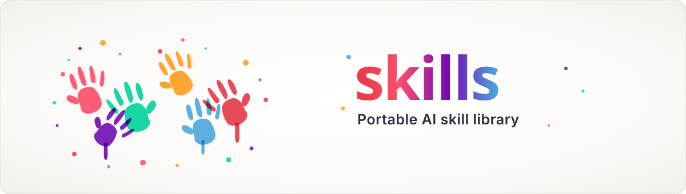
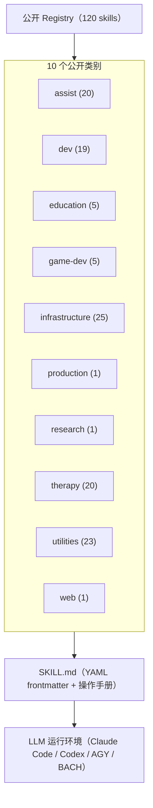

<p align="center">
  <a href="README.md"></a>
  <a href="README_de.md"></a>
  <a href="README_es.md"></a>
  <a href="README_ja.md"></a>
  <a href="README_ru.md"></a>
  <a href="README_zh.md"></a>
</p>

# ellmos skills

**六种语言的文档** · [机器可读上下文](llms.txt) · **🗺️ [在线浏览 skill 库](https://ellmos-ai.github.io/skills.html)** — 在浏览器中阅读并复制每一个公开 skill

> 面向 Claude Code 风格 `SKILL.md` 工作流、兼容 Codex 的智能体配置、BACH 以及其他 local-first LLM 智能体运行环境的可移植 AI skill 库。

[](https://github.com/ellmos-ai/skills/actions/workflows/tests.yml)
[](LICENSE)
[](SKILLS-MAP.md)
[](https://python.org)
[](https://github.com/ellmos-ai)
[](https://github.com/open-bricks)
[](llms.txt)

> [!NOTE]
> **AI 智能体与 LLM 集成：** 本仓库提供带 YAML frontmatter 的标准 `SKILL.md`，可由 Claude Code、Codex、AGY/Gemini 和自定义智能体运行环境直接使用。机器可读信息见 [`llms.txt`](llms.txt)。

> [!IMPORTANT]
> **正在阅读副本？** 权威且始终最新的版本位于
> **[github.com/ellmos-ai/skills](https://github.com/ellmos-ai/skills)**。
> fork 和 mirror 不会自动更新，使用前请核对权威来源。

**快速链接：** [开始使用](#开始使用) · [精选-skills](#精选-skills) · [Skills](skills/) · [技能地图](SKILLS-MAP.md) · [规范](docs/CONVENTIONS.md) · [更新日志](CHANGELOG.md)

本仓库是 ellmos 生态系统的可复用 skill 目录，包含独立流程、开发工作流、研究助手、治疗相关方法、基础设施手册和实用工具，采用兼容 Anthropic 的 `SKILL.md` 格式。每个 skill 在 YAML frontmatter 中声明来源、兼容性和依赖项。

## 系统架构


```mermaid
flowchart TD
    Catalog["公开 Registry（120 skills）"] --> Categories
    subgraph Categories ["10 个公开类别"]
        Assist["assist (20)"]
        Dev["dev (19)"]
        Edu["education (5)"]
        Game["game-dev (5)"]
        Infra["infrastructure (25)"]
        Prod["production (1)"]
        Res["research (1)"]
        Therapy["therapy (20)"]
        Utils["utilities (23)"]
        Web["web (1)"]
    end
    Categories --> Specs["SKILL.md（YAML frontmatter + 操作手册）"]
    Specs --> Runtimes["LLM 运行环境（Claude Code / Codex / AGY / BACH）"]
```

## 开始使用

| 需求 | 文件或命令 |
|---|---|
| 浏览所有公开 skills | [`skills/`](skills/) |
| 查看完整目录树 | [`SKILLS-MAP.md`](SKILLS-MAP.md) |
| 了解 `SKILL.md` 结构 | [`docs/CONVENTIONS.md`](docs/CONVENTIONS.md) |
| 机器可读目录索引 | [`registry/components.json`](registry/components.json) |
| 按类别浏览 | [`skills/`](skills/) |
| 使用一个 skill | 将 `skills/<category>/<name>/` 复制到智能体的 skills 目录 |
| 查看公开变更 | [`CHANGELOG.md`](CHANGELOG.md) |
| 获取供 LLM 使用的简洁地图 | [`llms.txt`](llms.txt) |

<!-- lang-only: zh -->
中文用户也可以通过 [Skills宝](https://skilery.com) 搜索和安装 skills。
<!-- /lang-only -->

## 目录概览

当前公开目录包含 120 个可运行 skills：

| 类别 | 数量 | 重点 |
|---|---:|---|
|  `assist` | 20 | 办公、笔记、家庭、联系人、健康信息、媒体、库存、语音、旅行、天气、日历和转录的用户中立方法 |
|  `dev` | 19 | | 开发、调试、错误扫描、pipeline、迁移、文档、plugin 和仓库发布 |
|  `education` | 5 | 学业规划、基于来源的学习、考试准备、工作表以及教学和支持规划 |
|  `game-dev` | 5 | Blender、Roblox、Rojo、Studio、资源安全和游戏设计 |
|  `infrastructure` | 25 | 可移植 AI、系统引导、skill 管理、自动化维护、语义 persona routing、配置同步和启动桥接 |
|  `production` | 1 | 通用文本、叙事和 PR 文本生产路由 |
|  `research` | 1 | 研究智能体工作流 |
|  `therapy` | 20 | 心理教育和咨询方法手册 |
|  `utilities` | 23 | | 批处理、思维、决策、文档分块、编码修复、视频、邮件、求职、用户模型以及德国法律和税务初步指引 |
|  `web` | 1 | Web 阅读协议 |

## 精选 Skills

| Skill | 作用 |
|---|---|
|  [`skill-explorer`](skills/infrastructure/skill-explorer/SKILL.zh.md) | 审计、分类、研究 skills，并在安全审查后安装。 |
|  [`model-strategy`](skills/dev/model-strategy/SKILL.zh.md) | 在 Claude、Codex、Gemini 和 Ollama 之间路由。 |
|  [`pipeline-optimizer`](skills/dev/pipeline-optimizer/SKILL.zh.md) | 以六个阶段安全整理现有项目。 |
|  [`github-repo-care`](skills/dev/github-repo-care/SKILL.zh.md) | 包含规则、锁、隐私、i18n 和 release 的发布 gate。 |
|  [`mcp-config-sync`](skills/infrastructure/mcp-config-sync/SKILL.zh.md) | 不设置隐式 hub 的 MCP 发现和同步规划。 |
|  [`video-transcriber`](skills/utilities/video-transcriber/SKILL.zh.md) | 提取视频字幕、转录文本和元数据。 |
|  [`rbx-studio`](skills/game-dev/rbx-studio/SKILL.zh.md) | Roblox Studio、Rojo 和资源安全检查。 |
|  [`decision-briefing`](skills/utilities/decision-briefing/SKILL.zh.md) | 将未决事项变为带建议的编号选项。 |
|  [`bugsweep`](skills/dev/bugsweep/SKILL.zh.md) | 具有可量化目标和完成验证的错误扫描。 |
|  [`plugin-system`](skills/dev/plugin-system/SKILL.zh.md) | 无外部依赖的 Python plugin system。 |
|  [`bilingual-doc-sync`](skills/utilities/bilingual-doc-sync/SKILL.zh.md) | 同步语言版本并发现结构漂移。 |
|  [`law-checker`](skills/utilities/law-checker/SKILL.zh.md) | 基于来源的德国法律初步指引；不能替代律师。 |
|  [`steuer-assistent`](skills/utilities/steuer-assistent/SKILL.zh.md) | 德国雇员费用的本地工作表；不构成税务建议。 |
|  [`worksheet-generator`](skills/education/worksheet-generator/SKILL.zh.md) | 根据目标、水平和年龄生成工作表。 |
|  [`research-agent`](skills/research/research-agent/SKILL.zh.md) | 面向 PubMed 和 arXiv 的可重复研究流程。 |
|  [`agent-config-sync`](skills/infrastructure/agent-config-sync/SKILL.zh.md) | 规划用户选择的配置拓扑。 |
|  [`agents-bridge`](skills/infrastructure/agents-bridge/SKILL.zh.md) | 从选定规则面加载上下文的中立桥接。 |
|  [`automation-self-care`](skills/infrastructure/automation-self-care/SKILL.zh.md) | 带 readback 和 rollback 的自动化维护。 |
|  [`semantic-persona-routing`](skills/infrastructure/semantic-persona-routing/SKILL.zh.md) | 分离角色、专家、endpoint、persona 和权限。 |
|  [`build-your-users-mind`](skills/utilities/build-your-users-mind/SKILL.zh.md) | 在不公开个人档案的前提下构建经授权的偏好模型。 |
|  [`dev-soft-agent`](skills/dev/dev-soft-agent/SKILL.zh.md) | 不依赖外部服务的开发自动化 pipeline。 |
|  [`llm-text-hygiene`](skills/utilities/llm-text-hygiene/SKILL.zh.md) | 清除聊天残留并管理 AI 披露等级。 |
|  [`idea-mining`](skills/utilities/idea-mining/SKILL.zh.md) | 从停滞问题中挖掘方案。 |
|  [`skill-extractor`](skills/infrastructure/skill-extractor/SKILL.zh.md) | 从对话中提取可复用 skill。 |
|  [`workflow-extract`](skills/infrastructure/workflow-extract/SKILL.zh.md) | 将对话或现有 prompt 转换为可重复 workflow。 |
|  [`ai-portable-setup`](skills/infrastructure/ai-portable-setup/SKILL.zh.md) | 创建包含本地模型和 RAG 的可移植环境。 |
|  [`bewerbungsexperte`](skills/utilities/bewerbungsexperte/SKILL.zh.md) | 支持招聘广告、简历、LinkedIn 和求职信。 |
|  [`therapy/`](skills/therapy/) | 具有伦理边界的 19 个心理教育和咨询方法集合（代表性技能：[`cognitive-restructuring`](skills/therapy/cognitive-restructuring/SKILL.zh.md)、[`motivational-interviewing`](skills/therapy/motivational-interviewing/SKILL.zh.md)）；库中最深度的连贯体系。 |
|  [`lebende-verfassung`](skills/utilities/lebende-verfassung/SKILL.zh.md) | 宪法级叠加态（“未出生者的立场”）：通过 5-CORE 审查架构和强制反事实分析，赋予后代对当下短期优化的算法否决权。 |
|  [`work-autonomous`](skills/infrastructure/work-autonomous/SKILL.md) | 基于证明的防懒惰非终止协议（WAAFAP）：反转终止条件，结束自主循环必须提供任务不存在的可证伪证明（“退出需要无活动证明”）。 |
|  [`piggyback-hosting`](skills/dev/piggyback-hosting/SKILL.md) | 零状态隐私部署模式（Huckepack-Hosting）：通过 SQLite-WASM/OPFS 和客户端 BYOK 在浏览器中运行关系型 SQLite，从设计上消除服务端数据库和 GDPR 责任。 |
|  [`software-in-worten`](skills/dev/software-in-worten/SKILL.md) | 双向 UI-Prompt 综合（“点击即 Prompt”）：带 4D 元素图例的类型化 ASCII 蓝图，无需前端构建步骤即可连接 GUI 设计与 Agent 指令。 |
|  [`metacognitive-injectors`](skills/infrastructure/metacognitive-injectors/SKILL.zh.md) | 将神经心理学执行控制功能（抑制、工作记忆缓冲、心理预演）集成到运行前检查中，以防止阿谀奉承和过早终止。 |
|  [`paveman`](skills/utilities/paveman/SKILL.md) | 确定性且无模型的规则压缩：在没有 LLM 推理、幻觉或语义漂移的情况下，将大型 Markdown 规则和记忆文件缩减高达 40% 的 Token 量。 |
|  [`wayfinding-routing`](skills/infrastructure/wayfinding-routing/SKILL.zh.md) | 面向迷向 AI Agent 的通用航海导航协议：在陷入上下文漂移或死循环时提供恢复启发式和状态重构。 |
|  [`condition`](skills/infrastructure/condition/SKILL.zh.md) | 面向 Prompt 的声明式条件门控 DSL：在标准 Markdown 中将前置条件、里程碑和顺序依赖封装为 fail-closed 门控。 |
|  [`letter-hooker`](skills/infrastructure/letter-hooker/SKILL.zh.md) | 无 Hook CLI Agent 的预检引导器：在每个回合前注入治理规则、记忆遍历和自愈上下文，无需原生 JSON 事件 Hook。 |
|  [`pingpong`](skills/infrastructure/pingpong/SKILL.md) | 基于共享同步文件夹的会话级电台：分离非对称角色（`ListenSync` 侦听者 vs `WriteSync` 发送者），实现无需中心服务器的异步多 Agent 协作。 |
|  [`choose-your-orchestrator`](skills/infrastructure/choose-your-orchestrator/SKILL.md) | 多 Agent 协作的会话契约协商器：在执行开始前约束编排拓扑、并发性、模型槽位和升级触发条件。 |
|  [`reissverschluss-merge`](skills/dev/reissverschluss-merge/SKILL.md) | 严重分歧分支的拉链式合并协议：使用决策表逐节对比，以意图重构（“重构而非合并”）作为最终升级阶段。 |
|  [`migrate-rename`](skills/dev/migrate-rename/SKILL.zh.md) | 使用包装器和 MOVED 存根的演进式文件与模块重命名：在引用随使用自然更新的过程中，防止 Agent 集群发生中断。 |
|  [`projekt-pipeline-umbrella`](skills/dev/projekt-pipeline-umbrella/SKILL.zh.md) | Pipeline 的分类学 2x2 指南针：防止语言模型的脚手架偏向，精确路由到适合的新手引导、启动器或重构技能。 |
|  [`tidy-up`](skills/dev/tidy-up/SKILL.md) | 确定性的 3 角色会话结束清理循环：在不蔓延新计划的情况下解决待办日常任务，将文档同步至测量实况，并可逆归档游离文件。 |
|  [`human-loop-audit`](skills/dev/human-loop-audit/SKILL.md) | 人在回路的异步拉链流水线：当用户实时测试项目 N 时，Agent 预先启动项目 N+1 并委托修复工人处理项目 N-1，消除空闲等待。 |
|  [`folder-organization`](skills/utilities/folder-organization/SKILL.md) | 基于 Cut-and-Clue 的语义化文件系统清理：在源头保留机器可读线索的前提下分离当前与历史文件，完整保留分类与审计日志。 |
|  [`iterative-bundle-selection`](skills/utilities/iterative-bundle-selection/SKILL.md) | 通过可选主题池、过滤阶段和反复重混捆绑包逐步精简庞大候选列表——分批选择、筛选或组合，而不彻底丢弃其余项。 |

## 公开与私有边界

公开 skill 文件夹只包含可移植方法和中立资源。特定应用或 host 的适配器、账户、数据库、本地路径、真实数据和个人默认设置必须放在独立私有档案或 fork 中。Privacy Gate 会拒绝具体用户路径、已知私有 host、token 模式以及误纳入跟踪的 ignored 文件。

`foerderplaner` 只负责教学和支持规划。通用报告生成位于 [`report-forge`](https://github.com/ellmos-ai/report-forge)，个人支持报告模板保持私有。

`build-your-users-mind` 和 `decision-avatar` 是公开用户模型核心；具名个人头像保持私有。Store 运营 workflow 仅供私用，不随仓库发布。`law-checker` 是公开法律指引模块，私有法律部门 workflow 同样不发布。

公开目录只收录 Ellmos 自有 skills。第三方 skills 不会以 Ellmos 作者名重新发布。因此，`registry/components.json` 只是精简的公开索引；内部评估、隐私分类和完整 maintainer registry 保存在独立的 No-Push 仓库中。

## 教育类 Skills

| Skill | 功能 |
|---|---|
| [`academic-study-control`](skills/education/academic-study-control/SKILL.zh.md) | 管理学期、截止日期、注册和提醒，并进行来源验证。 |
| [`academic-study-learn`](skills/education/academic-study-learn/SKILL.zh.md) | 目标、核心观点、术语表、迁移和检索练习的学习循环。 |
| [`academic-study-test`](skills/education/academic-study-test/SKILL.zh.md) | 带 rubric 的训练模式，禁止在真实考试中提供协助。 |
| [`foerderplaner`](skills/education/foerderplaner/SKILL.zh.md) | 用户中立的教学和支持规划，不生成个人报告。 |
| [`worksheet-generator`](skills/education/worksheet-generator/SKILL.zh.md) | 根据学习目标和水平生成差异化材料。 |

## 仓库结构与验证

```text
skills/<category>/<skill-name>/
  SKILL.md
  scripts/
  references/
docs/CONVENTIONS.md
registry/components.json
llms.txt
```

每个 `SKILL.md` 声明独立性、兼容性、来源和依赖项。公开 skill 发生变化时会运行静态 gate：

```bash
python testing/skill_tester.py batch --type static --ci
```

如果使用 [pre-commit](https://pre-commit.com/)，请运行 `pre-commit install` 启用 hook。

### 外部评估

针对单个 skill 的独立第三方 A/B 评估，随可用性在此列出（并非本项目自行开展或委托）：

- [`cloud-communication-protocols`](skills/infrastructure/cloud-communication-protocols/SKILL.md) -- [decimal.ai](https://app.decimal.ai/skills/ellmos-ai-cloud-communication-protocols)，于 2026-08-08 在 Gemini-3.6-flash 上测试，22 个案例：通过率 22.7% -> 95.5%（+73pp），token 减少 14%，安全性 15/15 项检查（3/3）。

## 搜索与相关项目

链接或建立索引时请使用权威名称 `ellmos-ai/skills`。本项目是可复用目录，不是 MCP 服务器、SaaS、marketplace 或私有 skills 安装器。

| 项目 | 组织 | 作用 |
|---|---|---|
| [BACH](https://github.com/ellmos-ai/bach) | `ellmos-ai` | 完整的文本型 LLM 操作系统 |
| [ellmos-controlcenter-mcp](https://github.com/ellmos-ai/ellmos-controlcenter-mcp) | `ellmos-ai` | 统一的工具与配置文件网关 MCP 服务器 |
| [system-explorer](https://github.com/ellmos-ai/system-explorer) | `ellmos-ai` | 智能体集群组合与系统探索 |
| [workflowhooker](https://github.com/ellmos-ai/workflowhooker) | `ellmos-ai` | 事务性工作流钩子调度器 |
| [sqlite-transit-sync](https://github.com/ellmos-ai/sqlite-transit-sync) | `ellmos-ai` | 离线优先的传输同步与快照保留 |
| [MarbleRun](https://github.com/ellmos-ai/MarbleRun) | `ellmos-ai` | 面向自主 LLM 智能体链的本地优先自动化框架 |
| [gardener](https://github.com/ellmos-ai/gardener) | `ellmos-ai` | 面向智能体系统的策展式跨来源记忆索引 |
| [usmc](https://github.com/ellmos-ai/usmc) | `ellmos-ai` | 本地 SQLite 记忆与跨智能体上下文共享 |
| [DevCenter](https://github.com/dev-bricks/DevCenter) | `dev-bricks` | 桌面开发者工作站套件 |
| [CodeBox](https://github.com/dev-bricks/CodeBox) | `dev-bricks` | 多语言代码编辑器与沙盒环境 |

`skills/third-party/` 中精选的第三方 skill（`grill-me`、`grilling`）依据上游
[mattpocock/skills](https://github.com/mattpocock/skills) 的 MIT 许可证提供。

## 许可证与责任

MIT License，详见 [LICENSE](LICENSE)。

本项目是无偿的开源贡献。根据德国民法典第 521 条，责任仅限于故意和重大过失。使用风险由用户承担；不保证维护、可用性、无错误或适用于特定目的。
