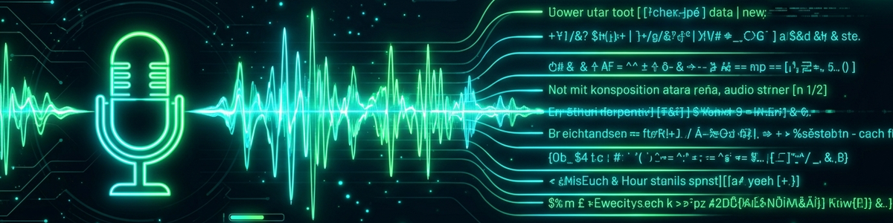

> **Русский** — Официальная русская версия `transkription`.


## Обзор и назначение

Преобразует аудио-/видеофайлы в текст — локально, без обязательного доступа к облаку. Скилл автоматически определяет, установлены ли Whisper или Vosk, и выбирает лучший доступный бэкенд. Без бэкенда он работает в тестовом режиме (dry-run) и возвращает текст-заглушку, поэтому рабочий процесс всегда функционирует.

Транскрипции сохраняются локально в `transkription/store.db` и могут быть запрошены.

---

## Триггеры

| Фраза | Действие |
|---|---|
| "Transcribe this audio" | Транскрибировать аудиофайл |
| "Transcribe [file]" | Транскрибировать указанный файл |
| "Show my transcripts" | Показать список последних транскрипций |
| "Search transcript [term]" | Полнотекстовый поиск по транскрипциям |
| "Export transcript [ID]" | Экспортировать транскрипцию в TXT |

---

## Рабочий процесс и порядок действий

1. **Проверка бэкенда**: Проверить возможность импорта `whisper` или `vosk`.
2. **Проверка файла**: Входной файл должен существовать (аудио: wav, mp3, m4a, ogg, flac; видео: mp4, mkv, webm — извлечение через ffmpeg).
3. **Транскрипция**: Вызвать бэкенд и получить необработанный текст.
4. **Сохранение**: Сохранить результат с метаданными (файл, длительность, язык, бэкенд, метка времени) в `store.db`.
5. **Вывод**: Вернуть текст; опционально экспортировать как `.txt`.

---

## Точка входа CLI

```bash
# Transcribe file (Deutsch)
python transkription_core.py transcribe audio.wav

# With explicit language (Deutsch)
python transkription_core.py transcribe audio.mp3 --lang de

# Dry-run (no backend required) (Deutsch)
python transkription_core.py transcribe audio.wav --dry-run

# List transcripts (Deutsch)
python transkription_core.py list [--limit 20]

# Full-text search (Deutsch)
python transkription_core.py search "term"

# Export (Deutsch)
python transkription_core.py export <id> [--out file.txt]

# Backend check (Deutsch)
python transkription_core.py check

# Alternative store path (e.g. for tests) (Deutsch)
python transkription_core.py --store /tmp/test.db transcribe audio.wav --dry-run
```

---

## Хранилище

| Свойство | Значение |
|---|---|
| Тип | SQLite |
| Путь (по умолчанию) | `skills/assist/transkription/store.db` |
| Переопределение | `--store <path>` или переменная окружения `TRANSKRIPTION_STORE` |
| Таблицы | `transcripts` |

### Схема `transcripts`

```sql
CREATE TABLE IF NOT EXISTS transcripts (
    id          TEXT PRIMARY KEY,  -- UUID (short: 8 hex)
    file_path   TEXT NOT NULL,     -- original path of audio file
    file_name   TEXT NOT NULL,     -- filename (without path, for display)
    text        TEXT NOT NULL,     -- transcribed text
    language    TEXT,              -- language (e.g. "de", "en")
    backend     TEXT,              -- "whisper" | "vosk" | "dry-run"
    duration_s  REAL,              -- duration in seconds (if known)
    created_at  TEXT NOT NULL,     -- ISO-8601 timestamp
    tags        TEXT               -- comma-separated tags (optional)
);
```

---

## Поведение и принципы

- Без установленного бэкенда скилл работает в режиме dry-run (демонстрационный текст).
- Whisper предпочтительнее Vosk (лучшее качество для немецкого языка).
- Выбор между Whisper и Vosk можно настроить через `assist/prefs.json` (`transkription_backend: "whisper"|"vosk"|"auto"`).
- ffmpeg для извлечения видео требуется отдельно и не входит в состав скилла.

---

## Конфиденциальность

- **Все транскрипции остаются локально** — никакой передачи в облако без онлайн-режима Whisper.
- Whisper можно использовать локально (модель tiny/base/medium) или через API OpenAI. По умолчанию используется локальная модель.
- `store.db` может содержать конфиденциальное содержимое разговоров — **не коммитьте в Git**.
- Рекомендация: добавьте `store.db` в `.gitignore`.

---

## Связанные ресурсы

- BACH `hub/_services/voice/voice_stt.py` — шаблон бэкенда (вдохновение, только для чтения)
- Скилл `utilities/yt-transcriber` — транскрипция YouTube (отдельный скилл, не дубликат: специфичен для YT)
- `tools/module-installer/module_installer.py` — реестр содержит whisper + vosk

---

## Журнал изменений

| Версия | Дата | Изменение |
|---|---|---|
| 0.1.0 | 2026-06-22 | Первоначальное создание — собственное хранилище SQLite, проверка наличия Whisper/Vosk |