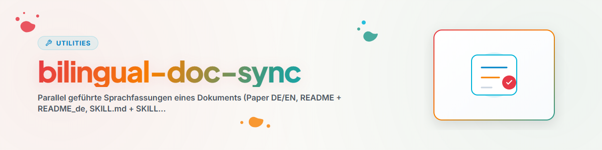

# Bilingual-Doc-Sync — Keeping Parallel Language Versions Synchronized

## Purpose

Bilingually maintained documents subtly diverge over time: the actively edited version
grows while the other becomes outdated — until "translation" is true in name only. This
skill turns synchronization checking into a defined workflow with a crucial
upfront decision: **Which version is leading?** Without a lead language rule, every divergence
becomes a case-by-case debate and the alignment process becomes non-repeatable.

## Workflow

### 1. Inventory Check

- Are both (or all) language versions present? If one is completely missing → **catch up** (full
  translation of the leading version, not a rewrite).
- Check naming conventions (e.g., `DOCUMENT.md` + `DOCUMENT.en.md` or `_de`/`_en` suffixes)
  and align outliers — discoverability is half of synchronization.

### 2. Clarify Lead Language (before every alignment)

- The lead language is the version in which content work primarily takes place (often EN for papers,
  native language for local documentation). It takes precedence in case of conflicts.
- **Back-transfer exception:** If the secondary version demonstrably solves something better (clearer
  phrasing, corrected error), it is ADOPTED into the lead version — back-transfer first, then
  synchronize normally. Verify domain correctness before adopting a "prettier" phrasing.

### 3. Verify Parallelism

Structure first, then content:

1. **Outline comparison:** Sections/headings of both versions side by side —
   missing, extra, or reordered sections represent major divergences.
2. **Section-by-section sampling** of the matching outline: statements, numbers,
   cross-references, examples identical? Particularly prone to divergence: changelogs, tables,
   numerical values, bibliography/link lists, recently edited sections.
3. **Check non-translatable invariants:** Code blocks, identifiers, formulas, paths
   must be IDENTICAL in both versions (code is never translated).

### 4. Resolve Divergences

- Resolve divergences towards the lead language (or following back-transfer).
- Respect target language typography (e.g. proper quotation mark conventions).
- Update metadata: version numbers, date fields, changelog entries in BOTH
  versions (the changelog itself is the most frequent point of divergence).

### 5. Document Results

Record findings (what was divergent, what was adopted, what was back-transferred).
For a periodic run over an inventory: combine with the rotation framework
(`rotation-check`) — one document (pair) per run, using the registry as memory.

## Extension: Expansion Audit (Should MORE languages exist?)

In addition to keeping existing versions synchronized, language maintenance involves asking whether a
document/project deserves ADDITIONAL languages:

1. **Assess suitability** instead of blind translation: target audience, international utility,
   store/web presence, content portability. Not every internal document needs English;
   not every app needs five languages.
2. **Check technical preparation:** Is the target system prepared for language files / parallel
   versions (i18n structure, naming conventions)? If not, THAT is the first
   task, not the translation.
3. **Document findings, do not mass-translate immediately:** Place concrete translation tasks
   into the project-local TODO file; "no further language makes sense" is a valid,
   record-worthy result.
4. **QA for added versions:** Sample auto-generated translations
   against the lead version (Section 3) before considering them "present".

## Example

```text
Task: "Check if the paper in DE and EN is synchronized."

1. Inventory: paper_en.tex (leading) + paper_de.tex present.
2. Outline: DE is missing the new section 4.2 (latest EN revision); DE has a
   better proof paragraph in 3.1.
3. Back-transfer: 3.1 phrasing verified technically → adopted into EN.
4. Catch-up: 4.2 translated into DE; numbers in Table 2 reconciled (DE had
   outdated values); bibliography aligned identically.
5. Registry entry: "paper-X | 2026-07-03 | de-en-sync | 3 divergences resolved,
   1 back-transfer | next check after next EN revision".
```

## Red Flags

| Thought | Reality |
| --- | --- |
| "I'll just translate the differences fresh" | Clarify lead language + back-transfer question first — otherwise the better solution gets overwritten. |
| "The outline matches, so it's synchronized" | Numbers, changelogs, and references diverge first — deep sampling is mandatory. |
| "I'll translate code comments as well" | Code blocks and identifiers remain identical in both versions (English). |
| "I'll synchronize all documents in one go" | One pair per run (rotation framework) keeps alignment verifiable. |

## Related Skills

- `rotation-check` — Framework for periodic runs over a document inventory.
- `workflow-extract` — When this check should be set up as a standing automation.

## Changelog

### 1.1.0 (2026-07-03)
- Added expansion audit (evaluate i18n suitability, technical preparation, QA for
  added versions) — integrated instead of a separate i18n-coverage-audit skill
  (deduplication decision).

### 1.0.0 (2026-07-03)
- Initial version. Abstracted from Codex automation
  "research-paper-de-en-synchronisationscheck", generalized to any parallel
  language versions (papers, READMEs, skills, website texts).
