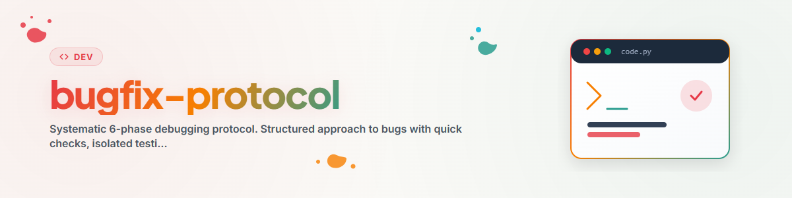

> **Español** — Versión oficial en español de `bugfix-protocol`.

# Bugfix Protocol: Depuración sistemática en 6 fases (Español)

Un enfoque estructurado para abordar errores: desde el análisis del síntoma hasta la verificación.
Evita el ensayo y error sin rumbo y garantiza que las correcciones sean sostenibles.

---

## Resumen y propósito

| Fase | Nombre | Objetivo | Tiempo máx. |
|------|--------|----------|-------------|
| 1 | Verificaciones rápidas | Descartar causas obvias | 2 min |
| 2 | Diagnóstico | Localizar la causa raíz | 10 min |
| 3 | Prueba aislada | Hacer que el error sea reproducible | 5 min |
| 4 | Corrección (Fix) | Corrección mínima | 10 min |
| 5 | Verificación | Verificar la corrección y comprobar efectos secundarios | 5 min |
| 6 | Documentación | Preservar el conocimiento | 2 min |

**Regla de los 20 minutos:** Si no hay avances tras 20 minutos, cambia de enfoque o busca ayuda.

---

## Fase 1: Verificaciones rápidas (2 min)

Antes de profundizar, comprueba las causas más comunes:

### Lista de verificación

- [ ] **¿Error de sintaxis?** Lee atentamente el mensaje de error, comprueba la línea
- [ ] **¿Error de importación?** ¿Módulo instalado? ¿Nombre correcto? ¿Importación circular?
- [ ] **¿Error tipográfico?** ¿Nombres de variables/funciones correctos?
- [ ] **¿Tipo de datos incorrecto?** ¿Cadena en lugar de entero? ¿None donde se esperaba un objeto?
- [ ] **¿Caché obsoleta?** Elimina `__pycache__`, reinicia
- [ ] **¿Entorno incorrecto?** ¿Entorno virtual activo correcto? ¿Versión correcta de Python?
- [ ] **¿Codificación (Encoding)?** UTF-8 vs. cp1252 (clásico de Windows)

### Acciones rápidas

```bash
# Limpiar caché (Español)
find . -name "__pycache__" -type d -exec rm -rf {} + 2>&1
find . -name "*.pyc" -delete 2>&1

# Verificar importaciones (Español)
python -c "import modulename"

# Verificar sintaxis (Español)
python -m py_compile file.py
```

---

## Fase 2: Diagnóstico (10 min)

### Estrategia: De fuera hacia dentro

1. **Analizar el mensaje de error** — Leer el traceback de abajo hacia arriba
2. **Revisar cambios recientes** — `git diff`, `git log --oneline -10`
3. **Usar herramientas de diagnóstico** — Utilizar herramientas de diagnóstico específicas del proyecto

### Herramientas de diagnóstico (Ejemplos)

Según el proyecto, las herramientas de diagnóstico especializadas pueden ser útiles:

| Herramienta | Propósito |
|-------------|-----------|
| `import_diagnose.py` | Analizar problemas de importación |
| `method_analyzer.py` | Verificar firmas de métodos |
| `env_checker.py` | Validar variables de entorno y rutas |

> **Nota:** Crea herramientas de diagnóstico específicas para el proyecto o utiliza las existentes.
> Lo que importa es el enfoque sistemático, no la herramienta específica.

### Técnicas de depuración

```python
# 1. Print debugging (rápido pero efectivo) (Español)
print(f"DEBUG: variable={variable!r}, type={type(variable)}")

# 2. Punto de interrupción (interactivo) (Español)
breakpoint()  # Python 3.7+

# 3. Traceback extendido (Español)
import traceback
traceback.print_exc()

# 4. Registro (Logging) en lugar de print (Español)
import logging
logging.basicConfig(level=logging.DEBUG)
logger = logging.getLogger(__name__)
logger.debug(f"State: {state!r}")
```

---

## Fase 3: Prueba aislada (5 min)

### Ejemplo mínimo reproducible (MRE)

Objetivo: Reproducir el error con la menor cantidad de código posible.

```python
# test_bug.py — Prueba de reproducción mínima (Español)
"""
Bug: [Descripción corta]
Esperado: [Qué debería suceder]
Actual: [Qué sucede en su lugar]
"""

# Configuración mínima (Español)
# ... solo lo esencial (Español)

# Activador del error (Español)
# ... código exacto que desencadena el error (Español)

# Resultado esperado (Español)
# assert result == expected, f"Obtenido {result}" (Español)
```

### Estrategias de aislamiento

1. **Nuevo archivo:** Reproducir el error en un archivo separado
2. **Eliminar dependencias:** Una por una, hasta que el error desaparezca
3. **Búsqueda binaria:** Reducir a la mitad el bloque de código y comprobar qué mitad contiene el error
4. **Git bisect:** `git bisect start`, `git bisect bad`, `git bisect good <commit>`

---

## Fase 4: Corrección / Fix (10 min)

### Principios

1. **Mínimo:** Cambiar lo menos posible
2. **Comprender:** Nunca corregir a ciegas — comprender POR QUÉ está roto
3. **Una sola cosa:** Una corrección por commit, no corregir múltiples problemas a la vez
4. **Compatible hacia atrás:** No romper la funcionalidad existente

### Patrones de corrección

```python
# MALO: Tratar el síntoma (Español)
try:
    result = broken_function()
except:  # Ocultar todo
    result = default_value

# BUENO: Corregir la causa raíz (Español)
def broken_function():
    if input_data is None:  # Causa real: falta verificación de None
        return default_value
    return process(input_data)
```

### Categorías comunes de corrección

| Categoría | Corrección típica |
|-----------|-------------------|
| None/Null | Cláusula de guardia: `if x is None: return default` |
| Error de índice | Comprobación de límites: `if i < len(lst)` |
| Error de tipo | Conversión explícita: `str(x)`, `int(x)` |
| Error de importación | Corregir ruta, instalar paquete |
| Codificación (Encoding) | Especificar UTF-8 explícitamente: `encoding='utf-8'` |
| Condición de carrera | Bloqueo/Mutex o cambiar el orden |
| Error de estado | Verificar inicialización, agregar reinicio |

---

## Fase 5: Verificación (5 min)

### Lista de verificación

- [ ] **Error corregido:** El problema original ya no ocurre
- [ ] **MRE pasa:** La prueba aislada se ejecuta correctamente
- [ ] **Sin regresión:** Las pruebas existentes siguen pasando
- [ ] **Casos límite:** Entrada vacía, None, datos grandes probados
- [ ] **Herramientas del proyecto:** Consultar el directorio de herramientas del proyecto para pruebas/validaciones relevantes

### Comandos de prueba

```bash
# Pruebas unitarias (Español)
python -m pytest tests/ -v

# Solo pruebas afectadas (Español)
python -m pytest tests/test_module.py -v -k "test_name"

# Verificación de tipos (Español)
python -m mypy file.py

# Linteo (Español)
python -m flake8 file.py
```

---

## Fase 6: Documentación (2 min)

### Plantilla de informe de errores (Bug Report)

```markdown
## Informe de error: [Título corto]

**Fecha:** AAAA-MM-DD
**Gravedad:** crítica / alta / media / baja
**Componente:** [Módulo/Archivo]

### Síntoma
[Lo que ve el usuario / mensaje de error]

### Causa raíz
[Causa raíz técnica]

### Corrección (Fix)
[Qué se cambió y por qué]

### Archivos afectados
- `file1.py` — [Cambio]
- `file2.py` — [Cambio]

### Prevención
[¿Cómo se puede prevenir este tipo de error en el futuro?]
```

### Formato de mensaje de commit

```
fix: [Descripción corta de la corrección]

Causa: [Causa raíz en una frase]
Fix: [Qué se cambió]
Test: [Cómo se verificó]
```

---

## Depuración de PyQt6 / GUI — Trampas comunes

> Esta sección es relevante para proyectos de GUI de escritorio con PyQt6/PySide6.

### Las 5 trampas principales de PyQt6

| Trampa | Problema | Solución |
|--------|----------|----------|
| **Desconexión Signal-Slot** | La señal está conectada pero el manejador no se ejecuta | `print` en el manejador, comprobar la firma |
| **Seguridad de hilos (Thread Safety)** | Actualización de la GUI desde un hilo secundario | `QMetaObject.invokeMethod` o usar señales |
| **Cascada de Layout** | Widget invisible o mal ubicado | `widget.show()`, comprobar la jerarquía del layout |
| **Bloqueo del Event Loop** | La GUI se congela | Mover operaciones largas a QThread |
| **Recolección de basura** | El widget desaparece de repente | Mantener la referencia como `self.widget` |

### Ayudantes de depuración para PyQt6

```python
# Imprimir jerarquía de widgets (Español)
def dump_widget_tree(widget, indent=0):
    print(" " * indent + f"{widget.__class__.__name__}: {widget.objectName()}")
    for child in widget.findChildren(QWidget):
        if child.parent() == widget:
            dump_widget_tree(child, indent + 2)

# Depuración de señales (Español)
from PyQt6.QtCore import QObject
original_connect = QObject.connect
def debug_connect(self, *args, **kwargs):
    print(f"CONNECT: {self.__class__.__name__} -> {args}")
    return original_connect(self, *args, **kwargs)
```

---

## Referencia rápida

```
¿ERROR ENCONTRADO?
     |
     v
[Fase 1: Verificaciones rápidas] ── ¿Obvio? -> CORREGIR
     |
     v
[Fase 2: Diagnóstico] ───────────── ¿Causa clara? -> Fase 4
     |
     v
[Fase 3: Prueba aislada] ───────── ¿Reproducible? -> Fase 4
     |                                    |
     |                              ¿No reproducible?
     |                                    |
     |                              Agregar registros,
     |                              esperar recurrencia
     v
[Fase 4: Corrección] ────────────── Mínima y comprendida
     |
     v
[Fase 5: Verificación] ─────────── ¿Pruebas en verde? -> Fase 6
     |                                    |
     |                              ¿Pruebas en rojo? -> Volver a Fase 4
     v
[Fase 6: Documentación] ────────── Informe + commit
```

### Regla de los 20 minutos

Si estás atascado después de 20 minutos:

1. **Cambia de enfoque** — Prueba una técnica de depuración diferente
2. **Pato de goma (Rubber duck)** — Explica el problema en voz alta (o escríbelo)
3. **Tómate un descanso** — Aléjate durante 5 minutos y vuelve con ojos frescos
4. **Busca ayuda** — Pregunta a un compañero, Stack Overflow o documentación
5. **Reinicia** — `git stash`, empieza completamente desde cero