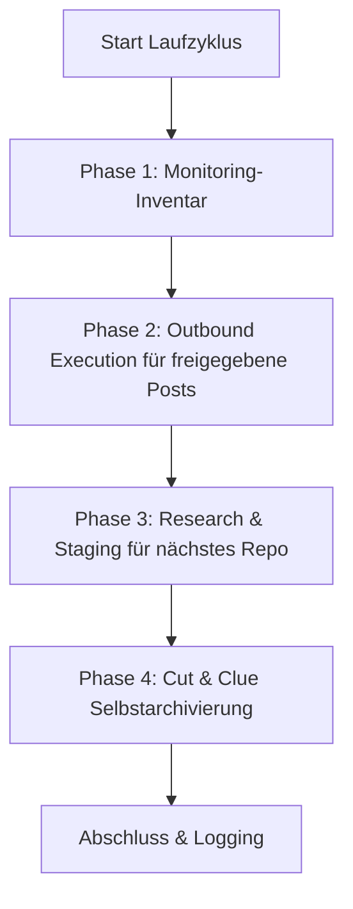

# Community Outreach & Solution Recommender

Ein anbieter-, LLM- und betriebssystemneutraler Skill zur automatisierten, lösungsorientierten Vorstellung von Open-Source-Software, Repositories und Werkzeugen in Entwickler-Communities, Reddit-Threads, Foren und Videokommentaren.

---

## 🌟 Kernprinzipien & Sicherheits-Garantien

1. **Human-in-the-Loop und fail-closed Veröffentlichung:**
   * Kein automatischer Post geht ohne menschliche Sichtung live.
   * Entwürfe werden in `POST-EINGANG.md` vorgelegt. Das Häkchen `- [x] Genehmigt` erlaubt nur den Veröffentlichungsversuch.
   * Erst ein vollständiger, auf Plattform und Ziel-URL gebundener `PublishReceipt` darf History, Rotation, Ausgang und Duplikatregister fortschreiben. Ohne angebundenen Publisher bleibt der Eintrag in der Queue.
2. **Anti-Spam & 100% Relevanz („Lieber kein Post als ein unpassender“):**
   * Jeder Post löst ein konkret im Ziel-Thread formuliertes technisches Problem.
   * Strikte Beachtung der jeweiligen Community- und Plattformregeln (keine Schleichwerbung, transparente Nennung als Autor/Maintainer).
3. **Strikter Duplikatschutz:**
   * `posts_history.json` und `POSTVERZEICHNIS.md` protokollieren jede durch Receipt belegte Ziel-URL.
   * Kein Thread oder Video wird jemals doppelt adressiert.
4. **Fair Round-Robin & Plattform-Rotation:**
   * Projekte werden nach längster Abstinenz rotiert (jedes Repo kommt gleichmäßig zum Zug).
   * Plattformen werden abgewechselt (Reddit $\rightarrow$ YouTube $\rightarrow$ Dev.to / Fachforen $\rightarrow$ Reddit).
5. **Cut-and-Clue Selbstarchivierung:**
   * Historische Postausgänge werden bei Erreichen einer Größengrenze automatisch nach `_archive/` ausgelagert und im Header referenziert.

---

## 📂 Standard-Infrastruktur

Der Skill baut in einem Ziel-Verzeichnis (`<workspace_root>/.COMMUNITY_OUTREACH/` o. ä.) folgende modulare Struktur auf:

| Datei | Zweck |
| :--- | :--- |
| `USECASES.md` | Übersicht aller Repositories, deren Usecases und gelöster Zielprobleme |
| `usecases.json` | Maschinenlesbare Rotations-Datenbank mit Zeitstempeln und Metadaten |
| `POST-EINGANG.md` | Human-in-the-Loop Genehmigungs-Queue mit `- [ ] Genehmigt` Checkboxen |
| `POST-AUSGANG.md` | Monitoring veröffentlichter Beiträge und Inbound-Community-Feedback |
| `POSTVERZEICHNIS.md` | Globaler URL- und Thread-Duplikatschutz-Index |
| `ACCOUNTVERZEICHNIS.md` | Übersicht autorisierter Profile und SSO-Login-Mechanismen |
| `config.json` | Instanz-Konfiguration (Repos, Frequenzen, Zielplattformen) |

Die verifizierte Laufzeitbeschreibung liegt in [`references/runtime-readme.md`](references/runtime-readme.md).

---

## 🔄 Der 4-Phasen-Laufzyklus



1. **Phase 1 (Monitoring-Inventar):** Zählt veröffentlichte History-Einträge als lokal zu prüfende Threads. Der Core ruft keine Plattformantworten ab; dafür wäre ein getrennter, autorisierter Inbound-Adapter nötig.
2. **Phase 2 (Outbound Execution):** Prüft freigegebene Einträge, exakte URL-Duplikate und den angebundenen Publisher. Nur ein verifizierter `PublishReceipt` löst lokale Zustandsänderungen aus. Der mitgelieferte CLI-Adapter veröffentlicht selbst nichts.
3. **Phase 3 (Research-Auftrag):** Wählt via Fair Round-Robin das am längsten nicht bespielte Repo aus und liefert `needs-action`. Erst eine getrennte Recherche darf eine echte, aktuelle und noch unbenutzte Ziel-URL sowie einen geprüften Entwurf in `POST-EINGANG.md` persistieren; Platzhalter werden nicht erzeugt.
4. **Phase 4 (Selbstarchivierung):** Archiviert die ältesten vollständigen Einträge nach `_archive/`, hält die neuesten Einträge live und ist bei Wiederholung idempotent.

Ein Lauf mit `--dry-run` ist eine reine Planberechnung: Er ruft keinen Publisher auf, verändert keine Datei und legt kein Verzeichnis an.

---

## ⚙️ Multi-Scheduler & Multi-Agent Betrieb

Der Skill unterstützt alle gängigen Scheduler- und Agentenumgebungen:

### 1. Antigravity Sidecar / Scheduled Task
Wird als nativer Sidecar in `.gemini/config/sidecars/community-outreach/sidecar.json` registriert.
* **Vorteil:** Läuft nur bei geöffneter App, vollständige Kontrolle im GUI-Dashboard.
* **Frequenz:** z. B. 1x täglich (`0 10 * * *`) oder 4x täglich (`0 8,12,16,20 * * *`).

### 2. Codex & Claude Code / Cron
* Aufruf über eine CLI-Session oder einen vorhandenen Task-Runner:
  ```bash
  python scripts/outreach_engine.py --full-run
  ```

### 3. Windows Task Scheduler (`schtasks`)
* Optional für autarke OS-Hintergrundausführung:
  ```powershell
  python scripts/setup_scheduler.py --backend windows --schedule 09:00
  ```

## 📋 Schnellstart (Bootstrap)

1. **Workspace initialisieren:**
   ```bash
   python scripts/init_outreach_workspace.py --target-dir ./outreach_data --repo-list ./repos.json
   ```
2. **Portablen Runtime-Adapter projizieren:**
   ```bash
   python scripts/deploy_runtime.py --target ./outreach_data --json
   ```
   Der Deploy kopiert nur Core, Adapter, Runtime-README und Runtime-Smoke-Test; Daten- und Queue-Dateien bleiben unberührt. `--check` prüft die Projektion ohne Schreibzugriff.
3. **Testlauf durchführen (Dry-Run):**
   ```bash
   python scripts/outreach_engine.py --workspace ./outreach_data --dry-run
   ```
   Der Rückgabestatus bleibt `needs-action`, solange echte Recherche oder ein Publisher fehlt. Das ist kein Fehler und kein Veröffentlichungsbeleg.
4. **Scheduler aktivieren:**
   ```bash
   python scripts/setup_scheduler.py --backend antigravity --workspace ./outreach_data
   ```

---

## 🔒 Private / Lokale Konfiguration

Spezifische Pfade, Anmeldedaten und persönliche SSO-Profile werden in `config.private.json` oder `.env` gespeichert. Diese Dateien sind per `.gitignore` ausgeschlossen und gelangen niemals in öffentliche Repositories.

---

## Changelog

### 1.1.0 (2026-08-29)
- Kanonischer Core mit dünnem Runtime-Adapter und kompatiblen Lesewegen für beide bisherigen Datenschemata.
- Fail-closed `PublishReceipt`, exakter Duplikatschutz, byte-erhaltende Queue-Verarbeitung und wiederanlauffähige lokale Projektion.
- Schreibfreier Dry-Run, eintragsbasierte idempotente Archivierung und wahrheitsgemäßer `needs-action`-Status für Phase 3.

### 1.0.0 (2026-08-13)
- Initiales Release: Universeller Community Outreach & Solution Recommender Skill.
- 4-Phasen-Engine mit Human-in-the-Loop, Duplikatschutz, Fair-Round-Robin und Cut-and-Clue Archivierung.
- Multi-Scheduler Support (Antigravity, Windows Task Scheduler, Cron, ellmos-scheduler, Codex, Claude Code).
