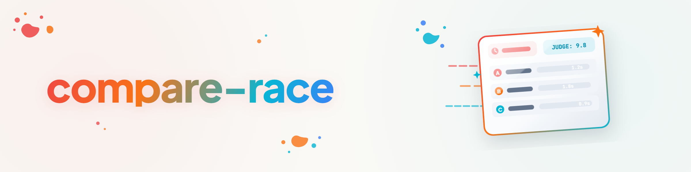

# compare-race — pointer skill (English)

> **This skill is a pure pointer. The module is the source of truth.**

## Module path

```
<HOME>\OneDrive\.TOPICS\.AI\.MODULES\.ORCHESTRATION\compare-race\
```

Repo: [github.com/ellmos-ai/compare-race](https://github.com/ellmos-ai/compare-race)

## Instruction to the agent

1. Read the role prompt **`prompts/RACE-STARTER.en.md`** in the module folder and
   follow it. You are the RACE-STARTER — and by default also the **judge** (user
   decision 2026-08-16).
2. Check the config (`compare-race config`; host config under `~/.compare-race/`).
   Pick the mode: `sequential` = stopwatch (clean per-lane timing) · `parallel` =
   true race. **The stopwatch is only a picture** — time is one dimension beside
   quality, correctness, completeness, instruction fidelity and cost.
3. Start the race (`compare-race run --prompt-file …`); without coma take the
   model-manual path via `compare-race record`.
4. As the judge, fill the rubric in the race folder's `RACE.md` — read every RUN
   file yourself; name your bias if your own model runs a lane.
5. Axis discipline: attribute only when exactly one axis varies
   (model = the race · run = variance · time = model drift).

## Quota warning

Races cost on **every** participating quota (claude/codex/agy/kimi). Ask the user
before large races (many lanes × repetitions).
