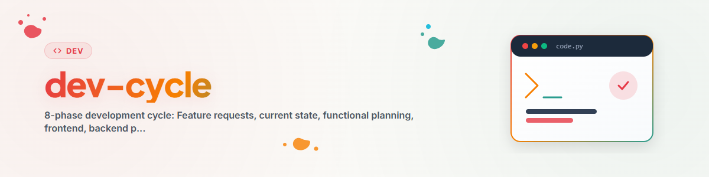

> **中文** — `dev-cycle` 官方中文版本。

# 开发周期 (Dev Cycle) (中文)

> **目标：** 从特性请求到经验证的系统的结构化流程。
> 每项开发都会经历这 8 个阶段。

---

## 概述与目的

```
  +--------------------------------------------------------------+
  |                        开发周期                              |
  +--------------------------------------------------------------+
  |                                                                |
  |  阶段 1   特性请求（功能性需求）                               |
  |     |                                                          |
  |     v                                                          |
  |  阶段 2   检查当前状态（哪些已存在？）                           |
  |     |                                                          |
  |     v                                                          |
  |  阶段 3   功能规划                                             |
  |            （工作流、Agent、专家、Skill、服务）                |
  |     |                                                          |
  |     v                                                          |
  |  阶段 4   实现功能前端                                         |
  |            （Skill 文件、工作流 markdown、Agent 配置文件）      |
  |     |                                                          |
  |     v                                                          |
  |  阶段 5   规划与对齐后端                                       |
  |            （CLI 处理程序、数据库 Schema、API 端点）           |
  |     |                                                          |
  |     v                                                          |
  |  阶段 6   实现后端任务                                         |
  |            （Python 代码、工具、数据库迁移）                   |
  |     |                                                          |
  |     v                                                          |
  |  阶段 7   技术测试与 Bug 修复                                  |
  |            （B/O/E 测试、Bug 修复协议）                        |
  |     |                                                          |
  |     v                                                          |
  |  阶段 8   功能与特性测试：用例 (USE CASES)                     |
  |            （从用户角度进行端到端验证）                         |
  |                                                                |
  +--------------------------------------------------------------+

  贯穿始终的核心原则：
  - 功能描述先行（在写代码之前）
  - CLI 优先（一切均可通过终端控制）
  - 用户数据与系统数据的清晰分离
```

---

## 阶段 1: 特性请求（功能性需求）

**内容：** 收集并制定功能性需求。

**输入：**
- 用户愿望、想法、问题
- 合作伙伴建议（LLM 助手）
- 来自用例的见解（反馈循环！）

**输出：**
- 任务系统中的任务（例如 Issue、Ticket 或 TODO 列表）
- 需求描述“想要什么”（WHAT），而不是“怎么做”（HOW）

**规则：**
- 始终从功能角度制定需求（“用户可以执行 X”）
- 而非技术角度（“为 X 实现 REST 端点”）
- 使用用例作为需求来源（阶段 8 -> 阶段 1）

---

## 阶段 2: 检查当前状态

**内容：** 清点现有功能。

**检查清单：**
```
  [ ] 搜索现有的工具/脚本
  [ ] 查看关于该主题的文档/帮助
  [ ] 检查现有的 Skill/Agent/服务
  [ ] 检查数据库 Schema（如果相关）
  [ ] 检查用例 — 是否测试过类似的内容？
```

**输出：**
- 记录哪些已存在、哪些缺失、哪些需要扩展
- 避免重复开发

---

## 阶段 3: 功能规划

**内容：** 在功能层面进行规划 — **切勿** 立即编写代码。

**规划层级：**

| 层级 | 问题 | 产出物 |
|------|------|--------|
| 工作流 (Workflow) | 何时/如何进行协调？ | workflows/*.md |
| Agent | 由谁执行？ | agents/*.txt |
| 专家 (Expert) | 谁具备该领域的知识？ | experts/*/ |
| 技能 (Skill) | 做了什么？ | skills/*.md |
| 服务 (Service) | 技术上是如何实现的？ | services/*/ |

**规则：**
- 先从功能角度思考，然后再考虑技术实现
- 工作流描述流程，而不是实现细节
- 每个 Agent 都需要有清晰的配置文件
- 服务必须能够在没有用户数据的情况下运行

---

## 阶段 4: 实现功能前端

**内容：** 创建 Skill 文件、工作流 Markdown、Agent 配置文件。

这里的“前端”指的是功能描述层：
- 工作流文件 (.md)
- Agent 配置文件 (.txt)
- 专家知识
- 服务描述
- 帮助文件

**输出：**
- 存在所有的功能描述
- LLM 合作伙伴能够阅读并理解该工作流
- 功能层已被完整文档化

---

## 阶段 5: 规划与对齐后端

**内容：** 将技术架构与功能前端进行对齐。

**规划领域：**

| 领域 | 问题 | 位置 |
|------|------|------|
| CLI 处理程序 | 哪些命令？ | handlers/*.py |
| 数据库 Schema | 哪些表/列？ | schema/*.sql |
| API 端点 | 哪些 GUI 端点？ | server.py |
| 工具 (Tools) | 哪些 Python 脚本？ | tools/*.py |

**输出：**
- 与功能前端对齐的技术方案
- 数据库 Schema 设计
- CLI 命令结构

---

## 阶段 6: 实现后端任务

**内容：** 编写 Python 代码、数据库迁移、CLI 处理程序。

**检查清单（针对每个任务）：**
```
  [ ] 是否可以在没有用户数据（空数据库）的情况下工作？
  [ ] CLI 命令是否可用？
  [ ] 输入是否可以来自文件/文件夹？
  [ ] 输出是否写入结构化的数据库？
  [ ] 扫描/导入是否可重复进行（幂等性）？
  [ ] 是否没有硬编码路径？
  [ ] 工具已注册并已文档化？
  [ ] 帮助文件已创建？
```

---

## 阶段 7: 技术测试与 Bug 修复

**内容：** 确保技术正确性。

**测试类型 (B/O/E)：**

| 类型 | 视角 | 描述 |
|------|------|------|
| B-Tests | 外部/自动化 | 自动化测试、CI/CD |
| O-Tests | 功能（输入->输出） | 手动功能验证 |
| E-Tests | 主观/体验 | UX 评估、易用性 |

**出现 Bug 时：**
- 应用 bugfix protocol
- 遵守 20 分钟规则（20 分钟后更换方法）
- 记录经验教训

---

## 阶段 8: 功能与特性测试 - 用例 (USE CASES)

**内容：** 从用户角度进行端到端验证。

**用例兼具以下两种目的：**
1. **特性指标** - 想要什么？应该可以实现什么？
2. **测试场景** - 从 A 到 Z 是否真正正常工作？

**用例格式：**
```
  USECASE_NNN: 简短标题

  前置条件 (PRECONDITION): 必须具备什么条件？
  输入 (INPUT):            用户输入什么 / 哪些数据？
  预期 (EXPECTED):         结果应该是什么？
  测试 (TESTS):            测试了哪些组件？
```

**反馈循环：**
- 失败的用例 -> 阶段 1 中的新任务
- 成功的用例 -> 已验证的特性
- 新的用例想法 -> 记录为任务

---

## 总结：开发周期

```
  阶段 8 (用例 USE CASES)
       |
       | 新需求 / Bug
       v
  阶段 1 (特性请求)       -->  阶段 2 (当前状态)
       ^                                    |
       |                                    v
  阶段 7 (测试/Bug)            阶段 3 (功能规划)
       ^                                    |
       |                                    v
  阶段 6 (后端代码)            阶段 4 (功能前端)
       ^                                    |
       |                                    v
       +──────────────────── 阶段 5 (后端规划)
```

开发周期是一个闭环：用例验证特性，同时不断产生新的需求。

---

## 各阶段专用 Skill

| 阶段 | 专用 Skill | 触发条件 |
|------|------------|----------|
| 阶段 1-3 | Project bootstrapper（如果可用） | 创建全新项目 (greenfield) |
| 阶段 2 | [project-onboarding](../project-onboarding/SKILL.zh.md) | 接手现有项目 |
| 阶段 2-3 | [docs-analysis](../docs-analysis/SKILL.zh.md) | 对照代码检查需求文档 |
| 阶段 5-6 | [pipeline-optimizer](../pipeline-optimizer/SKILL.zh.md) | 重构/优化现有结构 |
| 阶段 7 | [bugfix-protocol](../bugfix-protocol/SKILL.zh.md) | 系统化 6 阶段调试 |
| 阶段 7-8 | [bugsweep](../bugsweep/SKILL.zh.md) | 发布前的收敛型 Bug 排查 |

如果您的 Skill 集合包含索引文件，请在其中搜索更多特定阶段的 Skill。

---

## 变更日志

### 1.1.0 (2026-06-13)
- 新增“各阶段专用 Skill”表格，包含对 project-onboarding、docs-analysis、pipeline-optimizer、bugfix-protocol 和 bugsweep 的引用。

### 1.0.0 (2026-03-12)
- 从 BACH 移植 (dev-zyklus v1.0.0)。

---

*创建时间：2026-01-28 | 移植时间：2026-03-12*