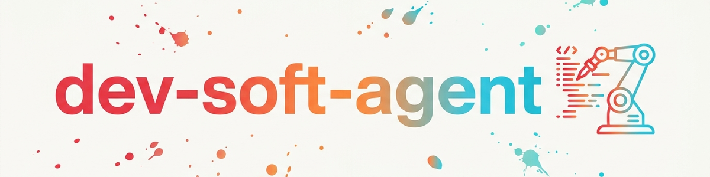

> **日本語** — `dev-soft-agent` の公式日本語版。

# Dev Soft Agent (日本語)

自動ソフトウェア開発パイプライン。BACH の ATI エージェントから抽出され、
Python の標準ライブラリのみで完全にスタンドアロン動作します。

## コンポーネント構成

```
scripts/
  config.py              設定（スキャンフォルダ、命名プレフィックス、重み）
  project_manager.py     プロジェクトスキャン + 命名規則による分類
  task_engine.py          TASKS.txt パーサー + コードスキャナー (TODO/FIXME)
  code_analyzer.py       静的解析（LOC、インポート、クラス、関数）
  dev_loop.py            オーケストレーター (DevLoop)
  policies/
    naming.py            snake_case / PascalCase / SCREAMING_SNAKE の検証
    encoding.py          UTF-8 の強制 + BOM 検出
    paths.py             ハードコードされたパスの検出
  prompt_templates/
    task_prompt.txt      タスク処理用 LLM プロンプト
    review_prompt.txt    コードレビュー用 LLM プロンプト
    analysis_prompt.txt  プロジェクト分析用 LLM プロンプト
```

## Python ライブラリとしての使用方法

```python
from scripts.dev_loop import DevLoop
from scripts.config import Config

config = Config()
loop = DevLoop(config)

# プロジェクトのスキャン (日本語)
projects = loop.scan_projects()

# プロジェクトの選択（命名規則に基づく加重ランダム選択） (日本語)
project = loop.select_project()

# コードの分析 (日本語)
analysis = loop.analyze_project()
print(f"{analysis.total_loc} LOC, {analysis.todo_count} TODOs")

# タスクの読み込みと優先順位付け (日本語)
tasks = loop.get_tasks()
for task in tasks:
    print(f"[{task.task_type.name}] {task.description} (Prio: {task.priority})")

# 開発セッションの完了 (日本語)
result = loop.run_session()
loop.save_session()
```

## CLI としての使用方法

```bash
cd scripts
python -m devSoftAgent scan ~/projects
python -m devSoftAgent select
python -m devSoftAgent analyze /path/to/project
python -m devSoftAgent tasks /path/to/project
python -m devSoftAgent session --project my-project
python -m devSoftAgent status
```

## 命名規則（プロジェクト分類）

プロジェクトはフォルダ名に基づいて分類されます：

| プレフィックス | ラベル | 重み | 意味 |
|----------------|--------|------|------|
| `RDY` | Ready（準備完了） | 1.0 | 最優先 |
| `RDY_FAST` | Fast Ready | 0.5 | 迅速に完了可能 |
| `FAST` | Fast | 0.33 | 小規模タスク |
| `DEV` | Development | 0.17 | 開発中 |
| `REL` | Released | 0.0 | 完了、作業不要 |
| `ARC` | Archived | 0.0 | アーカイブ済み |

重みはランダム選択時の確率を決定します。

## TASKS.txt フォーマット

```markdown
# TASKS - プロジェクト名 (日本語)
# 日付: 2026-03-12 (日本語)

## OPEN
- [ ] [BUG] バグの説明
- [ ] [FEATURE] 新機能

## IN PROGRESS
- [-] [REFACTOR] コードのリファクタリング

## DONE
- [x] [BUG] 修正済みバグ -- DONE 2026-03-01
```

## ポリシー (Policies)

コードに対して自動チェックが可能な品質ポリシー：

- **NamingPolicy:** モジュール/関数には snake_case、クラスには PascalCase
- **EncodingPolicy:** UTF-8 を強制、BOM を検出、CRLF に警告
- **PathPolicy:** ハードコードされた絶対パスを検出および報告

## 変更履歴

### 0.1.0 (2026-03-12)
- MODULAR_AGENTS/devSoftAgent からスキルライブラリへの移行
- プロジェクトスキャナー、タスクエンジン、コードアナライザー、DevLoop
- 3つのポリシー（命名、エンコーディング、パス）
- 3つのプロンプトテンプレート（タスク、レビュー、分析）