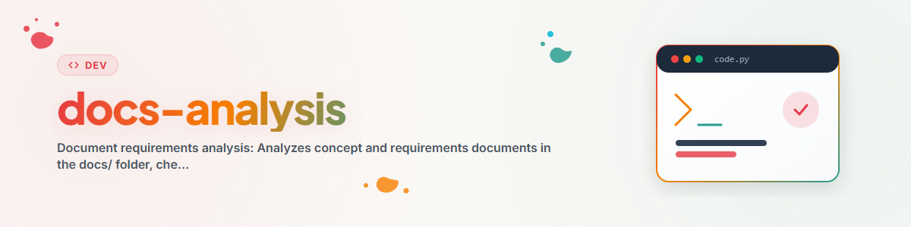

> **Русский** — Официальная русская версия `docs-analysis`.

# Анализ требований к документам (Русский)

> Анализирует все концептуальные документы и документы требований, проверяет их требования по текущему коду и создает сводный отчет о различиях.

---

## Обзор и назначение

Анализирует все концептуальные документы и документы требований в папке `../docs/`, проверяет их требования по текущему коду и создает сводный отчет о различиях.

---

## Соглашение о наименованиях

### Префикс и суффикс
Все проанализированные документы получают:
- **Префикс:** `conN_`, где N = версия анализа (1, 2, 3, ...)
- **Суффикс:** `_XX`, где XX = процент выполнения (округленный до ближайших 10)

### Порог архивации
- **>= 75% выполнено:** Документ перемещается в `../docs/_archive/`
- **< 75% выполнено:** Документ остается в `../docs/` с префиксом/суффиксом
- **Настраиваемый порог** (по умолчанию: 75)

---

## Процесс

### Фаза 1: Сбор документов
- Перечислить все файлы `*.md` и `*.txt` в `../docs/` (корень)
- Отфильтровать `README.txt`

### Фаза 2: Извлечение требований
Для каждого документа:
- Прочитать содержимое
- Выявить требования (чеклисты, таблицы, маркеры MISSING/TODO)
- Классифицировать: Структура, Код, API, Схема БД, CLI, Функциональность

### Фаза 3: Проверка кода
Для каждого требования:
- Определить метод проверки (Glob, Grep, Read)
- Выполнить проверку
- Отметить как: FULFILLED, PARTIAL, MISSING

### Фаза 4: Оценка
- Подсчитать выполненные и открытые требования
- Рассчитать процент выполнения (%)
- Решить: архивировать (>= 75%) или оставить (< 75%)

### Фаза 5: Генерация результатов
- Создать `REQUIREMENTS_ANALYSIS.md` (сводка)
- Создать `consense_diff.md` (только открытые требования, по приоритету)

### Фаза 6: Версионирование
- Поиск наивысшего префикса `conN_`
- Новая версия = наивысший + 1

### Фаза 7: Переименование и перемещение
- Применить новый префикс/суффикс к документам
- Архивировать или оставить

---

## Результаты

| Файл | Описание |
|------|----------|
| `conN_REQUIREMENTS_ANALYSIS.md` | Полный анализ (версия N) |
| `consense_diff_N.md` | Сводка открытых требований |
| `_archive/conN_*_XX.*` | Заархивированные (>=75%) документы |

---

## Классификация приоритетов

| Приоритет | Критерий |
|:---------:|----------|
| P1 | Основная функциональность отсутствует, система непригодна к использованию |
| P2 | Важная функция отсутствует, возможен обходной путь |
| P3 | Желательно, улучшает UX |
| P4 | Косметическое, документация, качество кода |

---

## Журнал изменений

### 1.0.0 (2026-03-15)
- Перенесено из BACH v3.8.0

---

*Перенесено из BACH v3.8.0 | Автономная версия*