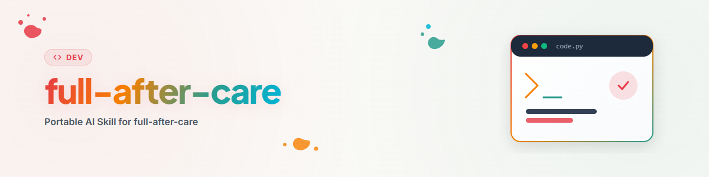

> **日本語** — `full-after-care` の公式日本語版。


# Full After Care — 詳細レビューラウンド (類義語: Deep After Care) (日本語)

## この Skill を適用するタイミング

公開されたリポジトリを**根本的**に見直す必要がある場合に使用します：長期間チェックされていない、大型リリースの前、法的に関連する事項がある場合、または自社の他のプロジェクトとの連携がテーマとなる場合。

簡易ラウンド（`surface-after-care`）との違いは注意深さではなく労力です：ステップ 2 は個々のリポジトリの境界を超えます。外部リソース（法的状況）に照会し、**所有するすべての**組織をインベントリ化し、アプリケーション自体（言語）に介入します。そのため、実行頻度は低く、通常はリポジトリごとに年 1 回、または必要に応じて実行されます。

## プロセス

### まずステップ 1 を完全に完了する

**`surface-after-care` を完全に実行します** — ステップ 0（配信プラットフォーム）、プライバシーゲート、公開の意图、バナー、現状と目標の照合、README の言語、可視性、組織エントリ、Issue と PR、コミット、プッシュ、プラットフォームの同等性を含みます。ここではこれらを繰り返したり省略したりしません。

以下の 3 つのステップはこれらに上乗せされます。これら自体がドキュメントとコードの変更を生成します — ステップ 1 で説明したのと同じリズムで、テーマごとに分割されたコミットでプッシュしてください。

---

### 5. 年次再確認を伴う法的初回評価

#### まず: 評価の期限が切れていますか？

`_after-care/RECHTSCHECK.md` を確認してください（このフォルダは gitignore されています。下記参照）。そこに記載された確認日付が **1 年未満** の場合、このステップは詳細ラウンドであっても**スキップ**されます。新しい評価を再度取得することは時間と費用がかかり、新しいメリットをもたらしません。

日付が **1 年より古い** 場合、またはファイルが存在しない場合は、確認が実行されます。再確認の理由は法律鑑定の質が低下するためではなく、**法的状況**が変化するためです（新しい規制、変更された閾値、新しい判例、プラットフォームルールの変更）。2 前の鑑定は形式的には正しくても実质的には古くなっている可能性があります。

年次サイクルの対象外であっても、**対象事項**が変更された場合は再評価が必要です：新しいデータカテゴリ、新しい配信チャネル、新的ビジネスモデル、ライセンス変更、Copyleft を伴う新しい依存関係、他の管轄区域への拡大。

#### リポジトリは法的に関連していますか？

すべてのプロジェクトがこれを必要とするわけではありません。トリガーには以下が含まれます：

- ローカルであっても個人データを処理する
- サードパーティのサービス、ウェブサイト、またはインターフェースにアクセスする（利用規約、スクレイピング）
- 規制された分野（法律、医療、税務、金融）で情報提供/アドバイスを行う
- 名称、ドキュメント、または UI にサードパーティの商標、名称、ロゴが含まれる
- Copyleft または不明確なライセンスを持つ依存関係が含まれる、あるいはサードパーティのコンテンツを同梱する
- 未成年者を対象とする、決済を処理する、または暗号/輸出規制の対象となる
- 人間に関する自動意思決定を行う、または AI システムとして分類される

いずれも当てはまらない場合は、実行ログに**確認して否定したことを明確に記録**してください — そうしないと、次のラウンドで同じ質問が最初からやり直されます。

#### 評価の取得

法務部門 Skill（Skill `law-checker`、モジュール `law-checker`）を使用し、具体的背景を提示します：アプリは何をするか、どのようなデータに触れるか、どのようなチャネルで配信されるか、どのようなライセンスが関与するか、誰を対象としているか。背景が具体的であるほど、引例が役立ちます。結果は条文の裏付けを伴う初回評価です — **法的助言ではありません**。重大なリスクがある場合、結果は弁護士に確認することを推奨するものであり、判決そのものではありません。

#### 格納場所

```
_after-care/
├── LOG.md                    # 両ステップの実行ログ
└── RECHTSCHECK.md            # 日付、対象事項、結果、条件、再確認
```

`_after-care/` は `.gitignore` に含まれます。これは隠し事ではなく、ステップ 1 のステップ 2b と同じルールです：内部作業ドキュメントはリポジトリの公開コンテンツではありません。鑑定の場合、公に同梱されたリスク分析は過失の承認と解釈される可能性があり、攻撃者にロードマップを提供してしまうことになります。あるいは、格納はリポジトリ外の専用フォルダで行うこともできます — 重要なのは次の実行時に**発見可能**であることだけであり、そうでないと年次ルールが機能しません。

ファイルのヘッダーはマシン可読に保ちます：

```markdown
# Rechtscheck — <Projekt> (日本語)
geprüft: 2026-07-24
gegenstand: lokale Dateiverwaltung, keine Cloud, keine personenbezogenen Daten Dritter
ergebnis: unbedenklich
auflagen: Hinweis auf MIT-Lizenz der eingebetteten Bibliothek X im README
wiedervorlage: 2027-07-24
```

評価から**公開**されるのは**結果・影響**のみです：ライセンス表示、免責事項、プライバシー通知、アプリの機能に関する明確な説明。これらの変更はリポジトリに属しますが、その背景にある理由は属しません。

---

### 9. すべての組織にわたる相互参照

ステップ 1 では、リポジトリが組織ページにあるかどうかのみを問いかけます。ステップ 2 ではさらに一段深くなります：**自社のすべての組織のどの個別リポジトリがこれと関連しているか — そして双方がそれを知っているか？**

```bash
gh api user/orgs --jq '.[].login'
for ORG in $(gh api user/orgs --jq '.[].login'); do
  gh repo list "$ORG" --limit 200 --json name,description,updatedAt,isArchived,primaryLanguage
done
```

価値はリスト化することではなく、関係性を認識することから生まれます。関連するタイプ：

- **使用する / 使用される** — 両方向の真の技術的依存関係
- **同じファミリーに属する** — 共通の製品ライン、共通のプレフィックス、共通のアーキテクチャ
- **同じ問題を異なる方法で解決する** — 一方にたどり着いたユーザーは、もう一方も知りたいことがよくある
- **前身 / 後継** — 置き換えられたプロジェクトには道標が必要であり、そうしないとユーザーは永久に停止した状態にとどまります
- **構成要素 / 組み合わせ** — ライブラリとそれを使用するアプリケーション

参照は**双方向**に設定してください。一方通行はこのステップの最も一般的なエラーです：メンテナンス対象のリポジトリに関連プロジェクトのリストを追加したのに、関連プロジェクト側には何も書かれていないケースです。そこに到着した人は決して戻る道を見つけられません。

バックリンクは対象リポジトリで実際に設定されます —, ステップ 1 のステップ 11 にある **Dirty Tree ルール**に従います。要約すると：クリーンなツリー -> 独自のコミットとプッシュ；他のファイルにコミット前の変更あり -> パス指定で正確にコミット、プッシュしない；対象ファイル変更済みまたはアクティブなロックあり -> 触らない。参照が設定されない場合は、対象リポジトリのタスクリスト（`AUFGABEN.txt`/`TODO.md`）に含め、ロックされている場合は自身の実行ログのみに記録します。これにより、第三者の作業状態を危険に晒すことなく、参照が失われることもなく、ラウンドが自己完結します。

参照は単なる名前のリストではなく、有用性を意識して定式化します：「**project-b** — このツールが生成したエクスポートを読み取り、レポートを作成します」は有用ですが、「参照：project-b」は有用ではありません。

アーカイブされた明らかに停止しているリポジトリはリンクされません — 反対方向の明示的な後継案内を除く。

このインベントリ調査はラウンドで最もコストがかかる部分です。確認すべき組織やリポジトリが多い場合、リポジトリのインベントリ結果を実行ログに記録しておくと、別のリポジトリの次回の詳細ラウンドでそれを活用できます。

---

### アプリレベルでの全言語の追従

ステップ 1 は README の言語バージョンを担当します。ここでは**製品自体**を扱います：UI テキスト、メッセージ、ヘルプ、CLI 出力、エラーメッセージ、ストアおよびレジストリの説明。

まず、アプリケーションが技術的にすでに認識している言語と、それをどのように管理しているかを特定します：

```bash
rg -l "gettext|i18n|locale|translations|LC_MESSAGES|\.po$|messages\.json" --hidden
fd -e po -e pot -e ftl . 2>/dev/null; ls locales/ i18n/ lang/ translations/ 2>/dev/null
```

次に、3 つの質問に沿ってギャップを埋めます：

1. **プロジェクトが持つべき言語が不足していませんか？** 標準言語はドイツ語、英語、スペイン語、簡体字中国語、日本語、ロシア語です（ユーザー向けアプリの場合）。開発者向けのライブラリの場合、英語だけで十分なことがよくあります。不要な言語は継続的なメンテナンスの負担であり、メリットではありません。
2. **既存の言語は完全ですか？** 各機能サイクルの後、サブ言語は遅れをとります。翻訳のない新しいキーは運用時にメイン言語にサイレントフォールバックすることが多く、気づかれにくいため、目視に頼らずメイン言語に対して明示的に diff を取ります。
3. **言語の選択はユーザーが利用可能ですか？** 誰も有効化できない完全な翻訳は、存在しないのと同じです。切り替えスイッチは存在するか、選択は保持されるか、システム言語がデフォルトとして認識されるか？

プロジェクトで確立された i18n メカニズムに従い、その横に第 2 のメカニズムを導入しないでください。リソースファイルだけでなく、**実際の画面**で結果を確認してください：長すぎる文字列はレイアウトを崩し、フォントサポートの欠如はレンダリング時になって初めて判明します（欠落した CJK 文字は空の四角として表示されます）。

最後に、ステップ 1 のステップ 0 からプラットフォームを含めます：ストアおよびレジストリの説明には独自の言語フィールドがあり、アプリの翻訳とともに自動的に移動することはありません。

## 実行ログ

`_after-care/LOG.md` にステージ `full` のエントリを追加します：

```markdown
## 2026-07-24 — full
- ステップ 1 完全実行済み（上のエントリを参照）
- 法的チェック：期限切れ（前回 2025-06-02）-> 新規取得、結果懸念なし、
  ライブラリ X のライセンス通知条件を実装、再確認 2027-07-24
- 相互参照：4 組織 / 38 リポジトリを確認、3 つの関係性を発見、
  双方向に設定；repo-y へのバックリンクは保留中（そこでアクティブなロックあり）
- アプリレベル言語：ES を追加（312 キー）、JA を最新に更新、
  切り替えスイッチは存在したが保持されていなかったため修正
```

## よくあるエラー

| エラー | 修正 |
|---|---|
| 前回の法的チェックから 3 ヶ月しか経過していないのに再取得した | まず `RECHTSCHECK.md` の日付を読む — 1 年未満はスキップ |
| 「何も変わっていない」ため法的チェックをスキップした | 法的状況はプロジェクトとは無関係に変化します。1 年経過したら確認 |
| 法律鑑定をリポジトリにコミットした | `_after-care/` は `.gitignore` に属します。公開されるのは結果・影響のみ |
| 否定された法的関連性が記録されていない | 「関連なし」も所見であり、ログに記述すべきです |
| 相互参照がメンテナンス対象のリポジトリにしか設定されていない | 双方向に設定します。そうでないと一方通行になります |
| 自分の組織しか確認していない | ステップ 2 はすべての組織を意味します — これがステップ 1 との違いです |
| 参照が単なる名前のリストになっている | 半文で有用性を説明します。そうでないと誰もクリックしません |
| 新しい言語を作成したが UI でアクセスできない | 切替スイッチ、保持、システム言語検出も合わせてテスト |
| 翻訳をリソースファイルでしか確認していない | 実際の画面でテスト — レイアウト崩れや欠落文字はそこでしか見えません |
| ストア/レジストリの言語フィールドを忘れた | アプリの翻訳とともに自動的に移動することはありません |

## 最終チェックリスト

- [ ] `surface-after-care` が完全に完了している（プッシュとプラットフォーム同等性を含む）。
- [ ] 法的関連性が確認され、結果が記録されている — 否定された場合でも。
- [ ] 法的チェックの期限は切れていましたか？切れていた場合：取得、条件実装、再確認設定済み。
- [ ] `_after-care/` が `.gitignore` にあり、鑑定が追跡されていない。
- [ ] すべての組織がインベントリ化され、関係性が特定されている。
- [ ] 相互参照が双方向に設定され、対象リポジトリでコミットおよびプッシュされている。
- [ ] Dirty tree またはロックのためにスキップされた対象リポジトリが未解決事項として記録されている。
- [ ] アプリの言語が完全で、切り替えスイッチが利用可能であり、画面でテストされている。
- [ ] ストア/レジストリの言語フィールドが追従している。
- [ ] ステージ `full` の実行ログエントリが記述されている。

## 変更履歴

### 1.0.0 (2026-07-24)
- 初期版本。`surface-after-care` に基づくリポジトリの事後メンテナンスのステップ 2。