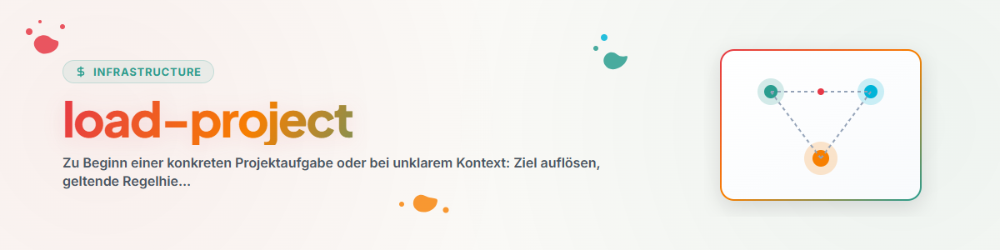

# Load Project

## Purpose

Use this skill at the beginning of a specific project task or when the work context has become unclear. The goal is not a comprehensive repository audit, but finding the minimum reliable context required to proceed safely.

## Configuration

This skill requires no fixed directory names. Local installations may optionally define the following values in their general agent rules or project-local configuration:

- known workspace roots,
- preferred file tools,
- names of additional boot or registry files,
- lock checkers,
- project-specific roles and priorities.

If such a configuration is absent, the skill works exclusively with the specified target and the project rules found there.

## Procedure

### 1. Resolve Target

1. Take an explicit path, project name, or current working directory as the starting point.
2. Determine the actual project or repository root.
3. Narrow down ambiguous matches using the task, root documents, and repository boundaries; do not guess when targets differ materially.

### 2. Load Rule Hierarchy

Read from general to specific context:

1. global agent and security rules,
2. workspace or pipeline rules,
3. project and repository rules,
4. task-specific instructions.

More specific rules apply within their scope; higher-ranking security and authorization boundaries remain in force.

### 3. Read Root Documents by Role

Filenames are indicators, not rigid standards. Specifically look for documents fulfilling these roles:

| Role | Typical Content |
|---|---|
| Entry | Purpose, navigation, start instructions |
| Rules | Working method, language, security, conventions |
| Architecture | Components, data flow, boundaries |
| Status | Current state, open issues, last check |
| Tasks | Prioritized next work |
| Register | Canonical projects, checks, or publications |
| Proof | Tests, check logs, verification notes |
| Handoff | Ongoing work, third-party changes, next step |

Only load roles relevant to the concrete task.

### 4. Trace Binding References

If a read rule explicitly specifies additional files as mandatory reading, load them in a targeted manner. End reference chains as soon as they provide no further binding context for the task.

### 5. Check State and Locks

- Check locks against local policy for owner, scope, timestamp, and validity criteria; never declare a lock stale on your own without a defined stale rule,
- Version control status and third-party changes,
- Running processes or checkpoints, if relevant,
- Timeliness of registers, tests, and status details.

Save the initial state of affected areas before making changes as a status/diff baseline. If existing changes cannot be confidently attributed, treat them preemptively as third-party and leave them untouched.

Treat snapshots as point-in-time states and re-verify before performing high-risk actions.

### 6. Create Status Report

Summarize concisely before execution:

```text
Ziel:
Projekt-Root:
Geltende Regeln:
Evidenzquellen:
Snapshot-Zeitpunkt:
Relevanter Ist-Zustand:
Locks oder fremde Änderungen:
Erfolgskriterium:
Nächster sicherer Schritt:
```

Name sources only as precisely as necessary for verification. Redact secrets, personal data, and confidential content and do not copy them into the status report.

If the task is clear and authorized based on this, proceed directly with work.

## Boundaries

- No broad, unrestricted file searches by default.
- Do not reinvent missing rules or registers.
- Do not treat old status messages as current proof.
- Do not overwrite third-party changes.
- Do not perform full project onboarding when only loading context for a specific task.

## Changelog

### 1.1.0 (2026-07-28)
- Removed fixed user, workspace, tool, and provider bindings.
- Introduced role-based document detection and optional local configuration.
- Operationalized lock validity, dirty-tree provenance, snapshot evidence, and redacted status reports.

### 1.0.0 (2026-06-17)
- Initial local version.
