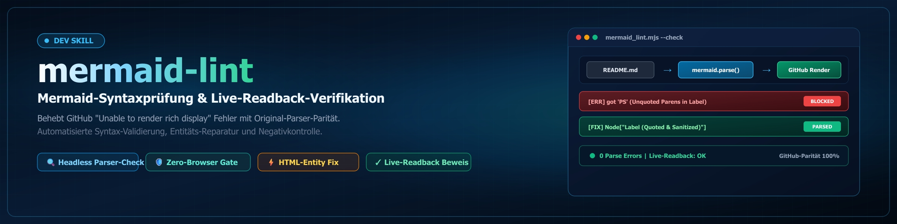

# mermaid-lint

Ein Mermaid-Diagramm mit Syntaxfehler zeigt auf GitHub statt der Grafik den Kasten
**"Unable to render rich display"**. Lokal faellt das nicht auf, weil kein Werkzeug den
Block prueft. Dieser Skill schliesst die Luecke.

## Wann anwenden

- Ein README oder Dokument zeigt auf GitHub einen Renderfehler statt eines Diagramms.
- Vor einer Veroeffentlichung oder einem Release mit Diagrammen in der Dokumentation.
- Nach jedem Umbau von Markdown, der Mermaid-Bloecke beruehrt.
- Flaechendeckend ueber mehrere Repos, wenn unklar ist, wo ueberall etwas kaputt ist.

## Die zwei Werkzeuge

### 1. `mermaid_lint.mjs` — Syntaxpruefung ohne Browser

```
node mermaid_lint.mjs <repo-pfad> [...] [--json]
node mermaid_lint.mjs --from <liste.txt> [--json]
```

Sucht rekursiv alle `.md`-Dateien, extrahiert jeden ```mermaid-Block und laesst ihn
durch `mermaid.parse()` laufen — **denselben Parser, den GitHub im Browser benutzt**.
Exit 0 = alles parst, Exit 1 = mindestens ein Block defekt. Ausgabe nennt Datei,
Blocknummer, Zeile und den woertlichen Parserfehler.

`--from <datei>` liest eine Pfadliste, eine pro Zeile. Nutze das statt vieler Argumente:
Windows-Pfade mit Backslashes werden in der Bash-Shell stumm zerfressen
(aus `D:\code\my-repo` wird `D:codemy-repo`). Schreibe Pfade mit Forward-Slashes.

Ein einziger Prozess schafft hunderte Repos, weil Mermaid nur einmal geladen wird.
Kein Puppeteer, kein Chromium-Download.

### 2. `readback.mjs` — Beweis an der lebenden Seite

```
node readback.mjs <github-url> [...]
```

Oeffnet die Seiten im vorhandenen Edge (kein Browser-Download) und zaehlt echte
Renderfehler. Urteil je Seite: `OK`, `DEFEKT`, `UNKLAR` oder `KEIN-MERMAID`.

## Drei Fallen, die diesen Skill noetig machen

**GitHub rendert Mermaid in sandboxed iframes** von `viewscreen.githubusercontent.com`.
Die Hauptseite sieht deren Inhalt nicht. Wer nur `document.body.innerText` oder
`msedge --dump-dom` auswertet, bekommt auf **jeder** Seite null Fehler gemeldet — auch
auf einer nachweislich kaputten. `readback.mjs` wertet deshalb alle Frames aus.

**Ein einzelner DEFEKT-Befund ist nicht belastbar.** Waehrend des Ladens zeigt GitHub
kurz einen Platzhalter, der wie ein Renderfehler aussieht. Gemessen am 2026-09-20:
dieselbe Seite meldete erst `ERR=1`, dann zweimal `ERR=0`. `readback.mjs` wiederholt
negative Befunde deshalb automatisch; ein `OK` wird nie wiederholt.

**`mermaid.parse()` braucht ein DOM**, sonst scheitert es an `DOMPurify.addHook` und
meldet gueltige Flowcharts faelschlich als kaputt. `mermaid_lint.mjs` stellt vorab
ein jsdom-Fenster bereit. Bleibt trotzdem ein Umgebungsfehler uebrig, landet er
getrennt unter `envIssues` und wird **nicht** als Syntaxfehler gezaehlt.

## Immer gegen eine Negativkontrolle pruefen

Bevor du einem gruenen Ergebnis glaubst, lass das Werkzeug einmal auf einen Stand los,
von dem du weisst, dass er kaputt ist — etwa den Commit vor deinem Fix:

```
node readback.mjs "https://github.com/<org>/<repo>/blob/<alter-sha>/README.md"
```

Meldet der auch `OK`, misst dein Readback nichts. Genau so wurde die iframe-Falle oben
entdeckt.

## Haeufige Fehlerursachen und ihre minimal-invasive Behebung

| Symptom im Parserfehler | Ursache | Behebung |
|---|---|---|
| `Expecting '+', '-', '()', 'ACTOR', got 'loop'` | Teilnehmer heisst wie ein reserviertes Wort: `loop`, `alt`, `opt`, `par`, `end`, `critical`, `break`, `rect`, `note` | Alias deklarieren: `participant L as Loop`, Nachrichten nutzen `L`. Der **angezeigte Name bleibt** — nicht umbenennen. |
| `got 'PS'` in einem Flowchart | Runde Klammern im Knotenlabel | Label quoten: `A["Start (hier)"]` |
| `Lexical error ... Unrecognized text` | Backticks oder Doppelpunkt im Label | Label quoten, Backticks entfernen |
| `Expecting 'SEMI', 'NEWLINE', 'EOF'` in `graph`/`flowchart` | `Note:` gibt es nur in Sequenz- und Klassendiagrammen | Hinweistext aus dem Block nehmen und als Markdown-Zeile darunter setzen, damit die Information sichtbar bleibt |
| `Expecting 'SOLID_OPEN_ARROW' ... got 'NEWLINE'` in einem Sequenzdiagramm | **HTML-Entity** im Nachrichtentext (`&lambda;`, `&Delta;`, `&ge;`). Nicht die Klammern und nicht das `=` brechen hier — das abschliessende `;` der Entity liest der Lexer als Statement-Terminator, alles dahinter wird neue Anweisung. | Entity durch das literale Zeichen ersetzen (λ, Δ, ≥), Text sonst unveraendert. Klammern duerfen bleiben. Zahlenwerte und ihre Schreibweise niemals veraendern. |
| Semikolon in einer Sequenznachricht | wird als Statement-Ende gelesen | durch ` - ` ersetzen |

In **quotierten Flowchart-Labels** sind Entities unproblematisch — die Regel gilt nur fuer
Sequenznachrichten. `mermaid_lint.mjs` meldet solche Entities als eigene `[WARN]`-Zeile
(Feld `warnings` im JSON), zusaetzlich zum Parserfehler: der Parser sagt nur
`got 'NEWLINE'` und nennt die Ursache nicht.

**Grundsatz:** minimal-invasiv. Layout, Knoten-IDs, Reihenfolge und sichtbarer Text
bleiben, soweit irgend moeglich, unveraendert. In wissenschaftlichen Repos gilt das
besonders fuer Zahlenwerte und deren Schreibweise. Bei EN/DE-Paritaet beide Fassungen
strukturgleich halten.

## Ablauf ueber mehrere Repos

1. Inventar per `gh repo list <org> --limit 200 --json name,isArchived,isPrivate,defaultBranchRef`.
2. Klone **auf Remote-Stand ziehen** und Divergenzen ernst nehmen. Ein Lint auf einem
   veralteten Klon misst den falschen Stand. Schlaegt `git pull --ff-only` fehl, pruefe
   gegen `origin` statt gegen den Arbeitsbaum:
   `git archive origin/<branch> | tar -x -C <tempdir>` und linte den Tempordner.
3. **Gleichnamige Repos verschiedener Orgs** (typisch `.github`) duerfen nicht auf
   denselben Klon gemappt werden — sonst prueft man neunmal dasselbe Repo. Bei
   Namensdopplung flach nach `<org>__<repo>` klonen und den frischen Stand linten.
4. Vor jeder Aenderung Locks pruefen (`lock_scan.py`, `LOCK*.txt` im Klon **und** am
   OneDrive-Projektpfad), eigenen Lock setzen, nach dem Push wieder entfernen.
   **Scope lesen, nicht nur die Existenz:** `LOCK.team.*` mit abgelaufener
   `expires_after` ist ignorierbar; `LOCK.user.zenodo-upload.txt` sperrt ausschliesslich
   die externe Zenodo-Schreiboperation und erlaubt Doku-Aenderungen ausdruecklich.
   Ein `LOCK.user.until-winners-announcement.txt` (Judging) sperrt dagegen jeden Push —
   dort nur lesend pruefen und den Befund als Ticket ablegen.
5. Reparieren, linten bis gruen, committen, `git pull --rebase`, pushen.
6. Readback mit Negativkontrolle. Erst dann gilt es als erledigt.

## Einrichtung

```
npm install mermaid jsdom playwright-core
```

Im Ordner der Skripte oder global; `playwright-core` nutzt den installierten Edge
(`channel: 'msedge'`) und laedt keinen eigenen Browser herunter. Nur fuer den Readback
noetig — die Syntaxpruefung laeuft ohne ihn.

## Verwandt

- `_tools/lint_mermaid.py` im GithubBot: aelterer regexbasierter Linter mit `--fix`.
  Er repariert bekannte Muster automatisch, **kennt aber keine reservierten Woerter**
  und ersetzt diesen Skill nicht. Sinnvolle Reihenfolge: erst `mermaid_lint.mjs` zur
  Diagnose, dann ggf. `lint_mermaid.py --fix` fuer die Massenmuster, dann erneut linten.
- `github-repo-care`: Gesamtprotokoll fuer Repo-Pflege und Veroeffentlichung.
