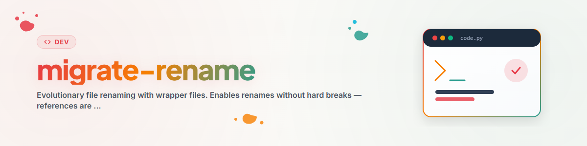

> **中文** — `migrate-rename` 官方中文版本。


# 使用 Wrapper 包装文件重命名（渐进式迁移）(中文)

> 实现文件重命名且无需强行打断现有引用。引用会在日常使用中自然被更新。

---

## 原理：渐进式迁移

```
之前：                           之后：
old_file.md                      new_file.md（重命名后）
   |                                |
   +-- 引用 A                       +-- old_file.md (wrapper)
   +-- 引用 B                              |
   +-- 引用 C                              +-- 迁移日志表
                                           +-- 说明指南
                                           +-- 指向 new_file.md 的链接
```

当有人访问旧路径时：
1. 访问到 wrapper 包装文件
2. 在日志表中添加一条记录
3. 修正引导其来到此处的引用
4. 继续跳转到实际的新文件

---

## 步骤指南

### 1. 重命名文件

```bash
mv old_file.md new_file.md
```

### 2. 创建 Wrapper 文件

创建 `old_file.md`，内容如下：

```markdown
# OLD_FILE.md - 已重定向 (中文)

**状态：** 此文件已重命名为 `new_file.md`

---

## 迁移日志

| 日期 | 操作人 | 来源 | 引用已修正？ |
|------|--------|------|-------------|
| YYYY-MM-DD | [姓名] | 初始迁移 | 不适用（已创建 wrapper） |

---

## 说明指南

1. **留下一条日志记录**（在上方表格中）
2. **检查来源**：是什么引导你来到这里的？
3. **修正引用**：将 `old_file.md` 修改为 -> `new_file.md`
4. **前往实际文件**：[new_file.md](new_file.md)

---

**目标文件：** [new_file.md](new_file.md)
```

### 3. 立即修正关键引用
- 帮助文件（核心文档）
- 系统 Prompt 提示词引用
- 直接使用该路径的 CLI 代码

### 4. 渐进式迁移剩余引用
其余引用会在后续使用中自动修正。

---

## 何时使用 Wrapper 方法？

**适用 — 使用 Wrapper：**
- 存在许多潜在引用
- 文件被多个合作伙伴/工具引用
- 非关键系统文件

**不适用 — 直接全部修改：**
- 仅有少数已知引用
- 关键系统文件（配置文件、数据库模式）
- 性能关键路径

---

## 清理工作

大约 30 天后或当日志显示不再有新条目时：
1. 将 wrapper 文件移动到 `_archive/deprecated/`
2. 或彻底删除（如果没有更多条目）

---

## 变更日志

### 1.0.0 (2026-03-15)
- 移植自 BACH v3.8.0

---

*移植自 BACH v3.8.0 | 独立版本*