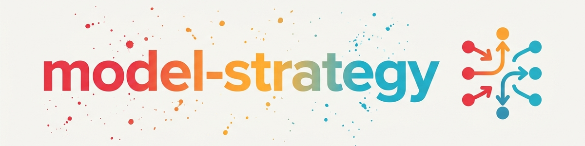

# Model-Switching Strategie

> Multi-Modell Orchestrierung: Score-basierte Modellauswahl, Cross-Agent-Delegation, Advisor-Pairing, Eskalations-Trigger und Kosten-Effizienz-Optimierung

---

## 1. Modell-Katalog

### Claude (Subagent-fähig via Agent-Tool)

```
Level 4 (Reviewer):   Opus 4.8  — Advisor, Math-Review    [nur User: /model, /advisor]
Level 3 (Stratege):   Opus 4.6  — Architektur, Konzepte   [Subagent: model:"opus"]
Level 3 (Kreativ):    Fable 5   — Kreative Texte, Stories  [Subagent: model:"fable"]
Level 2 (Arbeitstier):Sonnet 4.6— Implementation, Debug    [Subagent: model:"sonnet"]
Level 1 (Schnell):    Haiku 4.5 — Boilerplate, Formatting  [Subagent: model:"haiku"]
```

### Externe Agenten (Companion-Scripts / SSH)

```
Level 2-3: Gemini 3.5 pro  — Recherche, wiss. Datenbanken  [agy-companion CLI]
Level 2:   Gemini 3.5 flash— Schnelle Recherche             [agy-companion CLI]
Level 2-3: Codex 5.5 (GPT) — Code-Review, Code-Gen         [codex-companion CLI]
Level 2:   Codex 4.5 (GPT) — Einfachere Code-Aufgaben      [codex-companion CLI]
```

### Lokale Modelle (Token-frei, 24/7)

```
Level 1-2: Ollama (Qwen 3.5:35b-a3b) — Haiku-bis-Sonnet-Niveau [<ollama-host>:11434]
           Aufruf: SSH + curl http://<ollama-host>:11434/v1/chat/completions
           Oder: Buddha-Delegation via BACH Control API :8081
```

### Erreichbarkeits-Matrix

| Modell | LLM-startbar | Aufrufweg | Einschränkungen |
|--------|-------------|-----------|-----------------|
| Sonnet 4.6 | Ja | `Agent(model:"sonnet")` | — |
| Opus 4.6 | Ja | `Agent(model:"opus")` | — |
| Haiku 4.5 | Ja | `Agent(model:"haiku")` | — |
| Fable 5 | Ja | `Agent(model:"fable")` | — |
| Opus 4.8 | Nur als Advisor | `advisor()` in Session | User muss `/advisor` setzen |
| Gemini 3.5 | Ja (Bash) | `companion-for-agy "prompt"` | Windows-only, stdout-Workaround |
| Codex 5.5/4.5 | Ja (Bash) | `node codex-companion.mjs task "prompt"` | Auth nötig |
| Ollama | Ja (SSH/curl) | SSH + curl an Ollama-Host-API | VPN/Tailscale muss aktiv sein |
| Opus 4.8 als Hauptmodell | Nein | User: `/model opus 4.8` | Nur User-Aktion |
| Fable 5 als Hauptmodell | Nein | User: `/model fable` | Nur User-Aktion |

---

## 2. Score-Berechnung

```
Dimensionen (0-10):
  KLARHEIT      : Wie eindeutig ist die Aufgabe?
  KOMPLEXITAET  : Wie viele Komponenten?
  KREATIVITAET  : Neue Loesungen noetig?
  KONTEXT       : Wie viel Vorwissen?
  KRITIKALITAET : Wie wichtig ist Perfektion?

SCORE = (10 - KLARHEIT) + KOMPLEXITAET + KREATIVITAET + KONTEXT + KRITIKALITAET
```

### Score-Schwellwerte

| Score | Modell | Beispiele |
|-------|--------|-----------|
| 0-8 | Ollama (lokaler Host) | Prompt generieren, Summaries, einfache Texte |
| 9-12 | Haiku | __init__.py, Formatierung, Boilerplate |
| 13-22 | Sonnet | Implementation, Bug-Fixes, Standard-Code |
| 13-22 | Gemini 3.5 | Recherche, Literatursuche, wiss. Datenbanken |
| 13-22 | Codex 5.5 | Code-Gen (Luau, Node.js), Compute-Scripts |
| 23-28 | Sonnet + Advisor-Review | Komplexer Code mit Qualitätsprüfung |
| 23-35 | Fable 5 | Kreative Texte, Marketing, Storytelling |
| 29-40 | Opus 4.6 | Architektur, Strategie, Paper-Schreiben |
| 35-50 | Opus 4.6 + Advisor | Beweise, Architektur-Entscheidungen, Statistik |
| 40-50 | Opus 4.8 (User-Empfehlung) | Mathematische Beweisführung, höchste Rigorosität |

---

## 3. Cross-Agent-Delegation

### Wann welchen externen Agenten?

| Aufgabe | Bester Agent | Grund |
|---------|-------------|-------|
| Wissenschaftliche Literatursuche | Gemini 3.5 pro | Native OpenAlex/arXiv/PubMed-Skills |
| Code-Review (Zweitmeinung) | Codex 5.5 | Unabhängige Perspektive |
| Einfache Text-Generierung | Ollama (lokaler Host) | Token-frei, 24/7 |
| Kreative Texte, Marketing | Fable 5 | Stärkster kreativer Output |
| Mathematische Beweise | Opus 4.8 (Advisor) | Höchste analytische Tiefe |

### Ausschlüsse (dokumentierte Schwächen)

- **Gemini:** NICHT für mathematische Reviews/Beweisführung (Richtungsfehler bei abc-Review, 2026-06-07)
- **Codex 4.5:** Nur wenn 5.5 nicht verfügbar; sonst immer 5.5

### Aufrufwege

> Platzhalter `<host>`, `<ollama-host>`, `<tailscale-ip>`, `<user>` und `~/.ssh/<key>` durch die eigene Infrastruktur ersetzen.

**Gemini (via companion-for-agy):**
```
companion-for-agy --researcher --json --timeout 120000 "Recherche-Prompt"
```

**Codex (via codex-companion):**
```
node "~/.claude/plugins/cache/openai-codex/codex/1.0.4/scripts/codex-companion.mjs" task --effort high "Code-Prompt"
```

**Ollama auf entferntem Host (via SSH):**
```
ssh -i ~/.ssh/<key> <user>@<tailscale-ip> "curl -s http://localhost:11434/v1/chat/completions -d '{\"model\":\"qwen3.5:35b-a3b\",\"messages\":[{\"role\":\"user\",\"content\":\"Prompt\"}]}'"
```

**Buddha-Delegation (BACH mit Tools):**
```
curl -s -X POST http://<host>:8081/api/chat -H "Content-Type: application/json" -d '{"prompt": "...", "chat_id": "claude-delegate"}'
```

---

## 4. Advisor-Pairing

### Mechanik

`advisor()` ist ein **Session-Level-Tool** — das Advisor-Modell wird vom User per `/advisor` gesetzt, nicht programmatisch. Daraus ergeben sich drei Pairing-Muster:

| Muster | Wie es funktioniert | Wann einsetzen |
|--------|-------------------|----------------|
| **Session-Advisor** | User setzt `/advisor opus 4.8`, Agent ruft `advisor()` | Standard bei Beweis/Architektur |
| **Orchestrator-als-Reviewer** | Opus-Hauptmodell reviewt Sonnet-Subagent-Output | Orchestrator ist leistungsfähiger als Worker |
| **Gegen-Agent** | Agent A arbeitet, Agent B prüft adversarial | Unabhängige Verifikation, 2-Perspektiven |
| **User-Empfehlung** | Agent empfiehlt: "Diese Aufgabe mit opus 4.8 + advisor" | Wenn aktuelle Session zu schwach |

### Wann Advisor empfehlen?

- Mathematische Beweisführung (Score ≥ 35)
- Architektur-Entscheidungen mit langfristigen Konsequenzen
- Statistische Methodik / Studiendesign
- Komplexe Bugs nach 2+ erfolglosen Debug-Zyklen

### Wann KEINEN Advisor?

- Routine-Code, Content, Formatting (Score < 23)
- Einfache Feature-Implementierung
- Gut definierte, unkritische Aufgaben

---

## 5. Eskalations-Trigger

### Ollama -> Haiku
- Dateizugriff benötigt
- Analyse von Code nötig

### Haiku -> Sonnet
- Mehr als 2 Dateien betroffen
- Entscheidung zwischen Alternativen nötig
- Unerwarteter Fehler aufgetreten
- Lösch-Operation angefordert

### Sonnet -> Opus
- Architektur-Entscheidung gefordert
- 3+ Systeme müssen integriert werden
- Anforderungen widersprüchlich/unklar
- Strategische Planung nötig

### Sonnet -> Gemini (lateral)
- Wissenschaftliche Recherche benötigt
- Literaturverzeichnis-Verifikation

### Sonnet -> Codex (lateral)
- Code-Review als Zweitmeinung
- Advisor überlastet (Fallback-Reviewer)

### Opus -> Opus + Advisor
- Beweis-Review benötigt
- Kritische Architektur-Entscheidung
- Statistische Methodik

### De-Eskalation
- Konzept definiert -> Sonnet übernimmt Implementation
- Aufgabe trivial/repetitiv -> Haiku übernimmt
- Nur Text, kein Tool-Zugriff -> Ollama übernimmt

---

## 6. Berechtigungsmatrix

| Operation | Ollama | Haiku | Sonnet | Opus | Gemini | Codex |
|-----------|--------|-------|--------|------|--------|-------|
| Dateien lesen | - | Ja | Ja | Ja | Ja* | Ja* |
| Dateien schreiben | - | Ja | Ja | Ja | Ja* | Ja* |
| Dateien löschen | - | - | Ja** | Ja | - | - |
| System-Befehle | - | - | Ja** | Ja | Ja* | Ja* |
| Architektur-Entscheidung | - | - | - | Ja | - | - |
| Web-Recherche | - | - | Ja | Ja | Ja | - |
| advisor() aufrufen | - | - | Ja | Ja | - | - |

*via Companion-Script im eigenen Sandbox-Modus
**mit User-Bestätigung

---

## 7. Kosten-Effizienz

### Token-Ersparnis durch Routing

| Aufgaben-Typ | Ohne Routing | Mit Routing | Ersparnis |
|--------------|--------------|-------------|-----------|
| Trivial | Opus-Tokens | Ollama (frei) | 100% |
| Boilerplate | Opus-Tokens | Haiku-Tokens | ~80% |
| Standard-Code | Opus-Tokens | Sonnet-Tokens | ~50% |
| Recherche | Claude-Tokens | Gemini-Tokens | ~70% (anderes Budget) |
| Code-Review | advisor()-Tokens | Codex-Tokens | ~60% (anderes Budget) |

---

## 8. Goldene Regel

> "Opus denkt, Sonnet baut, Haiku führt aus, Ollama spart. Gemini recherchiert, Codex reviewt, Fable erzählt."

---

## Changelog

### 2.0.0 (2026-06-12)
- Cross-Agent-Delegation: Gemini, Codex, Ollama (lokaler Host) als Routing-Ziele
- Advisor-Pairing: 4 Muster (Session-Advisor, Orchestrator-als-Reviewer, Gegen-Agent, User-Empfehlung)
- Erreichbarkeits-Matrix: LLM-startbar vs. User-only dokumentiert
- Ollama (Qwen 3.5:35b-a3b, Haiku-bis-Sonnet-Niveau) als Level 1-2 aufgenommen
- Laterale Eskalation: Sonnet -> Gemini (Recherche), Sonnet -> Codex (Review)
- Ausschlüsse dokumentiert (Gemini nicht für Math)
- Score-Schwellwerte erweitert für alle Modelle

### 1.0.0 (2026-03-15)
- Portiert aus BACH v3.8.0 (ing-strategie v2.0.0)

---

*Portiert aus BACH v3.8.0 | Erweitert um Cross-Agent + Advisor v2.0.0*
