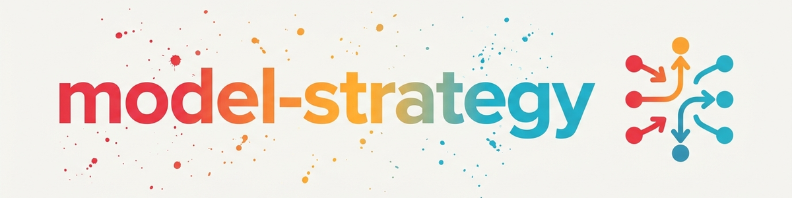

> **Русский** — Официальная русская версия `model-strategy`.


# Стратегия переключения моделей (Model-Switching Strategy) (Русский)

> Мультимодельная оркестрация: выбор модели на основе оценки, делегирование между агентами, связывание с советником, триггеры эскалации и оптимизация стоимости.

---

## 1. Каталог моделей

### Claude (способны запускать субагентов через инструмент Agent)

```
Уровень 4 (Рецензент): Opus 4.8  — советник, математический анализ [только пользователь: /model, /advisor]
Уровень 3 (Стратег):   Opus 4.6  — архитектура, концепции        [субагент: model:"opus"]
Уровень 3 (Творческий):Fable 5   — творческие тексты, истории   [субагент: model:"fable"]
Уровень 2 (Рабочий):   Sonnet 4.6— реализация, отладка          [субагент: model:"sonnet"]
Уровень 1 (Быстрый):   Haiku 4.5 — шаблонный код, форматирование [субагент: model:"haiku"]
```

### Внешние агенты (скрипты-компаньоны / SSH)

```
Уровень 2-3: Gemini 3.5 pro  — исследования, научные базы данных [CLI agy-companion]
Уровень 2:   Gemini 3.5 flash— быстрые исследования              [CLI agy-companion]
Уровень 2-3: Codex 5.5 (GPT) — ревью кода, генерация кода       [CLI codex-companion]
Уровень 2:   Codex 4.5 (GPT) — более простые задачи по коду     [CLI codex-companion]
```

### Локальные модели (без токенов, 24/7)

```
Уровень 1-2: Ollama (Qwen 3.5:35b-a3b) — уровень от Haiku до Sonnet [<ollama-host>:11434]
             Вызов: SSH + curl http://<ollama-host>:11434/v1/chat/completions
             Или: делегирование через API управления агентами (при наличии)
```

### Матрица доступности

| Модель | Запускается LLM | Путь вызова | Ограничения |
|--------|-----------------|-------------|-------------|
| Sonnet 4.6 | Да | `Agent(model:"sonnet")` | — |
| Opus 4.6 | Да | `Agent(model:"opus")` | — |
| Haiku 4.5 | Да | `Agent(model:"haiku")` | — |
| Fable 5 | Да | `Agent(model:"fable")` | — |
| Opus 4.8 | Только как советник | `advisor()` в сессии | пользователь должен задать `/advisor` |
| Gemini 3.5 | Да (Bash) | `companion-for-agy "prompt"` | только Windows, обходной путь через stdout |
| Codex 5.5/4.5 | Да (Bash) | `node codex-companion.mjs task "prompt"` | требуется авторизация |
| Ollama | Да (SSH/curl) | SSH + curl к API хоста Ollama | должен быть активен VPN/Tailscale |
| Opus 4.8 как главная модель | Нет | пользователь: `/model opus 4.8` | только действие пользователя |
| Fable 5 как главная модель | Нет | пользователь: `/model fable` | только действие пользователя |

---

## 2. Расчет оценки (Score)

```
Измерения (0-10):
  CLARITY     : Насколько однозначна задача?
  COMPLEXITY  : Сколько компонентов?
  CREATIVITY  : Нужны ли новые решения?
  CONTEXT     : Сколько требуется предварительных знаний?
  CRITICALITY : Насколько важна идеальность результата?

SCORE = (10 - CLARITY) + COMPLEXITY + CREATIVITY + CONTEXT + CRITICALITY
```

### Пороговые значения оценки

| Оценка (Score) | Модель | Примеры |
|----------------|--------|---------|
| 0-8 | Ollama (локальный хост) | генерация промптов, саммари, простые тексты |
| 9-12 | Haiku | __init__.py, форматирование, шаблонный код |
| 13-22 | Sonnet | реализация, исправление багов, стандартный код |
| 13-22 | Gemini 3.5 | исследования, поиск литературы, научные базы данных |
| 13-22 | Codex 5.5 | генерация кода (Luau, Node.js), вычислительные скрипты |
| 23-28 | Sonnet + ревью советника | сложный код с проверкой качества |
| 23-35 | Fable 5 | творческие тексты, маркетинг, сторителлинг |
| 29-40 | Opus 4.6 | архитектура, стратегия, написание статей |
| 35-50 | Opus 4.6 + советник | доказательства, архитектурные решения, статистика |
| 40-50 | Opus 4.8 (рекомендация пользователю) | математические доказательства, максимальная строгость |

---

## 3. Делегирование между агентами

### Какой внешний агент для чего подходит?

| Задача | Лучший агент | Причина |
|--------|--------------|---------|
| Поиск научной литературы | Gemini 3.5 pro | нативные навыки работы с OpenAlex/arXiv/PubMed |
| Ревью кода (второе мнение) | Codex 5.5 | независимая перспектива |
| Генерация простого текста | Ollama (локальный хост) | без токенов, 24/7 |
| Творческие тексты, маркетинг | Fable 5 | сильнейший креативный результат |
| Математические доказательства | Opus 4.8 (советник) | максимальная аналитическая глубина |

### Исключения (задокументированные слабости)

- **Gemini:** НЕ использовать для математических ревью/доказательств (зафиксирована ошибка направления в ревью доказательства, 07.06.2026)
- **Codex 4.5:** только если 5.5 недоступен; в остальных случаях всегда 5.5

### Пути вызова

> Замените плейсхолдеры `<host>`, `<ollama-host>`, `<tailscale-ip>`, `<user>` и `~/.ssh/<key>` вашей собственной инфраструктурой.

**Gemini (через companion-for-agy):**
```
companion-for-agy --researcher --json --timeout 120000 "research prompt"
```

**Codex (через codex-companion):**
```
node "~/.claude/plugins/cache/openai-codex/codex/1.0.4/scripts/codex-companion.mjs" task --effort high "code prompt"
```

**Ollama на удаленном хосте (через SSH):**
```
ssh -i ~/.ssh/<key> <user>@<tailscale-ip> "curl -s http://localhost:11434/v1/chat/completions -d '{\"model\":\"qwen3.5:35b-a3b\",\"messages\":[{\"role\":\"user\",\"content\":\"Prompt\"}]}'"
```

**Делегирование в систему агентов с инструментами (пример):**
```
curl -s -X POST http://<host>:8081/api/chat -H "Content-Type: application/json" -d '{"prompt": "...", "chat_id": "claude-delegate"}'
```

---

## 4. Связывание с советником (Advisor pairing)

### Механика

`advisor()` — это **инструмент уровня сессии**: модель-советник задается пользователем через `/advisor`, а не программно. Это дает следующие паттерны связывания:

| Паттерн | Как работает | Когда использовать |
|---------|--------------|-------------------|
| **Советник сессии** | пользователь задает `/advisor opus 4.8`, агент вызывает `advisor()` | стандарт для доказательств/архитектуры |
| **Оркестратор как рецензент** | главная модель Opus рецензирует вывод субагента Sonnet | оркестратор сильнее исполнителя |
| **Оппонирующий агент** | агент A работает, агент B проверяет в качестве оппонента | независимая проверка, 2 перспективы |
| **Рекомендация пользователю** | агент рекомендует: "выполните эту задачу с opus 4.8 + advisor" | когда текущая сессия слишком слаба |

### Когда рекомендовать советника?

- Работа с математическими доказательствами (оценка ≥ 35)
- Архитектурные решения с долгосрочными последствиями
- Статистическая методология / дизайн исследований
- Сложные баги после 2+ неудачных циклов отладки

### Когда НЕ использовать советника?

- Рутинный код, сбор контента, форматирование (оценка < 23)
- Простая реализация функций
- Четко определенные, некритичные задачи

---

## 5. Триггеры эскалации

### Ollama -> Haiku
- Требуется доступ к файлам
- Необходим анализ кода

### Haiku -> Sonnet
- Затронуто более 2 файлов
- Требуется выбор между альтернативами
- Произошла неожиданная ошибка
- Запрошена операция удаления

### Sonnet -> Opus
- Требуется архитектурное решение
- Должно быть интегрировано 3+ системы
- Требования противоречивы/неясны
- Требуется стратегическое планирование

### Sonnet -> Gemini (боковая)
- Необходимы научные исследования
- Проверка библиографии

### Sonnet -> Codex (боковая)
- Ревью кода как второе мнение
- Советник перегружен (резервный рецензент)

### Opus -> Opus + советник
- Требуется ревью доказательства
- Критическое архитектурное решение
- Статистическая методология

### Деэскалация
- Концепция определена -> Sonnet берет на себя реализацию
- Задача тривиальна/тривиально-повторяема -> Haiku берет на себя выполнение
- Только текст, без доступа к инструментам -> Ollama берет на себя выполнение

---

## 6. Матрица прав

| Операция | Ollama | Haiku | Sonnet | Opus | Gemini | Codex |
|----------|--------|-------|--------|------|--------|-------|
| Чтение файлов | - | Да | Да | Да | Да* | Да* |
| Запись файлов | - | Да | Да | Да | Да* | Да* |
| Удаление файлов | - | - | Да** | Да | - | - |
| Системные команды | - | - | Да** | Да | Да* | Да* |
| Архитектурные решения | - | - | - | Да | - | - |
| Веб-исследования | - | - | Да | Да | Да | - |
| Вызов advisor() | - | - | Да | Да | - | - |

*через скрипт-компаньон в собственном песочном режиме (sandbox)
**с подтверждением пользователя

---

## 7. Оптимизация стоимости

### Экономия токенов за счет маршрутизации

| Тип задачи | Без маршрутизации | С маршрутизацией | Экономия |
|------------|-------------------|------------------|----------|
| Тривиальная | Токены Opus | Ollama (бесплатно) | 100% |
| Шаблонный код | Токены Opus | Токены Haiku | ~80% |
| Стандартный код | Токены Opus | Токены Sonnet | ~50% |
| Исследования | Токены Claude | Токены Gemini | ~70% (другой бюджет) |
| Ревью кода | Токены advisor() | Токены Codex | ~60% (другой бюджет) |

---

## 8. Золотое правило

> "Opus думает, Sonnet строит, Haiku исполняет, Ollama экономит. Gemini исследует, Codex рецензирует, Fable рассказывает."

---

## Журнал изменений

### 2.0.0 (2026-06-12)
- Делегирование между агентами: добавлены Gemini, Codex, Ollama (локальный хост) как цели маршрутизации
- Связывание с советником: 4 паттерна (советник сессии, оркестратор как рецензент, оппонирующий агент, рекомендация пользователю)
- Матрица доступности: четко задокументированы варианты запуска LLM и варианты только для пользователя
- Добавлен Ollama (Qwen 3.5:35b-a3b, уровень от Haiku до Sonnet) как Уровень 1-2
- Боковая эскалация: Sonnet -> Gemini (исследования), Sonnet -> Codex (ревью)
- Задокументированы исключения (Gemini не подходит для математики)
- Пороговые значения оценок расширены на все модели

### 1.0.0 (2026-03-15)
- Перенесено из BACH v3.8.0 (ing-strategie v2.0.0)

---

*Перенесено из BACH v3.8.0 | Расширено с помощью cross-agent + advisor v2.0.0*