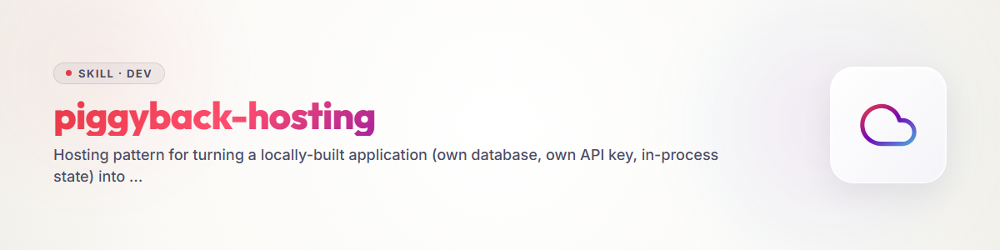

# piggyback-hosting

**A hosting pattern for applications that never accept other people's data in
the first place.**

> Blueprint born on 2026-08-02 while building three call agents. Reusable for
> any application that was designed for a single local user but should also
> be hostable for others.

## On the name

In English this pattern is called **piggyback** — riding on infrastructure
you don't own is already the term of art for it. English prose in this skill
therefore says *piggyback*; **"huckepack" is the German working title** the
pattern was built under, and it is also the name of the repository this skill
was migrated from. **The literal mode values stay `huckepack-gift` and
`huckepack-only-host`** — they are what ships in code and configuration, spelled
exactly that way, regardless of the language the surrounding prose is in.

## The problem

An application gets built locally: a database, an API key, state living in
the process. On your own machine that is simply correct. The moment someone
hosts it for others, each of those three assumptions turns into a bug — every
visitor shares the same state, the same database, the same key. Whoever opens
the page sees everyone else's data.

The usual fix is user management: accounts, login, access checks, deletion
deadlines, a privacy notice, a data-processing agreement. Often a bigger
undertaking than the application itself.

## The idea

**The visitor keeps everything on their own device. The host keeps nothing.**

This doesn't solve user management — it makes it **moot**. Where no one
else's data sits on the server, there is nothing to wall off between
visitors, nothing to delete on a schedule, and the privacy notice shrinks to
what the service actually does.

## The three modes

| Mode | API key | Data | User management |
|---|---|---|---|
| **`huckepack-gift`** | from the host | on the visitor's device | none |
| **`huckepack-only-host`** | from the visitor | on the visitor's device | none |
| **`pay-membership`** | host's, billed | server | required |

- **`huckepack-gift`** — the host supplies their own key and gives the
  execution away for free. An invitation to try the tool with no friction.
- **`huckepack-only-host`** — the visitor brings their own key. The host pays
  nothing and stores nothing.
- **`pay-membership`** — deliberately kept as a stub. This is where everything
  the other two avoid — accounts, billing, server-side storage — becomes
  necessary again. It's a separate undertaking, not a flag to flip.

There is always a **`local`** default: whoever configures nothing gets the
application exactly as it ran before, on their own machine.

## The building blocks

| Block | Purpose |
|---|---|
| Mode as an install-time setting | a property of the deployment, not of the session |
| Swappable storage layer | same database, different location |
| SQLite in the browser (WASM + OPFS) | same schema, same queries, different execution site |
| Key field, masked | only in `only-host` mode, never logged |
| Export and import | **not optional** — browser data is volatile |
| Receipt as a downloadable file, target folder selectable | no server involved in delivering it |

The real engineering effort sits in making the storage layer swappable: the
application writes to SQLite either way, but a layer in between decides
whether that write lands on the server or in the visitor's browser
(`sql.js` / the official SQLite-WASM build, persisted via the Origin Private
File System). Rank the browser-storage options by weight if WASM is too
heavy: SQLite-WASM + OPFS (a real database, most capacity) > IndexedDB
(structured, its own query model) > `localStorage` (fine only for small
things like language and theme).

## What this pattern does not solve — said plainly

- **Browser data deleted means everything is gone.** There is no server-side
  copy. This is why export is a condition, not a nice-to-have feature.
- **No device switch** without an export and an import.
- **The key living in the browser** (`only-host`) is less protected than one
  on a server. It does belong to the visitor, though, and the alternative
  would be handing it to the host — not obviously the safer choice.
- **Execution still runs through the host.** For services that reach a third
  party — a phone call, for instance — the host processes that third party's
  data regardless of where the visitor's own records live. A privacy notice
  does not become unnecessary, only short.

## What the legal check found

A first-look legal review (`references/RECHT.md`, in German — it examines
German and EU statutes, so quoting them in translation would be less
accurate, not more accessible) checked the pattern against GDPR, TDDDG and
UWG. **Ersteinschätzung mit Fundstellen, keine Rechtsberatung** — a first
assessment with citations, not legal advice. Three findings in one line each:

- **The host stays the data controller even while storing nothing.**
  GDPR Art. 4(7) attaches controllership to deciding purposes and means, not
  to storage; the CJEU has said so explicitly (C-683/21). What becomes moot
  is **user management**, not responsibility.
- **Nothing shrinks for the person who gets contacted.** Information duties
  under Art. 14, a documented legal-basis balancing test, a data-processing
  agreement with whatever service performs the contact — these are usually
  the longest sections of a privacy notice, and the pattern doesn't touch
  them.
- **The household exemption helps the visitor, not the host.** It covers
  purely personal use by a natural person; a service offered to others is not
  a purely personal activity. That is exactly where piggyback hosting begins.

The gain is in the **volume of obligations and the size of the exposure**,
not in their kind — which is also the more honest claim to make about the
pattern.

## How to apply this pattern

1. Read `references/DATA-FLOW-TEMPLATE.md` and fill it in for the actual
   application, evidence-first (every row needs a `file:line`, or "not
   found"). This surfaces exactly which local assumptions break under
   multi-visitor hosting before any code changes.
2. Decide which modes the application actually needs — `local` is always the
   default; `huckepack-gift` and `huckepack-only-host` are the two that avoid
   user management; `pay-membership` stays a stub unless there is a concrete
   reason to build real accounts.
3. Make the storage layer swappable (the core engineering step above), add
   the masked key field for `only-host`, and wire up export/import before
   anything ships — it is the safety net for volatile browser storage.
4. Fill in `references/PRIVACY-TEMPLATE.md` for the concrete deployment;
   delete the blocks that don't apply, verify every provider fact from
   current contracts, and get a case-specific legal review before real data
   is processed. The template is a starting point, not a finished notice.
5. For any installation touching real third parties (phone calls, messages
   to people who did not sign up themselves) or research participants, treat
   `references/RECHT.md`'s recommendations as a checklist, not as clearance —
   involve a lawyer before the first public run.

## References

- `references/DATA-FLOW-TEMPLATE.md` — template and method for a data-flow
  plan: every row needs a file:line, or it's a belief, not a finding.
- `references/PRIVACY-TEMPLATE.md` — sample privacy notice with marked
  placeholders for a piggyback installation.
- `references/RECHT.md` — first-look legal assessment (German) with GDPR,
  TDDDG and UWG citations.

Both templates are **samples, not legal advice**. Whoever hosts an
application adapts them and is responsible for the result.

## Origin

Emerged while building HungryCall, Ringedingeding and ResearchCall — three
call agents where a data-flow audit showed that hosting them unmodified would
have been a privacy incident with a name attached to it. Migrated from the
standalone `huckepack` repository into this skill library.
