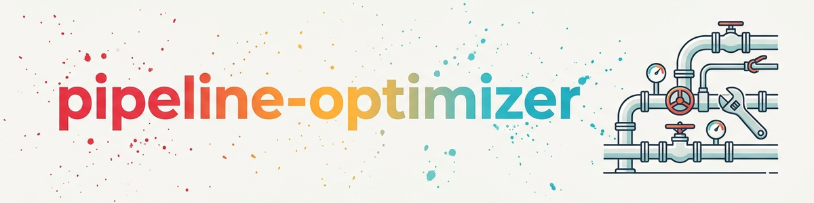

> **Español** — Versión oficial en español de `pipeline-optimizer`.

# Pipeline Optimizer / Project-Folder Optimizer (Español)

**Renovación en 6 pasos sin incompatibilidades** — aplicable a dos escalas:

| Nombre del activador | Alcance | Ejemplo |
|---|---|---|
| **Pipeline optimizer** | Pipelines completos, stacks, estructuras de documentación | Tus pipelines temáticos, ej. `software/`, `research/`, `games/`, un sistema de agentes |
| **Project-folder optimizer** | Carpetas de proyectos individuales dentro de un pipeline | Una herramienta de software, un proyecto de artículo científico, un proyecto de juego |

Un **pipeline** aquí significa una estructura de nivel superior orientada a un tema en la que viven múltiples proyectos bajo convenciones compartidas (ej. un pipeline de software con reglas de lanzamiento, un pipeline de investigación con un procedimiento de publicación).

Ambos utilizan el mismo flujo de trabajo de 6 pasos; la única diferencia es el **alcance** (a nivel de pipeline vs. proyecto único) y, en consecuencia, la profundidad de la inspección de la estructura existente en el paso A.

## Cuándo se aplica esta habilidad

La habilidad se aplica tan pronto como se te pida mejorar, reconstruir o extender una estructura **existente**, no para construcciones desde cero. Activadores concretos:

**Nivel de pipeline** (alcance: pipeline completo):
- "Mejorar el pipeline X"
- "Optimizar el stack"
- "Renovar el pipeline de software"
- "Consolidación de documentación en el pipeline de investigación"
- Intervención sustancial en un pipeline temático, `_tools/` central o componentes del sistema

**Nivel de carpeta de proyecto** (alcance: carpeta de proyecto único):
- "Limpiar / optimizar la carpeta del proyecto X"
- "Mejorar la estructura de carpetas en Y"
- "Refactorizar una sola herramienta"
- "Unificar la configuración de un proyecto de artículo científico"
- "Alinear una carpeta de proyecto de juego con el estándar del pipeline"

**Transversal:**
- "Reconstruir X / integrarlo en el Y existente"
- "Refactorización", "consolidación"
- "Unificar convenciones"
- "Integrar en un sistema existente"

## La metáfora de la estructura existente (edificio)

Renovar una casa requiere primero saber **de qué está hecha** (piedra, madera, plástico), **para qué sirve** (refugio de montaña, forja de software) y **dónde cumple ya sus funciones**. La misma disciplina se aplica a los pipelines.

---

## Procedimiento — 6 pasos (NO omitir, NO reordenar)

### Paso A — Inspeccionar la estructura existente

**Pregunta:** ¿De qué está hecha la casa?

**Alcance de pipeline** (todos los documentos raíz + herramientas + plantillas):
- [ ] **Leer todos los documentos raíz por completo** (no solo fragmentos o puntos de inserción)
- [ ] Revisar las carpetas de plantillas (`_templates/`, `_TEMPLATES/`) y de herramientas (`_tools/`)
- [ ] Archivos de políticas: ej. GITHUB-POLICY.md, RELEASE-MANAGEMENT.md, QUALITY_RULES.md, NAMING-SYSTEM.md, procedimientos de publicación, …
- [ ] Capturas de estado: ej. PROJECT_STATUS.md, resúmenes de estado, releases.json, archivos de registro
- [ ] Listas de verificación: ej. listas de verificación de lanzamientos, listas de verificación de compilación/PDF
- [ ] Flujos de trabajo: AGENTS.md, GUIDE.md, SKILL.md
- [ ] Archivos de lecciones aprendidas: LESSONS_LEARNED.md, MEMORY.md, archivos de estado de bucle

**Alcance de carpeta de proyecto** (sustancia del proyecto único + convenciones relevantes del pipeline):
- [ ] **Leer todos los archivos markdown y de control en la carpeta del proyecto** (README, CHANGELOG, TASKS/TODO, DONE, CONCEPT, plan de acción, notas de prueba, …)
- [ ] **Inspeccionar la estructura del código:** src/, tests/, configuración de compilación (pyproject.toml, requirements.txt, manifiestos de proyecto, archivos de cadena de herramientas, …)
- [ ] **Tener en cuenta las convenciones del pipeline secundario/padre** (ej. para un proyecto de software: política de GitHub, sistema de nombres, gestión de lanzamientos, plantillas)
- [ ] **Escanear herramientas/scripts existentes en el proyecto** (`_tools/`, `_scripts/`, build_*.bat, scripts START)
- [ ] **Archivos de configuración:** `.gitignore`, LICENSE, NOTICE, SECURITY.md, CODE_OF_CONDUCT.md

**Anti-patrón:** Usar `grep -l "<palabra_clave>"` para encontrar puntos de inserción e insertar allí sin conocer el contexto del archivo.

**Resultado:** Nota de inventario con todas las convenciones, herramientas y plantillas relevantes en el alcance elegido.

### Paso B — Identificar el propósito

**Pregunta:** ¿Para qué existe la casa?

Establece el propósito explitamente en 1-2 oraciones.

**Ejemplos de pipeline:**

| Pipeline | Propósito |
|---|---|
| Pipeline de software | Desarrollar, probar y lanzar aplicaciones de escritorio + herramientas web en tiendas/GitHub |
| Pipeline de investigación | Escribir artículos científicos, revisarlos entre pares, publicarlos en repositorios/servidores de preimpresión |
| Pipeline de juegos | Desarrollar juegos y publicarlos en la plataforma de destino |
| Sistema de agentes | Sistema LLM para orquestación multi-agente |

**Ejemplos de carpeta de proyecto:**

| Carpeta de proyecto | Propósito |
|---|---|
| `software/PlannerApp` | Aplicación de escritorio de planificación, comercial, repo privado |
| `research/CosmologyModel` | Serie de artículos de modelos + cálculos numéricos |
| `games/SortingChaos` | Juego de clasificación, etapa alfa, progresión de niveles |

El propósito **dirige cada intervención** — las medidas que no sirven al propósito se descartan.

### Paso C — Bocetar la imagen ideal

**Pregunta:** ¿Cómo sería una casa perfecta para este propósito?

- Esboízala desde tu propia perspectiva (breve, máx. 10 puntos)
- Compara con las mejores prácticas (ej. stack de Vercel para SaaS, stack de scientific-python para investigación)
- No desciendas a la optimización de detalles — un boceto de nivel superior es suficiente

**Resultado:** 5-10 puntos de "estado ideal por pipeline"

### Paso D — Análisis de brechas + plan

**Cuatro preguntas por pipeline:**

1. **¿Qué tiene ya la casa?** — Incluso si se resuelve de manera diferente al ideal pero es **funcionalmente equivalente**.
   *Ejemplo:* El ideal dice "pip-licenses para licencias de terceros". Realidad: un script generador personalizado lo envuelve → funcionalmente equivalente, no se requiere intervención.

2. **¿Qué impide la función?** — Estructuras existentes que causan rupturas o esfuerzo extra hoy.

3. **¿Qué es no funcional?** — Código muerto, convenciones desactualizadas, herramientas sin uso.

4. **¿Qué mejoraría mediblemente las funciones?** — Intervenciones concretas con beneficio esperado.

→ A partir de esto, un **plan concreto**:
- ¿Qué se construye **de nuevo**?
- ¿Qué se **extiende**?
- ¿Qué se **demuele**?
- ¿Qué se mantiene **sin cambios** (¡importante nombrarlo!)

**Resultado:** Tabla de plan con columnas *Intervención* / *Existente* / *Medida* / *Justificación*

### Paso E — Trabajar empíricamente

No solo planifiques de arriba hacia abajo — recopila puntos de dolor:

- [ ] **Bugs conocidos**: rastreador de problemas, archivos TASKS/TODO/DONE
- [ ] **Historial de errores**: archivos de lecciones aprendidas, registros de corrección de errores, registros de verificación
- [ ] **Rupturas de automatización**: "¿Qué tengo que hacer siempre manualmente?"
- [ ] **Entrevista de usuario**: pregunta específicamente — puntos de dolor, deseos, soluciones temporales
- [ ] **Auto-prueba**: recorre el pipeline (crear un nuevo proyecto, ejecutar una compilación, simular un lanzamiento) — ¿dónde se rompe?

Los puntos de dolor encontrados empíricamente **priorizan el plan** del paso D.

### Paso F — Reevaluación tras la implementación

- [ ] Encarga a **nuevos subagentes** (sin la carga del contexto de renovación) que recorran el flujo de trabajo modificado
- [ ] **Valores medibles antes/después**: tiempo de configuración, tasa de errores, número de pasos manuales, tiempo de compilación
- [ ] **Comprobación anti-regresión**: ¿siguen funcionando los flujos de trabajo existentes tras el cambio?
- [ ] Si **no hay mejora medible** o hay una regresión: **revertir** la renovación o reajustar

## Anti-patrones (prohibidos)

| Anti-patrón | Daño | Antídoto |
|---|---|---|
| Buscar puntos de inserción en lugar de leer documentos | Estándares paralelos | Paso A completo |
| Transferir "mejores prácticas de X" 1:1 | Incompatibilidad | Paso D compara funcionalmente |
| Crear un nuevo archivo sin verificar convenciones | Duplicación (ej. NOTICE.md ↔ THIRD_PARTY_LICENSES.txt) | Paso A + paso D |
| Planificar de arriba a abajo sin empirismo | La solución no resuelve el punto de dolor | Paso E antes de finalizar el plan |
| No probar tu propio cambio | Regresión no detectada | Paso F con un agente nuevo |
| "Aclarar más tarde" con estado no claro | El usuario descubre el conflicto después | En caso de duda, repasar el paso D con el usuario nuevamente |

## Estudio de caso — el incidente NOTICE.md

**Asignación:** Implementar mejoras en varios pipelines temáticos (software, investigación, juegos).

**Error:** Paso A omitido — solo se buscaron puntos de inserción en lugar de leer los archivos de políticas completos.

**Consecuencia:** Se introdujo `NOTICE.md` como un "nuevo archivo de licencia" en 7 archivos, aunque `THIRD_PARTY_LICENSES.txt` + un generador de licencias personalizado (envoltorio alrededor de `pip-licenses`) ya estaban establecidos — documentado en la política de GitHub del pipeline (archivos obligatorios + lista de verificación de licencias). Todos los proyectos de software ya tenían archivos THIRD_PARTY.

**Detección:** Solo después de que el usuario preguntó ("Estoy bastante seguro de que ya teníamos gestión de derechos").

**Corrección:** Se eliminó NOTICE.md de la plantilla del proyecto, se ajustaron otros 6 archivos, se hizo referencia al generador de licencias existente en lugar de `pip-licenses`.

**Lección:** Si el paso A se hubiera ejecutado por completo, el conflicto se habría detectado antes de escribir.

## Reglas empíricas

1. **Para "mejorar el pipeline", lee tanto tiempo como escribas.**
2. **Ningún estándar nuevo sin prueba de que no existe uno previo.**
3. **Usa herramientas/envoltorios existentes en lugar de nuevos paralelos.**
4. **"Más de lo mismo" suele ser peor que "extender lo que existe".**
5. **Revertir en caso de conflicto** siempre es mejor que mantener dos estándares paralelos.

## Lista de verificación de finalización

Antes de informar que una renovación de pipeline está "hecha":

- [ ] Paso A: ¿se leyeron todos los documentos raíz relevantes?
- [ ] Paso B: ¿se estableció el propósito del pipeline en 1-2 oraciones?
- [ ] Paso C: ¿se esbozó la imagen ideal (5-10 puntos)?
- [ ] Paso D: ¿análisis de brechas con tabla (qué se queda / qué se extiende / qué es nuevo / qué se va)?
- [ ] Paso E: ¿empirismo verificado (bugs, lecciones, auto-prueba, entrevista de usuario)?
- [ ] ¿Plan acordado con el usuario?
- [ ] Paso F: ¿probado con un nuevo subagente — mejora medible?
- [ ] ¿No se introdujeron estándares paralelos?
- [ ] En caso de conflictos: ¿se revirtió o se justificó honestamente?

## Estructura óptima de carpeta de proyecto (para el optimizador de carpetas de proyectos)

Cuando la habilidad se aplica a **una sola carpeta de proyecto**, la siguiente recomendación combinada sirve como referencia ideal (paso C):

### Estándar Anthropic (Claude Code)

| Archivo/carpeta | Función |
|---|---|
| `CLAUDE.md` (raíz) | Cargado automáticamente por Claude Code, instrucciones específicas del proyecto |
| `.claude/settings.json` | Permisos, variables de entorno, selección de modelo (confirmado en git) |
| `.claude/settings.local.json` | Anulaciones locales (NO confirmar en git, agregar a `.gitignore`) |
| `.claude/commands/*.md` | Comandos de barra personalizados |
| `.claude/agents/*.md` | Subagentes personalizados |
| `.claude/skills/<nombre>/SKILL.md` | Habilidades del proyecto |

### Tu propia plantilla de documentación de proyecto (recomendada)

Si mantienes tu propia plantilla de documentación de proyecto (ej. bajo `<tu-espacio-de-trabajo>/_templates/project-docs/`), **tres perfiles de desarrollo** dan resultado. Ejemplo de división: **MINIMAL** proporciona el conjunto central con 7 archivos raíz (`AGENTS.md`, `CLAUDE.md`, `README.md`, `START.md`, `STATE.md`, `TODO.md`, `DONE.md`) más `_tools/`. **STANDARD** agrega `CHANGELOG.md`, `DECISIONS.md` y `PATTERNS.md`. **FULL** se amplía a 14 archivos raíz y agrega además `ARCHITECTURE.md`, `WORKFLOWS.md`, `TOOLS.md`, `GLOSSARY.md`, así como `workflows/` y `.github/`.

→ **Usa dicha plantilla como base para nuevos proyectos** (copiar en lugar de crear manualmente).

### Adiciones específicas del pipeline (ejemplos)

Según el pipeline, se añaden más archivos obligatorios — patrones típicos:

- **Proyecto de software:** LICENSE, CODE_OF_CONDUCT.md, SECURITY.md, CONTRIBUTING.md, THIRD_PARTY_LICENSES.txt (generado), pyproject.toml/requirements.txt, entrada en el registro de lanzamientos central del pipeline. → Si está disponible: usa la plantilla cookiecutter del pipeline.
- **Proyecto de investigación:** documento de concepto, plan de acción, plan de publicación, carpetas de archivo/fuente/resultado/datos (`_archive/`, `_sources/`, `_results/`, `_data/`), `paper/` para LaTeX. Para proyectos de demostración/prueba: archivo de notas de prueba con la cadena de prueba y el estado.
- **Proyecto de juegos:** manifiesto de proyecto y archivos de cadena de herramientas del motor (ej. para Roblox/Rojo: default.project.json, rokit.toml, wally.toml, selene.toml), documento de diseño de juego, `src/{server,client,shared}/` según la convención del motor.

### Referencia de detalle completa

→ Consulta **`references/optimal-project-structure.md`** en esta carpeta de habilidad (alemán). Contiene:
- Ejemplo de `settings.json` (esquema Anthropic)
- Entradas obligatorias en `.gitignore`
- Anti-patrones (lo que NO pertenece a carpetas de proyectos)
- Flujos de trabajo recomendados por tipo de pipeline (software/investigación/juegos)
- Convención de encabezado YAML para archivos de documentación
- Boceto de auto-comprobación

## Habilidades relacionadas (¿cuándo usar en lugar de esta?)

| Habilidad | Cuándo usar |
|---|---|
| **`project-onboarding`** | Incorporar un repositorio EXTERNO existente a tu propio sistema |
| Project bootstrapper (si está disponible) | Crear un NUEVO proyecto en un pipeline existente (construcción nueva, sin reconstrucción) |
| Pipeline bootstrapper (si está disponible) | Crear un pipeline COMPLETAMENTE NUEVO (caso raro) |
| System onboarding (si está disponible) | Configurar una nueva máquina |

El **pipeline optimizer** es responsable de la **renovación**, no de la nueva construcción ni de la adopción. Si tu colección de habilidades tiene un índice, búscalo para encontrar habilidades de inicio coincidentes.

## Referencias cruzadas

- Referencia detallada: `references/optimal-project-structure.md` (en esta carpeta de habilidad)
- Documentación de Anthropic Claude Code: `https://docs.claude.com/en/docs/claude-code`
- Si está disponible: reglas globales del usuario (ej. una sección de "renovaciones" en tu `~/CLAUDE.md`) y descripciones de stack específicas del pipeline

## Elección de alcance: pipeline vs. carpeta de proyecto

Si no está claro qué alcance se requiere, **aclara antes del paso A**:

| Pista | Alcance |
|---|---|
| "Mejorar todo el pipeline de software" | Pipeline |
| "Limpiar la carpeta de la herramienta X" | Carpeta de proyecto |
| "Sincronizar el registro central de lanzamientos" | Pipeline (recurso central) |
| "Refactorizar el AssetBuilder en el juego Y" | Carpeta de proyecto |
| "Introducir una convención de comprobación en todo el pipeline" | Pipeline |
| "Crear un archivo de comprobación en el proyecto Z" | Carpeta de proyecto |

En el **alcance de carpeta de proyecto**, comprueba además brevemente las convenciones del pipeline primario (paso A extendido) para que la intervención siga siendo compatible con el pipeline.

---

## Historial de cambios

### 1.2.0 (2026-06-13)
- Primera publicación en la biblioteca de habilidades: rutas personales, nombres concretos de pipelines/proyectos y referencias a habilidades privadas reemplazados con ejemplos genéricos; el procedimiento en sí (6 pasos, anti-patrones, estudio de caso, listas de verificación) sin cambios

### 1.1.1 (2026-06-01) y anteriores
- Versiones internas (directorio de habilidades privadas, antes de la publicación)