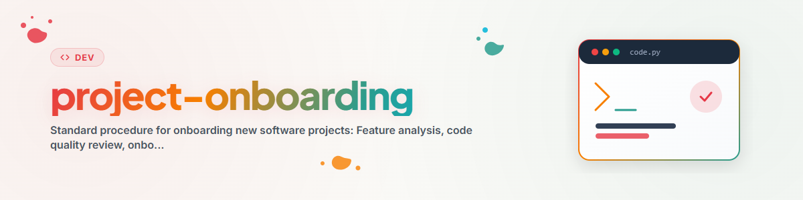

> **Español** — Versión oficial en español de `project-onboarding`.


# Procedimiento Estándar de Incorporación (Onboarding) para Nuevos Proyectos de Software (Español)

**Versión:** 1.0
**Fecha:** 2026-03-12

---

## Visión General y Propósito

Este procedimiento define los pasos a realizar sobre carpetas de software recién descubiertas antes de agregarlas a un sistema de gestión de tareas.

```
+─────────────────────────────────────────────────────+
|       PROCEDIMIENTO ESTÁNDAR DE INCORPORACIÓN       |
+─────────────────────────────────────────────────────+
|  1. Crear análisis de características              |
|  2. Revisión de calidad de código (pruebas std)     |
|  3. Crear TASKS.txt                                 |
|  4. Agregar a la gestión de tareas                  |
+─────────────────────────────────────────────────────+
```

---

## Fase 1: Análisis de Características

**Propósito:** Comprender la herramienta, sus funciones y el estado de desarrollo.

**Crear archivo:** `Feature_Analysis_<ToolName>.md`

### Plantilla

```markdown
# Análisis de Características: <ToolName> (Español)

## Descripción Breve
Una oración corta que describe lo que hace la herramienta.

---

## Aspectos Destacados

| Característica | Descripción |
|---------|-------------|
| **Característica 1** | Descripción |
| **Característica 2** | Descripción |

---

## Evaluación de la Etapa de Desarrollo

### Estado Actual: **<Estado> (<X>%)**

Posibles estados:
- Prototipo (0-30%)
- Alfa (30-60%)
- Beta (60-85%)
- Listo para Producción (85-95%)
- Lanzamiento / Release (95-100%)

| Categoría | Calificación (1-5) | Detalles |
|----------|:------------:|---------|
| **Funcionalidad** | 3 | |
| **UI/UX** | 3 | |
| **Estabilidad** | 3 | |
| **Documentación** | 3 | |

---

## Extensiones Recomendadas

### Prioridad: Alta
1. ...

### Prioridad: Media
2. ...

### Prioridad: Baja
3. ...

---

## Detalles Técnicos

Framework:            <Framework>
Tamaño de archivos:   <X> líneas de Python
Archivo principal:    <main.py>

---
*Análisis creado: <Fecha>*
```

---

## Fase 2: Revisión de Calidad de Código

**Propósito:** Garantizar la calidad técnica e identificar problemas conocidos.

### Comprobaciones Recomendadas

| Prueba | Herramienta | Descripción |
|------|------|-------------|
| **Codificación** | Verificador de codificación (ej., `chardet`, `file`) | Asegurar UTF-8 |
| **Análisis de Métodos** | Linter (ej., `pylint`, `flake8`) | Encontrar métodos demasiado grandes |
| **Sangría** | Formateador (ej., `black`, `autopep8`) | Verificar consistencia |
| **Importaciones** | Verificador de importaciones (ej., `isort`, `pylint`) | Encontrar importaciones sin usar |

### Puntos de Comprobación

- [ ] ¿Todos los archivos .py están codificados en UTF-8?
- [ ] ¿Sin métodos inusualmente grandes (>100 líneas)?
- [ ] ¿Sangría consistente (espacios vs tabulaciones)?
- [ ] ¿Se eliminaron las importaciones sin usar?
- [ ] ¿Docstrings presentes?

### Documentar Resultados

Registrar los problemas en TASKS.txt bajo "QUALITY REVIEW".

---

## Fase 3: Crear TASKS.txt

**Propósito:** Capturar tareas pendientes en un formato estructurado.

**Crear archivo:** `TASKS.txt` en la carpeta del proyecto

### Plantilla

```
TASKS - <ToolName> V<Version>
==============================
Estado: <Estado>
Fecha: <Fecha>

TAREAS PENDIENTES:
[ ] <Tarea 1> - Esfuerzo: <BAJO|MEDIO|ALTO>
[ ] <Tarea 2> - Esfuerzo: <BAJO|MEDIO|ALTO>

---
COMPLETADO (Archivo):
- <Tarea completada> (<Versión>, <Fecha>)
```

### Valores de Estado

| Estado | Significado |
|--------|---------|
| NEWLY DISCOVERED | Aún no analizado |
| ANALYSIS NEEDED | Análisis de características en progreso |
| QUALITY REVIEW | Pruebas de código en ejecución |
| VALIDATED & READY | Listo para nuevas características |
| MVP | Producto Mínimo Viable |
| BUILD ONLY | Solo se requiere compilación |
| BLOCKED | Esperando prueba de usuario/decisión |

---

## Fase 4: Integración en la Gestión de Tareas

Después de completar las fases 1-3:

1. **Transferir tareas:** Crear entradas de TASKS.txt como tareas/tickets
2. **Verificar:** ¿Todas las tareas clasificadas correctamente?
3. **Categorizar:** Asignar el proyecto a la categoría adecuada (herramienta individual, suite, biblioteca, etc.)

### Tareas Automáticas de Incorporación

Para proyectos nuevos, crear las siguientes tareas estándar:

| Tarea | Descripción | Esfuerzo |
|------|-------------|--------|
| onb_1 | Crear análisis de características | medio |
| onb_2 | Revisión de calidad de código | bajo |
| onb_3 | Crear TASKS.txt | bajo |

Las tareas tienen dependencias: onb_2 depende de onb_1, onb_3 depende de onb_2.

---

## Lista de Verificación Rápida

```
[ ] 1. Feature_Analysis_<Name>.md creado
[ ] 2. Revisión de calidad de código completada (linter, codificación, importaciones)
[ ] 3. TASKS.txt creado con estado
[ ] 4. Tareas agregadas a la gestión de tareas
```

---

## Ejemplo y Aplicación

```bash
# 1. Análisis de características
# -> Crear Feature_Analysis_MyTool.md (ver plantilla)

# 2. Calidad de código
pylint MyTool/main.py
flake8 MyTool/main.py
file -i MyTool/main.py  # Comprobar codificación

# 3. TASKS.txt
# -> Crear en la carpeta de la herramienta con estado "QUALITY REVIEW"

# 4. Crear tareas
# -> Registrar entradas de TASKS.txt como tickets/issues
```

---

*Creado: 2026-01-10 | Portado: 2026-03-12*