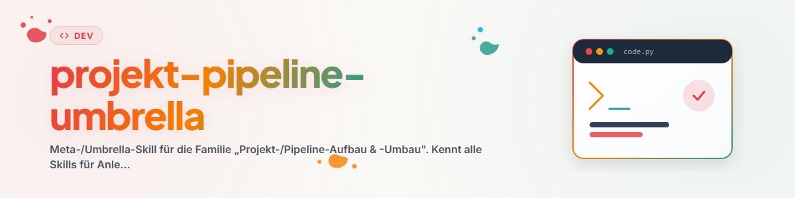

# プロジェクト/パイプライン構築・再構築 — Umbrella

## 目的

「プロジェクト/パイプライン構築・再構築」ファミリーのエントリポイントです。メンバーは **グリーンフィールド vs. 既存** および **プロジェクトレベル vs. パイプラインレベル** という2つの軸に沿って分類されます。この Umbrella は、「bootstrap」 vs. 「optimize」 vs. 「onboard」 のよくある混乱を防ぎます。

## メンバーとルーティング (Routing)

| スキル | 用途 | 他のスキルではなくこれを使用するタイミング |
|-------|-------|-------------------------------|
| `/project-bootstrapper` | 既存のパイプライン**内**に新規プロジェクトを作成 | グリーンフィールド、プロジェクトレベル |
| `/pipeline-bootstrapper` | 完全に新しいトップレベルパイプラインを作成 | グリーンフィールド、パイプラインレベル（稀） |
| `/project-onboarding` | 既存のプロジェクトを取り込み/記録 | 既存、プロジェクトレベル |
| `/pipeline-optimizer` | 既存のパイプライン/構造を刷新（6ステップ手順） | 既存、再構築 |
| `/docs-analysis` | 要件/コンセプトドキュメントを現在のコードと照合チェック | 既存、分析（再構築なし） |
| `/dev-cycle` | 実際の構築のための8フェーズ開発フレームワーク | 横断的: 開発の具体的な進め方 (HOW) |

> ルーティングルール: **新規 + プロジェクト** → `/project-bootstrapper` · **新規 + パイプライン** → `/pipeline-bootstrapper` · **既存を取り込む** → `/project-onboarding` · **既存を再構築** → `/pipeline-optimizer` · **チェックのみ** → `/docs-analysis` · **構築する** → `/dev-cycle`。

## 連携のよい組み合わせ

- `/project-onboarding`（最初に: 既存を記録）→ `/pipeline-optimizer`（後に: 目的を絞って再構築）— 最初に理解し、次に刷新する（「まず読み、次に書く」という6ステップ原則をカバー）。
- `/docs-analysis`（ギャップの発見）→ `/dev-cycle`（ギャップの解消）。
- `/project-bootstrapper`（骨組み）→ `/dev-cycle`（コンテンツの開発）。

## 共通の規約

- 既存のパイプライン規約（Registry、Templates、CLAUDE.md）を必ず最初に読み込む — 並行標準を作成しないこと。
- グリーンフィールド用スキルは作成、既存用スキルは刷新 — これらを混同しないこと。
- 適用前に各スキルの最新ファイルを読み込むこと。

## 変更履歴 (Changelog)

### 0.1.0 (2026-06-17)
- 初期バージョン。プロジェクト/パイプラインファミリー向けに監査モード (3c1) により生成。
