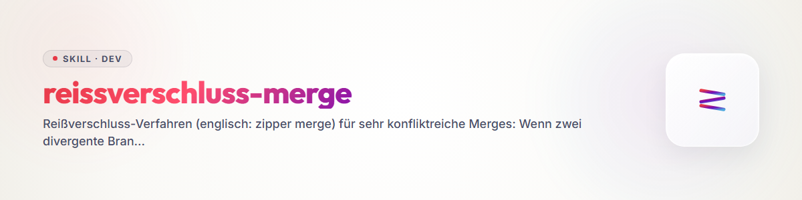

# Reißverschluss-Merge (zipper merge)

## Wann dieses Verfahren

Zwei Zweige desselben Repos sind **stark divergiert** und **beide tragen Wert** —
typisch: `main` vs. `master` nach paralleler Pflege, ein alter PR gegen einen
weitergezogenen Zielbranch, zwei Agenten-/Team-Stände mit je eigenen Fixes.
Ein normaler Merge würde entweder eine Seite plattmachen („ours"/„theirs") oder
einen unentwirrbaren Konfliktbrei erzeugen. Das Reißverschluss-Verfahren löst das,
indem es die Zähne beider Seiten **abschnittsweise ineinandergreifen** lässt:
je Abschnitt gewinnt die nachweislich bessere Version — oder eine begründete Mischung.

**Nicht nötig** bei trivialen Konflikten (eine Seite offensichtlich veraltet,
wenige Hunks): dann normal mergen. Das Verfahren lohnt ab dem Punkt, an dem man
für mehrere Dateien/Abschnitte ernsthaft abwägen muss.

## Phase 0 — Lagebild und Basiswahl

1. **Beide Seiten vollständig sichten** (nicht nur die Konfliktmarker):
   `git log --oneline A..B` und `B..A`, `git diff A...B --stat`, dann die
   divergenten Dateien beider Fassungen lesen.
2. **Basis wählen — nach Realität, nicht nach Datum.** Basis wird der Branch,
   der sich mit der **veröffentlichten Wirklichkeit** deckt: Registry-Stand
   (npm/PyPI/…), deployte Version, grüne CI, Release-Tags. Ein Branch mit
   neuerem Datum, aber ohne Deckung zur Außenwelt, ist Material, nicht Basis.
3. **Konsistenz beider Seiten prüfen** — oft sind BEIDE in sich inkonsistent
   (z. B. Basis hat Version X ohne passenden Changelog, Gegenseite pflegt den
   Changelog, hängt aber bei der Version zurück). Solche Befunde gehören in
   die Tabelle, nicht unter den Teppich.

## Phase 1 — Entscheidungstabelle (der Kern)

Für jeden divergenten Abschnitt (Datei, Block, Feld — so fein wie nötig) eine
Zeile:

| Abschnitt | Nimm | Warum |
|---|---|---|
| `package.json` → version | Basis | deckt sich mit Registry |
| `overrides`-Block | Gegenseite | enthält Security-Bumps, die der Basis fehlen |
| ↳ darin Eintrag `X` | **mischen** | Eintrag der Gegenseite übernehmen, aber auf die neuere Version der Basis heben |
| Changelog `[Unreleased]` | **mischen** | beide Blöcke vereinigen, Duplikate raus |

Regeln:

- **Fakten statt Vermutung.** Jede „Warum"-Zelle stützt sich auf etwas
  Prüfbares: Registry-Abfrage, Testlauf, Advisory-Datenbank, isolierte
  Probeinstallation der strittigen Datei. Wer rät, merged Vermutungen.
- **„Mischen" ist ein legitimes Verdikt** — der Reißverschluss darf innerhalb
  eines Abschnitts beide Zähne greifen lassen.
- **Verwerfen ist ein legitimes Verdikt** — was auf keiner Seite trägt
  (toter Badge, halb eingeführtes Feature), fliegt raus. Der Zwischenzustand
  („Feature halb drin") ist die schlechteste Variante: ganz rein oder ganz raus.
- Die fertige Tabelle ist das **Vertragsdokument** der Umsetzung — bei
  Sessionwechsel oder Übergabe reicht sie, um mechanisch fortzusetzen.

## Phase 2 — Umsetzung: abschnittsweise committen, am Ende pushen

1. Auf der Basis einen echten Merge beginnen: `git merge <gegenseite>`
   (bewusst KEIN `-X ours/theirs` — die Konflikte sind gewollt sichtbar).
2. Konflikte **Abschnitt für Abschnitt** exakt nach Tabelle lösen.
3. **Pro logischem Abschnitt ein Commit** (bzw. bei einem einzigen Merge-Commit:
   pro Abschnitt ein dokumentierter Lösungsschritt in der Commit-Message).
   Jede Commit-Message nennt das Tabellen-Verdikt („overrides: Gegenseite +
   vitest auf Basis-Stand gehoben"). So bleibt jeder Reißverschluss-Zahn
   einzeln nachvollziehbar und revertierbar.
4. **Tests nach der Umsetzung** (Suite, Build, Installierbarkeit) — erst grün,
   dann weiter.
5. **Erst am Ende pushen** — der lokale Verlauf darf während des Verfahrens
   umgebaut werden, der Remote sieht nur das fertige Ergebnis.
6. **Divergenz schließen ohne Löschen:** den unterlegenen Branch per
   Fast-Forward auf das Ergebnis setzen (`git checkout <gegenseite> &&
   git merge --ff-only <basis>`). Beide Namen zeigen danach auf denselben
   Stand; keine Historie geht verloren.

## Eskalationspfad — Rebuild statt Merge (letzte Stufe)

Wenn der Reißverschluss nicht mehr greift, wird **nicht gemerged, sondern neu
gebaut**: Man destilliert die **Absicht/Funktionalität** des Branches/PRs
(WAS wollte er erreichen — nicht WIE) und implementiert sie frisch auf dem
aktuellen Stand. Der alte Branch/PR wird mit Verweis auf den Neubau geschlossen.

Auslöser für die Eskalation (einer genügt):

- Die Gegenseite ist **nachweislich defekt** (z. B. nie installierbar gewesen,
  Build bricht ab) — dann gab es nie einen funktionierenden Stand zu mergen.
- Konfliktmasse ≫ Substanz: Die Änderung ist klein, aber über hunderte
  verschobene Zeilen verschmiert (Rename-/Format-Wellen dazwischen).
- Die Historie ist vergiftet (z. B. dieselbe Versionsnummer auf beiden Seiten
  für **unterschiedliche** Inhalte vergeben — ein Merge würde die Lüge erben).
- Der PR ist so alt, dass sein Kontext (APIs, Struktur) nicht mehr existiert.

Vorgehen: Absicht in 2–5 Sätzen festhalten (aus PR-Beschreibung, Commits,
Diff-Substanz) → auf aktuellem Stand neu implementieren → Tests → im alten
PR/Branch dokumentieren, WAS übernommen wurde und WAS bewusst nicht, dann
schließen. Urheberschaft der Idee im Commit/PR-Text nennen.

## Fallstricke (aus der Ursprungs-Session, teuer bezahlt)

- **Doppelter `[Unreleased]`-Changelog-Block** ist der häufigste Hotspot bei
  parallel gepflegten Branches — immer vereinigen, nie einen still verwerfen.
- **Beide Seiten vergeben dieselbe Versionsnummer für verschiedene Inhalte:**
  vor dem Merge klären, welche Nummer die Registry kennt; die andere Seite
  bekommt im vereinigten Changelog eine Korrektur.
- **Ein Merge ist eine Audit-Gelegenheit:** Beim abschnittsweisen Lesen fallen
  Dinge auf, die keiner der Branches sah (offene Advisories, tote Links,
  inkonsistente Pins). Funde mitnehmen, aber als eigene Commits — nicht mit
  den Reißverschluss-Entscheidungen vermengen.
- **Übernahme „weil neuer":** Datum ist kein Argument. Jede Übernahme braucht
  einen prüfbaren Grund.
- **Force-Push-Reflex:** Das Verfahren kommt ohne Force-Push aus (Merge +
  Fast-Forward). Wenn ein Force nötig scheint, ist meist die Basiswahl falsch.

## Red Flags

| Gedanke | Realität |
|---|---|
| „Ich nehme einfach die neuere Seite" | Datum ≠ Qualität. Tabelle bauen. |
| „Die Konflikte löse ich in einem Rutsch" | Ein Sammel-Commit macht jede Einzelentscheidung unrevidierbar. |
| „Push ich schon mal zwischendurch" | Halbfertige Reißverschlüsse auf dem Remote verwirren jeden Mitleser. Push erst am Ende. |
| „Mergen geht immer irgendwie" | Bei defekter Gegenseite oder vergifteter Historie ist Rebuild ehrlicher und schneller. |
| „Die Tabelle ist Overkill" | Ohne Tabelle ist nach der dritten Datei vergessen, warum Abschnitt 1 so entschieden wurde. |

## Verwandte Skills

- `bugfix-protocol` — wenn der Merge einen echten Defekt aufdeckt, dort weiter.
- `skill-extractor` — Herkunft dieses Skills (Live-Session-Destillat).

## Changelog

### 1.0.0 (2026-08-07)
- Initiale Version. Extrahiert aus einer Live-Merge-Session vom 2026-08-06
  (main/master-Vereinigung mehrerer Repos mit Entscheidungstabelle, Fund einer
  nie installierbaren Gegenseite, Fast-Forward-Abschluss; Eskalationsfall
  „Absicht übernehmen, neu bauen").
