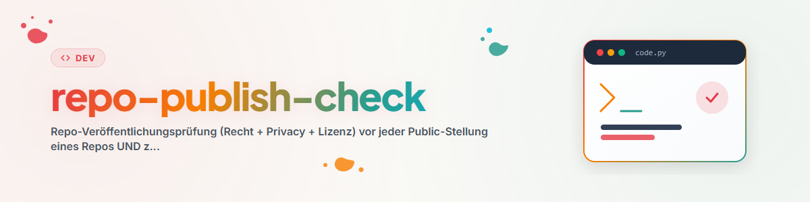

# Repo Publish Check

## 目的

初回公開前または公開後の再確認としてリポジトリを審査します。不合格も正当な結果
です。可視性の変更は、所有者が明示的に承認した後にのみ行います。

この Skill は法的意見を作成しません。法的に慎重な分野や不明確な案件は、公開
Skill `law-checker` に接続してください。専門家の法的助言の代わりにはなりません。

## 審査記録のプライバシー

審査報告やリスク評価を対象リポジトリへ Commit しません。プロジェクト外の非公開
領域、または `<private-review-dir>` のような gitignore 済みディレクトリに保存し、
公開側には必要な修正だけを反映します。

## 審査手順

1. `git ls-files`、`.gitignore`、パッケージの許可リストで公開範囲を確定し、
   内部メモ、報告、テストデータ、ローカル設定、ロックを除外します。
2. 作業ツリーと到達可能な全履歴から、認証情報、トークン、秘密鍵、ローカル
   ユーザーパス、連絡先、個人データを検索します。
3. 適切な `LICENSE` を用意し、第三者のコード、Prompt、文書、メディアについて
   出所とライセンスを記録します。
4. 目的と対象外を明記します。法律、医療、金融、セキュリティ、個人データに
   関わる場合はデータフローと除外用途を示し、法的質問は `law-checker` に渡します。
5. データを最小化し、外部処理を説明し、公開 Issue に機密事例を投稿しないよう
   注意します。
6. AI や製品の主張を検証し、根拠のない認証や品質を示唆しません。
7. 名前、商標の可能性、README、説明、Badge を確認します。
8. 非公開報告に発見事項、修正、残存リスク、信号評価を記録し、最終 Commit と
   所有者の明示承認を確認してから、別の認可済み公開手順へ進みます。

## 制限

- この Skill 自体は公開操作を行いません。
- 法的助言や公的な商標調査を代替しません。
- ソースがクリーンでも、過去の公開コピーや Registry、Cache の削除は証明しません。
