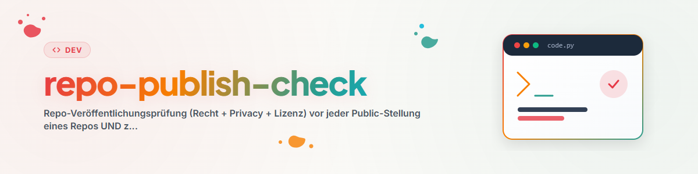

# Repo Publish Check

## Zweck

Prüfe ein Repository vor der ersten Veröffentlichung oder bei einer späteren
Nachprüfung. Ein negatives Ergebnis ist zulässig. Ändere die Sichtbarkeit erst,
wenn der Repository-Eigentümer das ausdrücklich freigegeben hat.

Der Skill erstellt keine Rechtsgutachten. Bei einer rechtlich sensiblen Domäne
oder einem unklaren Einzelfall wird der öffentliche Skill `law-checker`
hinzugezogen. Eine professionelle Rechtsberatung ersetzt auch dieser nicht.

## Datenschutz für Prüfberichte

Prüfberichte und Risikobewertungen werden nicht in das geprüfte Repository
committet. Lege sie in einem vom Projekt getrennten, privaten Prüfbereich ab
oder verwende einen gitignorierten Ordner wie `<private-review-dir>`.
Öffentlich werden nur die notwendigen Korrekturen, zum Beispiel eine
Lizenzangabe, ein Datenschutzhinweis oder eine präzisere Beschreibung.

## Prüfablauf

1. **Veröffentlichungsumfang festlegen**
   - Prüfe den tatsächlich getrackten Baum mit `git ls-files`.
   - Schließe interne Notizen, Berichte, Testdaten, lokale Konfigurationen und
     Sperrdateien aus.
   - Prüfe `.gitignore` und Paket-Allowlisten vor dem Commit.
   - Bei Skill-Bibliotheken (`SKILL*.md`-Dateien vorhanden): jede Frontmatter
     muss als YAML parsen. Falls `testing/skill_frontmatter_gate.py` im Repo
     existiert, ausführen (`--fix` quotet mechanisch nach, ohne den
     Wortlaut zu ändern); sonst stichprobenartig mit `yaml.safe_load` prüfen.

2. **Privacy- und Secret-Scan**
   - Suche im Arbeitsbaum UND in der gesamten erreichbaren Git-Historie (`git log -p --all`) nach
     E-Mail-Adressen, Zugangsdaten, Tokens, privaten Schlüsseln, lokalen
     Benutzerpfaden (`C:\Users\<name>`, `_Local_DEV`, `OneDrive`, `CREDENTIALS`)
     und personenbezogenen Daten.
   - Suchmuster zwingend aus einer Datei (`grep -f`) laden, nie als fehleranfällige
     Inline-Strings; vorab eine Positivkontrolle mit einem Testpfad durchführen.
   - Klassifiziere jeden Fund als beabsichtigt, zu entfernen oder als
     dokumentiertes Restrisiko.
   - Bereinige problematische historische Inhalte vor einer Veröffentlichung:
     Ein Historienfund wird NIE durch einen simplen Bereinigungs-Commit gelöst,
     sondern erfordert History-Rewrite (`git filter-repo`) oder Neuanlage/Nutzerfreigabe.

3. **Lizenz und Herkunft**
   - Eine passende `LICENSE`-Datei muss vorhanden sein.
   - Dokumentiere, ob die Lizenz Code, Prompts, Dokumentation und Medien
     abdeckt.
   - Inventarisiere Drittbestandteile und übernommene Inhalte mit ihrer
     Herkunft und Lizenz.
   - Veröffentliche fremde Bestandteile nur, wenn die Lizenz und die
     kuratorische Veröffentlichungsentscheidung dies erlauben.

4. **Zweck und sensible Domänen**
   - Beschreibe klar, was das Projekt leistet und was nicht.
   - Bei Recht, Gesundheit, Finanzen, Sicherheit oder personenbezogenen Daten:
     dokumentiere Grenzen, Datenflüsse und ausgeschlossene Einsätze.
   - Hole bei Rechtsfragen über `law-checker` eine aktuelle Ersteinschätzung
     ein.

5. **Datenschutz und Cloud-Nutzung**
   - Minimiere verarbeitete Daten.
   - Weise auf externe Dienste und Cloud-Verarbeitung hin.
   - Fordere Nutzer auf, keine vertraulichen Falldaten in öffentliche Issues
     oder Diskussionen einzustellen.

6. **KI- und Produkthinweise**
   - Dokumentiere bei KI-Bezug Zweckbestimmung, Anbieterrolle, wesentliche
     Grenzen und relevante Transparenzhinweise.
   - Behaupte keine Zulassung, Zertifizierung oder Prüfqualität, die nicht
     belegt ist.

7. **Name, Banner und Außendarstellung**
   - Prüfe Slug- und Paketnamen sowie mögliche Markenüberschneidungen.
   - Eine normale Web- oder Plattform-Suche ersetzt keine amtliche
     Markenrecherche.
   - README, Beschreibung und Badges müssen den tatsächlichen Funktionsumfang
     wiedergeben.
   - **Pflicht-Banner-Prüfung vor Umschaltung auf public:**
     * Prüfe, ob bereits ein Banner existiert (`assets/banner*` oder Root `banner.*`)
       und im `README.md` eingebunden ist.
     * Fehlt das Banner: zwingende Generierung VOR der Veröffentlichung!
     * Generierungsweg: Antigravity / Gemini (`generate_image` oder agy CLI —
       Standardregel: Banner/Artwork an agy; Default), Ersatzweg: Codex.
     * Ablage unter `assets/banner.png` (bzw. `banner.svg`); Datei-Existenz und
       -Größe direkt auf der Festplatte verifizieren (nicht allein auf die
       Erfolgsmeldung des Modells verlassen).
     * Banner im `README.md` oben (zentriert) einbinden.

8. **Abschluss und Sichtprüfung**
   - Banner, Logo und Webansichten (wie Repo-Startseite oder Org-Profil) dem
     Nutzer aktiv zur Sichtprüfung öffnen (`Invoke-Item` bzw. `Start-Process msedge`),
     nicht nur verlinkt im Bericht hinterlassen.
   - Dokumentiere Funde, Korrekturen, offene Risiken und ein Ampelergebnis im
     privaten Prüfbericht.
   - Verifiziere den finalen Commit erneut.
   - Hole die ausdrückliche Freigabe des Repository-Eigentümers ein.
   - Erst danach darf ein separater, autorisierter Schritt die Sichtbarkeit
     auf public ändern (`gh repo edit <org>/<repo> --visibility public`).

## Beispiel- und Evidenzdaten (Telefonnummern, Transkripte, IDs) [C 2026-09-05]

Feldversuchs- und Testbelege sind der häufigste Weg, auf dem echte Daten in ein öffentliches
Repository geraten — nicht Zugangsdaten. Prüfen, in Code, Tests, Fixtures, Doku **und der
erreichbaren Git-History**:

- **Telefonnummern:** Nur standardisiert reservierte Drama-/Fiktivbereiche des jeweiligen Landes
  (DE: Bundesnetzagentur-Reservierungen; kein plausibler Mobilfunk- oder Festnetzblock). Regex-Scan
  mit **Positivkontrolle** (eine eingespielte Beispielnummer muss der Scan finden), sonst ist ein
  Negativbefund wertlos. Maskierte Formen (`+49 17x XXXX`, `+491 ••• •`) sind zulässig.
- **Transkripte und Gesprächsauszüge:** nur als klar markierte synthetische Reproduktionen;
  keine Roh-Transkripte, keine Namen, keine exakten Zeitstempel, keine Nummernfragmente.
- **Anbieter-IDs:** keine Run-/Call-/Order-IDs (32-Hex-Muster), keine Dashboard-Links.
- **History:** War so etwas jemals committet, reicht ein Bereinigungs-Commit nicht — Rewrite
  (`git filter-repo`) plus Support-Purge der dangling Objekte; alte Commit-URLs danach live auf
  404 prüfen. Ergebnis ohne Werte berichten (Datei, Zeile, Zähler).

Ergebnisstufen wie beim Zugangsdaten-Scan: *blockiert* (echter Fund) · *ansehen* (verdächtig, evtl.
Beispiel) · *sauber*. Lehrfall: CALL-E 2026-08-24/25 (Maintainer-Review erzwang drei History-Rewrites).

## Pflichtschritte nach der Umschaltung auf public

Sobald die Sichtbarkeit eines Repositories auf `public` gestellt wurde (`gh repo edit <org>/<repo> --visibility public`), sind folgende Pflichtschritte abzuarbeiten:

1. **Banner-Vollständigkeit im finalen Release/Commit verifizieren:**
   - Prüfe auf GitHub, dass das Banner im README korrekt lädt (kein 404, Branch-/Asset-Pfad erreichbar).

2. **Org-Profil-README aktualisieren (Banner + Verzeichniseintrag):**
   - Jedes neu veröffentlichte Repo mit Banner muss auf der Organisations-Profilseite (`<org>/.github/profile/README.md` und `profile/README_de.md`) gelistet werden.
   - Mechanische Prüfung über das Org-Profil-Gate:
     ```bash
     python testing/org_profile_gate.py --org <org>
     ```
   - Fehlt der Eintrag, generiert das Skript ein passendes HTML/Markdown-Snippet. Dieses in die Banner-Galerie der passenden Kategorie (z. B. Fachanwendungen, Module, Orchestrierung) einfügen und das Repo in die zugehörige Tabelle der Profil-READMEs aufnehmen.
   - Anpassung per Branch und Pull Request gegen `<org>/.github` einreichen (siehe hierzu auch `github-repo-care` Schritt 14).

3. **Eigenen Stern setzen:**
   - Nach der Veröffentlichung für jedes eigene öffentliche Repo prüfen, ob der Account selbst schon einen Stern vergeben hat, und diesen setzen (z. B. via `.GITHUBBOT` `run.py --self-star --repo <org>/<name>` oder `gh api`). Details siehe `github-repo-care` Schritt 14.

## Nachprüfung bereits öffentlicher Repositories

Prüfe mindestens Privacy und Geheimnisse, Lizenzabdeckung, Drittinhalte,
Disclaimer und Außendarstellung. Kritische Funde in der Historie werden sofort
an den Repository-Eigentümer gemeldet und nicht stillschweigend überschrieben.

Eine Organisation kann eine eigene private Warteschlange und Berichtsablage
führen. Diese gehören nicht in den öffentlichen Skill. Überfällige
Nachprüfungen können nach Risiko, Sichtbarkeit und Alter des letzten privaten
Prüfberichts priorisiert werden.

## Ergebnisformat

```markdown
# Veröffentlichungsprüfung — <Repository>
- Stand: <Commit>
- Modus: vor Veröffentlichung | Nachprüfung
- Privacy/Secrets: grün | gelb | rot
- Lizenz/Drittinhalte: grün | gelb | rot
- Dokumentation/Außendarstellung: grün | gelb | rot
- Korrekturen: <Liste>
- Offene Risiken: <Liste>
- Freigabe: ausstehend | erteilt
```

## Grenzen

- Der Skill veröffentlicht nichts selbst.
- Er ersetzt keine Rechtsberatung oder amtliche Markenrecherche.
- Ein grüner Quellcode-Scan beweist nicht, dass frühere öffentliche Kopien,
  Paket-Registries oder Caches bereinigt sind.

## Changelog

Details siehe [CHANGELOG.md](CHANGELOG.md).
