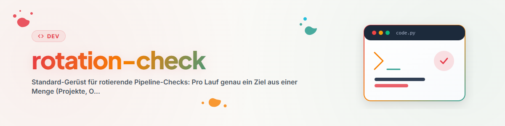

# Verificación Rotativa — Un objetivo por ejecución, cobertura justa, memoria

## Propósito

Quien desee auditar periódicamente una pipeline con muchos proyectos (fuentes, estilo, salud, seguridad, traducciones, …) se enfrenta a un problema de distribución: revisar todos los proyectos por ejecución es demasiado costoso; sin memoria, cada ejecución revisa aleatoriamente el mismo proyecto. El patrón de rotación resuelve ambos problemas: **exactamente un objetivo por ejecución, selección basada en "el que lleva más tiempo sin revisar", registro como memoria.** De este modo, incluso un ritmo poco frecuente (diario/semanal) cubre toda la pipeline a lo largo de las semanas, de manera demostrable y sin duplicar trabajo.

Probado como la columna vertebral de una colección madura de automatizaciones de producción a través de múltiples pipelines de proyectos.

## Componentes

### 1. Dos archivos por pipeline (crear una sola vez)

| Archivo | Contenido | Carácter |
| --- | --- | --- |
| `CHECKED-REGISTRY.md` | Una línea compacta por revisión: objetivo, fecha, tipo de revisión, resultado, siguiente paso | Resumen de estado — se lee ANTES de cada selección de objetivo |
| `CHECKS-LOG.txt` | Entrada corta de historial por ejecución con detalles/evidencia | Diario — append-only |

Ambos residen en la raíz de la pipeline (no en el proyecto individual) para que una ejecución pueda inspeccionarlos con una sola lectura. Formato de línea del registro:

```text
| <ziel> | <YYYY-MM-DD> | <checktyp> | <ok|befund|übersprungen> | <nächster schritt> |
```

### 2. Regla de selección

1. Leer el registro y el historial (Obligatorio, ANTES de la selección — de lo contrario se produce una doble verificación).
2. Candidatos: Objetivos que nunca se han revisado para ESTE tipo de revisión o que llevan más tiempo sin revisarse.
3. Desviar/Omitir si el objetivo fue tocado recientemente por una revisión **estrechamente relacionada** (p. ej., una revisión de citas justo después de una revisión de fuentes no aporta nada) o si está bloqueado/en edición activa (respetar bloqueos).
   **Tiempo de enfriamiento entre hermanos (Sibling Cooldown):** Si ejecutas varias revisiones relacionadas sobre el mismo conjunto de objetivos (p. ej., desarrollo, búsqueda de errores y revisión de la misma pipeline), acuerda un período de carencia (valor empírico: ~24 h) durante el cual un objetivo modificado por una revisión hermana no vuelva a seleccionarse — evita colisiones y cambios paralelos contradictorios.
4. Priorizar fuera de turno solo con una buena razón (p. ej., gran reestructuración desde la última revisión) — indicar el motivo en el historial.

### 3. Realizar la revisión — con salida de solo lectura

Aplicar la revisión real (libremente definible: revisión de fuentes, revisión de estilo, auditoría de seguridad, …) sobre el ÚNICO objetivo seleccionado. Dos resultados válidos:

- **Hallazgo:** Corregir lo que encaje en el alcance; registrar tareas mayores como trabajo posterior en el archivo TODO/tareas local del proyecto (la revisión no necesita resolver todo por sí misma).
- **Nada que hacer:** Documentar brevemente y finalizar. Una ejecución sin cambios es un resultado, no un fallo; bajo ninguna circunstancia se debe ampliar el alcance solo para "haber encontrado algo".

### 4. Documentación

- Complementar la línea del registro (compacta), escribir la entrada en el historial (detalles/evidencia).
- **Higiene de registros:** Si el registro/historial se vuelve desordenado (valor empírico: varias cientos de líneas), mover el estado antiguo a `_archiv/`, crear un archivo nuevo y hacer referencia al predecesor en el encabezado (ruta + fecha).
- **Desviación de rutas (Path Drift):** Si una ruta esperada apunta a la nada (objetivo movido/renombrado), NO crearla de nuevo — corregir mediante el archivo de estado/registro autoritativo de la pipeline y registrar la ruta errónea en un registro de fallos.

### 5. Cadencia

Vincular la frecuencia a la tasa de cambios de lo auditado: las revisiones rotativas sobre repositorios estables funcionan bien de forma semanal (un objetivo por ejecución ≈ toda la pipeline por trimestre para ~12 objetivos); las revisiones de ritmo rápido (p. ej., sobre trabajo activo) se ejecutan diariamente. Experiencia práctica: las revisiones horarias iniciales se redujeron casi todas a diarias/semanales — la cobertura se mantuvo y los costos cayeron.

## Plantilla de prompt (para Scheduler / Automatización)

```text
VORBEREITUNG: Lies <PIPELINE_ROOT>/<POLICY-DOKUMENTE> sowie <REGISTRY> und <LOG>.

AUFGABE: Wähle genau ein Ziel aus <ZIELMENGE>. Bevorzuge Ziele, die für den Check
"<CHECKTYP>" noch nie oder am längsten nicht geprüft wurden. Wurde ein Ziel kürzlich
von diesem oder einem eng verwandten Check geprüft oder ist es gesperrt: ausweichen
oder read-only mit Logeintrag enden.

CHECK: <konkrete Prüf-/Pflegeaufgabe und was bei Befund zu tun ist; Folgearbeiten in
die projektlokale TODO-Datei>.

Wenn keine Arbeit anfällt: kurz dokumentieren, Lauf beenden.

DOKUMENTATION: Registry-Zeile in <REGISTRY> (Ziel, Datum, Checktyp, Ergebnis, nächster
Schritt) + Verlaufseintrag in <LOG>. Bei Überlänge: alten Stand nach _archiv/ und
frische Datei mit Verweis.

ABSCHLUSS: Kurzbericht (Ziel | getan | Ergebnis | Folgeaufgaben).
```

## Señales de alerta (Red Flags)

| Pensamiento | Realidad |
| --- | --- |
| "Simplemente elegiré un proyecto interesante" | Selección basada estrictamente en el registro — de lo contrario surgen sesgos por proyectos favoritos y puntos ciegos. |
| "Leeré el registro después de la revisión" | Léelo antes. Es el criterio de selección, no solo el protocolo. |
| "Múltiples objetivos por ejecución logran más" | Un objetivo mantiene las ejecuciones cortas, idempotentes y cancelables; el volumen se logra mediante la rotación. |
| "La ejecución sin cambios fue tiempo perdido" | Una ejecución sin cambios documentada actualiza la memoria — eso es la mitad del valor del sistema. |

## Habilidades relacionadas

- `workflow-extract` — construye automatizaciones a partir de sesiones/automatizaciones externas; utiliza este marco como componente estándar.
- `pipeline-optimizer` — para la reestructuración profunda de una pipeline (Rotation-Check mantiene, Optimizer renova).

## Registro de cambios

### 1.1.0 (2026-07-03)
- Se añadió el tiempo de enfriamiento entre hermanos como regla de selección (anticolisión entre revisiones relacionadas sobre el mismo conjunto de objetivos; hallazgo de la clasificación completa del catálogo de automatizaciones).

### 1.0.0 (2026-07-03)
- Versión inicial. Abstraída del catálogo de automatizaciones de Codex (patrón de rotación en ~40 de 77 automatizaciones: revisiones de investigación/software/Roblox con CHECKED-REGISTRY/CHECKS-LOG).
