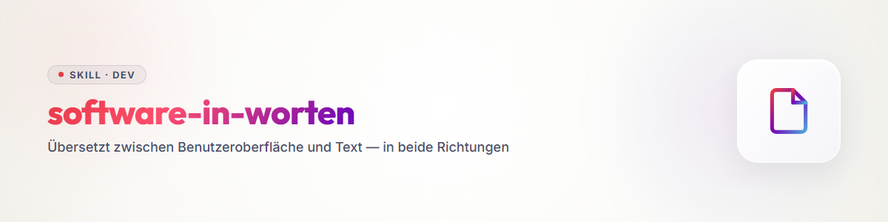

# Software in Worten

## Der Gedanke

Menschen entwerfen **visuell**: *Wie will ich das bedienen?* Agenten lesen **Text**.
Solange beides getrennt entsteht, driftet es auseinander — die Oberfläche kann etwas, das
der Skill nicht kennt, und umgekehrt.

Beides ist aber dasselbe, nur in verschiedenen Aggregatzuständen. Es gibt eine
Übersetzung, und wer sie kennt, arbeitet in beide Richtungen:

> **Aus Worten eine Oberfläche entwerfen. Und eine Oberfläche zurück in Worte bringen.**

---

## Die Übersetzungstabelle

| In der Oberfläche | Was es bedeutet | In Text |
|---|---|---|
| **Mauszeiger** | *ich kann auswählen* — der Raum des Möglichen | die Menge der Optionen an dieser Stelle |
| **Markieren** | *das will ich haben* | eine Auswahl, ein Wert |
| **Klick** | *ich entscheide mich, ich will dahin* | **der Prompt** — die Antwort des Nutzers |
| **Feld, Schalter, Einstellung** | eine Entscheidung, die bleibt | **Config** |
| **Einstellungen der ganzen Software** | Entscheidungen, die überall gelten | **Policies** |
| **Formular, Eingabemaske** | eine Sammlung zusammengehöriger Entscheidungen | **Template** |
| **Knopf, der etwas startet** | *jetzt passiert etwas* | **Skill** oder **Workflow** wird ausgelöst |
| **Was danach abläuft** | die Schrittfolge | Anweisungen im Skill — oder ein **Skript** |
| **Fortschrittsanzeige** | *es läuft, und wie weit* | Statusmeldungen im Ablauf |
| **Erfolgsmeldung, Ergebnisansicht** | *das kam heraus* | die Rückgabe — in der Oberfläche nur schöner gesetzt |
| **Projekt** | ein abgegrenzter Arbeitsstand | ein **Ordner** — und weil er selbst in einem Ordner liegt, Teil der Software |
| **Ansicht, Tab, Bereich** | ein Zustand, in dem man gerade ist | ein Schritt im Ablaufbaum |

**Die zentrale Zeile ist der Klick.** Ein Klick ist nichts anderes als das, was ein Nutzer
im Gespräch sagen würde — nur schneller. **Der Klick ist der Prompt.** Und auf einen Prompt
folgt eine Reaktion: eine neue Frage, eine neue Ansicht, ein neuer Zustand.

---

## Der Ablauf ist ein Baum

Jede Anwendung ist eine Folge von Entscheidungen, zwischen denen etwas passiert:

```
Voraussetzungen geklärt?   →  Referenzen · Kandidatenliste · Nummern · Reihenfolge
        ↓
Einverständnis des Nutzers →  START
        ↓
Will er mitlesen?          →  ja: Mitleseansicht öffnen
Will er Zwischenmeldungen? →  ja: bei jedem Ereignis melden (durch, abgelehnt, Status)
        ↓
        [ AUSFÜHRUNG — oft ausgelagert an andere Software ]
        ↓
Rückgabe kommt zurück      →  auswerten
        ↓
Was will er wissen?        →  das Ergebnis in seinen Begriffen:
                              „bestellt bei X, 40 Minuten, 30 Euro"
```

**Drei Teile, immer dieselben:**

1. **Entscheidungen** — wenn-dann, bis alles Nötige beisammen ist
2. **Ausführung** — häufig gar nicht im eigenen Werkzeug, sondern ausgelagert
3. **Rückmeldung** — das Ergebnis zurück an den Menschen, in seiner Sprache

Der dritte Teil wird beim Entwurf am häufigsten unterschätzt. **Kommunikation läuft über
die Sinne** — als Text, als Bild, als Ton. Eine Oberfläche gestaltet das aus; ein Skill
beschreibt, *was* gemeldet wird und *wann*.

---

## Die Zwischenebene: das Blueprint

Zwischen „beschrieben" und „gebaut" fehlt eine Stufe. Sie heißt **Blueprint** und ist
**Text, dessen Anordnung dem Bild entspricht** — ein Screen, den man lesen kann:

```
 Worauf hast du Hunger?   [ Burger                        ]
 Wohin liefern?           [ Dorfstraße 1, 16321 Bernau    ]
 Höchstbetrag             [ 35 ] €   ⓘ Endbetrag an der Haustür
 Modus                    (•) Lieferung  ( ) Tisch  ( ) Abholung

 Kandidaten (ziehen zum Umsortieren)            ↻ neu suchen
 ┌────────────────────────────────────────────────────┐
 │ ≡ 1  Burger House Dorfstadt      ★ Favorit   offen │
 │ ≡ 2  Pizzeria Roma                            offen │
 └────────────────────────────────────────────────────┘

 [ Trockenlauf ansehen ]   [ Wirklich anrufen → 4 Anrufe, ~0,20 € ]
```

**Warum diese Stufe so viel bringt:**

Ein Blueprint ist **gleichzeitig lesbar und ansehbar**. Der Mensch sieht sein Bild wieder,
der Agent sieht Felder, Typen und Reihenfolge. Es entsteht in Minuten, kostet nichts und
lässt sich im Gespräch korrigieren — anders als eine gebaute Oberfläche.

**Und aus dem Blueprint fällt der Skill fast von selbst:**

> **Was muss der Agent können, wissen und tun — in welcher Reihenfolge —
> um dieses Blueprint auszufüllen?**

Jedes Feld wird eine Frage. Die Anordnung wird die Reihenfolge. Was vorbelegt ist, wird
nicht gefragt. Was als Knopf dasteht, wird ein Schritt. Danach reichert man an, was der
Agent zusätzlich wissen muss — Fachwissen, Grenzen, Fallstricke.

**Drei Stufen also:** Beschreibung → **Blueprint** → Skill *(und von dort ebenso gut in
eine gebaute Oberfläche)*.

### Ein leeres Feld ist eine Frage — und die Frage hat einen Zweck

`[ 35 ] €` sieht aus wie eine Zahl. Es ist aber eine **Datenabfrage an einen Menschen**,
und sie hat einen Grund, der meist ungesagt bleibt:

> **Wir brauchen diesen Höchstbetrag, weil er die Bedingung ist, unter der überhaupt
> bestellt wird.**

Das Feld trägt also drei Dinge auf einmal: **was** hineingehört, **warum** es gebraucht
wird, und **wo es später wirkt**. In einer Oberfläche steckt das im Layout und im
Hilfetext. Im Text muss es hingeschrieben werden — sonst geht es verloren.

**Deshalb gehört unter jedes Blueprint eine Feldlegende:**

| | |
|---|---|
| **Frage** | wie ein Mensch danach gefragt würde |
| **Typ** | Zahl, Text, Auswahl, Liste, geordnete Liste, Datum … |
| **Zweck** | wofür der Wert später gebraucht wird — *„Abbruchkriterium in der Kaskade"* |
| **Vorbedingung** | was dasein muss, damit das Feld überhaupt sinnvoll ist |
| **Nachbedingung** | was gilt, nachdem es gefüllt ist |
| **Wenn leer** | still akzeptieren · Vorgabe setzen · nachfragen · blockieren |
| **Wenn falsch** | Meldung, Rückfrage, Korrekturvorschlag |

**Die letzten beiden Zeilen sind die, die man am ehesten vergisst** — und die im Betrieb
den meisten Ärger machen. *„Preis egal"* ist eine gültige Antwort und muss als solche
vorgesehen sein, nicht als Fehler.

### Das Feld ist offen — die Frage schränkt ein

Ein leeres Feld ist **alles und nichts**, wie ein leeres Kontextfenster: eine Einladung,
irgendetwas hineinzuschreiben. Aber was?

**Eingeschränkt wird nicht durch das Feld, sondern durch das, was darum herum steht** —
meist durch den verbundenen Text davor, darüber oder daneben:

> *„Wie viel soll es höchstens kosten?"*

Diese Frage schränkt **semantisch und pragmatisch** ein. Das Feld selbst lässt weiterhin
alles zu — und wenn jemand diese Freiheit nutzt, **verliert es seinen Zweck**. Deshalb
springen die Feldbedingungen ein: *nur Zahlen*. Nicht, weil „fünfunddreißig" unverständlich
wäre, sondern weil es schwerer zu verarbeiten und länger zu schreiben ist.

**Daraus folgt die Arbeitsrichtung: Aus der Frage leiten sich die Feldregeln ab, nicht
umgekehrt.** Wer zuerst den Datentyp festlegt, hat die Frage schon vergessen.

Und die Frage trägt meist auch den **Zweck** — deshalb steht bei Menschen oft ein
Info-Zeichen daneben:

> *„Wir nehmen kein Angebot an, das über diesem Preis liegt."*

Das ist keine Höflichkeit, sondern die eigentliche Bedeutung des Feldes: **eine Präferenz
des Nutzers, die später als hartes Gate wirkt.**

### Die Kontrollgrenze — und warum alles mitgegeben werden muss

Aus einem Feld folgt eine Kette:

```
Feld „Höchstbetrag"
   → der Wert wird später gebraucht        (Zweck)
   → für eine Prüfung                       (Gate)
   → also muss der Gegenwert erhoben werden (neue Frage, an anderer Stelle)
   → diese Frage stellt niemand von uns     (sie steht im Prompt)
```

**Und hier verläuft die entscheidende Linie: Mit dem Prompt verlässt es unsere
Kontrollebene.** Danach gibt es keinen Zugriff mehr — kein Nachfassen, kein Eingreifen,
keine zweite Chance.

Deshalb muss **alles** mitgegeben werden, was drüben gebraucht wird:

- **der Wert selbst** — 35 €
- **die Anweisung, den Gegenwert zu erheben** — nach dem Preis fragen
- **was gilt, wenn er höher ist** — ablehnen, bedanken, freundlich beenden
- **was gilt, wenn keiner genannt wird** — nicht schätzen, ablehnen
- **was gilt, wenn das Gegenüber nicht mit einer Maschine sprechen will** — um einen
  persönlichen Rückruf bitten und die Nummer als Wert zurückgeben

Der letzte Punkt zeigt die Richtung, in die man beim Entwerfen am seltensten denkt:
**Auch der Ausnahmefall muss einen Wert zurückliefern**, sonst kommt beim Menschen nichts
an außer „hat nicht geklappt".

### Der Prompt ist ein erzeugter Skill

Damit ist klar, was ein Prompt eigentlich ist:

> **Ein Prompt ist ein Skill, den die Oberfläche gerade erst zusammengebaut hat** — aus
> den Entscheidungen, Klicks und Werten dieses einen Laufs. Personalisiert, auf den Zweck
> zugeschnitten, und gezwungen, alles Gewollte **in Sprache** auszudrücken.

Ein fest geschriebener Skill sagt, wie man es *immer* macht. Ein Prompt sagt, wie es
*diesmal* laufen soll. Beide sind dieselbe Form — der eine bleibt, der andere entsteht im
Moment und ist danach weg.

**Praktisch heißt das:** Wer den Prompt-Aufbau als Textbaustein-Bastelei behandelt, baut
schlechte Prompts. Wer ihn als *Skill-Erzeugung* behandelt — mit Zweck, Regeln, Grenzen,
Ausnahmen und Rückgabewerten —, baut gute.

### Warten ist kein Nichtstun, sondern Nichtwissen

Nach dem Absenden hat der Mensch die Kontrolle abgegeben. Was er jetzt braucht, ist nicht
Geduld, sondern **Information**: *Was passiert gerade? Wo stehen wir?*

Der Agent bekommt das ohnehin — er fragt den Fortschritt ab. **Der Mensch sieht davon
nichts, solange es niemand übersetzt.** Genau dafür gibt es Fortschrittsbalken,
mitlaufende Protokolle und Statuszeilen: Sie sind keine Verzierung, sondern die
Übersetzung eines Datenstroms in etwas, das ein Wartender aushält.

### Die Rückmeldung ist ein Rück-Prompt

Die Erfolgsmeldung ist kein Abschluss, sondern eine **Übergabe zurück**:

> *„Das ist das Ergebnis deines Auftrags."*

Erst damit kann der Mensch bewerten und weiterhandeln. Und genau deshalb muss sie
vollständig sein: *„Bestellt — aber drei Pizzen statt einer. Gut, dass die Rückrufnummer
dasteht, ich rufe selbst an."*

**Ohne brauchbare Rückgabe kann niemand weiterverarbeiten.** Eine Meldung, die nur „hat
geklappt" sagt, hat den Kreis nicht geschlossen.

### Fragen- und Feldanalyse

Für **jedes** Element eines Blueprints — Feld, Knopf, Auswahl, Anzeige — dieselben Fragen:

| | |
|---|---|
| **Was ist gewollt, und wozu?** | die Absicht hinter dem Element |
| **Was passiert beim Absenden?** | sofort verarbeitet, oder erst gespeichert? |
| **Wo und wann wird der Wert wieder gebraucht?** | die Stelle, an der er wirkt |
| **Wie lange muss er vorgehalten werden?** | über den Klick hinaus? über den Lauf hinaus? |
| **Was muss damit geschehen?** | prüfen, mitgeben, anzeigen, verwerfen |

Der Höchstbetrag zum Beispiel wird **nicht sofort** gebraucht. Er wird gespeichert,
mitgeschleppt und wirkt erst im Gespräch — also braucht es einen Ort, an dem er liegt,
und eine Stelle, an der er in den Prompt wandert.

### Weichen bestimmen den Frage-Algorithmus

Eine Auswahl ist selten nur ein Wert. Oft ist sie eine **Weiche**, die den ganzen weiteren
Ablauf umstellt:

| Modus | Erste Frage im Gespräch | Was entfällt | Was hinzukommt |
|---|---|---|---|
| **Lieferung** | *„Liefern Sie hierhin?"* — Nein beendet den Anruf sofort | — | Lieferadresse |
| **Abholung** | entfällt | die Lieferfrage | Abholzeit |
| **Tisch** | *„Haben Sie offen, und ist um X ein Tisch frei?"* | die ganze Preisprüfung | Personenzahl, Kinder, Sitzwunsch, Zeitraum |

**Die Reihenfolge im Gespräch folgt der Ausschlusskraft, nicht der Neugier.** Wer nicht
liefert, muss nicht nach dem Essen gefragt werden — die härteste Bedingung kommt zuerst,
weil sie am schnellsten zum nächsten Kandidaten führt.

Und: **Vieles bleibt über die Weichen hinweg gleich.** Der Höchstbetrag gilt bei Lieferung
wie Abholung, die Kandidatenliste ebenso. Nur der Fragealgorithmus wechselt.

### Der Kreis

```
Problem  →  Use Case  →  Wille        „Ich bin auf dem Land und habe Hunger"
   ↓
was ich will, wird zu Bedingungen     5 Personen · 19 Uhr · Italiener · nicht der eine
   ↓
Bedingungen brauchen Daten            → daraus ergeben sich die FELDER
   ↓
Felder + Entscheidungen               → daraus wird der PROMPT (der erzeugte Skill)
   ↓
                [ Ausführung jenseits der Kontrollgrenze ]
   ↓
Rückgabe empfangen und speichern      → nur, was vorher mitgegeben wurde, kommt zurück
   ↓
übersetzen in Sicht- und Hörbares     → MELDUNG an den Menschen
   ↓
er bewertet und entscheidet neu       → zurück nach oben
```

**Der Use Case begründet die Daten, die Daten begründen die Felder.** Wer bei den Feldern
anfängt, erfindet Formulare. Wer beim Willen anfängt, bekommt sie geschenkt.

### Zwischen zwei Blueprints steht die Kausalität

Ein Blueprint ist eine **statische Anordnung**. Mehrere hintereinander ergeben noch keinen
Ablauf — dazwischen passiert etwas, und **dieses Dazwischen ist die eigentliche Logik**:
Was geschieht, wenn hier geklickt wird? Welche Prüfung läuft? Was wird gespeichert?
Was wird ausgelöst?

Drei Wege, diese Zeitebene sichtbar zu machen:

1. **Beschriftung im Bild** — Pfeile und kurze Notizen zwischen den Blueprints
2. **Vorher/Nachher-Paare** — derselbe Ausschnitt in zwei Zuständen, „vor dem Klick" und
   „nach dem Klick"
3. **Verschriftlichung** — Vor- und Nachbedingungen als Text unter dem Bild

Der dritte Weg trägt am weitesten, weil er ausführbar ist. Die ersten beiden helfen dem
Menschen beim Verstehen.

### Aus den Feldern ergibt sich das Datenmodell

Wer ein Feld „Kontakt hinzufügen" beschreibt, hat damit schon entschieden, dass es
Adressaten gibt, dass sie gespeichert werden und welche Angaben dazugehören. **Die
Datentabelle richtet sich nach den Feldern, nicht umgekehrt.**

Deshalb lohnt es sich, die Feldlegende vollständig zu machen, bevor irgendein Schema
entworfen wird: Jedes Feld mit Typ und Zweck ist eine Spalte, jede wiederholbare Gruppe
eine Tabelle, jede Beziehung zwischen Feldern ein Verweis.

## Richtung 1: Aus Worten eine Oberfläche

**Wenn zuerst der Ablauf beschrieben wurde.**

1. **Entscheidungen sammeln.** Jede Stelle, an der etwas festgelegt wird. Dabei sortieren:
   - **Pflicht** — ohne das geht es nicht weiter → **Muss-Feld**
   - **Ableitbar** — kann aus Kontext oder Bestand kommen → **vorbelegtes Feld** mit
     Korrekturmöglichkeit
   - **Optional** — verbessert das Ergebnis → **zugeklappter Bereich**
   - **Gate** — unumkehrbar, kostet Geld, erreicht Menschen → **Bestätigungsschritt**
2. **Zusammengehöriges bündeln** → eine Maske, ein Template.
3. **Den Baum in Ansichten schneiden.** Ein Zustand = eine Ansicht.
4. **Rückmeldungen entwerfen.** Was wird wann gemeldet? Fortschritt, Zwischenstand,
   Ergebnis.
5. **Was durchgehend gilt, einmal festlegen** — Farbe, Typografie, Schnitt, Bewegung.
   Das sind Policies für die Oberfläche.

**Der Gewinn:** Ein Formular, das aus einem Gesprächsablauf entsteht, ist fast immer
schlanker als eines vom Reißbrett. Man merkt beim Formulieren, welche Frage überflüssig ist.

## Richtung 2: Aus einer Oberfläche Worte

**Wenn die Anwendung schon existiert oder beschrieben ist.**

1. **Jeden Klick als Frage formulieren.** Was fragt dieser Knopf den Nutzer eigentlich?
2. **Jedes Feld als Config-Eintrag** — mit Vorgabewert, Typ und Hilfetext.
3. **Jede Ansicht als Schritt** im Ablauf.
4. **Jede Meldung als Rückgabe** — was wird berichtet, in welchen Worten?
5. **Prüfen, was die Oberfläche implizit weiß** — Reihenfolgen, Sperren, Abhängigkeiten,
   die nirgends stehen, sondern nur im Layout stecken. **Das ist der Teil, der beim
   Übersetzen am leichtesten verlorengeht.**

### Warum diese Richtung schwerer ist — und wie man sie trotzdem geht

Richtung 1 fällt leicht, Richtung 2 fühlt sich zäh an. Das hat einen Grund:

> **Ein Skill ist Zeit. Ein Screen ist Fläche.**
> Erst dies, dann jenes — gegen alles gleichzeitig sichtbar.

Man übersetzt also nicht Zeile für Zeile, sondern **schneidet einen Ablauf in Flächen**.
Die Schnittkante ist immer dieselbe:

**Ein Screen entsteht dort, wo der Ablauf auf einen Menschen wartet.**

Alles zwischen zwei Wartepunkten läuft von selbst — das wird **kein** Screen, sondern
höchstens eine Fortschrittsanzeige. Wer für jeden Schritt eine Ansicht baut, baut ein
Klickgefängnis.

**Und die wenn-dann-Ketten?** Sie werden nicht alle sichtbar. Vier Fälle:

| Art der Bedingung | Was daraus wird |
|---|---|
| **Der Mensch legt sie fest** („höchstens 35 €") | ein **Feld** — vor dem Start |
| **Das System prüft sie** („Preis über Limit") | ein **Ergebnis** — danach, mit Begründung |
| **Sie ändert, was der Mensch sieht** („kein Treffer") | ein **Zustand** desselben Screens, kein neuer |
| **Sie ist reine Mechanik** (Wiederholungen, Zeitüberschreitungen, Formatprüfung) | **gar nichts** — sie bleibt unsichtbar |

**Der vierte Fall ist der häufigste.** Die meisten Verzweigungen eines Skripts gehören nie
auf einen Bildschirm. Wer sie trotzdem zeigt, verwechselt Ablaufdiagramm mit Oberfläche.

**Praktisch in vier Schritten:**

1. **Wartepunkte markieren** — jede Stelle, an der ein Mensch entscheidet, bestätigt oder
   etwas eingibt. Das sind die Screens, und es sind meist überraschend wenige.
2. **Rückwärts einsammeln** — was muss vor diesem Wartepunkt bekannt sein? Diese Werte
   sind die Felder des Screens.
3. **Vorwärts einsammeln** — was passiert danach, und was davon muss der Mensch erfahren?
   Das ist die Rückmeldung.
4. **Den Rest weglassen** — alles, was weder Eingabe noch Meldung ist, bleibt unsichtbar.

---

## Der Gradient: Skill ↔ Skript

```
weit von der Software                                    nah an der Software
   Skill trägt alles                                    Skript trägt alles
        │                                                       │
   ausführlicher Text          ────────────►         knappe Bedienungsanleitung
   jeder Schritt erklärt                             „ruf dies auf, dann jenes"
   funktioniert ohne Werkzeug                        funktioniert nur mit Werkzeug
```

**Je mehr ein Vorgang automatisiert ist, desto weniger muss der Skill erklären.**
Er wird kürzer und konkreter — irgendwann ist er kaum mehr als eine Bedienung für die
Skripte: *wann nimmt man dieses Werkzeug, was gibt man hinein, woran erkennt man, dass es
geklappt hat.*

Zwei Umkehrschlüsse, die im Alltag helfen:

- **Wird ein Skill zu lang, fehlt ein Skript.** Länge ist ein Signal: Was sich wiederholt
  und mechanisch ist, gehört automatisiert.
- **Wird ein Skript unverständlich, fehlt ein Skill.** Ein Werkzeug ohne Text darüber ist
  nur für den benutzbar, der es gebaut hat.

---

## Die gemeinsame Währung

**Jede Einstellung existiert dreifach** — als Config-Wert, als Frage im Skill, als Feld in
der Oberfläche. Damit sie nicht auseinanderlaufen, wird die Darstellung **einmal**
beschrieben und von allen dreien gelesen:

```yaml
field: sample.method
label: "Ziehungsverfahren"                       # Oberfläche
question: "Wie soll gezogen werden — zufällig, geschichtet oder alle?"   # Skill
type: choice
options: [random, stratified, census]
default: random
help: "Geschichtet nur, wenn die Merkmale in der Grundlage stehen."
locked: false        # true = nicht abschaltbar, erscheint in keiner Oberfläche
```

**Was `locked` ist, taucht nirgends als Option auf.** Manche Dinge sind keine Einstellung,
sondern Teil des Gerüsts.

---

## Wann dieser Skill hilft

- Eine Anwendung wird entworfen und der Ablauf ist noch unklar → **Richtung 1**
- Ein bestehendes Werkzeug soll für Agenten nutzbar werden → **Richtung 2**
- Oberfläche und Agentenzugang driften auseinander → **gemeinsame Währung** einführen
- Ein Skill wird zu lang und niemand weiß warum → **Gradient** prüfen
- Ein Entwurfsgespräch soll festgehalten werden, bevor es verfliegt → Tabelle + Baum

## Verwandtes

`condition` übersetzt Bedingungen, Zeitpunkte und Reihenfolgen in prüfbare Gates
(`/if`, `/when`, `/after`, `/and`, `/or`) — dieselbe Bewegung für den Sonderfall Ablaufsteuerung.
`skill-extractor` gewinnt Skills aus Gesprächsverläufen. `plugin-system` macht eigene
Skripte auffindbar.
