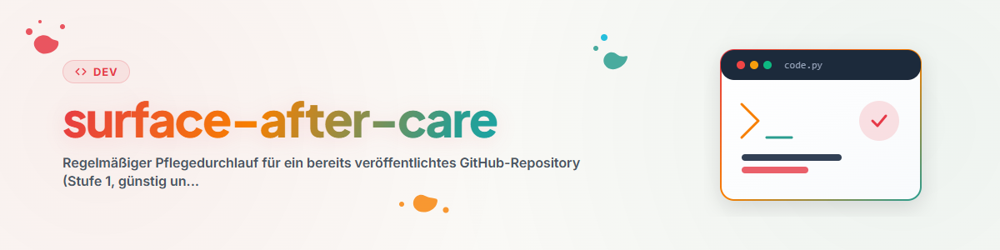

# Surface After Care — 公開済みリポジトリのための定期保守ラウンド

## このスキルをいつ使用するか

**すでに公開されている**リポジトリで、定期的な点検が必要な場合に使用します。これは安価な段階であり、サードパーティ製のリポジトリを棚卸ししたり法的鑑定を開始したりすることなく、リポジトリ自体の中で決定できるすべての処理を行います。

関連スキルとの違い：

| 状況 | スキル |
|---|---|
| リポジトリを初めて公開する | `github-repo-care` |
| リポジトリが公開済みで、定期保守ラウンドを行う | **本スキル** |
| 追加の法的チェック＋全組織にわたる相互参照＋アプリ i18n | `full-after-care` (同義語 `deep-after-care`) |
| 公開前の純粋な法的・プライバシー・ライセンス監査 | `repo-publish-check` |
| ドキュメントの言語バージョンの内容を同期維持する | `bilingual-doc-sync` |
| 多数のリポジトリにわたってこのラウンドを公平に回転分配する | `rotation-check` |

## 核心となる考え方

公開されたリポジトリは 2 つの方向に乖離していきます：**ドキュメントがリポジトリ内にある実際のソフトウェアよりも古いバージョンを記述している**こと、そして**外部に見せることを意図していないファイルが蓄積していく**ことです。どちらも通常は致命的ではありませんが、どちらも獲得したいまさにそのユーザーを失わせます —— 一方はインストール手順が一致しないために離脱し、もう一方はルートディレクトリで `AUFGABEN.txt` や `Plan.txt` を見つけて「この作者は自分のためだけにコードを書いている」という印象を受けます。

このラウンドは両方をクリーンアップします。意図的に繰り返し可能に設計されています：年 1 回の大掃除よりも、年 4 回の 30 分のメンテナンスの方が優れています。

## ワークフロー

手順の順序は任意ではありません。ステップ 0 は後続のすべてのステップの対象範囲を決定するため、最初に配置されています。ステップ 2 は変更をプッシュするすべての処理の前に実行されます —— そうしないと、まだ清掃が必要な状態の上に改善を重ねてプッシュすることになります。ステップ 1 は純粋にサーバー側処理であり、干渉しません。

### 0. 配信プラットフォームの棚卸し

**何も変更する前に：このプロジェクトがどこに存在するかを明確にします。** GitHub リポジトリが唯一の面であることは稀です。npm パッケージページが誤ったインストール指示を含む古いバージョンの README を表示し続けている場合、GitHub 上の README だけを修正しても意味がありません —— パッケージレジストリは検索エンジンでリポジトリ自体よりも上位にランク付けされることが多いため、実際には大多数のユーザーがそこに着殖します。

```bash
# マニフェストから配信チャネルを特定
cat package.json pyproject.toml setup.py Cargo.toml 2>/dev/null | rg -n "name|version|keywords|repository|homepage"
rg -n "npmjs.com|pypi.org|marketplace|registry|crates.io|hub.docker|zenodo|doi" README* docs/ .github/ 2>/dev/null

# チャネルの公開状態を照会（該当するもののみ）
npm view <paket> version description keywords 2>/dev/null
pip index versions <paket> 2>/dev/null
gh release list --repo ORG/REPO --limit 5
```

典型的なプラットフォーム：npm、PyPI、Crates、Docker Hub、MCP レジストリ、プラグイン／スキルディレクトリ、VS Code またはブラウザのマーケットプレイス、アプリストア、Zenodo/DOI、プロジェクト公式ウェブサイト、組織 Profile ページ、`llms.txt`、他ホスト上のミラーリポジトリ。

発見されたリストを実行ログに記録します。これ以降、それが**対象集合**となります：以降のステップでの各変更は、最終的にこのリストのすべてのプラットフォームにミラーリングされます（「すべての配信プラットフォームの一致」を参照）。誰も保守しておらず放棄されたコードを指しているプラットフォームを発見した場合は、それ自体が指摘事項です —— 更新するか明示的に取り下げるかを選択し、そのまま放置しないでください。

### 1. トピック（Topics）の設定

Topics は GitHub 内部で最も重要な検索入口であり、コストもほとんどかかりません。

```bash
gh repo view ORG/REPO --json nameWithOwner,description,repositoryTopics,homepageUrl,visibility
gh repo edit ORG/REPO --add-topic <topic> --add-topic <topic>
```

目標は 3 つの視点から約 5〜12 個の Topics を設定することです：**それが何であるか**（`cli`, `mcp-server`, `python-library`）、**何に関するものか**（`file-management`, `tax`, `note-taking`）、そして**どのように動作するか**（`local-first`, `offline`, `privacy`）。同種の人気プロジェクトで実際に使用されているタグを参考にしてください —— 創作されたタグはユーザーを引きつけません。同じ画面に表示される Description と Homepage も同時に確認してください。

Topics にはステップ 0 の他のプラットフォームにも対応物があります：`package.json` の `keywords`、`pyproject.toml` の `keywords`/`classifiers`、マーケットプレイスやストアのカテゴリやタグ。内容を同一に保ってください —— これらは複数の場所での同じ決定です。

### 2a. プライバシーゲート（Privacy-Gate） — 常に実行

このステップは、一見無害なラウンドであっても決して省略されません。目に見える作業ツリーではなく、**追跡対象（tracked）** のファイル集合の中で検索します。これこそが「綺麗に見える」と「実際に綺麗である」の違いだからです。

```bash
git ls-files
rg -n "C:\\\\Us[e]rs\\\\|/home/[a-z]|s[k]-[A-Za-z0-9]{16}|gh[p]_|gh[o]_|AKIA[0-9A-Z]{16}|API[_-]?KEY|TO[K]EN|PASS[W]ORD|SEC[R]ET|BEGIN [A-Z ]*PRIVATE KEY" $(git ls-files)
rg -n "\x{C3}\x{83}|\x{C2}\x{A0}|\x{FFFD}" $(git ls-files -- '*.md' '*.txt' '*.json')
```

検索パターンに**ご自身の内部保管場所の名称**（パイプラインフォルダ、テーマディレクトリ、プライベート作業領域）を補完してください：

```bash
rg -n "\.SOFTWARE|\.RESEARCH|_control-center|<weitere eigene Ordnernamen>" $(git ls-files)
```

このような参照は Secret ではなくセキュリティアラートを発動しないため、すり抜けてしまいます —— しかし外部の読者にとっては**解読不能**であり（例：「.SOFTWARE パイプラインから移植」は第三者には意味不明）、内部構造を漏洩させることになります。これらは放置せず置換または削除してください。`C:\Users\…` や Token パターンのみを検索するスキャンでは絶対に発見できません。

問題が見つかりましたか？ その場合は発見物の**性質**によって対応手順が決まります —— 「Force-Push ルール」のセクションを参照してください。一度コミットされた Secret は漏洩したとみなされます：`HEAD` から削除するだけでは不十分で、ローテーションする必要があります。

### 2b. ドキュメントの公開意図の確認

本ラウンドの真の核心です。追跡対象の `.md`、`.txt`、`.json` ファイルを 1 つずつ確認し、問いかけてください：**これは本来、外部の人に見せることを意図していたのか？**

```bash
git ls-files -- '*.md' '*.txt' '*.json' | sort
```

ファイル名だけで推測しないでください —— 必ず中身を軽く確認してください。`PLAN.md` が公開ロードマップであることもあれば、一見無害な `notes.md` が内部の価格戦略であることもあります。3 つのカテゴリ：

**リポジトリに含まれるべき** — README, LICENSE, CHANGELOG, SECURITY, CONTRIBUTING, `docs/`, API 参照, サンプル設定, 実際のロードマップ, マニフェスト（`package.json`, `pyproject.toml`）, ロックファイル, CI 設定。

**リポジトリに含まれるべきではないが、機密性はない** — 本ラウンドの最も一般的なケース。タスクや計画ファイル（`AUFGABEN.txt`, `Plan.txt`, `TODO-intern.md`）、セッションメモや引き継ぎファイル（`HANDOFF`, `BRIEFING`, `_handoff/`）、固有パイプラインの状態ファイル、開発日記、`_archive/`、ローカルパスを含むレジストリ／インデックス JSON、中間生成物、エージェントの作業ファイル。これらは危険ではありませんが、雑乱さと整理されていない作業現場という印象を与えます。対応：`.gitignore` に追加し、`git rm --cached <file>` を実行して**通常通り Push** します。

**リポジトリに含まれるべきではなく、機密性がある** — 資格情報（Credentials）、個人データ、顧客データ、内部財務計算、価格／交渉戦略、未公開のビジネスプラン、契約書案、競合上の価値があるすべてのもの。ここでは通常のコミットでは不十分です。「Force-Push ルール」を参照してください。

`.json` ファイルについては再確認が必要です：マニフェストやロックファイルは保持されますが、ローカル設定、Task/Registry ファイル、エクスポートダンプ、および絶対パスやホスト名を含むものは典型的な密航者です。

誰かが探す可能性のあるファイル（ロードマップなど）を削除する場合は、情報がどこに移動したかをコミットメッセージや README に簡潔に記載してください —— そうしないと退化のように見えてしまいます。

### 3. バナー

バナーは、訪れた人が読み始めるかどうかを大きく左右します。README の最初の要素としてバナーが存在し埋め込まれているか確認してください。

不足している場合、3 つの作成経路があります（以下の優先順位を推奨）：

1. **エージェントの画像生成機能**（例：agy。「生成」という単語はリアルな PNG 画像生成のトリガーです）、タイポグラフィよりも視覚モチーフが適している場合。
2. **Codex**、コードからバナーを生成し、参考にできるデザイン仕様が存在する場合。
3. **SVG として自作**、バナーが主にロゴマーク＋造形言語である場合 —— これは多くの場合最も迅速でコントロールしやすい選択肢であり、SVG は後から修正可能です。

プロジェクトがグループに属している場合は、デザインファミリーの一貫性を維持してください：同じベースカラー、同じ美学、同じロゴマーク処理。ファミリーから逸脱したバナーは、ない方がマシに見えます。標準サイズは 1200x300。PNG をリポジトリに保存し、SVG ソースをその隣に配置します。

### 4. 記述を実際のコードの実態と照合

ここで最大の価値が生まれます。README は様々な主張をしています —— 盲信せずにコードで検証してください：

- README/Badge 内の**バージョン**を `pyproject.toml`/`package.json`/`__version__` および最新の Release Tag と照合します。複数のバージョン記載場所がある場合は、すべてをチェックしてください。
- **インストール手順**を実際に実行（少なくとも論理的に確認）します：指定された名称のパッケージが存在するか？ コマンドや Flag は一致しているか？
- **機能リスト**をコードと照合：記載されているすべてが存在するか？ 新機能がリストから漏れていないか？
- **数値データ**（ツール数、対応フォーマット、テストカバー率）をそのまま引き継がず源泉で再カウントします。README 内の数字は静かに古くなります。
- **スクリーンショット**を現在の実際の画面と照合します。
- **動作要件**（Python/Node バージョン、依存関係）をマニフェストと照合します。
- 関連プロジェクト、ドキュメント、レジストリへの**リンク**：現在も有効か？

**修正は、問題が発覚した面だけでなく、すべての面に適用されます。** 記述内容に誤りがあることが判明した場合 —— 特にオーナー自身が明かした場合 —— 同じ記述が他の場所（組織 Profile、`llms.txt`、第 2 言語バージョン、関連プロジェクトの README）にも存在する可能性が極めて高いです。完了マークをつける前に具体的に検索してください：

```bash
gh search code "<特徴的な表現>" --owner ORG
```

そうしないと 1 箇所だけ修正して 3 箇所を残すことになり —— その矛盾は次のリポジトリの順が来たときに初めて発覚します。これは時間の無駄であるだけでなく、ドキュメントへの信頼を損ないます：同じ事項に対して 2 つの異なる記述を見つけた読者は、どちらも信じなくなります。

続いて、弱い部分の**見栄え**を改善します：オプションの長いリストは表形式にすると読みやすくなります；コードブロックには言語 Tag が必要です；構造やフローの概要は散文よりも Mermaid 図や ASCII ツリーの方が素早く把握できます；ファーストビューにはバッジや背景ストーリーではなく、目的、インストール方法、使用例を表示すべきです。README が ~400 行を超える場合は、詳細を `docs/` に切り出してリンクしてください。

**README の言語ルール：** 標準設定は**英語の `README.md`** に**ドイツ語の第 2 バージョン**を加えたものです。例外：アプリケーションの対象分野自体がドイツ語圏である場合（ドイツの法律、税制／助成金制度、ドイツ語話者のターゲット層）、または現在ドイツ語版のみが存在する場合 —— この場合はドイツ語が主言語のままとなります。コードレベルでプロジェクトがすでにサポートしている他の各言語についても、対応する README バージョンを用意してください。リポジトリで確立されている命名規則（`README_de.md`, `README.de.md`, `docs/README.de.md`）に従い、第 2 の規則を勝手に作成しないでください。ヘッダーでお互いへのリンクを設定します。

### 6. 不足している標準言語の作成

**標準言語**の中で不足している README バージョンを補全します：ドイツ語、英語、スペイン語、簡体字中国語、日本語、ロシア語。目的はリーチの拡大であるため、これは主にユーザー向けプロジェクトに適用されます —— 英語圏のみを対象とする開発者向けライブラリの場合、ロシア語の README は利益ではなく単なる保守負担です。意識的に決定し、次回ラウンドで再議論しないよう決定を実行ログに記録してください。

新規作成するバージョンは**内容を記入して作成し、空のまま放置しないでください** —— 「TODO: translate」とだけ書かれたファイルは完全性を偽装するため、ファイルが存在しないより悪質です。内容の平行性と同期調整は `bilingual-doc-sync` が処理します。3 つ以上の言語バージョンがある場合は、そのスキルを呼び出して照合させることを推奨します。

### 7. 可視性とプロモーション

**この**プロジェクトにとって実際にユーザーをもたらす対策を考え、実施してください：

- 技術的にプロジェクトが所属すべき**レジストリ**：パッケージレジストリ（npm, PyPI）、MCP レジストリ、プラグイン／スキルディレクトリ、マーケットプレイス。
- **キュレーションリスト**（`awesome-*` およびテーマ別コレクション）、登録基準が真に満たされている場合に限ります。基準を満たしていない外部リストへの PR は評判を落とします。
- **自社／自家プラットフォーム**：組織 Profile、`llms.txt`、プロジェクト公式サイト、エコシステム README、関連する自家リポジトリからの参照。
- 契機としての **Release Notes**：新機能のストーリーを伴わない Release は気づかれません。

**承認ゲート（Approval Gate）：** 外部に向けたすべての動作 —— サードパーティリポジトリへの PR、外部リストへの登録、投稿、申請 —— は、そのチャネルに対する永続的な許可がない限り、**案を提示し明確な承認を得てから実行**します。自社プラットフォーム上の変更にはこのゲートは不要です。理由は単純です：外部リポジトリへ送信して撤回された PR は公開表示され、プロジェクトに悪影響を及ぼすからです。

### 8. 組織ページへの登録

まず自身の組織：プロフィールの README（`ORG/.github` → `profile/README.md`）にリポジトリが掲載されているか、正しいカテゴリか、最新の説明か？

```bash
gh api user/orgs --jq '.[].login'
```

次に**すべて**の組織を確認し、組織ごとに 1 つの質問に答えます：この組織ページの訪問者はこのリポジトリから利益を得られるか？ ほとんどの場合、答えは「いいえ」です —— その場合は「リンクしない」が正しい結果であり、欠落ではありません。答えが「はい」の場合（テーマの近さ、共通のユーザー、そこにあるプロジェクトを補完するツール）、名称だけでなくメリットを説明する 1 行を添えて参照を設定します。

プロフィールは固有のリポジトリ（`ORG/.github`）に存在します。そこでの変更は並行して保守・プッシュされます —— ステップ 11 の Dirty Tree ルールに従います。

### 10. Issue および Pull Request の処理

```bash
gh issue list --repo ORG/REPO --state open --limit 50
gh pr list --repo ORG/REPO --state open --limit 30
```

単に数をカウントするのではなく、処理を推し進めます：

- **修正可能なバグ**を直接修正 —— 本ラウンド中はコンテキストがすでにロードされています。テストと Issue 番号の参照を含むコンパクトな Fix。
- **解決済みの Issue** を、解決した内容の説明を 1 文添えてクローズします。
- **内容が不明確な報告**には具体的な確認（バージョン、OS、再現手順）を返します。
- **PR**：Diff を精読し、テストを実行した上で Merge するか、理由を添えて返答します。数ヶ月放置された PR は、礼儀正しい拒否よりも好意を失わせます。
- **停滞した（Stale）ケース**を放置せず解消します。

**承認ゲート（Approval Gate）：** 公开コメント、理由付きクローズ、外部貢献の Merge は対外コミュニケーションです —— 永続的な許可がない限り、実行前に案を提示してください。自リポジトリ内の純粋なコード修正は対象外です。

### 11. コミット、プッシュ、検証

ラウンドは編集で終わるのではなく、それらが**外部に公開された**時点で終了します。未プッシュの改善で溢れた作業ツリーは最悪の結果です：次のセッション（別のエージェントやデバイスである可能性があります）は、まず見知らぬ半端な状態を把握することから始めなければならず、公開プラットフォーム上では何も改善されていません。

プッシュ前に検証可能な項目を短時間で確認します：テストとスモークチェックを実行し、ドキュメント変更の場合はリンクとレンダリング表示を確認します。その後、すべてを 1 つのまとめコミットに放り込むのではなく、**テーマごとに分割されたコミット**にまとめます —— クリーニング、ドキュメント更新、バグ修正は 3 つの異なる事象であり、後でそのうちの 1 つを取り消したいと思った人は感謝するでしょう：

```bash
git add .gitignore && git rm --cached <interne dateien>
git commit -m "chore: 内部作業ファイルを Git 追跡から除外"
git commit -am "docs: README を最新状態に更新 (バージョン, ツール数, 画面ショット)"
git commit -am "fix: <Issue 番号> ..."

git pull --rebase        # ブランチが分岐している場合、プッシュ前に実行
git push
```

その後、想定するのではなく実際に検証します：レンダリング表示でのリモート README、CI の実行状態、Release および Tag の状態。

```bash
gh run list --repo ORG/REPO --limit 3
gh repo view ORG/REPO --json description,repositoryTopics,url
```

**ドキュメントのみを修正したにもかかわらず CI が赤くなった場合**、原因があなた自身にあることはほぼありません。このリポジトリファミリーで 1 日に**3 回**遭遇した圧倒的に最も頻繁なケースは、**ルールセットが固定されていない未ピン留めの Linter** です。ご自身のコミットを疑う前に、**まず**ここを確認してください。

発生メカニズム：Workflow 内で未ピン留めの依存関係（例：`ruff>=0.12`、またはバージョン指定なし）に対して `ruff check`（または flake8, eslint …）が実行され、かつ明示的なルール選択（`[tool.ruff.lint] select = [...]`、`pyproject.toml` がない場合は個別の `ruff.toml`）がない場合、Linter は**新しくインストールされたバージョン**のデフォルトルールに従います。Linter の新しいリリースがこのデフォルトをシフトさせ、変更されていないコードが赤くなります。決定的な兆候：

- プロジェクトが設定したことのないルールコード（`UP045`, `UP006`, `BLE001`, `RUF100`, `DTZ005`, `N999` …）、時に数百個規模。
- 失敗はしばしば**プラットフォーム間で分裂**します：古いバージョンのキャッシュを持つ Runner は緑のまま、新規のものは赤になります。
- 時に修正不可能な内容（`N999` がパッケージ名自体を警告）を指摘します —— 標準ルールではなかった確固たる証拠です。

修正方法：以前緑だったルールセットを固定します —— `select = ["E4","E7","E9","F"]` は古典的な ruff のデフォルトです。`pyproject.toml` が存在しない場合は `ruff.toml` を作成してください。**新** Linter バージョン自体に対して検証します（インストールし、設定なしで指摘を再現、設定ありで "passed" を確認）。新しいルールは**新タスク**としてプロジェクトに追加します —— 明示的な採用は決定であり、ツール更新の副作用ではありません。これは実際に繰り返し発生している発見です：ピン留めを行わないと、同様に設定された**すべての**リポジトリで次の Linter リリース時に CI が再び崩壊します。

**プッシュを行わない**ケースが 2 つあります：プロジェクトに公開／提出の凍結期間が適用されている場合、または状態が明確に未完成である場合。どちらも理由を説明すべき例外であり、標準的なケースはコミットしてプッシュすることです。

公開凍結期間中であってもラウンドは中断されず、**ルーティングが変更**されます：独立したブランチ（`judging-hold/…`, `freeze/…`）でローカルコミットを行い、メインブランチは提出された状態のまま変更せず、実行ログに凍結理由を記録し、解除後に追いつかせます。一貫性を保つことが極めて重要です：凍結されているのは `git push` だけでなく、**リモートで可視なすべての変更**です —— Topics、説明、ホームページ、Release、Issue/PR の操作も同様に公開プロジェクトを変更します。

同一リポジトリの他のクローン（2 台目のデバイス、デプロイコピー、ミラー）が存在する場合は、プッシュ直後に同期引き込みを行ってください。10 コミット遅れたクローンは、次のトラブルシューティング時にすでに存在しない状態に基づいて誤った診断を引き起こします。

#### 他のリポジトリへの変更 — Dirty Tree 特例

本ラウンドでは、保守対象リポジトリの**外部**に変更が定期的に発生します：組織 Profile への 1 行追加（ステップ 8）、後の深層ラウンドでの関連リポジトリへの逆リンク。このような変更も同様にコミットおよびプッシュされます —— 未プッシュの逆リンクは存在しないリンクと同じです。

他人のリポジトリに触れる前に、その状態を短時間で確認します：

```bash
git -C <path> status --porcelain
```

**作業ツリーがクリーン** → 編集を行い、**独立した明確なテーマのコミット**（`docs: link <projekt>`）でコミットしてプッシュします。保守対象リポジトリのコミットと混ぜないでください：独自の履歴と読者を持つ異なるリポジトリです。

**Dirty だが外部の変更が他のファイルにある** → ご自身の編集はクリーンに実行可能です。**ご自身のファイルのみをパス指定で Stage および Commit** し、未検証の他人の作業が混入しないようにします：

```bash
git -C <path> add README.md
git -C <path> commit -m "docs: link <projekt>"     # ステージングされたパスのみ
```

ただし**プッシュはしないでください**。コミットはローカルでは無害ですが、プッシュはそうとは限りません：他人の作業状態が最終的に何を目指しているか分かりません（アメンド、リベース、分割の作業中である可能性があります）、あなたのプッシュは相手にコンフリクト処理を強制することになります。ローカルコミットは他人に強制することなく作業成果を保護します。後でそのリポジトリを担当するラウンドがそれを見つけて持ち出します。

**編集が必要なまさにそのファイルが Dirty** → 触れないでください。ここでは他人の中間状態の上に構築して一緒にコミットしなければならなくなります。それを事前に理解するコストは、この 1 つのリンクの価値を上回ります。

**対象リポジトリにアクティブなロック (`LOCK*.txt`) がある** → **一括禁止として扱うのではなく、まずロックの内容を読んでください。** ロックはその作用範囲を記述しており、多くの場合「一切禁止」よりも狭いです。典型的なケース：

- **編集ロック**（「現在誰かが作業中」） → サイドファイルを含め、一切触れないでください。
- **純粋な公開／プッシュロック**（提出中、審査中、凍结期間） → ローカル作業は許可されたままであり、リモートとの接触のみがブロックされています。独立したブランチで作業しローカルでコミットします。**リモートで可視なステップは省略されます** —— プッシュだけでなく、Topics、説明、ホームページ、Release、Issue/PR 操作も含まれます。

プッシュのみをブロックするロックを完全禁止として読み替えると、安全性の向上なしにラウンドのローカル部分全体をドブに搭てることになります。逆に、メダデータ変更を行いながらプッシュのみを省略するのも不十分です。疑問がある場合は、ロックを引用して質問してください。

#### 要望を紛失させてはならない

これらの理由のいずれかにより編集が実行**されなかった**場合、対象リポジトリのタスクリスト（`AUFGABEN.txt`, `TODO.md`, `TODO.txt` のうち存在するファイル）に記録します。日付、希望する編集内容、および理由を含むエントリ：

```markdown
- [ ] [2026-07-24, after-care] README に <projekt> への逆リンクを追加
      (スキップ: README に未コミットの第三者による変更あり)
```

これが「延期」と「忘却」の違いです：タスクリストはそのリポジトリの次のメンテナが必ず目にする場所に存在するため、外部実行のログに記録されたメモよりも信頼性が高くなります。タスクリストが存在しない場合は新規作成しないでください。ご自身のログ内の未解決項目で十分です。

**アクティブなロック制限下では、上記すら適用されません** —— ファイルは完全無変更のままとし、メモはご自身の実行ログのみに残します。回転チェックが未解決項目を把握できるよう、どちらの場合もご自身のログに記録してください。

最後にステップ 0 のプラットフォームに対応します —— 次のセクションを参照してください。

## すべての配信プラットフォームの一致

ラウンドの最後にステップ 0 のリストと照合します：**ユーザーが見る可能性のあるすべての変更は、ユーザーが検索する可能性のあるすべてのプラットフォームに到達しなければなりません。** npm ページが GitHub と異なるストーリーを語っているリポジトリは、1 つの面しか持たないリポジトリよりも悪い状態です。

決定的なメカニズム：**パッケージレジストリはリポジトリの現在の状態ではなく、最後の Publish 時の README を表示します。** npm や PyPI 上の README の修正は、新しいバージョンが発行されて初めて表示されます。修正が内容的に重要である場合（誤ったインストール、誤ったバージョン、古い機能リスト）、パッチリリースの発行が伴わなければなりません —— そうしなければ修正は無効のままです。

| プラットフォーム | そこで保守される内容 | どのように到達するか |
|---|---|---|
| npm | README, `description`, `keywords`, リポジトリリンク | `npm publish`（パッチバージョン）経由のみ；メタデータは `package.json` 由来 |
| PyPI | README (`long_description`), Classifiers, プロジェクト URLs | 新規アップロード経由のみ；メタデータは `pyproject.toml` 由来 |
| MCP レジストリ／プラグインディレクトリ | 説明, バージョン, ツールリスト, 入門ドキュメント | レジストリによる：マニフェスト更新または再申請 |
| マーケットプレイス／ストア | 説明, スクリーンショット, カテゴリ, 言語バージョン | 各自の管理UI経由；スクリーンショットはそこで特に早く陳腐化します |
| Docker Hub／コンテナレジストリ | Description, Tag, 使用例 | リポジトリ説明プラス新しい Tag |
| Zenodo / DOI | メタデータ, 著者, バージョン | メタデータはその場で編集可能、コンテンツ更新には新バージョンが必要 |
| 公式サイト／組織 Profile／`llms.txt` | 簡潔な説明, リンク, ポジショニング | 直接編集可能 —— 最も安価なプラットフォームなので絶対に忘れないでください |

バージョンが引き上げられる場合、**すべてのバージョン保持場所**が同時に移動しなければなりません：マニフェスト、コード定数、README Badge、Changelog、Release Tag、`llms.txt`。中途半端に引き上げられたバージョン状態は、一貫して古い状態よりも診断が困難です。

あるプラットフォームでの更新が現時点で不可能または適切でない場合（例：誤字修正のみのための Release）、次回ラウンドが差異を失念と誤解しないよう実行ログに記録してください。

## Force-Push ルール

標準原則は **Force-Push を行わない**ことです。内部計画ファイルを事後的に ignore 化することは、履歴を書き換える理由にはなりません：工数が高く、すべてのクローンやフォークが壊れ、オープンな PR が無効化されます —— そして内容に危険がないため利益はごく僅かです。標準的な手順：

```bash
git rm --cached <file>            # 追跡から除外、ローカルには保持
# .gitignore を更新
git commit -m "chore: 内部作業ファイルを Git 追跡から除外"
git push
```

履歴を書き換える（したがって `--force-with-lease` でプッシュする）ことが正当化されるのは、**真の漏洩（Leak）** の場合のみです：資格情報や Key、個人データや顧客データ、および真の競合上の価値を持つドキュメント（内部財務計算、価格戦略、未公開計画、契約内部詳細）。この場合：

1. **まず影響を受ける Secret をローテーションします** —— この時点ですでに履歴はコピー、フォーク、キャッシュされています。ローテーションこそが有効な防護であり、削除は単なる表面上の処理です。
2. 履歴をクリーンアップし（`git filter-repo` または BFG を使用）、`--force-with-lease` でプッシュします。
3. フォークやキャッシュを確認し、必要に応じて孤立したオブジェクトの削除を GitHub サポートに依頼します。
4. 実行ログに全プロセス（漏洩内容、日時、ローテーション措置）を記録します。

「機密性なし」と「機密性あり」で疑問がある場合：機密性ありとして扱い、上告してください。リスクコストは非対称です。

## 指摘事項はログ行だけでなくタスクに変換する

保守ラウンドでは、同じ実行内で解決できる／解決すべき以上の問題が定期的に見つかります：不足している言語バージョン、近代化の遅れ、一度も行われていない公開など。**このような指摘事項は、発見された瞬間にタスクに変換されなければなりません** —— そうしなければ完了したラウンドのログ内に埋もれ、プロジェクトの次のメンテナはログを翻って見たりしません。

タスクは**プロジェクトのローカルフォルダタスクシステム**に属します —— このプロジェクトで次に作業する人が確認する場所です。通常、それはプロジェクトフォルダ内の `AUFGABEN.txt` または `TODO.md` であり、そのフォルダは**Git クローン内部にはない**ことが多く、プロジェクト計画が置かれているディレクトリにあります。クローンにはコードが含まれ、プロジェクトフォルダには管理が含まれます。次の `git clean` で消えてしまうクローン内の記録はタスクとは言えません。

3 つの点に注意してください：

1. **内部タスクリストと公開ロードマップを分離する。** `TODO.md` が丁寧に保守された公開ロードマップである場合があります —— その場合、そこは内部の補修作業を投げ込む場所ではありません。追記する前に中身を確認してください：「Public roadmap」などの見出しがある場合は、隣の内部ファイル（`AUFGABEN.txt`）に記述し、内部タスクとしてマークしてください。
2. **重複作成する前に既存のエントリを確認する。** 発見された問題がすでに記載されていることが多々あります。その場合は新規条目を作成せず、本ラウンドの最新の証拠（「確認済み：`--help` が完全に日本語出力を返す」）で**内容を補強**します。最新の証拠を伴う既知の問題は、隣に作成された重複条目よりも価値があります。
3. **完了した事項を記録する。** 本ラウンドで解決された問題は、コミットハッシュを伴う完了済み項目として記載されるべきです。これにより次のラウンドに対してなぜ問題が消えたかが説明され、同じ問題が「再発見」されるのを防ぎます。

タスクの記述は、本ラウンドのコンテキストがなくても理解できるように表現してください：何が発見されたか、なぜ重要か、次のステップは何であるべきか。「i18n が不完全」は適切なタスクではありません。「カタログには `status.title` のみが含まれ、そこでは es/zh/ja/ru が空である —— まず CLI 文字列をカタログに抽出し、その後 6 言語すべてを補充する」が適切なタスクです。

## 実行ログ

結果を `_after-care/LOG.md` に記録します（このフォルダは `.gitignore` に属します —— ステップ 2b のルールに従い、パイプラインの素材であってリポジトリの公開コンテンツではありません）。1 実行につき 1 行、日付、レベル、明確な決定事項を記述します：

```markdown
## 2026-07-24 — surface
- プラットフォーム: GitHub, npm (<paket>), MCP レジストリ, 組織 Profile, llms.txt
- Topics: +local-first, +mcp-server; package.json の keywords を同期
- 削除: AUFGABEN.txt, _handoff/ (gitignore 済み、Force-Push 不要)
- README: バージョン 0.9 -> 1.2 を修正、ツール数 23 -> 26 を再カウント
- 言語: EN + DE を保守；ES/ZH/JA/RU は意図的に見送り（開発者向け受众）
- Issues: #12 を修正、#7 をクローズ (解決済み)、#15 に確認を送信
- Push: 3 コミット、CI 緑；README 修正のため npm 1.2.1 Republish を実行
- 宿題: Store のスクリーンショットが古いため、再 Build が必要
```

実行ログにより、次のラウンドで同じ決定を繰り返す必要がなくなり、多数のリポジトリにわたる回転保守（`rotation-check`）の基礎となります。

## よくあるミス

| ミス | 修正 |
|---|---|
| 作業ツリーのみを確認し、`git ls-files` を確認しなかった | 常に追跡対象のファイル集合を確認する —— 問題はそこに潜んでいる |
| プライバシーゲートがパスと Token のみを検索した | 自社のパイプライン／フォルダ名も検索する —— アラートを発動せずすり抜ける |
| 内部ファイルを削除する際に Git 履歴を書き換えた | 非機密ファイルの場合、`git rm --cached` ＋ 通常 Push で十分 |
| `HEAD` から Secret を削除して対応完了とみなした | Secret をローテーションする；それ以外の対応は単なる表面上の処理 |
| ファイル名のみでファイルを分類した | 必ず中身を軽く確認する —— ファイル名は意図を正確に反映しない |
| README 内の数字を再カウントせずそのまま増加させた | 源泉で再カウントする（ツールリスト、テスト実行、マニフェスト） |
| 新しい言語バージョンを空の骨組みとして作成した | 内容を記入するか作成しない —— 空の骨組みは完全性を偽装する |
| 既存の規範の隣に第 2 の README 命名規範を導入した | リポジトリに既存の命名規範を踏襲する |
| 承認なしにサードパーティのリストに PR を送信した | 対外コミュニケーションはまず案を提示する；自社プラットフォームのみ自由変更可能 |
| Issue を処理せず数だけカウントした | 修正、クローズ、または具体的に質問する —— 各 Issue に明確な状態を与える |
| ファミリーのデザインから逸脱したスタイルでバナーを自作した | エコシステムの既存のデザイン言語に従う |
| リポジトリ内の README を修正したが、npm/PyPI ページは古いまま | レジストリページは前回の Publish 由来 —— Patch バージョンを発行する |
| マニフェスト内でのみバージョンを引き上げた | すべてのバージョン保持場所を同時に更新：マニフェスト、コード、Badge、Changelog、Tag、`llms.txt` |
| 修正が完了したのにローカルに未プッシュのまま放置した | コミットとプッシュは本ラウンドの一部；凍結制限のみが例外となる |
| すべての変更を 1 つの大包コミットにまとめた | クリーニング、ドキュメント、修正を分離する —— そうしないと後で個別 Revert できない |
| ドキュメントコミット後に CI が赤くなり、自分の変更を疑った | 未ピン留めの Linter が `select` なしで新バージョンのデフォルトを採用した —— ルールセットを固定する |
| 発見された場所でのみ誤った記述を修正した | 組織全体でその表現を検索する —— 通常 Profile、`llms.txt`、第 2 言語バージョンにも存在する |
| Dirty なサードパーティリポジトリで `commit -a` を使用した | パス指定で正確に Stage して Commit し、Push はしない —— 他人の作業には触れない |
| クリーンな組織 Profile リポジトリで変更を行ったが Push しなかった | クリーンなサードパーティリポジトリは独立した Commit **および** 独立した Push を行う |
| スキップした変更をご自身のログにのみ記録した | ターゲットリポジトリのタスクリスト（存在する場合）にも追加記録する |
| 発見した問題を実行ログにのみ記述した | プロジェクトのローカルフォルダシステム内でタスクに変換する —— 後でログを翻る人はいない |
| 内部補修作業を公開ロードマップに吊り下げた | まず内部を確認する；「Public roadmap」は隣の内部ファイルを使用することを意味する |
| 既知の問題を新しい条目として重複作成した | 本ラウンドの最新の証拠で既存の条目を補強する |
| 編集ロック制限下でロックされたリポジトリに TODO 行を書き込んだ | ロックはプロジェクト全体に適用される：中の何物にも触れてはならない |
| Push ロックを完全禁止と読み替えてリポジトリ全体をスキップした | ロックを読め：発行のみを制限している場合は、独立したブランチでローカルラウンドを続行する |
| Push ロック制限下で Push はしなかったが、Topics や説明を変更した | メタデータもリモートで可視である —— 公開凍結期間下では同様に省略する |

## 最終チェックリスト

- [ ] 配信プラットフォームを特定し、実行ログに記録した。
- [ ] Topics、Description、Homepage を設定および確認した。
- [ ] プライバシーゲートを追跡対象集合に対して実行し、発見事項を処理した。
- [ ] `.md`/`.txt`/`.json` の公開意図を審査し、内部ファイルを ignore 化した。
- [ ] 真の Leak がない限り Force-Push は行わない；Leak がある場合はローテーションを実施した。
- [ ] バナーが存在し、README に導入されている。
- [ ] バージョン号、機能、数値統計、画面ショット、リンクを実際のコードと照合した。
- [ ] 見栄えを改善した（表、図、ファーストビュー）。
- [ ] README の言語マトリクスが完全である；他言語に対する決定が記録されている。
- [ ] 可視性対策を実施または承認申請した。
- [ ] 自社組織 Profile 内のエントリを確認し、意義のある他組織参照を確立した。
- [ ] サードパーティリポジトリへの変更：クリーン → Commit および Push 済み；Dirty → ローカル Commit 済み；
      未実行 → ターゲットリポジトリのタスクリストに記録済み。
- [ ] Issue および PR を明確な状態に処理した。
- [ ] 独立した Commit を作成して Push し、CI およびリモート表示効果を検証した。
- [ ] すべての配信プラットフォームを同じ状態に同期した（必要に応じて Patch バージョンを発行）。
- [ ] 未解決の問題をプロジェクトのローカルタスクシステムにタスクとして記録した。
- [ ] 実行ログを `_after-care/LOG.md` に書き込んだ。

## 変更履歴

### 1.6.0 (2026-07-24)
- 規則追加：内容の修正はすべての面に適用される。実践の教訓から —— あるユーザーの明確化が第 1 ラウンドの Hub で修正されたが、気付かれないまま組織 Profile（EN, DE, `llms.txt`）にさらに 5 箇所残っており、9 ラウンド後に初めて発見された。

### 1.5.0 (2026-07-24)
- 1 日に 3 回連続でこのパターンに遭遇した後（n8n-workflow-manager ruff 0.15, clirec + swarm-ai ruff 0.16）、Linter の診断説明を強化：「まず確認する」、具体的な犯人ルールコード、プラットフォーム間の分裂、`pyproject.toml` がない場合の `ruff.toml` による修復、新版 Linter 自体に対する検証。

### 1.4.0 (2026-07-24)
- 診断説明を追加：純ドキュメントのコミット後に CI が赤くなった場合、最も頻繁な原因はルールセットが固定されていない未ピン留めの Linter である —— ツールの新バージョン発行がデフォルトルールを変更し、未変更のコードを赤くする。修復方法：ルールセットを固定し、新しいルールはタスクとして処理する。2 回連続で発生（n8n-workflow-manager で ruff 0.15, clirec で 0.16）。

### 1.3.0 (2026-07-24)
- 新セクション「指摘事項はタスクに変換する」を追加：本ラウンドで自力解決できない問題は、発見された瞬間にプロジェクトのローカルフォルダタスクシステム内の条目に変換する —— 次のメンテナが見る場所であり、完了したラウンドのログ内ではない。内部リストと公開ロードマップの分離、重複作成ではなく内容の補強、コミットを伴う完了済み事項を含む。

### 1.2.0 (2026-07-24)
- プライバシーゲートに自社の内部保管場所の名称の検索を追加。これらは Secret ではないためアラートを発動せず、パスと Token のみを対象とするチェックを通過してしまう —— しかし読者にとっては解読不能であり内部構造を漏洩させる。

### 1.1.0 (2026-07-24)
- ロックファイルを一律の禁令としてではなく内容を読んで対応：純粋な公開／Push ロックは本ラウンドを直接中断せずローカルブランチに重定向する。同時に、類似のロック制限下ではメタデータ、Release、Issue/PR 操作も省略が必要であることを明確化 —— これらは Push と同様にリモートで可視である。

### 1.0.0 (2026-07-24)
- 初版。`github-repo-care` から派生したリポジトリ事後ケアのレベル 1。
