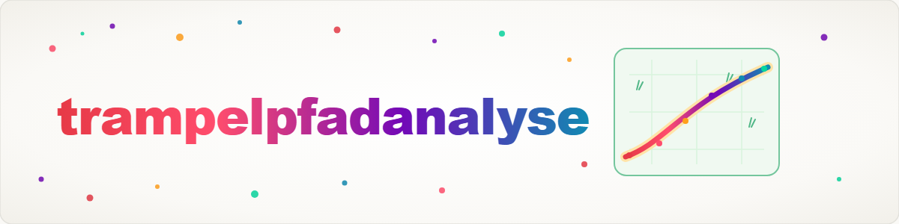

> **Русский** — Официальная русская версия `trampelpfadanalyse`.


# Анализ протоптанных троп (Desire-Path Analysis) — эмпирическая визуализация конвенций для LLM (Русский)

Метод выявления ошибок в рабочих процессах конвейеров и контрольных файлов, вызванных не сломанным кодом, а тем, что **конвенция невидима для LLM**. Вместо того чтобы гадать, является ли README или правило «достаточно понятным», вы измеряете это эмпирически: наивные субагенты без предварительных знаний запускаются в рабочий процесс, их поведение становится **базовым уровнем (baseline)**; точечное изменение документации («указатель») является **вмешательством (intervention)**, а новые наивные субагенты обеспечивают **повторное тестирование (retest)**. Разница (diff) по сравнению с базовым уровнем служит измерением успеха.

Название происходит от понятия *желаемая тропа / протоптанная тропа* (нем. *Trampelpfad*, англ. *desire path*): дорога должна проходить там, где люди реально ходят вместо мощёного маршрута. По аналогии, пути наивных LLM показывают, где документация или ограждения действительно необходимы — а не там, где мы это предполагаем.

## Когда использовать этот навык

- Агенты неоднократно игнорируют правило/конвенцию, хотя она задокументирована.
- Вы хотите узнать, является ли процедура **видимой/обнаруживаемой** для LLM перед написанием дополнительной документации («говорит ли кто-нибудь здесь со стеной?»).
- После реструктуризации (новые директории, переименования): могут ли агенты по-прежнему находить точки входа?
- Вы внесли изменение в документацию и хотите **доказать**, что оно работает — а не просто надеяться на это.
- Тест перед интеграцией новых LLM-партнёров в конвейер.

Не подходит для: чистых ошибок в коде (→ систематическая отладка) или выбора паттернов координации роя для продакшен-задач (→ см. `swarm-operations`). Этот навык использует рой наивных агентов исключительно как **измерительный инструмент**.

## Основная идея в одном предложении

Относитесь к документации как к UX: важно не то, что вы написали, а то, что непредвзятый пользователь (здесь: наивный агент) реально с этим делает — и вы измеряете это, меняете и измеряете снова.

---

## Процесс: 5 шагов

```
1. БАЗОВЫЙ УРОВЕНЬ  Наивные субагенты → измерить текущее поведение (количественно)
2. АНАЛИЗ ПУТИ      Где именно сбой? Какое место в документации вводит в заблуждение?
3. ВМЕШАТЕЛЬСТВО    Установить «указатель» (сделать README/конвенцию заметнее)
4. ПОВТОРНЫЙ ТЕСТ   СВЕЖИЕ наивные субагенты, идентичный тест-кейс
5. РАЗНИЦА (DIFF)   Повторный тест vs Базовый уровень → измерение успеха + честная оценка
```

### Шаг 1 — Базовый уровень: наивное измерение текущего поведения

Сначала сформулируйте проблему как **проверяемый вопрос**, например: «Создаёт ли агент лог в месте, предусмотренном конвенцией?» или «Находит ли агент точку входа в конвейер?».

Затем запустите наивных субагентов:

- **Наивный означает:** без памяти о проекте, без навыков, без предварительных подсказок — агент знает только путь входа и задачу. Это измеряет **чистую обнаруживаемость через существующую документацию**, а не предварительные знания агента.
- **Изолированные копии в песочнице:** каждый агент-проба работает со своей собственной копией затронутой папки/воркфлоу, поэтому пробы не влияют друг на друга, а реальное состояние остается нетронутым.
- **Один и тот же тест-кейс, несколько повторений:** вариативность реальна. Одна проба — это анекдот; n повторений (например, 3 или более при необходимости) дают показатель.
- **Дешёвая «наивная» модель** достаточна и реалистична — она не должна хитро угадывать, а должна показать, куда документация ведёт среднего агента.

Минимальный промпт для пробы (настройте плейсхолдеры):

```
Ты исследуешь <СИСТЕМА>. Она находится по адресу: <ПУТЬ>.
ЗАДАЧА: <конкретная задача>.
ПРАВИЛА:
1. Ты знаешь только указанный выше путь, больше ничего.
2. Исследуй, чтобы выполнить задачу. Макс. <N> шагов.
3. В конце отчитайся: VISITED_DIRECTORIES, READ_FILES,
   TASK_COMPLETED (yes/no), MOST_HELPFUL_FILE.
```

**Зафиксируйте как метрики базового уровня** (всегда количественные, никогда «выглядит лучше»):

| Метрика | Значение |
|---|---|
| Уровень успеха | как часто задача выполнялась по конвенции (например, 0/3) |
| Ошибочное поведение | как часто использовалось неверное место/метод (например, 3/3 коллективный лог вместо поштучного) |
| Путь к цели | сколько шагов/обходов потребовалось для достижения цели |
| Слепые зоны | какой релевантный файл/место никто не открывает |

### Шаг 2 — Анализ пути: где на самом деле происходит сбой?

Оцените отчёты проб совместно (достаточно «тепловой карты» посещённых мест):

- Какой файл читается **часто** (HOT)? Если там не хватает ориентира, это самое эффективное место для установки указателя.
- Какое релевантное место **никогда** не открывается (COLD / слепая зона)? Оно фактически невидимо — независимо от того, насколько хорош его контент.
- Где агент циклится или обходит конвенцию (тупик, обходной путь)? Это указывает на конкретную брешь в документации.

Таблица находок:

| Находка | Значение | Действие (→ Шаг 3) |
|---|---|---|
| HOT + нет ориентира | высокий трафик, нет указателя | установить указатель прямо там |
| WARM + ошибки | агенты доходят, но спотыкаются | добавить пример/уточнение |
| COLD | место никогда не находится | поставить ссылку из файла HOT |
| Обходной путь | конвенция обходится | добавить подсказку в точке обхода |

Результат Шага 2: **конкретная локализованная гипотеза** — «Агенты читают X, но в X не упоминается конвенция; поэтому они оказываются в Y.»

### Шаг 3 — Вмешательство: установка указателя

Установите **ровно один** указатель (одна переменная за прогон, иначе diff невозможно интерпретировать). Типичные указатели:

- Разместить конвенцию **заметно там, где путь HOT уже проходит** (например, короткая явная подсказка в самом верху наиболее читаемого README/контрольного файла).
- **Таблица быстрой навигации** в начале центрального файла архитектуры/обзора, указывающая на бывшие слепые зоны.
- **Перекрёстная ссылка/указатель** из файла HOT в место COLD.
- Опционально **ограждение (guardrail)** (например, подсказка PreToolUse) для опасных или нарушающих конвенцию действий.

Держите указатель коротким и заметным — агенты сканируют текст, они редко читают длинные описания.

### Шаг 4 — Повторный тест со СВЕЖИМИ наивными субагентами

Повторите Шаг 1 **идентично** — та же задача, то же количество повторений, та же модель, те же наивные условия — но на копиях в песочнице **с** новым указателем. Важно:

- **Свежие** агенты без памяти о базовом прогоне (иначе вы измеряете обучение, а не обнаруживаемость).
- **Только указатель** отличается от настройки базового уровня.

### Шаг 5 — Diff по сравнению с базовым уровнем + честное измерение успеха

Поставьте повторный тест и базовый уровень рядом:

| Метрика | Базовый уровень | После указателя | Δ |
|---|---|---|---|
| Уровень успеха | например, 0/3 | например, 3/3 | +3 |
| Ошибочное поведение | например, 3/3 | например, 0/3 | −3 |
| Слепые зоны | например, 1 | например, 0 | −1 |

Оценка — без приукрашивания результатов:

- **Работает** (ошибочное поведение измеримо снижается): сохранить указатель, задокументировать его.
- **Не работает** (малая Δ): указатель был не в том месте или слишком незаметен → вернуться к Шагу 2/3, попробовать другой указатель и измерить снова.
- **Открыто заявляйте об ограничениях:** малые выборки n — это индикаторы, а не доказательства; наивный агент моделирует «среднего неосведомлённого пользователя», а не каждого реального пользователя; явно проверяйте ложноположительные/ложноотрицательные результаты при подсчете успеха (что именно считалось «выполненным»?).

---

## Мини-кейс (реальный, с фактическими цифрами)

Проблема: Конвейер тикетов требовал, чтобы для каждого тривиального завершения создавался **один** отдельный лог на тикет — но агенты вместо этого складывали всё в **один общий лог**.

- **Шаг 1 (базовый уровень):** 3 наивных субагента, та же задача → **3/3 использовали общий лог** (конвенция не соблюдалась).
- **Шаг 2 (анализ пути):** наиболее читаемый README не упоминал правило отдельного лога на заметном месте → наивный путь вёл к общему логу.
- **Шаг 3 (вмешательство):** короткий явный «указатель» на правило логов размещен на заметном месте в README.
- **Шаг 4 (повторный тест):** 3 свежих наивных субагента, идентичная задача.
- **Шаг 5 (diff):** **3/3 неверно → 0/3 неверно**, все трое создали правильный лог на тикет. (Задокументировано в тикете T-20260621-44.)

Урок: Конвенция не была «сформулирована слишком слабо» — она была **невидимой** на реально читаемом пути. Указатель в нужном месте, эмпирически проверенный, решил проблему.

---

## Источник и связанные методы

Этот метод происходить из Desire-Path Analysis v2.0 (рой как эмпирический измерительный инструмент поведения LLM). Исходные эталонные результаты крупного прогона (100 наивных проб) задокументированы как доказательства: самой большой слепой зоной была директория справки, которую посетили **0/100** агентов (несмотря на множество файлов справки), а задача «создать новый Skill» увенчалась успехом в **0%** случаев, потому что никто не нашёл директорию шаблонов — и то, и другое являлось классической проблемой видимости, а не содержимого.

## См. также

- `swarm-operations` (dev) — каталог **паттернов координации** роя для продакшен-задач; содержит анализ протоптанных троп только как концептуальный раздел. Этот навык — применимый **процессный** вариант с циклом базовый уровень→повторный тест.
- `pipeline-optimizer` (dev) — 6-шаговая реновация конвейеров; её повторный тест со свежими субагентами соответствует Шагам 4–5 здесь.
- `bugfix-protocol` / систематическая отладка — для реальных ошибок в коде, а не проблем видимости.

## История изменений

### 0.1.0 (2026-06-21)
- Первоначальный перенос из Desire-Path Analysis v2.0 (источник: swarm-ai/BACH).
- Фокус на применимом 5-шаговом процессе (базовый уровень → анализ пути → вмешательство → повторный тест → diff); паттерны координации роя намеренно опущены (они остаются в `swarm-operations`). Пользовательски-нейтральный формат с плейсхолдерами; реальный мини-кейс.