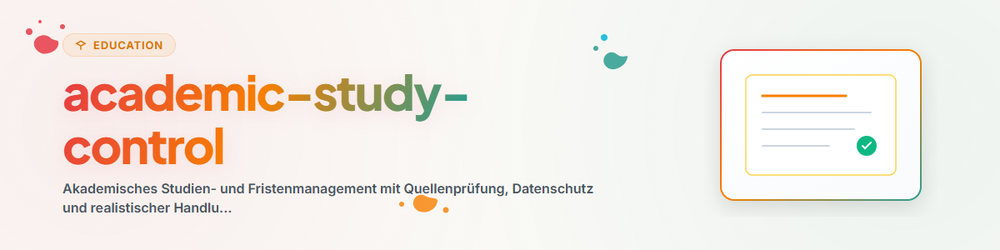

# Управление Академической Учебой и Дедлайнами (Русский)

Этот навык обеспечивает систематическую поддержку в организации учебы, отслеживании сроков и планировании экзаменов.

## 1. Общий обзор и цели

- **Контроль Сроков и Экзаменов:** Составление обязательных графиков обучения и сдачи.
- **Проверка по Регламенту:** Сверка с официальными учебными планами и положениями.
- **Защита Персональных Данных:** Полное разделение личной информации и учебных заданий.

## 2. Рабочий процесс и шаги

1. **Уточнение Цели:** Определение дат экзаменов или сдачи работ.
2. **Анализ Текущего Состояния:** Проверка учебного плана и материалов LMS.
3. **Проверка Источников:** Уточнение сроков на официальном сайте вуза.
4. **Обратное Планирование:** Расчет этапов от дедлайна с учетом резервного времени.
5. **Сводная Таблица:** Оформление краткого расписания задач.

## 3. Обязательные правила и ограничения

- **Приоритет Официальных Документов:** Положения вуза всегда имеют высший приоритет.
- **Запрет на Хранение Паролей:** Учетные данные для входа не сохраняются.
- **Обязательный Резерв Времени:** Каждое расписание должно включать буфер.
