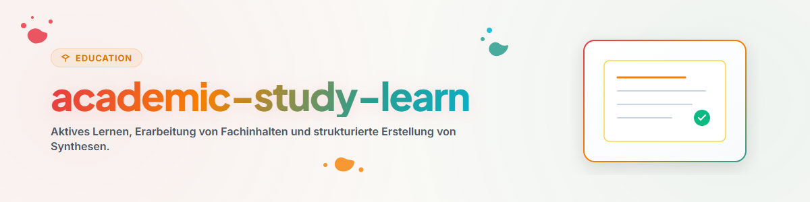

# Aprendizaje Activo e Integración de Conocimientos (Español)

Esta habilidad proporciona métodos de estudio activo, elaboración de resúmenes estructurados y síntesis conceptual profunda.

## 1. Descripción General y Objetivos

- **Repetición Espaciada y Recuerdo Activo:** Estrategias para consolidar la memoria a largo plazo.
- **Técnica Feynman:** Explicación simplificada de conceptos complejos para identificar vacíos de comprensión.
- **Toma de Notas Estructurada:** Métodos tipo Cornell, mapas conceptuales y síntesis analíticas.

## 2. Flujo de Trabajo y Pasos

1. **Lectura Analítica:** Extraer las ideas clave y conceptos fundamentales del texto fuente.
2. **Auto-Explicación:** Formular el contenido con palabras propias sin consultar el material.
3. **Identificación de Vacíos:** Revisar las áreas donde la explicación fue imprecisa.
4. **Consolidación:** Crear fichas de estudio o esquemas sintéticos.

## 3. Límites No Negociables y Reglas

- **Comprensión sobre Memorización:** Priorizar la comprensión lógica frente a la memorización mecánica.
- **Verificación de Fuentes:** Utilizar bibliografía académica validada.
