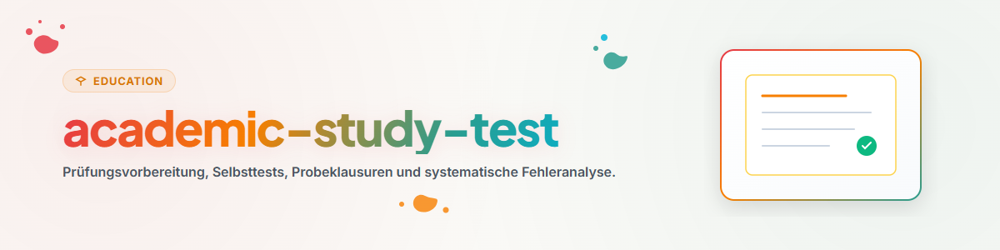

# Preparación de Exámenes y Evaluaciones (Español)

Esta habilidad proporciona herramientas para crear simulacros de examen, pruebas de autoevaluación y análisis de errores.

## 1. Descripción General y Objetivos

- **Simulacros de Examen:** Generación de preguntas objetivas y de desarrollo ajustadas al temario.
- **Análisis de Errores:** Identificación sistemática de fallos conceptuales y de interpretación.
- **Gestión del Tiempo de Examen:** Práctica con límites de tiempo reales.

## 2. Flujo de Trabajo y Pasos

1. **Diseño del Examen de Prueba:** Elaborar preguntas basadas en los criterios de evaluación.
2. **Ejecución Simulado:** Responder bajo condiciones de examen (sin material de consulta).
3. **Corrección Objetiva:** Calificar las respuestas con pautas claras.
4. **Plan de Remedión:** Reforzar las áreas con mayor tasa de error.

## 3. Límites No Negociables y Reglas

- **Evaluación Rígida:** Aplicar criterios de calificación estrictos e imparciales.
- **Foco en el Proceso:** Utilizar los errores como insumos de aprendizaje.
