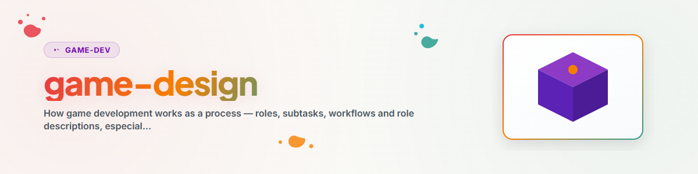

> **中文** — `game-design` 官方中文版本。


# Game Design — 角色、子任务与工作流

## 概述与目的

游戏开发是由明确分工的学科组成的团队合作——即使是由同一个人或同一个 AI 智能体承担其中多个角色。本 skill 提供**组织模型**：存在哪些角色、哪些子任务归属于他们、他们以何种顺序交互，以及如何以概念形式（GDD）记录游戏。关于*技术*细节，请参阅 `/rojo`（同步）、`/rbx-studio`（编辑器/资源）和元 skill `/rbx-dev`（架构）。

在规划新游戏、分工（包括跨多个 AI 智能体分工）以及撰写/审查 Game Design Document 时使用此 skill。

## 角色划分（5 个开发角色 + 2 个测试角色）

一套经过实践检验的精简角色分配。包含所有子任务的完整描述请参阅：[`references/roles-and-workflows.md`](references/roles-and-workflows.md)。

| 角色 | 核心关注点 | 核心子任务 |
| --- | --- | --- |
| **Creative Director** | 内容（WHAT）、原因（WHY）与受众（for WHOM） | GDD/KONZEPT、设计与平衡机制、优先级/冲刺、故事、UX 流程 |
| **Engineer** | 技术实现（HOW） | 服务端/客户端/共享代码、游戏主循环、网络/remotes、DevOps（Rojo、构建）、缺陷修复 |
| **Artist** | 世界外观 | 世界/关卡构建、光照与氛围、粒子、资源获取（含恶意软件检查） |
| **Polish / Audio** | 体验与音效 | SFX/音乐/环境音、动画、UI/UX 微调、打击感/反馈“juice”（屏幕震动、命中停顿）、反馈调整 |
| **Business** | 面向外部 | 商店页面、图标/缩略图、变现（gamepass/开发者产品/通行证）、数据分析、社区 |
| **QA-Tester** | 技术正确性 | 代码中的 Bug 扫描、试玩测试 + 检查控制台、可复现报告、回归测试、性能 |
| **Game Critic** | 游戏是否有趣 | 从玩家视角看的第一印象与长久印象、坦诚评估（趣味性、清晰度、公平性）、建议 |

**基本规则：** 开发和测试是**独立**的角色——理想情况下由不同的人员或智能体担任。编写代码的人不能进行客观测试。Game Critic 可以非常严格。

## 工作流与步骤

工作像链条一样从一个角色流动到另一个角色。最模式化的流程：

**标准功能开发链：**
```
Creative Director (plans feature) → Engineer (backend) → Artist (frontend/assets)
→ Polish/Audio (sound + fine-tuning) → QA-Tester (technical test)
→ Game Critic (player perspective) → Creative Director (feedback → next iteration)
```

**快速修复链：** QA-Tester (bug) → Engineer (fix) → QA-Tester (verifies)。

**资源链：** Artist (store search) → Artist (malware scan) → Artist (integrate) → QA (visual)。

**润色磨光链：** Game Critic (weakness) → Polish/Audio → Artist → Game Critic (re-check)。

**人机协同链（Human-in-the-loop）：** [agent chain] → human tester → Creative Director (feedback) → [chain]。

每次迭代都应保留简短的变更日志。停止条件：达到时间预算**或**达到质量目标。

### 基于画像的测试（Persona-based testing）

一款游戏只有在非常多样的玩家都能适应时才能生存。因此，请从多个**玩家画像（personas）**视角（亦可由智能体模拟）进行测试，而非仅从你自己的视角出发——在年龄、经验、平台（PC/手机/平板/主机）、注意力集中时间、语言和无障碍设计上进行区分。例如：一名在平板电脑上只想按按钮的 9 岁休闲儿童；一名在 PC 上寻找 meta 玩法的 12 岁核心玩家；一名需要大按钮的 60 岁以上初学者。
画像测试应**盲测**运行（测试者不知道设计意图）。

## 游戏设计文档 (KONZEPT.md)

将每款游戏记录在简明扼要的 GDD 中——模板：[`assets/KONZEPT_template.md`](assets/KONZEPT_template.md)。最小结构：

- **愿景** — 1–2 句话：游戏是什么？
- **类型 / 参考** — 分类 + 参考作品。
- **核心机制** — **最多 3–4 个**（聚焦才能保证质量）。
- **游戏循环（Gameplay loop）** — 玩家每分钟的循环体验。
- **游戏模式 / 时间格式** — 若相关。
- **变现** — gamepasses、开发者产品、战斗通行证、商店。
- **技术** — 技术栈（Rojo/框架）、粗略架构。
- **下一步** — 实现清单。
- **已知 Bug / 待解决问题**。

## 多智能体分工合作

多个 AI 智能体（或人机合作）可以分工开发一款游戏——两种模式：

- **Swarm（蜂群模式）** — 相同的任务，不同的区域（例如三个智能体分别平衡一个系统）。
- **Team（团队模式）** — 不同的角色，相互协调（Engineer + Artist + Polish 并行开发一个功能，由 Creative Director 统一协调）。

实践证明：**绝不**将开发和测试分配给同一个智能体；按角色固定提示词（系统提示词 = 角色描述）；每次链式迭代以变更日志 + 测试报告结束；人类始终作为质量把关人（quality gate）。

## Roblox 特定市场背景（参考）

为 Roblox 概念设计提供支撑的平台知识（不保证绝对正确，仅供经验参考）：

- **高利润类型：** Simulator、RPG、Tycoon、Horror、Obby — 扩展性和开发工作量差异巨大。
- **服务不足的细分市场（风险较高，竞争较少）：** 真正的策略/RTS-lite、高质量体育游戏、舒适/生活模拟（cozy/life sim）、合作解密/逃脱、自走棋（auto-battler）。
- **变现黄金法则：** (1) LiveOps 是必须的（每 2–4 周更新一次），(2) 变现应当*辅助*玩法，而非阻碍玩法，(3) 社交设计（交易、合作）是基础设施，(4) 移动端优先（50%+ 玩家在手机上玩），(5) 适合内容创作者传播（YouTube/TikTok）即是营销。

> 如需获取最新、可靠的市场数据，请进行实地调研而非估算——上述内容为稳定的启发式规则，非实时数据。

## 延伸阅读

- 关联 skill：`/rojo`、`/rbx-studio`；元 skill `/rbx-dev`（架构模式、项目结构、Luau 经验）。
- 参考流水线（若可用）：`<your Roblox project pipeline>`（`AGENT_ROLES.md`、`GUIDE.md`、`IDEAS.md`、市场分析）。

## 变更日志

### 1.0.0 (2026-06-17)
- 初始版本。通用角色/工作流框架，萃取自 `.ROBLOX/AGENT_ROLES.md` 与 `GUIDE.md`，用户中立（无特定项目组合）。