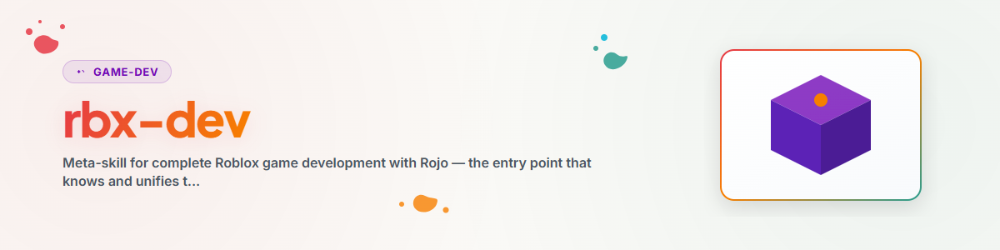

> **Русский** — Официальная русская версия `rbx-dev`.

> **Примечание:** Не имеет отношения к Roblox Corporation; «Roblox» является товарным знаком владельцев. «rbx» — общепринятое сокращение в сообществе.

# Roblox-Dev — Мета-навык для разработки игр на Roblox (Русский)

## Обзор и назначение

Центральная точка входа для разработки игр на Roblox с использованием рабочего процесса на основе Rojo и контроля версий.
Этот навык объединяет общие знания — структуру проекта, шаблоны архитектуры и самые важные подводные камни Luau — и перенаправляет специализированные вопросы трем суб-навыкам:

| Суб-навык | Назначение |
| --- | --- |
| **`/rojo`** | Синхронизация файловой системы→Studio, `default.project.json`, rokit/Wally/Lune, скелет проекта, проблемы синхронизации |
| **`/rbx-studio`** | Работа в Studio, режим «сцена против кода», Studio MCP, конвейер ассетов, **сканирование вредоносного ПО** |
| **`/game-design`** | Роли и подзадачи, цепочки разработки, документ дизайна игры (KONZEPT.md), мульти-агентный режим |

> Правило маршрутизации: Если вопрос касается **синхронизации/сборки/настройки** → `/rojo`. О **редакторе/ассетах/тестировании в Studio**
> → `/rbx-studio`. О **концепции/ролях/процессе** → `/game-design`. Об **архитектуре кода,
> подводных камнях Luau или общем процессе** → оставайтесь здесь.

## Краткий обзор стека

- **Язык:** Luau (`.luau`, а не `.lua`). Код на английском языке, комментарии/документация на русском языке, тексты интерфейса на целевом языке.
- **Синхронизация:** Rojo через rokit (зафиксированные версии инструментов). Файловая система = единственный источник истины.
- **Инструменты:** Rojo (синхронизация/сборка), Lune (тесты/скрипты вне Studio), Wally (пакеты),
  опционально Knit (фреймворк сервисов/контроллеров, новые проекты), Selene (линтер).
- **Управление:** Roblox-Studio-MCP для проверки/тестов/вставки ассетов под управлением ИИ.

## Структура проекта (Стандартная)

```
ProjektName/
├── default.project.json     # Rojo-Mapping
├── rokit.toml               # gepinnte Tool-Versionen
├── wally.toml               # Package-Dependencies
├── KONZEPT.md               # Game Design Document
├── src/
│   ├── shared/              # → ReplicatedStorage(.ProjektName.shared)
│   │   ├── Config.luau      # zentrale Werte, States, Gameplay-Parameter
│   │   ├── GameEnums.luau   # Enums, Remote-Namen, Konstanten
│   │   └── *Defs.luau       # Datendefinitionen (Items, Einheiten, Level)
│   ├── server/              # → ServerScriptService(.ProjektName)
│   │   ├── Main.server.luau # EINZIGER Server-Entry-Point (Script)
│   │   └── *Manager.luau    # ModuleScripts, von Main per require() geladen
│   ├── client/              # → StarterPlayerScripts(.ProjektName)
│   │   └── GameClient.client.luau   # Client-Entry-Point (LocalScript)
│   └── gui/                 # → StarterGui(.ProjektName)
│       └── *HUD.client.luau # GUI-Aufbau + Heartbeat-Loop
└── assets/                  # optionale .rbxm/.rbxl (scriptfrei)
```

Скелет создается с помощью `/rojo` через `scaffold_roblox_project.sh`.

## Шаблоны архитектуры

**Сервер — Main + модули менеджеров.** Только **один** Script на проект: `Main.server.luau`. Он
централизованно создает папку remotes и загружает все модули функций через `require()`:
```lua
Main.server.luau (Script)
  ├─ require(StationManager)     -- .luau ModuleScripts
  ├─ require(PlayerSession)
  └─ erstellt RemoteEvents → verbindet OnServerEvent-Handler
```
Все остальные файлы сервера — `.luau` (ModuleScripts).

**Клиент — общее состояние + HUD.** GameClient записывает общее состояние, HUD считывает
его в Heartbeat:
```lua
-- GameClient:
_G.ClientState = { gameState = "Lobby", health = 100 }
-- HUD:
RunService.Heartbeat:Connect(function()
    local cs = _G.ClientState; if not cs then return end
    healthBar.Size = UDim2.new(cs.health / cs.maxHealth, 0, 1, 0)
end)
```

**Remotes — централизованы в GameEnums.** Определите имена удаленных событий один раз в `GameEnums.Remotes`;
сервер создает события на их основе, клиент ищет их по тем же именам. Таким образом исключается несоответствие строк между сервером и клиентом.

## Общий процесс создания игры

1. **Концепция** (`/game-design`): KONZEPT.md — жанр, УТП (USP), 3–4 ключевые механики, монетизация.
2. **Настройка** (`/rojo`): создание скелета, определение сопоставления в `default.project.json`.
3. **Бэкенд**: Config → GameEnums → *Defs → Main.server → *Manager.
4. **Фронтенд**: GameClient → HUD.
5. **Тестирование геймплея в greybox** (`/rbx-studio`): сначала геймплей, базовые детали (parts) + опционально ИИ-материалы.
6. **Обновление ассетов** (`/rbx-studio`): ассеты из Creator Store, **сканирование вредоносного ПО**, сцена как .rbxl.
7. **Тест** (`/game-design`): QA + критика игры + слепые тесты с персонажами, итерации.
8. **Релиз** (`/game-design` бизнес-роль): страница в магазине, монетизация, оперирование (live ops).

## Подводные камни Luau/Roblox (Краткий список)

Самые распространенные ошибки — полный список с аннотациями:
[`references/lessons-learned-luau.md`](references/lessons-learned-luau.md).

- Точка с запятой после `task.wait(x)`, если в той же строке следует другой код.
- `Model.Position` не существует → `model:GetPivot().Position`.
- `#table` для словарей = 0 → считать вручную.
- `mouse.Hit` может быть nil → проверять перед использованием.
- Вызовы DataStore **всегда** оборачивать в `pcall`.
- `tick()` устарел → `os.clock()`; `SetPrimaryPartCFrame` → `PivotTo`.
- Имена событий централизованы в `GameEnums.Remotes`; создавать все RemoteEvent в `Main.server.luau`.
- Без циклических `require` (иначе возникнет взаимная блокировка / deadlock).
- `require()` только для ModuleScripts `.luau`, но ни в коем случае не для Scripts/LocalScripts.

## Перед каждым комитом (Чек-лист)

- [ ] Точки с запятой после `task.wait(...)` в многострочных инструкциях
- [ ] отсутствие `Model.Position`, `tick()`, `SetPrimaryPartCFrame`
- [ ] DataStore в `pcall`, `mouse.Hit` проверен на nil
- [ ] имена событий совпадают между сервером и клиентом (через GameEnums)
- [ ] все RemoteEvents созданы в `Main.server.luau`
- [ ] отсутствие циклических require
- [ ] ассеты из маркетплейса проверены (`/rbx-studio` → сканирование вредоносного ПО), отчеты сохранены

## Источники знаний

- **Актуальная документация по движку/для авторов:** Context7 MCP — `resolve-library-id` →
  `/websites/create_roblox_reference_engine` (API движка) и `/roblox/creator-docs`
  (руководства/инструкции); резервный вариант <https://create.roblox.com/docs>.
- **Эталонный конвейер** (если присутствует в системе): `<your Roblox project pipeline>` —
  включая `SKILL.md`, `GUIDE.md`, `LESSONS_LEARNED.md`, `ROJO_FAQ.md`, `ROBLOX_MCP_FAQ.md`,
  `AGENT_ROLES.md`, `_malware_reports/PATTERNS.md`, `_knowledge/` (локальный кэш API).

## История изменений

### 1.0.0 (2026-06-17)
- Начальная версия. Мета-навык над `/rojo`, `/rbx-studio`, `/game-design`; структура проекта,
  шаблоны архитектуры и уроки Luau, извлеченные из конвейера `.ROBLOX`, нейтрально к пользователю.