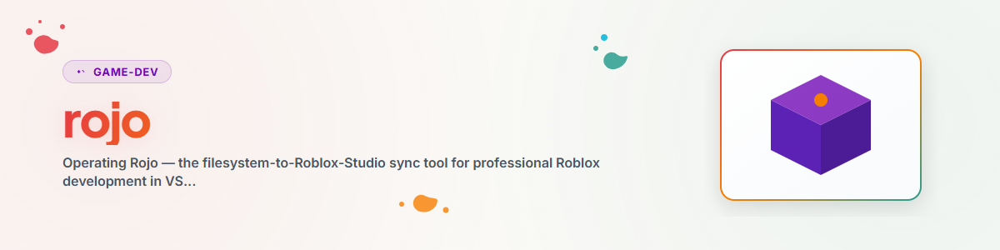

> **Русский** — Официальная русская версия `rojo`.


# Rojo — Синхронизация Файловой системы → Roblox Studio

## Обзор и назначение

Rojo связывает обычный проект в файловой системе (файлы `.luau` в `src/`, версионируемые с помощью Git)
с Roblox Studio. Вы пишете код в любом редакторе на ваш выбор (VS Code, Claude Code), а Rojo
синхронизирует его в реальном времени с запущенным экземпляром Studio. Это позволяет версионировать,
сравнивать (diff) и редактировать код Roblox с помощью полноценных инструментов — вместо работы во встроенном скриптовом редакторе Studio.

Используйте этот skill для всего, что связано с настройкой Rojo, сопоставлением `default.project.json`,
инструментарием (rokit/Wally/Lune) и типичными проблемами синхронизации.

## Ментальная модель

```
VS Code / Claude Code          rojo serve            Roblox Studio
   src/server/*.luau   ──────►  (localhost:34872) ──►  ServerScriptService.*
   src/client/*.luau            Live-Sync               StarterPlayerScripts.*
   src/shared/*.luau                                    ReplicatedStorage.*
   src/gui/*.luau                                       StarterGui.*
```

**Основное правило:** Файловая система является единственным источником истины. При каждом подключении Rojo
перезаписывает сопоставленные области Studio содержимым файловой системы. Поэтому **никогда** не редактируйте код
в Studio (он будет потерян при следующей синхронизации), только в редакторе. `Workspace`
(3D-сцена, ландшафт) **не** сопоставляется Rojo и сохраняется — см. skill
`/rbx-studio` для описания рабочего процесса сцена-код.

## Расширения файлов → Типы Roblox (Соглашение Rojo)

Rojo определяет тип экземпляра по расширению файла. Это самая частая причина ошибок:

| Файл               | Тип Roblox    | Доступен для `require()` | Роль                      |
| ------------------ | ------------- | ------------------------ | ------------------------- |
| `Foo.luau`         | ModuleScript  | **да**                   | Логический модуль, определения |
| `Foo.server.luau`  | Script        | нет                      | Точка входа сервера       |
| `Foo.client.luau`  | LocalScript   | нет                      | Точка входа клиента       |
| `init.luau`        | становится самим узлом папки | да        | делает папку модулем ModuleScript |

> Практическое правило: **Только точки входа** должны быть `.server.luau`/`.client.luau`. Всё, что
> загружается через `require()`, **должно** быть ModuleScript с расширением `.luau`. Вызов `require()` для
> Script/LocalScript вызывает ошибку "Attempted to call require with invalid argument(s)".

## Команды CLI

```bash
rojo serve default.project.json     # Запуск сервера Live-Sync (порт по умолчанию 34872)
rojo serve                          # автоматически использует default.project.json
rojo build default.project.json -o game.rbxlx   # разовый билд → файл места (XML)
rojo build default.project.json -o game.rbxl    # разовый билд → файл места (бинарный)
rojo plugin install                 # установить плагин Rojo для Studio (однократно)
rojo --version                      # проверить установленную версию
```

После `rojo serve`: в Studio откройте плагин Rojo → **Connect** (localhost:34872).
Для `rojo build` не требуется запущенный Studio — идеально подходит для CI, дымовых тестов и релизов.

## `default.project.json` — Сопоставление путей

Этот файл сопоставляет пути файловой системы с иерархией модели данных Roblox. Ключи:

- `name` — название проекта (для отображения)
- `$className` — класс Roblox данного узла (`DataModel`, `ServerScriptService`, `Folder`, …)
- `$path` — путь в файловой системе, который синхронизируется под этим узлом (относительно корня проекта)

Готовый к использованию стандартный шаблон находится в [`assets/default.project.json`](assets/default.project.json).

### Плоское и вложенное сопоставление — самое важное решение

Ваш код должен соответствовать схеме сопоставления. Два варианта:

**Плоское (Flat)** — содержимое `src/server` попадает непосредственно в `ServerScriptService`:
```json
"ServerScriptService": { "$className": "ServerScriptService", "$path": "src/server" }
```
→ Код ссылается, например, на `ReplicatedStorage.Config`, `ReplicatedStorage.GameEnums`.

**Вложенное (Nested)** — содержимое попадает в `ServerScriptService.ProjectName`:
```json
"ServerScriptService": {
  "$className": "ServerScriptService",
  "ProjektName": { "$path": "src/server" }
}
```
→ Код ссылается на `ReplicatedStorage.ProjectName.shared.Config` и т.д.

Оба варианта допустимы. Выберите **один** вариант для всего проекта и соблюдайте единообразие
путей `require`/`WaitForChild`. Симптом несоответствия: `WaitForChild(...)`
зависает неограниченно (infinite yield), так как ожидаемый узел находится в другом месте.

## Инструментарий через rokit

[rokit](https://github.com/rojo-rbx/rokit) — это менеджер инструментария. Файл `rokit.toml` в
проекте (или родительской папке) фиксирует точные версии инструментов → воспроизводимые сборки на всех
компьютерах. Если он отсутствует, вы получите ошибку `Failed to find tool 'rojo' in any project manifest file`.

Стандартный `rokit.toml` (см. [`assets/rokit.toml`](assets/rokit.toml)):
```toml
[tools]
rojo = "rojo-rbx/rojo@7.4.4"
lune = "lune-org/lune@0.10.4"
wally = "UpliftGames/wally@0.3.2"
```

> Примечание о версии: 7.4.4 — это версия, последовательно зафиксированная во всей эталонной цепочке.
> Новые проекты могут использовать 7.6.x, но сначала проверьте с помощью `rojo build` на проекте,
> так как формат проекта может меняться между мажорными версиями.

После клонирования/настройки: `rokit install` загружает все зафиксированные инструменты.

- **Lune** — среда выполнения Luau вне Studio (юнит-тесты, скрипты сборки, обработка ассетов).
- **Wally** — менеджер пакетов: `wally install` → `Packages/` → в Studio размещается в
  `ReplicatedStorage.Packages`. Зависимости перечисляются в `wally.toml` (см.
  [`assets/wally.toml`](assets/wally.toml)), например, фреймворк `sleitnick/knit@1.7.0`.

## Создание нового проекта

Скрипт [`scripts/scaffold_roblox_project.sh`](scripts/scaffold_roblox_project.sh) создает
полный каркас Rojo (project.json, rokit.toml, wally.toml, `src/{shared,server,client,gui}/`
с начальными файлами и заглушкой KONZEPT):

```bash
bash scripts/scaffold_roblox_project.sh MeinSpiel        # плоская структура (по умолчанию)
bash scripts/scaffold_roblox_project.sh MeinSpiel --nested   # вложенная структура
```

После этого: `cd MeinSpiel && rokit install && rojo serve`.

## Устранение неполадок

| Симптом | Причина | Решение |
| --- | --- | --- |
| `Failed to find tool 'rojo'` | отсутствует `rokit.toml` | создайте `rokit.toml` с привязкой Rojo в папке проекта/родительской папке, выполните `rokit install` |
| `require` вызывает "invalid argument(s)" | `require()` вызван для Script/LocalScript | только ModuleScript `.luau` можно подключать через require; проверьте расширение |
| Порт 34872 занят (`os error 10048`) | запущен старый процесс Rojo | `tasklist \| grep -i rojo` → `taskkill //PID <PID> //F`, затем снова запустите `rojo serve` |
| Скрипты попадают не туда в Studio | плоское сопоставление вместо вложенного (или наоборот) | скорректируйте `default.project.json` в соответствии с путями в коде (см. выше) |
| `WaitForChild` зависает неограниченно | ожидаемый узел не существует / ошибка на сервере до его создания | **сначала проверьте консоль сервера на наличие ошибок**; проверьте сопоставление и порядок создания |
| Синхронизация останавливается после переименования файла | Rojo не сразу обнаруживает переименование | остановите сервер (Ctrl+C) и перезапустите его, в Studio нажмите Disconnect → Reconnect |
| Изменения в Studio исчезают после переподключения | редактирование в Studio вместо файловой системы | изменяйте код **только** в редакторе; Rojo перезаписывает сопоставленные области |

### Известные ограничения Rojo

1. **Отсутствие синхронизации террейна/Workspace** — создавайте 3D-сцену и террейн в Studio или генерируйте их программно.
2. **Отсутствие слияния (merge) для `.rbxl`** — файлы мест являются бинарными и не поддерживают git merge. Никогда не используйте их в качестве основного источника.
3. **Отсутствие живой синхронизации в режиме Play** — изменения, внесенные во время воспроизведения, отбрасываются при остановке.
4. **Преобразование путей в Git Bash** — `/c/...` может преобразовываться в `C:/...` и ломать пути Rojo; при сомнениях используйте относительные или нативные пути Windows.

## Линтинг (Selene)

Проекты Roblox Luau обычно проверяются с помощью **Selene** (`selene.toml` в корне,
`std = "roblox"`). Разрешите глобальные переменные, такие как `_G`, через `global_usage = "allow"`,
если проект использует их для общего состояния клиента. Запускайте Selene из директории, содержащей определение Roblox API (`roblox.yml`).

## Дополнительные материалы

- Смежные skills: `/rbx-studio` (работа в Studio, MCP, ассеты), `/game-design`
  (роли, рабочие процессы, GDD), мета-skill `/rbx-dev` (объединяет все три + архитектурные паттерны).
- Текущая документация по движку/Rojo: Context7 MCP (`resolve-library-id` →
  `/websites/create_roblox_reference_engine`, `/roblox/creator-docs`) или
  <https://rojo.space/docs/>.
- Если на этой системе присутствует эталонный пайплайн проектов, он расположен по адресу
  `<your Roblox project pipeline>` (включая `ROJO_FAQ.md`, `SKILL.md`).

## История изменений

### 1.0.0 (2026-06-17)
- Начальная версия. Выделена из пайплайна `.ROBLOX` (ROJO_FAQ, ROJO_START, _template),
  написана в пользовательски-нейтральном стиле.