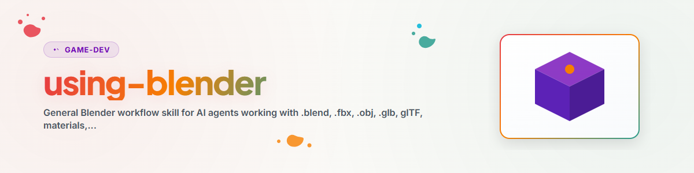

> **Русский** — Официальная русская версия `using-blender`.

# Использование Blender

## Основное правило

Работайте с Blender в трех режимах в зависимости от задачи:

1. **Режим GUI:** Открывайте Blender видимым образом, если пользователь хочет просмотреть, оценить или вручную отредактировать ресурс.
2. **Headless-режим:** Используйте `blender --background --python <script.py>`, если требуется экспорт, повторный импорт, пакетная обработка или детерминированная проверка.
3. **Режим MCP:** Используйте только в том случае, если работающее дополнение Blender намеренно подключено и требуется управление сценой в реальном времени. Предварительно проверьте безопасность и лицензионный статус.

## Стандартный рабочий процесс

1. Уточнить цель: просмотреть, создать, конвертировать, оптимизировать, отрендерить или проверить.
2. Сначала прочитать существующие файлы: Манифест, README, форматы экспорта и имеющиеся результаты проверок.
3. Определить путь к Blender: `blender` в PATH, конфигурация проекта или пользовательский путь. Не записывайте локальные приватные пути в публикуемую документацию.
4. Для автоматизации используйте небольшой скрипт `bpy`, явно задающий входные данные, выходные данные и ошибки.
5. После каждого экспорта выполняйте как минимум одну проверку повторного импорта или загрузки, прежде чем считать результат пригодным к использованию.
6. Кратко документировать артефакты: источник, форматы экспорта, версия инструмента, статус проверки и известные ограничения.

## Правила экспорта и проверки

- Для общего использования в Веб / предпросмотре отдавайте предпочтение `.glb`.
- Для игровых движков и обмена с DCC дополнительно предлагайте `.fbx` или `.obj/.mtl`, если этого требует целевой рабочий процесс.
- При сквозной проверке (roundtrip) всегда проверяйте: файл существует, не пуст, может быть импортирован повторно, ожидаемые имена объектов/материалов присутствуют.
- Для крупных ресурсов собирайте метрики: количество мешей, материалы, ограничивающий параллелепипед (bounding box), размер файла и опционально количество треугольников.
- Для проверки рендеринга используйте небольшое разрешение предпросмотра перед запуском ресурсоемких рендеров в Cycles или Full HD.

## Правила безопасности

- Код `bpy` — это локальный код Python с доступом к файловой системе. Выполняйте только собственный или проверенный код.
- Не активируйте сторонние дополнения Blender, загрузчики ресурсов или телеметрические серверы без проверки лицензии и конфиденциальности данных.
- Для MCP-серверов с произвольным инструментом `execute_python` предварительно ограничивайте область действия, сеть, рабочий каталог и таймаут.
- Для ресурсов из маркетплейсов или внешних источников проверяйте лицензию отдельно. Техническая возможность загрузки не заменяет права на использование.

## Параметры MCP

Для управления в реальном времени ознакомьтесь с [references/blender-mcp-review.md](references/blender-mcp-review.md), если необходимо выбрать, установить или оценить MCP-сервер Blender.

## Журнал изменений

### 1.0.0 (2026-06-20)
- Первоначальный навык Blender, независимый от пользователя, с маршрутизацией GUI, headless и MCP.