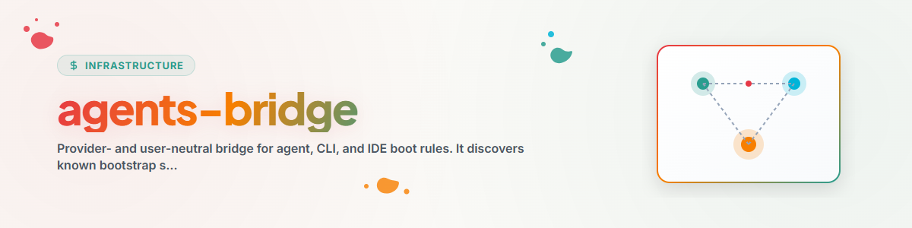

> **English** — Official English version of `agents-bridge`.


# AGENTS-BRIDGE — the Lifeboat (English)

> **Nickname "Lifeboat":** agents-bridge IS the recovery/restore set for the
> agent rule files (CLAUDE.md/GEMINI.md/GPT.md/AGENTS.md) — it just carried
> that function without a recognizable name until now. Fits the nautical
> naming family around the bridge metaphor (Wheelhouse, Deep-Diver, Lower
> Decks). Not a rename: the technical name stays `agents-bridge`, "Lifeboat"
> is a descriptive synonym.

Use this skill to capture, verify, transfer, or restore a small file-based
multi-provider system. Each instance has exactly one explicitly selected
primary provider surface. No provider, filename, host, or cloud directory is
implicitly canonical.

## Workflow & Procedure

1. Read all local instructions, locks, and privacy rules governing source and
   target. Preserve foreign changes.
2. Run `python scripts/bridge.py discover --root <instance>`. Discovery may
   adopt only one unambiguous `agents-bridge-primary: true` marker. Zero or
   multiple claims require a decision; filenames never decide authority.
3. Create a profile conforming to `references/profile-v3.schema.json`. It
   declares the primary surface, provider surfaces, truth sources, pointer
   graph, recovery, memory silos, messenger, presence, locks, and privacy scope.
4. Validate and capture without mutating the source:

   ```text
   python scripts/bridge.py profile-validate --profile <profile.json>
   python scripts/bridge.py capture --profile <profile.json> --root <source> --output <new-package>
   ```

5. Inspect the package with `doctor`, then preview with `plan` or `restore`
   without `--apply`. Existing files are never overwritten blindly.
6. Apply only after review with `--apply --yes --backup-dir <backup> --receipt
   <receipt.json>`. Run `verify`, then prove the native Claude, Codex/GPT,
   Gemini, or neutral provider actually loaded the contract.
7. Resolve drift or revert the exact receipt with `rollback --yes`. A second
   restore must report `idempotent`.
8. Use `message send|ack|status`, `memory`, `presence`, and
   `lock claim|release|status` as small file contracts only. Messaging is not a
   ticket master or scheduler, and memory silos never merge automatically.

## Safety boundaries

- Prefer loaders or redirects. Use a projection only when native references do
  not work; projections carry source hashes, provenance, `generated_at`, and
  drift detection. Controlled regeneration writes only to a new package through
  `capture --regenerate-projections`.
- All profile paths are UTF-8, relative, and portable. Exports are manifested
  and bounded by includes and excludes.
- Secrets, credentials, and personal absolute paths fail closed, or are
  recorded and replaced only in explicit `redact` mode.
- When a controlroom exists, it remains the coordination authority. The bridge
  is only a bootstrap, recovery, and file adapter; it does not duplicate a
  central runtime.

See `references/contracts.en.md`, `references/truth-topologies.md`,
`references/inventory-contract.md`, and
`references/migration-2-to-3.en.md`.
