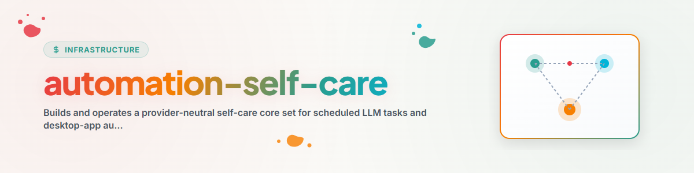

> **Français** — Documentation officielle complète traduite en français pour la compétence `automation-self-care`.


> **English** — Offizielle English-Version / Documento Oficial en English.


# Automation Self-Care (English)

Create a native, provider-specific maintenance fleet from one provider-neutral
control loop. Preserve the original intent of the ANTIGRAVITY task family while
requiring evidence, reversible changes and native readback.

## Non-negotiable Boundaries & Rules

- Treat discovery, planning, approval, mutation and readback as separate phases.
- Use the target app's supported automation API, command or UI. Never assume that
  editing a storage file changes live app state.
- Read local rules, locks, deletion/suppression logs and existing schedules before
  proposing a task.
- Do not invent scheduler support. If create/update/readback cannot be proven,
  produce a manual installation plan and stop before mutation.
- Make at most one independently testable tuning change per care run.
- Protect the care tasks from disabling themselves or reducing their own cadence
  below the configured recovery floor.
- Preserve the previous prompt, schedule, model, permissions and enabled state so
  every mutation can be rolled back.
- Count success only after outcome evidence, not merely scheduler start or exit 0.
- Never copy secrets, private prompts or personal data into a shared registry.

## Flux de Travail et Étapes d'Exécution & Execution Steps

### 1. Discover the native automation surface

Inventory the current actor, provider, app class, scheduler surface, supported
operations, state files, run history, usage telemetry and readback method. Record
capabilities using the profile contract in
[provider-adapter-contract.md](references/provider-adapter-contract.md).

Distinguish native desktop-app schedules, CLI/headless execution, OS scheduler or
service starter, general scheduler service, workflow engine, and unsupported or
UI-only automation. Do not equate the existence of a config file with a supported
mutation path.

### 2. Inventory the fleet

For each task capture a stable local identifier, purpose, prompt fingerprint,
schedule, enabled state, model, permissions, target paths, last scheduler event,
last successful outcome and current owner. Keep prompt content local.

Check the authoritative live surface twice before mutation when the app can rewrite
state from memory.

### 3. Design the core set

Read [core-set.md](references/core-set.md). Select either:

- `compact`: five care tasks combining frequency with load distribution; or
- `full`: nine focused tasks corresponding to the original maintenance family.

Generate a provider-neutral plan:

```bash
python scripts/build_core_set.py provider-profile.json \
  --topology compact --out automation-care-plan.json
```

The generator never installs tasks. Review every `blocked` capability and choose
collision-free local times before applying the plan.

### 4. Stage installation

Install through the native provider adapter:

1. Start with hygiene in read-only mode.
2. Add resource protection.
3. Add prompt-quality tuning with rollback.
4. Add frequency and load tuning only after enough run evidence exists.
5. Add cross-system coordination last.

Create new or imported tasks disabled unless the user explicitly approved active
installation. For an unattended pilot, require a deletion log, before-state
snapshot, run receipt and rollback path first.

### 5. Run the care loop

Every care task follows:

```text
follow-up previous change
  -> collect current evidence
  -> classify one cause
  -> choose zero or one change
  -> mutate through native surface
  -> read back
  -> write receipt and next-check condition
```

Use the hypothesis catalogue and evidence rules in
[core-set.md](references/core-set.md). Unknown cause means observe, narrow
permissions or pause safely; never guess a repair.

### 6. Coordinate across actors

Keep local app state authoritative. Share only task contracts, coverage, status,
receipts and sanitized fingerprints. Redundant read-only reviews are allowed;
single-writer mutations require a claim or an equivalent native lock.

### 7. Systems Without Native Event Hooks (Letter-Hooker Extension)

For AI frameworks that lack native, event-driven JSON hook loaders (such as
Antigravity / Gemini CLI), do not attempt to force unavailable OS/CLI event hooks.
Instead, adopt the **Letter-Hooker** pattern (see [`letter-hooker`](../letter-hooker/SKILL.md)):

- Use active, scheduled maintainer tasks (`agy_kontext_and_workflow_loader.py`) to
  evaluate logs and execution state.
- Dynamically inject **Preflight Bootloaders** (e.g. document-traversal rules for
  `CLAUDE.md` / `AGENTS.md`) and **Letter Hooks** (`file://` protocol references)
  directly into target `sidecar.json` prompt texts.
- Maintain a daily domain `STICHWORTLISTE.json` for context queries into memory,
  `gardener`, `workflowhooker`, and `.SKILLS`.

Treat token or subscription limitation as capacity state, not a broken actor.
Return delegated coverage after the original actor produces a successful receipt.

## Required Outputs & Deliverables

For each setup or care run report:

- discovered native surface and unsupported capabilities;
- selected topology and tasks created, proposed or skipped;
- exact mutation and before/after readback;
- evidence of outcome or open observation window;
- rollback location and return condition;
- shared coverage update, if a coordination registry exists.

## Exemple et Mode d'Emploi & Usage

User: "Set up self-maintaining schedules in this desktop app."

Discover whether the app can list, create, update and verify scheduled tasks.
Generate the compact plan, present unsupported capabilities, then install only the
approved tasks through the native surface. A folder containing a task prompt
without a live scheduler registration is not a completed setup.

## Journal des Modifications

### 1.0.0 (2026-07-28)

- Consolidated the original ANTIGRAVITY maintenance family, the F1-F6 control
  loop and later provider-specific adaptations into a neutral core-set skill.