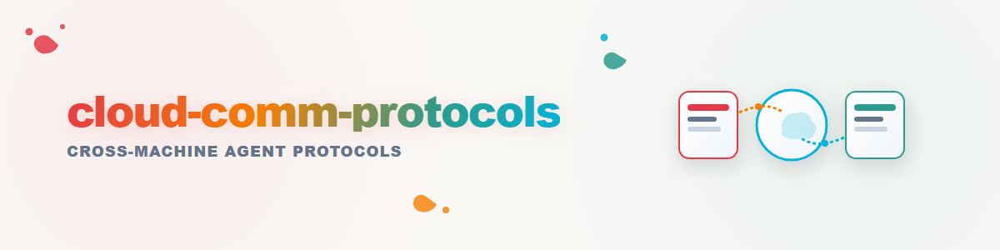

# cloud-communication-protocols

Family of protocols that let two or more agents on different machines
coordinate through a shared, cloud-synchronized folder (the "yard") instead of
a direct channel. This skill is the **umbrella**: it collects the protocols,
names which one is proven, and gates the ones still in concept.

## When to use

- Work spans two or more machines (verification, mirrored setups, pilots)
  and there is no direct agent-to-agent channel.
- You need a common vocabulary for assignments, answers, cadence and
  escalation across those machines.

## Protocols in this family

### 1. Ping-Pong (proven, base protocol)

Two or more workers with offset scheduled scans bridge the cloud-sync
latency: each side scans the yard for assignments addressed to itself,
executes, leaves the answer, and may issue follow-ups for the other side.

Core rules: write only in your own slot, receipts for every action,
idempotency, no secrets in the yard (public keys/fingerprints/paths only),
cooperative error deltas, readback-over-log verification.

Cadence control is **not** part of the base protocol; it is provided by the
companion skill **`cron-tuner`** (self-tuning loop) and by peer-instructed
cadence signals (`CADENCE: match 15m` / `CADENCE: pause …`). A mutual `WAKE:`
channel allows out-of-cycle scans as a hint, never as authority.

Full specification and reference evidence:
`dev-bricks/system-gap-master` → `docs/communications-protocols-skill.md`.

### 2. agent-beam (concept, gated)

For urgent work: a package of prompt + starter script is placed in the
target slot, and a watcher on the target machine starts a local agent run
on it — the agent "lands" with assignment and starter and begins immediately.

Gated: requires a signed-starter trust contract, quarantine/review step and
explicit operator approval before any activation.

### 3. listeners / ear-to-ear-listening (concept, gated)

Watchers observe triggers in the yard (file arrivals, flag files, registry
changes) and start agents on the other machine. "Ear-to-ear": one host's
listener watches the other host's inbox.

Gated: debouncing rules, trigger whitelists per slot and a security contract
are required first.

## Shared invariants (all protocols)

- The yard is transport, never a workspace and never a secret store.
- Every action leaves a verifiable receipt; "done" without an artifact is
  not done.
- Failure handling is cooperative: error deltas with hypothesis and
  counter-test, second opinions welcome.
- Absence of a partner is handled by the platform's vacancy rule
  (e.g. 48 h), not by escalation.

## Adding new protocols

New protocols join this family as a subchapter in
`communications-protocols-skill.md` (concept first, with its own security
contract and evidence before "proven"). List them here with one line each:
name, state (concept/pilot/proven), purpose.
