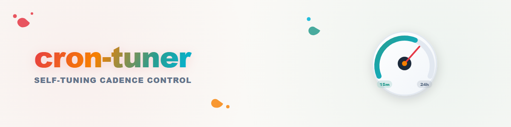

# cron-tuner — self-tuning cadence control loop

A **self-tuning** control loop for recurring, schedule-driven work (cron jobs,
scheduled tasks, timers). Instead of a fixed interval, the job adapts its own
cadence: it sharpens when there is work and cools down when there is none.
Host- and platform-neutral; the pattern works with any scheduler.

## When to use

- A recurring scan (mailbox watch, sync-yard scan, queue poll) should react
  quickly during an active "match" and stay cheap during idle phases.
- You want the adaptation to be **auditable** (a state file) instead of
  implicit in a conversation or a person's head.

## Concepts

- **Control loop**: measure → decide → act → persist. Every run ends by
  writing its state; every run starts by reading it.
- **Activation**: new work found → jump straight to the fastest interval.
- **Cooldown ladder**: empty runs advance down a ladder; each step only
  applies when the interval actually changes.
- **Cap**: never relax beyond a defined maximum interval.

## Reference scheme

| Condition | New interval |
|---|---|
| new work found | fastest (e.g. 15 min) |
| 4 consecutive empty runs | 30 min |
| 6 consecutive empty runs | 1 h |
| each further empty run | double (2 h, 4 h, 8 h) |
| cap | 24 h (never higher) |

Tune the thresholds to the workload; keep the doubling simple and the cap explicit.

## State file (required)

One small JSON file per worker, e.g. `cron-tuner-state.json`:

```json
{
  "empty_runs": 0,
  "interval_minutes": 15,
  "note": "cron-tuner state"
}
```

Rules:

1. **File, not memory.** The counter must survive context compaction,
   session restarts and operator changes, and must be inspectable by humans
   and other agents. Do not track cadence in conversation history.
2. **Rewrite only on change.** Persist the state every run, but only
   replace the scheduled job when the interval actually changes.
3. **New job = new schedule, same state.** Changing cadence means deleting
   the old job and creating a new one with the new interval; the counter
   continues.

## Operating rules

- **Work decides, not mood.** Only observed arrivals change the cadence —
  never expectations or approximations.
- **Anti-herd offsets.** Avoid full-hour and half-hour marks for the fastest
  interval (e.g. minutes 7/22/37/52) so fleets do not fire in lockstep.
- **Fail-safe:** if a peer system goes silent, the normal vacancy/absence
  policy applies — the tuner never escalates into polling floods.
- **Receipts:** every cadence change is logged with reason, old interval and
  new interval.

## Extensibility (registry of loop types)

The skill is the home for additional self-tuning loop types over time:

- **cooldown** (this scheme: silence → slower)
- **backoff** (failures → slower, success → faster)
- **burst** (spike of arrivals → temporary fast mode with an explicit end)
- **wake-assist** (external wake message → immediate out-of-cycle run)

New loop types get a subchapter here plus their own state-file schema.
