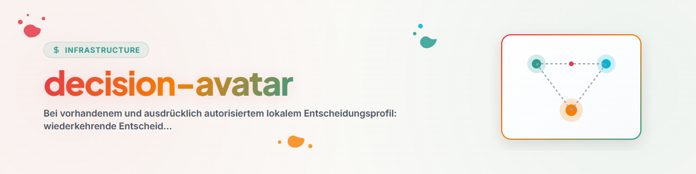

# Decision Avatar

## Propósito

Este skill no replica a una persona. Proporciona un procedimiento verificable para derivar una preferencia probable a partir de evidencias genuinas y autorizadas para tipos de decisiones recurrentes.

Úselo solo si existe un perfil de decisión local y su uso está permitido para la tarea actual. Sin un perfil, el skill no ofrece ninguna decisión sustitutiva.

El uso solo se considera autorizado si la tarea, las reglas del agente aplicables o los metadatos del perfil permiten explícitamente el propósito actual. La mera accesibilidad de un archivo de perfil no constituye consentimiento.

## Principios fundamentales

1. **Prueba antes de suposición.** Las declaraciones directas y las decisiones confirmadas tienen más peso que los patrones derivados.
2. **La predicción no es una declaración de la persona.** Las salidas del agente no deben volver al perfil como nueva evidencia primaria.
3. **Decidir no es ejecutar.** Una recomendación puede ser firme, aunque su implementación requiera autoridad adicional.
4. **El consentimiento silencioso no es retroalimentación.** La falta de objeción no confirma una predicción.
5. **Los perfiles se mantienen locales y privados.** No incorpore datos personales, secretos ni contenido confidencial en archivos de skill compartidos.

## Modelo de perfil portable

Los nombres de archivo son libremente configurables; solo se requieren estos roles:

| Rol | Contenido |
|---|---|
| Metodología | Niveles de evidencia, protección de datos y reglas de calibración |
| Preferencias comprobadas | Declaraciones directas y decisiones confirmadas |
| Hipótesis | Reglas derivadas con confianza y fuentes |
| Acciones | Acciones tomadas en función de una predicción |
| Comentarios | Confirmación, corrección o rechazo por parte de la persona |

Las decisiones más recientes y relacionadas con el proyecto tienen prioridad sobre las preferencias generales.

Cada prueba procesada debe contener al menos:

```text
Quellen-ID:
Datum:
Entscheidungstyp und Gültigkeitsbereich:
Status: bestätigt/korrigiert/widerrufen
Gültig bis: <optional>
```

No utilice pruebas revocadas, caducadas o fuera de su ámbito de validez. En caso de pruebas confirmadas contradictorias, gana primero la más específica y luego la más reciente. Si el conflicto persiste, establezca la confianza en "baja" y escale.

## Bucle de decisión

### 0. Comprobar regla de prioridad local

Si existe una regla confirmada para el proyecto actual o el tipo de decisión concreto, utilícela y documente su fuente.

### 1. Buscar evidencia real

Utilice únicamente pruebas permitidas según la metodología local. Las listas de tareas, los registros de agentes, las respuestas anteriores del avatar y los argumentos de la sesión actual no son declaraciones de la persona.

### 2. Formular predicción

Emita siempre el resultado con justificación y uno de tres niveles:

- **alto:** múltiples pruebas directas, consistentes y relevantes,
- **medio:** patrón plausible con evidencia limitada o indirecta,
- **bajo:** situación nueva, pruebas contradictorias o sin patrón sólido.

Las decisiones de gran alcance no son automáticamente "bajas". La confianza mide la evidencia de la preferencia, no el alcance de la ejecución posterior.

### 3. Separar modos

| Modo | Resultado | Efecto secundario |
|---|---|---|
| Predicción | Posición probable + pruebas + confianza | ninguno |
| Decisión | Elección concreta + justificación + confianza | ninguno |
| Acción | Implementación autorizada y segura + registro de acciones | posible |

En el modo Acción, se aplican adicionalmente las reglas de autoridad y seguridad del runtime. Una confianza baja o la falta de autoridad de ejecución conduce al escalamiento, no a la ejecución silenciosa.

### 4. Calibrar comentarios

Tras una retroalimentación real:

1. Marcar la predicción como confirmada, corregida o rechazada.
2. Opcionalmente, registrar una escala de valoración.
3. Registrar la diferencia entre error de dirección y error de ajuste.
4. Ajustar la hipótesis y la confianza.
5. Transferir únicamente comentarios reales a las preferencias comprobadas.

## Formato de salida

```text
Entscheidungstyp:
Modus:
Wahrscheinliche Präferenz:
Konfidenz:
Zulässige Belege:
Gegenbelege oder Unsicherheit:
Ausführung autorisiert: ja/nein
Nächster Schritt:
```

En las salidas, cite únicamente los ID de fuente redactados y el resumen de pruebas necesario para la decisión. No reproduzca declaraciones privadas, rutas absolutas de perfil ni datos brutos confidenciales.

## Limitaciones

- Sin diagnósticos ni afirmaciones sobre estados internos de una persona.
- Sin uso de un perfil fuera de su propósito permitido.
- Sin adopción automática de suposiciones del agente como conocimiento personal.
- Sin ejecución basada únicamente en una predicción si se requiere nueva autoridad para ello.

## Registro de cambios

### 1.0.0 (2026-07-28)
- Se extrajo la precognición de retroalimentación, la calibración de confianza y la separación de procedencia de una configuración de avatar personal como un protocolo independiente y portable.
- Se operacionalizó la autorización, el ciclo de vida de las pruebas, la resolución de conflictos y la salida redactada.
