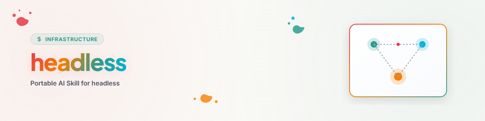

> **中文** — `headless` 官方中文版本。


# Headless (中文)

## 概述与目的

当需求方明确要求进行长时间、无持续返问的自主运行时使用此 Skill。该模式增加的是持续执行能力，而非操作权限。

单个无法执行的项切勿无故中止独立、安全的剩余工作。

## 前置条件

在开始前明确记录：

- 具体目标与成功标准，
- 明确的包含范围与排除范围（正向与负向 Scope），
- 可用的时间或成本预算，
- 允许的副作用，
- 项目规则、锁和外部变更，
- Checkpoint（检查点）的路径或机制，
- （可选）允许的本地决策配置文件。

若缺少决策配置文件，则仅使用明确规则和安全默认假设。Runtime 切勿冒充任何个人。

## 决策级别

| 级别 | 依据 | 行为 |
|---|---|---|
| 高 | 明确规则或经多次确认的模式 | 作出决策；仅在具备相应权限时执行 |
| 中 | 合理且可逆的默认决策 | 作出决策，标记假设，安全继续 |
| 低 | 新颖、矛盾或缺乏可靠框架 | 切勿猜测；暂缓或向上升级 |

决策置信度与执行权限是两个独立的维度。

## 执行流程

1. **加载上下文。** 检查规则、状态、锁和目标。
2. **拆分任务。** 标记独立任务包、决策点和审批点。若使用至少两个独立 Worker，在可用时应用 `orchestrator` 的任务与证据协议。
3. **执行安全工作。** 继续进行可逆、已授权的步骤。
4. **处理决策。**
   - 具备允许的配置文件：使用 `decision-avatar` 的流程。
   - 无配置文件：仅从明确的项目或任务规则中推导。
5. **挂起无法执行的项。** 记录决策或建议，但不预先执行。
6. **继续独立工作。** 被挂起的项仅阻塞其真实的依赖项。
7. **写入检查点。** 保存目标、已完成步骤、证据、假设、挂起项和下一步计划。
8. **检查完成状态。** 自行验证结果并将待决策事项归拢为简明列表。

## 决策日志

对每个非平庸假设均需记录：

```text
ID:
Entscheidung:
Grundlage:
Konfidenz:
Ausgeführt: ja/nein
Evidenz:
Rücknahme oder Korrektur:
```

Agent 的决策后续绝不能被视为需求方的声明。

## 任务包局部停止

若单个任务包需要新权限、不可逆的外部操作、规则不明确或存在冲突，则停止并挂起该任务包。随后检查哪些其他任务包真正依赖于它。

## 全局运行停止条件

仅在以下情况下停止整个运行：

- 无法再进行任何安全、独立的工作，
- 某项必要决策的置信度较低，
- 所有剩余任务包都需要新的外部或不可逆权限，
- 锁、冲突或安全风险波及整个剩余范围，
- 已达到约定的预算限额，
- 当前状态无法再可靠保存。

## 结束报告格式

```text
Erreicht:
Verifiziert durch:
Annahmen:
Zurückgestellte Entscheidungen:
Nicht ausgeführte Seiteneffekte:
Nächster sinnvoller Schritt:
```

## 更新日志

### 1.1.0 (2026-07-28)
- 移除了个人 Avatar、路径、命令和 Provider 绑定。
- 分离了置信度与执行权限。
- 明确了独立工作的继续进行与集中升级机制。
- 将任务包局部阻塞与全局运行停止进行了明确区分。

### 1.0.0 (2026-06-17)
- 本地初始版本。