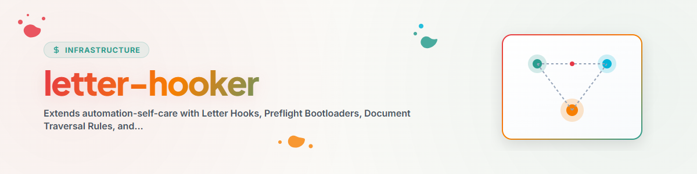

> **Español** — Versión oficial en español de `letter-hooker`.

# Letter-Hooker (Motor de Preflight y Gobernanza a Nivel de Prompt)

La habilidad **Letter-Hooker** extiende `automation-self-care` para frameworks de agentes de IA (como **Antigravity / Gemini CLI**) que no poseen cargadores nativos de hooks de ciclo de vida JSON basados en eventos (p. ej. `~/.claude/settings.json` o `~/.codex/hooks.json`).

En lugar de depender de hooks pasivos por pulsación de tecla, `letter-hooker` opera un **bucle activo de bootloader de preflight e inyección de letter-hooks a nivel de prompt** a través de tareas programadas y scripts de mantenimiento (`scripts/agy_kontext_and_workflow_loader.py`).

---

## Capacidades Principales

1. **Preflight Bootloaders y Reglas de Recorrido de Documentos**:
   - **Búsqueda Ascendente y Descendente**: Aplica instrucciones estrictas para que los agentes inspeccionen `AGENTS.md`, `CLAUDE.md`, `START.md`, `RULES.md` y `README.md` a nivel del directorio de trabajo actual. Si no se encuentran, recorre hacia arriba hasta encontrarlos; luego inspecciona hacia abajo.
   - **Preflight de Memoria y Gardener**: Consulta de preflight obligatoria a `gardener` y `memoryhooker` antes de ejecutar modificaciones destructivas o complejas.

2. **Catálogo de Letter Hooks y Enlaces de Referencia**:
   - Archivos de instrucciones `.md` modulares almacenados en `hooks/`.
   - Inyecta enlaces `file://` explícitos directamente en el texto del prompt de `sidecar.json` para que los agentes lean los protocolos exactos de seguridad y flujo de trabajo tras su invocación.

3. **Lista Diaria de Palabras Clave y Enriquecimiento de Prompts con Autorrecuperación**:
   - Mantiene una `STICHWORTLISTE.json` diaria a partir de tareas activas/en espera.
   - Analiza los registros de ejecución (`AUTOMATIONS-MEMORY.md`) en busca de patrones de fallo (contexto faltante, orientación del flujo de trabajo faltante, rutas no válidas) y parchea dinámicamente los prompts de las tareas.

4. **Enrutamiento de Habilidades y Personas**:
   - Inspecciona las palabras clave de las tareas y las mapea a los `.SKILLS` adecuados (p. ej., `infrastructure/condition`, `semantic-persona-routing`, `orchestrator`, `think`, `decide`).

---

## Letter Hooks Principales

- **`HOOK-DOC-TRAVERSAL-01`**: [bootloader_doc_traversal.md](hooks/bootloader_doc_traversal.md)
- **`HOOK-GARDENER-MEMORY-01`**: [preflight_gardener_query.md](hooks/preflight_gardener_query.md)
- **`HOOK-WORKFLOW-HYGIENE-01`**: [workflow_lock_and_git_hygiene.md](hooks/workflow_lock_and_git_hygiene.md)
- **`HOOK-PATH-VALIDATION-01`**: [path_validation_and_authority.md](hooks/path_validation_and_authority.md)

---

## Integración del Flujo de Trabajo

```bash
# Execute the Letter-Hooker Maintenance Engine
python scripts/agy_kontext_and_workflow_loader.py
```

Ejecuta este comando desde el directorio del skill `letter-hooker`. La lista de palabras clave se genera en `<SYNC_DIR>/STICHWORTLISTE.json`; `<SYNC_DIR>` se configura en `config.json`.

1. **Escanear Sidecars**: Leer todos los textos de prompt `sidecar.json` en `~/.gemini/config/sidecars/`.
2. **Actualizar Lista de Palabras Clave**: Extraer términos de dominio y guardarlos en `<SYNC_DIR>/STICHWORTLISTE.json`.
3. **Inyectar Letter Hooks**: Añadir reglas de bootloader y enlaces de referencia `file://` a los prompts.
4. **Registrar Resultados**: Registrar las actualizaciones en `ANTIGRAVITY-LOG.txt` y `ANTIGRAVITY-REGISTRY.md`.